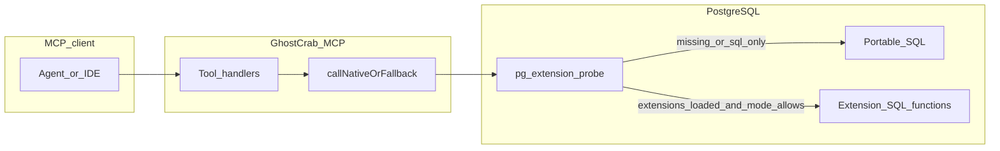

# GhostCrab MCP — Architecture and native PostgreSQL extensions

This document describes how the GhostCrab MCP server routes work to its backends, what is **implemented today**, and how the three native extensions (**`pg_facets`**, **`pg_dgraph`**, **`pg_pragma`**) relate to **creating and querying objects** versus **read acceleration** and **graph analytics**. GhostCrab still supports a SQL-only portability path, but **boot and seed are now expected to run on the native Docker PostgreSQL stack**, while sqlite mode is proxied through MindBrain.

For product setup and day-to-day usage, start with [README.md](README.md) and [README_MACOSX.md](README_MACOSX.md). For execution checklists and backlog, see [ROADMAP.md](ROADMAP.md) and [docs/ROADMAP-V2.md](docs/ROADMAP-V2.md).

**Terminology:** user-facing docs and prompts should say **workspace** (isolation scope, DDL lifecycle, semantics export). The directory `docs/v3/` is a historical path only; shipped behavior is defined by migrations `009+` and the runbook, not by a “version” label.

---

## Current status

GhostCrab should currently be read as a **native-first MindBrain/PostgreSQL MCP server** with a working internal release chain on a **fresh native database**.

SQLite mode is now a separate proxy path: GhostCrab forwards sqlite-backed tool calls to a MindBrain HTTP backend, and MindBrain owns the sqlite file, schema init, and default workspace seed.

In practice, the current status is:

- **Native Docker boot / seed is the reference path.**
- **SQL-only remains a fallback / portability path**, but not the main production-readiness signal.
- The main validation chain is now:
  - `npm run lint`
  - `npm run build`
  - `npm run test`
  - `npm run verify:pack`
  - fresh native PostgreSQL boot with `pg_facets`, `pg_dgraph`, `pg_pragma`
  - `npm run migrate`
  - `npm run test:integration`
  - native MCP smoke scenarios

This status exists because a recent hardening pass completed the following:

- migration immutability was restored by moving new materialized native facet columns out of `006` and into **`014_facets_materialized_native_expansion.sql`**
- `ghostcrab_traverse` was hardened against malformed native neighborhood payloads
- `ghostcrab_status` now reports **real native readiness** under `runtime.native_readiness`
- the test suite was split so unit/tool checks and native integration checks are explicit

What remains true:

- native extension presence alone is **not** enough; runtime capabilities are gated by readiness probes
- BM25 readiness can lag behind extension presence and still leave the native boot contract valid
- some legacy parity tests were relaxed from exact shape equality toward contract-level assertions because native and SQL paths do not always produce identical metadata or ranking

---

## MCP tool surface (25 tools)

The server registers **25** MCP tools, all prefixed `ghostcrab_*`. Registration is centralized in [`src/tools/register-all.ts`](src/tools/register-all.ts). At build time, `ghostcrab tools list` prints the same definitions (see [`src/cli/runner.ts`](src/cli/runner.ts)). Smoke tests validate the expected public tool families and startup behavior (see [`scripts/mcp-smoke.mjs`](scripts/mcp-smoke.mjs)).

| Subsystem | Count | Tools |
|-----------|------:|-------|
| **Facets** (Layer 2 facts + schema registry) | 8 | `ghostcrab_search`, `ghostcrab_remember`, `ghostcrab_upsert`, `ghostcrab_count`, `ghostcrab_facet_tree`, `ghostcrab_schema_register`, `ghostcrab_schema_list`, `ghostcrab_schema_inspect` |
| **Geo** (optional PostGIS; `geo_entities`) | 1 | `ghostcrab_query_geo` |
| **Graph** (`graph.*` / `pg_dgraph`) | 5 | `ghostcrab_learn`, `ghostcrab_traverse`, `ghostcrab_marketplace`, `ghostcrab_patch`, `ghostcrab_coverage` |
| **Pragma** (projections + operational snapshot) | 3 | `ghostcrab_project`, `ghostcrab_pack`, `ghostcrab_status` |
| **Workspace** (`mindbrain`, DDL lifecycle, semantics export) | 7 | `ghostcrab_workspace_create`, `ghostcrab_workspace_list`, `ghostcrab_workspace_inspect`, `ghostcrab_workspace_export_model`, `ghostcrab_ddl_propose`, `ghostcrab_ddl_list_pending`, `ghostcrab_ddl_execute` |

Workspace-scoped facet/graph reads (`workspace_id`) use the same facet and graph tools with an optional `workspace_id` argument; Layer 1 DDL and semantics are the workspace tools above. Geo is optional and gated by migration `010` + PostGIS (see runbook §8).

**Contracts and validation artifacts**

- Workspace **export JSON** shape (consumer contracts): [docs/dev/workspace-model-export.schema.json](docs/dev/workspace-model-export.schema.json), examples under [docs/dev/examples/](docs/dev/examples/), consumer notes in [docs/dev/README.md](docs/dev/README.md).
- Agent **scenario pack** (baseline traces for client comparison): [docs/mcp_agent_scenarios.md](docs/mcp_agent_scenarios.md), helpers in [`tests/helpers/mcp-scenarios.ts`](tests/helpers/mcp-scenarios.ts).

---

## What GhostCrab is

GhostCrab is an **MCP (Model Context Protocol) stdio server** (`@mindflight/ghostcrab`). It is the tool-facing boundary; the runtime backend depends on mode:

- PostgreSQL for the native extension stack
- MindBrain HTTP for sqlite proxy mode

Agents call **`ghostcrab_*` tools**; the server validates requests and dispatches to the appropriate backend path.

Entry points:

- `node dist/index.js` or `ghostcrab` — MCP server (default when no CLI subcommand).
- `ghostcrab <cli-args>` — migrations, maintenance, etc. (see [README.md](README.md)).

Core implementation:

- Tool handlers under [`src/tools/`](src/tools/).
- Dual-mode dispatch: [`src/db/dispatch.ts`](src/db/dispatch.ts) — `callNativeOrFallback({ useNative, native, fallback })` returns `{ value, backend }` where `backend` is `"sql"` or `"native"`.
- Extension detection and gating: [`src/db/extension-probe.ts`](src/db/extension-probe.ts) — respects `MINDBRAIN_NATIVE_EXTENSIONS` from [`src/config/env.ts`](src/config/env.ts).
- Native bootstrap checks: [`src/db/native-bootstrap.ts`](src/db/native-bootstrap.ts) — validates extension presence and native readiness during `npm run migrate` and server startup when native mode is expected.

---

## High-level architecture



At runtime, **`ghostcrab_status`** reports:

- `runtime.native_extensions_mode` — `auto` | `native` | `sql-only`
- `runtime.extensions_detected` — booleans for `pg_facets`, `pg_dgraph`, `pg_pragma`
- `runtime.backends` — effective subsystem routing (from `computeSubsystemBackends`)
- `runtime.capabilities` — feature flags derived from **native readiness** probes, e.g. `facets_native_count`, `facets_native_bm25`, `graph_native_traversal`, `graph_marketplace_search`, `graph_confidence_decay`, `pragma_native_pack`
- `runtime.native_readiness` — fine-grained readiness per subsystem

---

## Runtime modes (`MINDBRAIN_NATIVE_EXTENSIONS`)

| Mode        | Behavior |
|------------|----------|
| `sql-only` | Skip native probes for routing; tools use portable SQL even if extensions are installed. Useful only for explicit portability checks. |
| `auto`     | Probe `pg_extension`; use native paths where loaded and readiness checks pass; fall back on failure. |
| `native`   | Fail fast during migrate / boot / seed if `pg_facets`, `pg_dgraph`, or `pg_pragma` are missing, or if the native bootstrap checks fail. This is the expected mode for real GhostCrab bootstraps. |

Configure via environment (see `.env.example`). For real GhostCrab boot / seed, use [docker/docker-compose.native.yml](docker/docker-compose.native.yml) with `MINDBRAIN_NATIVE_EXTENSIONS=native`.

**Operational interpretation**

- Use `sql-only` only for explicit debugging or portability checks.
- Use `auto` for most development and CI validation.
- Use `native` when you want GhostCrab to fail fast unless the full MindBrain native stack is really available.

---

## Boot / Seed Path

The canonical local boot path is:

1. Start PostgreSQL from [docker/docker-compose.native.yml](docker/docker-compose.native.yml).
2. Ensure the image has copied and loaded `pg_facets`, `pg_dgraph`, `pg_pragma`, and `roaringbitmap`.
3. Run `npm run migrate`.
4. Let GhostCrab seed its bootstrap data.
5. Start `node dist/index.js` or another MCP host pointing at the same database.

What GhostCrab validates during migrate / startup in native mode:

- required extensions are present in `pg_extension`
- `facets` is registered with `pg_facets`
- `facets.merge_deltas` is runnable
- `graph.entity_degree` is refreshable
- `pragma_pack_context` is available

The BM25 index on `facets` is still a runtime capability and may remain off immediately after first bootstrap; this does **not** invalidate the native boot contract by itself.

### Migration status

GhostCrab now assumes **migration files are immutable once applied**.

Recent status:

- `006_facets_materialized_pg_facets.sql` has been restored to its historical content
- additional native facet materializations now live in **`014_facets_materialized_native_expansion.sql`**
- a fresh native bootstrap is therefore the reference validation scenario for migration integrity

If a migration has already been applied, any later schema evolution must be added as a **new** migration file, not by editing the older file in place.

---

## Database layout (conceptual)

| Area | Main tables / schemas | Migrations (examples) |
|------|------------------------|------------------------|
| Fact store | `public.facets` — `content`, `facets` (JSONB), `schema_id`, optional `embedding`, validity, materialized facet columns for `pg_facets`; workspace model adds `workspace_id`, `source_ref` for Layer1 sync | `001`–`008`, `009`, `011` |
| Graph (canonical) | `graph.entity`, `graph.relation`, `graph.entity_alias` — aligned with `pg_dgraph`; workspace model adds `workspace_id` | `005`+, `009` |
| Projections | `public.projections` — working memory / pragma surface; generated columns for FTS alignment (no `workspace_id` column today; scope via `agent_id` / `scope` as in V2) | `007`+ |
| Agent state | `agent_state` and other `mindbrain_*` bootstrap tables | earlier migrations |
| **Layer 1 (per workspace)** | Typed application tables in `mindbrain.workspaces.pg_schema` (e.g. `ws_prod_eu.*`) — created after human-approved DDL; FKs and native PostgreSQL types | DDL via `ghostcrab_ddl_execute` |
| **Workspace control plane** | `mindbrain.workspaces`, `pending_migrations`, `query_templates`, `source_mappings`; semantics metadata in `table_semantics`, `column_semantics`, `relation_semantics` | `009`, `012`, `013`, `014` |
| **Layer 1→2 coupling** | Generated `AFTER INSERT/UPDATE/DELETE` triggers sync Layer1 rows into `facets` (and optional graph/geo paths per `facet_type`); idempotence via `source_ref` + partial unique index | `009`–`011`, [`src/db/trigger-generator.ts`](src/db/trigger-generator.ts) |

Legacy `graph.entity` / `graph.relation` may exist from older migrations; **new graph work targets `graph.*`**.

**How workspaces feed extensions:** `pg_facets`, `pg_dgraph`, and `pg_pragma` still accelerate **Layer 2** reads. The workspace model adds a path where **facts in `facets`** can be produced by **triggers from Layer 1**, not only by `ghostcrab_remember` / `ghostcrab_upsert`.

---

## Extension 1: `pg_facets` — faceted facts, BM25, counts, hierarchy

### Role

Speeds up **search**, **aggregated facet counts**, and **hierarchical facet trees** using extension APIs (e.g. roaring bitmaps, BM25). It does **not** replace the primary **write path** for facts: inserts still go through normal SQL into `facets`.

### PostgreSQL objects you interact with (via MCP or maintenance)

- Registration of `facets` for indexing (CLI — see Maintenance).
- Native functions used by the server when eligible, including (non-exhaustive):
  - `facets.bm25_search` — native BM25 ranking path for **`ghostcrab_search`** when `mode` is `bm25` and filters/readiness allow.
  - `build_filter_bitmap_native` + `facets.get_facet_counts` — **`ghostcrab_count`** when dimensions are **registered** materialized columns, `filters` is empty, and readiness allows.
  - `facets.hierarchical_facets` — **`ghostcrab_facet_tree`**.
  - `facets.merge_deltas` / `facets.delta_status()` — maintenance and **`ghostcrab_status`** `runtime.facets_delta_status`.

Filter type for native bitmap paths: composite **`facets.facet_filter`** as `(facet_name, facet_value)` scalars (not a text array).

### MCP tools (practical)

| Tool | Writes / reads | Native when |
|------|----------------|-------------|
| **`ghostcrab_remember`** | **Write** — `INSERT` into `facets` | N/A (SQL insert); optional embeddings |
| **`ghostcrab_upsert`** | **Write** — update/create current-state facts | N/A (SQL) |
| **`ghostcrab_search`** | Read | `mode: "bm25"`, extension + readiness; complex JSONB facet filters may force SQL |
| **`ghostcrab_count`** | Read | All `group_by` dimensions map to **registered** columns on `facets`, **no** `filters` object keys, readiness |
| **`ghostcrab_facet_tree`** | Read | `pg_facets` loaded + readiness; empty filter edge cases documented in [docs/ROADMAP-V2.md](docs/ROADMAP-V2.md) |

**Registered dimensions for native count** (materialized column names on `facets`): `facet_record_id`, `facet_activity_family`, `facet_title`, `facet_label`, `schema_id`, `facet_tier`, `facet_app_segment`, `facet_churn_risk`, `facet_nationality`, `facet_game_type`, `facet_is_vip`, `facet_marketing_consent`. Logical names like `activity_family`, `tier`, or `is_vip` map to these materialized columns where applicable (see [`src/tools/facets/count.ts`](src/tools/facets/count.ts) and [`src/db/native-facets.ts`](src/db/native-facets.ts)).

### Example MCP payloads (`pg_facets`-oriented)

**Store a fact (always SQL write path):**

```json
{
  "tool": "ghostcrab_remember",
  "arguments": {
    "content": "Release 2.1 ships on Friday.",
    "schema_id": "agent:observation",
    "facets": { "activity_family": "software-delivery", "title": "Release note" }
  }
}
```

**Native-friendly search (BM25):**

```json
{
  "tool": "ghostcrab_search",
  "arguments": {
    "query": "release ship",
    "mode": "bm25",
    "limit": 10,
    "filters": {}
  }
}
```

**Native-friendly count (registered dimensions only, no JSONB filters):**

```json
{
  "tool": "ghostcrab_count",
  "arguments": {
    "group_by": ["schema_id", "activity_family"],
    "filters": {}
  }
}
```

---

## Extension 2: `pg_dgraph` — knowledge graph, neighborhood, marketplace, patches

### Role

Provides **graph-native** operators on `graph.*` (e.g. neighborhood and marketplace-style search) while **`ghostcrab_learn`** persists **entities** and **relations** through the normal SQL graph layer.

### PostgreSQL objects

- Tables: `graph.entity`, `graph.relation`, `graph.entity_alias`.
- Functions (examples invoked by tools when native + ready): `entity_neighborhood`, `graph.marketplace_search`, knowledge patch application as implemented in [`src/tools/dgraph/patch.ts`](src/tools/dgraph/patch.ts).
- Supporting analytics: `graph.entity_degree` refresh (maintenance CLI).

### MCP tools (practical)

| Tool | Writes / reads | Native when |
|------|----------------|-------------|
| **`ghostcrab_learn`** | **Write** — upsert **node** (`graph.entity`) and/or **edge** (`graph.relation`) | SQL persistence; native used for other tools |
| **`ghostcrab_traverse`** | Read | **`depth === 1`**, no `target`, `pg_dgraph` + readiness → `entity_neighborhood`; multi-hop / target path-finding → **SQL recursive CTE**. Native rows are normalized before path / gap evaluation so malformed partial native payloads degrade to structured responses rather than crashes. |
| **`ghostcrab_marketplace`** | Read | Requires `pg_dgraph` + readiness; otherwise structured error (e.g. `extension_not_loaded`) |
| **`ghostcrab_patch`** | **Write** / graph op | Native patch pipeline when extension ready |
| **`ghostcrab_coverage`** | Read | Uses graph / ontology; **decayed confidence** on gap nodes when native decay path available |

### Example MCP payloads (`pg_dgraph`-oriented)

**Create or update a graph node:**

```json
{
  "tool": "ghostcrab_learn",
  "arguments": {
    "node": {
      "id": "svc:payments-api",
      "node_type": "service",
      "label": "Payments API",
      "properties": { "team": "platform" }
    }
  }
}
```

**Create a directed edge:**

```json
{
  "tool": "ghostcrab_learn",
  "arguments": {
    "edge": {
      "source": "svc:payments-api",
      "target": "svc:ledger",
      "label": "CALLS",
      "weight": 1
    }
  }
}
```

**Shallow native traversal (depth 1, no target):**

```json
{
  "tool": "ghostcrab_traverse",
  "arguments": {
    "start": "svc:payments-api",
    "direction": "outbound",
    "depth": 1,
    "edge_labels": []
  }
}
```

**Marketplace-style search:**

```json
{
  "tool": "ghostcrab_marketplace",
  "arguments": {
    "query": "onboarding workflow",
    "limit": 20,
    "min_confidence": 0.3,
    "max_hops": 3
  }
}
```

---

## Extension 3: `pg_pragma` — projections and packed context

### Role

Enhances **retrieval of working context** from **`projections`** via native packing (e.g. `pragma_pack_context`) when available. **Creating** projections remains a normal SQL insert path through the MCP tool.

### PostgreSQL objects

- Table: `projections` (scope, content, `proj_type`, `status`, `agent_id`, etc.).
- Generated / alignment columns for pragma search (e.g. `content_tsvector`, `projection_type`, `user_id`) — see migration `007` in [docs/ROADMAP-V2.md](docs/ROADMAP-V2.md).
- Native function: `pragma_pack_context` — used by **`ghostcrab_pack`** when `pg_pragma` is loaded, readiness passes, and **`scope` is omitted** (scoped packs still use portable SQL until the native API supports scope parameters).

### MCP tools (practical)

| Tool | Writes / reads | Native when |
|------|----------------|-------------|
| **`ghostcrab_project`** | **Write** — insert/update projection row | SQL |
| **`ghostcrab_pack`** | Read | `pg_pragma` + readiness + **no `scope`** in arguments (try native; fallback to SQL on error) |
| **`ghostcrab_status`** | Read | SQL-heavy snapshot; surfaces `runtime.capabilities.pragma_native_pack` |

### Example MCP payloads (`pg_pragma`-oriented)

**Record a working projection:**

```json
{
  "tool": "ghostcrab_project",
  "arguments": {
    "scope": "session:2026-03-30",
    "content": "Next: run migrations, then parity tests.",
    "proj_type": "STEP",
    "status": "active",
    "provisional": true,
    "agent_id": "agent:self"
  }
}
```

**Pack context (native path when `scope` omitted and pragma ready):**

```json
{
  "tool": "ghostcrab_pack",
  "arguments": {
    "query": "What are we doing next for GhostCrab?",
    "agent_id": "agent:self",
    "limit": 15
  }
}
```

---

## Full MCP tool reference (extension affinity)

| Tool | Primary subsystem | Typical write? | Optional native acceleration |
|------|-------------------|----------------|--------------------------------|
| `ghostcrab_remember` | Facets | Yes (`facets`) | Search/count/tree elsewhere |
| `ghostcrab_upsert` | Facets | Yes | Same |
| `ghostcrab_search` | Facets | No | BM25 (`pg_facets`) |
| `ghostcrab_count` | Facets | No | Counts (`pg_facets`) |
| `ghostcrab_facet_tree` | Facets | No | Hierarchy (`pg_facets`) |
| `ghostcrab_schema_register` | Facets / graph meta | Yes | SQL |
| `ghostcrab_schema_list` | Facets / graph meta | No | SQL |
| `ghostcrab_schema_inspect` | Facets / graph meta | No | SQL |
| `ghostcrab_learn` | Graph | Yes (`graph.*`) | Other graph tools |
| `ghostcrab_traverse` | Graph | No | Neighborhood (`pg_dgraph`), depth 1 |
| `ghostcrab_marketplace` | Graph | No | `pg_dgraph` |
| `ghostcrab_patch` | Graph | Yes | `pg_dgraph` |
| `ghostcrab_coverage` | Graph / ontology | No | Confidence decay (`pg_dgraph`) |
| `ghostcrab_project` | Pragma | Yes (`projections`) | Pack elsewhere |
| `ghostcrab_pack` | Pragma | No | `pragma_pack_context` (`pg_pragma`) |
| `ghostcrab_status` | Cross-cutting | No | Reports capabilities |
| `ghostcrab_workspace_create` | Workspace / `mindbrain` | Yes (schema + workspace row) | SQL |
| `ghostcrab_workspace_list` | Workspace / `mindbrain` | No | SQL |
| `ghostcrab_workspace_inspect` | Workspace / `mindbrain` + Layer1 introspection | No | SQL |
| `ghostcrab_workspace_export_model` | Workspace / semantics + export contract | No | SQL |
| `ghostcrab_ddl_propose` | Workspace / `pending_migrations` | Yes (queued proposal) | SQL |
| `ghostcrab_ddl_list_pending` | Workspace / `pending_migrations` | No | SQL |
| `ghostcrab_ddl_execute` | Workspace / Layer1 DDL + triggers | Yes | SQL |
| `ghostcrab_query_geo` | Workspace / `geo_entities` (optional PostGIS) | No | SQL (or structured error if PostGIS absent) |

Tool responses include a `backend` field where dual-mode applies (e.g. `ghostcrab_count`, `ghostcrab_search`, `ghostcrab_pack`, `ghostcrab_traverse`).

---

## Maintenance CLI (native operations)

Run via `ghostcrab` after build (see [README.md](README.md)):

| Command | Purpose |
|---------|---------|
| `ghostcrab maintenance register-pg-facets` | Idempotent registration of `facets` with **`pg_facets`** (needs extension + migration `008` surrogate key). |
| `ghostcrab maintenance merge-facet-deltas` | Run `facets.merge_deltas` on `facets` after bulk facet writes. |
| `ghostcrab maintenance refresh-entity-degree` | Refresh **`graph.entity_degree`** for `pg_dgraph` analytics / marketplace workflows. |
| `ghostcrab maintenance ddl-approve --id <uuid> --by <name>` | **Workspace** Approve a pending DDL migration. Human-only step in the DDL lifecycle. |
| `ghostcrab maintenance ddl-execute --id <uuid>` | **Workspace** Execute an approved DDL migration (DDL + trigger in one transaction). |

## Validation status and commands

Recommended native validation commands:

```bash
npm run lint
npm run build
npm run test
PG_PORT=55432 npm run migrate
PG_PORT=55432 npm run test:integration
PG_PORT=55432 npm run smoke:mcp
PG_PORT=55432 npm run verify:e2e
```

Interpretation:

- `npm run test` is the fast local confidence pass for unit/tool behavior.
- `npm run test:integration` is the native integration/E2E pass.
- `npm run verify:e2e` is the closest thing to the current release gate and should be read as a **fresh native stack validation**, not a generic SQL-only compatibility check.

---

## Workspace isolation and DDL lifecycle

Migrations `009`+ introduce a `mindbrain` control schema (migration 009) and a `source_ref` sync contract (migration 011).

### Key concepts

- **Workspaces** — logical isolation scopes. Every Layer 2 row has a `workspace_id TEXT DEFAULT 'default'`. All V2 data lives in `workspace_id = 'default'`, unchanged.
- **DDL lifecycle** — agents propose schema changes via `ghostcrab_ddl_propose`; humans approve via CLI `ddl-approve`; execution is atomic via `ghostcrab_ddl_execute` or CLI `ddl-execute`.
- **Trigger generator** — `ghostcrab_ddl_propose` accepts a `sync_spec` that auto-generates a PostgreSQL trigger syncing Layer 1 rows into `facets` (Layer 2).
- **source_ref contract** — `facets.source_ref` (nullable TEXT, migration 011) identifies the Layer 1 source row for synced data. Partial unique index on `(source_ref, workspace_id) WHERE source_ref IS NOT NULL` ensures trigger idempotence without affecting historical V2 rows.
- **Geo (optional)** — `ghostcrab_query_geo` requires PostGIS. Returns a structured error (`geo_feature_not_available`) on standard deployments.

### Workspace MCP tools

| Tool | Purpose |
|------|---------|
| `ghostcrab_workspace_create` | Create a workspace (idempotent) |
| `ghostcrab_workspace_list` | List workspaces with live stats |
| `ghostcrab_workspace_inspect` | Introspect Layer 1 + semantics metadata for a workspace |
| `ghostcrab_workspace_export_model` | Export workspace model + semantics to the JSON contract (enriched with `012`/`013` semantics) |
| `ghostcrab_ddl_propose` | Propose a DDL migration for human review (optional `semantic_spec`, `sync_spec`) |
| `ghostcrab_ddl_list_pending` | List pending / approved / executed migrations |
| `ghostcrab_ddl_execute` | Execute an approved migration (DDL + triggers in one transaction) |

All existing facet query tools (`ghostcrab_search`, `ghostcrab_count`, `ghostcrab_facet_tree`) accept an optional `workspace_id` parameter with full backward compatibility when Layer 2 rows are workspace-scoped. **`ghostcrab_query_geo`** (see §8 in the runbook) queries `geo_entities` and is optional when PostGIS is not installed.

### Workspace-related migrations

| Migration | What it adds |
|-----------|-------------|
| `009_mindbrain_foundation.sql` | `mindbrain` schema, 4 control tables, `workspace_id` on Layer 2, seed `default` workspace |
| `010_specialized_layer2.sql` | `geo_entities` (PostGIS optional), `embedding_vectors` (pgvector optional) |
| `011_facets_sync_contract.sql` | `facets.source_ref`, partial unique index for trigger idempotence |
| `012_workspace_semantics.sql` | `semantic_spec` on `pending_migrations`; `mindbrain.table_semantics`, `column_semantics`, `relation_semantics` |
| `013_rich_semantics.sql` | `mindbrain.workspaces.domain_profile`; `rich_meta` JSONB on column/relation semantics |

Full runbook: **[docs/v3/RUNBOOK_V3.md](docs/v3/RUNBOOK_V3.md)**

---

## Docker and native images

- **Canonical local boot / seed stack**: [docker/Dockerfile.postgres](docker/Dockerfile.postgres) and [docker/docker-compose.native.yml](docker/docker-compose.native.yml).
- **Native extensions build and init order** (roaringbitmap → `pg_facets` / `pg_dgraph` → `pg_pragma`): [docker/Dockerfile.postgres](docker/Dockerfile.postgres), [docker/init/01-init-postgres.sql](docker/init/01-init-postgres.sql), [docker/init/02-init-template1.sh](docker/init/02-init-template1.sh).
- **SQL-first fallback stack**: [docker/Dockerfile](docker/Dockerfile) and [docker/docker-compose.yml](docker/docker-compose.yml). Keep this only for explicit portability / degraded-path checks.

Upstream extension sources and vendoring: [docs/setup/extension_sources.md](docs/setup/extension_sources.md).

---

## Further reading

- [docs/ROADMAP-V2.md](docs/ROADMAP-V2.md) — dual-mode roadmap, capability matrix, test pointers.
- [docs/v3/RUNBOOK_V3.md](docs/v3/RUNBOOK_V3.md) — workspace operational runbook (feature matrix, migration list, DDL lifecycle, Geo, semantics).
- [docs/v3/Roadmap_GHOSTCRAB_V3.md](docs/v3/Roadmap_GHOSTCRAB_V3.md) — historical architecture SOP (3-layer + mindCLI intent); **not** the operational source of truth — use this file and the runbook for shipped behavior.
- [docs/mcp_tools_contract.md](docs/mcp_tools_contract.md) — stable response envelope and core tool matrix (extend mentally with graph/marketplace/patch/workspace tools above).
- [docs/mcp_agent_scenarios.md](docs/mcp_agent_scenarios.md) — MCP agent scenario pack (`workspace_create`, `workspace_ddl_propose`, facets, graph, pragma).
- [docs/dev/README.md](docs/dev/README.md) — workspace export schema and consumer-facing contracts.
- [docs/native_agent_validation.md](docs/native_agent_validation.md) — validation scenarios on the native Docker stack.
- [docs/v3/cross_repo_table_usage_audit.md](docs/v3/cross_repo_table_usage_audit.md) — checklist to audit mindCLI / mindBot PostgreSQL usage against workspace invariants.

**Tests (non-exhaustive):** [`tests/integration/mcp/server-contract.test.ts`](tests/integration/mcp/server-contract.test.ts) (stdio + `ghostcrab_status`), [`tests/integration/mcp/scenario-pack.test.ts`](tests/integration/mcp/scenario-pack.test.ts), [`tests/tools/mcp-schema-contract.test.ts`](tests/tools/mcp-schema-contract.test.ts) (inputSchema drift guard on selected tools), workspace DDL integration under [`tests/integration/cli/`](tests/integration/cli/).
