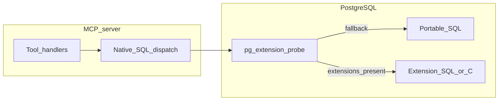
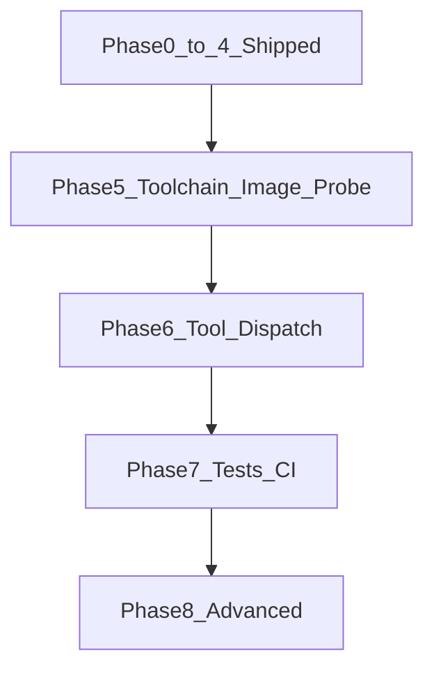

# GhostCrab — Roadmap V2 (Native extensions dual-mode)

This document is the **execution roadmap** for **V2 native path**: running the GhostCrab MCP server in **dual-mode** — **SQL-first fallback** (current default) plus **optional native PostgreSQL extensions** (`pg_facets`, `pg_dgraph`, `pg_pragma`) when the `.so` files are installed and `CREATE EXTENSION` succeeds.

**Prerequisites**

- Extension rename: `pg_memproj` is now **`pg_pragma`** (see [docs/setup/extension_sources.md](setup/extension_sources.md)).
- Upstream repos: [pg_facets](https://github.com/mindflight-orchestrator/pg_facets), [pg_dgraph](https://github.com/mindflight-orchestrator/pg_dgraph), [pg_pragma](https://github.com/mindflight-orchestrator/pg_pragma).

## Progress checklist

Use this section as the single place to see what is **done** vs **open**. Update checkboxes when PRs land.

### Foundation (section 1.0)

- [x] Canonical `graph.*` schema + migrations `005`–`007`
- [x] `extension-probe.ts` + `extensions` on MCP/CLI tool context
- [x] `dispatch.ts` + `maintenance.ts` (facet deltas / entity_degree refresh helpers)
- [x] `Dockerfile.postgres` builds `pg_pragma`; `01-init-postgres.sql` loads extensions in order
- [x] CI: build three `.so` + `scripts/smoke-create-extension.sh` for all three extensions (`pg_facets`, `pg_dgraph`, `pg_pragma`)
- [x] `MFO_NATIVE_EXTENSIONS` gating — `resolveExtensionCapabilities()` (`sql-only` skips probe; `native` fails fast if any extension missing)
- [x] Migration `008` — `doc_id GENERATED ALWAYS AS IDENTITY` surrogate key on `mfo_facets` (required by `pg_facets`)
- [x] `facets-registration.ts` — idempotent `registerPgFacetsWithReport()` + CLI `maintenance register-pg-facets`
- [x] `SubsystemBackend` type expanded to `"sql" | "native" | "conditional"` with `computeSubsystemBackends()`

### Phase 5 — Toolchain and image

- [x] **PR-5.1** — Zig 0.15.x / PG17 matrix; CI builds `libpg_facets.so`, `libpg_dgraph.so`, `libpg_pragma.so`; Dockerfile builder aligns with pins
- [x] **PR-5.2** (partial) — [`.github/workflows/docker-build.yml`](../.github/workflows/docker-build.yml): `docker buildx` amd64 `--load` + container smoke; [`Dockerfile.postgres`](../docker/Dockerfile.postgres) `HEALTHCHECK` verifies extensions (not only `pg_isready`). **Remainder**: `docker buildx --push` multi-arch to DockerHub when secrets exist.
- [x] **PR-5.3** (partial) — `probePgExtensions()` + `ToolExecutionContext.extensions` + unit tests (`extension-resolve.test.ts`)
- [x] **PR-5.3** (remainder) — `runtime.capabilities` + `runtime.extensions_detected` + `runtime.backends` on `ghostcrab_status`; contract documented in section 1.0

### Phase 6 — Dual-mode tools

- [x] **PR-6.4** (partial) — `callNativeOrFallback`; used from `ghostcrab_pack` pragma path
- [x] **PR-6.4** (done) — `backend` field on all tool payloads: `ghostcrab_pack`, `ghostcrab_traverse`, `ghostcrab_count`, `ghostcrab_search`
- [x] **PR-6.1** (partial) — `ghostcrab_count` wired to native `pg_facets` via `callNativeOrFallback` when columns registered
- [x] **PR-6.1** (remainder) — `ghostcrab_search` native BM25 path when `pg_facets` loaded + mode `bm25`
- [x] **PR-6.2** (documented) — `k_hops_filtered` returns bitmap only (no paths/edges); SQL CTE retained; `backend` field prepared for future native switch
- [x] **PR-6.3** (partial) — `pragma_pack_context` + join `mfo_projections` when `pg_pragma` and no `scope` (fallback SQL on error or when scoped)

### Phase 7 — Testing and CI matrix

- [x] **PR-7.1** (partial) — `test-node.yml` with `unit-tests` (mocked) and `tool-tests` (real Postgres, `sql-only`) jobs
- [x] **PR-7.1** (remainder) — [`parity-native.test.ts`](../tests/integration/cli/parity-native.test.ts): `ghostcrab_count` / `ghostcrab_search` (bm25) parity `sql-only` vs `auto` (ignoring `backend`); [`executeHandler`](../tests/helpers/cli-integration.ts) accepts optional `nativeExtensionsMode`
- [x] **PR-7.2** (partial) — [`test-node.yml`](../.github/workflows/test-node.yml): `tool-tests` runs `tests/integration/`; job `native-tests` runs integration suite with `MFO_NATIVE_EXTENSIONS=auto` on vanilla Postgres. **Remainder**: native image service when `mindflight/ghostcrab-postgres` is published.

### Phase 8 — Stretch

- [x] **PR-8.1** — CLI `maintenance merge-facet-deltas` + `runtime.facets_delta_status` on `ghostcrab_status`; `facets.get_facet_counts()` + roaring bitmap filter via `build_filter_bitmap_native` in `ghostcrab_count`; new `ghostcrab_facet_tree` tool wrapping `facets.hierarchical_facets()`
- [x] **PR-8.2** — `ghostcrab_patch` (`apply_knowledge_patch`); `decayed_confidence` on `ghostcrab_coverage` gap nodes; new `ghostcrab_marketplace` tool wrapping `graph.marketplace_search()`; `entity_neighborhood` for depth=1 traversal in `ghostcrab_traverse` when `pg_dgraph` loaded

### Audit hardening (post–Fast / Sonnet plans, Mar 2026)

- [x] **`facets.facet_filter` SQL** — `build_filter_bitmap_native` calls use scalar `ROW('schema_id', $2)::facets.facet_filter` (composite is `(text, text)`, not `text[]`) in [`count.ts`](../src/tools/facets/count.ts) and [`hierarchy.ts`](../src/tools/facets/hierarchy.ts)
- [x] **`ghostcrab_traverse` native root row** — depth-0 node uses real `graph.entity.metadata` (`label` / `node_type` / full metadata) to match SQL CTE semantics ([`traverse.ts`](../src/tools/dgraph/traverse.ts))
- [x] **`ghostcrab_facet_tree` empty filter** — when `schema_id` is set but bitmap build returns no row, return `tree: null` without calling `hierarchical_facets` (avoids unfiltered tree)
- [x] **MCP inputSchema** — `ghostcrab_facet_tree` `schema_id` documents `minLength: 1` (aligned with Zod)
- [x] **Unit / tool tests** — extended coverage (summary in next subsection); full suite: `MFO_NATIVE_EXTENSIONS=sql-only npx vitest run tests/unit/ tests/tools/` (177 tests as of revision 1.5)

### Test coverage summary (this discussion)

**Integration** ([`tests/integration/`](../tests/integration/))

- [`parity-native.test.ts`](../tests/integration/cli/parity-native.test.ts) — `ghostcrab_count` and `ghostcrab_search` (bm25): same payload for `sql-only` vs `auto` (compare ignoring `backend`); requires real Postgres (CI `tool-tests` / `native-tests`).

**Tools / unit — facets** ([`tests/tools/facets.test.ts`](../tests/tools/facets.test.ts))

- Native BM25 (`pgFacets: true`, `mode: bm25`): single-query path; **with `schema_id`**: CTE branch + param `$3`
- **`nativeExtensionsMode: sql-only`** with extensions mocked on: `ghostcrab_search` and `ghostcrab_count` stay on SQL path (`bm25_vector` / JSONB `GROUP BY`, not `facets.bm25_search` / `get_facet_counts`)
- Native `get_facet_counts` + `build_filter_bitmap_native`; assertion on correct `ROW('schema_id', $2)::facets.facet_filter` SQL
- `ghostcrab_facet_tree`: extension missing error; happy path; **with `schema_id`** (bitmap + `hierarchical_facets`); **bitmap row absent** → `tree: null`; **with `facet_names`** (`list_table_facets` + `hierarchical_facets`)

**Tools / unit — dgraph** ([`tests/tools/dgraph.test.ts`](../tests/tools/dgraph.test.ts))

- `ghostcrab_marketplace`: success shape; **error** includes `error.code: extension_not_loaded`
- `entity_neighborhood` (native): metadata on root row; **`edge_labels` post-filter**; **entity not found** → empty path; depth `>1` / `target` at depth 1 → SQL CTE

**Contract drift** ([`tests/tools/mcp-schema-contract.test.ts`](../tests/tools/mcp-schema-contract.test.ts))

- `ghostcrab_facet_tree`, `ghostcrab_marketplace` — Zod vs MCP `inputSchema` guards

**Relationship to other roadmaps**

- Phase 0–4 product delivery (historical PR graph): [roadmap.md](roadmap.md).
- Operational checkboxes and V2 seed backlog pointer: [ROADMAP.md](../ROADMAP.md) at repo root.
- V1 scope / DoD: [AUDIT_V1_TRACKING.md](AUDIT_V1_TRACKING.md) (same folder as this file).

### 1.0 Alignment status (implemented)

- **Canonical graph**: `graph.entity` / `graph.relation` / `graph.entity_alias` (pg_dgraph-aligned). Legacy `mfo_nodes` / `mfo_edges` (migration `002`) are not used by MCP tools; new work targets `graph.*`.
- **Extension resolution**: [src/db/extension-probe.ts](../src/db/extension-probe.ts) — `resolveExtensionCapabilities()` (respects `MFO_NATIVE_EXTENSIONS`: `sql-only` skips `pg_extension` probe; `native` requires all three extensions); `probePgExtensions()` remains for tests/low-level use. Results in `ToolExecutionContext.extensions`; **mode** in `ToolExecutionContext.nativeExtensionsMode` (MCP [src/server.ts](../src/server.ts), CLI [src/cli/context.ts](../src/cli/context.ts)).
- **`ghostcrab_status` contract**: `runtime.extensions_detected` (`pg_facets` / `pg_dgraph` / `pg_pragma` booleans), `runtime.backends` (effective subsystem path via `computeSubsystemBackends`), and **`runtime.capabilities`** — booleans for which product features are available given loaded extensions: `facets_native_count`, `facets_native_bm25`, `graph_native_traversal` (always `false` until path-reporting native graph exists), `graph_marketplace_search`, `graph_confidence_decay`, `pragma_native_pack`. See [src/tools/pragma/status.ts](../src/tools/pragma/status.ts).
- **Dispatch helper**: [src/db/dispatch.ts](../src/db/dispatch.ts) — `callNativeOrFallback` returns `{ value, backend }` and falls back on native errors; **used by** [pack.ts](../src/tools/pragma/pack.ts) (`pragma_pack_context`), [count.ts](../src/tools/facets/count.ts) (native facet counts), [search.ts](../src/tools/facets/search.ts) (native BM25 when `mode=bm25` and no JSONB filters), and [traverse.ts](../src/tools/dgraph/traverse.ts) (`entity_neighborhood` when `depth=1` and no `target`).
- **Maintenance hooks**: [src/db/maintenance.ts](../src/db/maintenance.ts) — `mergeFacetDeltasIfNeeded` after facet writes; `refreshEntityDegreeIfNeeded` / `refreshEntityDegreeWithReport`; CLI: `ghostcrab maintenance refresh-entity-degree`, `register-pg-facets`, `merge-facet-deltas` ([facets-maintenance.ts](../src/db/facets-maintenance.ts), [runner.ts](../src/cli/runner.ts)).
- **Migrations**: `005_graph_pg_schema.sql`, `006_facets_materialized_pg_facets.sql`, `007_pragma_extension_alignment.sql` (generated columns for `pg_pragma` + facet key mirrors).
- **Docker native image**: [docker/Dockerfile.postgres](../docker/Dockerfile.postgres) builds `libpg_pragma.so`; [docker/init/01-init-postgres.sql](../docker/init/01-init-postgres.sql) — order: `roaringbitmap` → `pg_facets` / `pg_dgraph` → `pg_pragma`.
- **CI smoke**: [.github/workflows/build-test.yml](../.github/workflows/build-test.yml) — [scripts/smoke-create-extension.sh](../scripts/smoke-create-extension.sh) verifies `CREATE EXTENSION` for **pg_facets**, **pg_dgraph**, and **pg_pragma**.
- **pg_facets + UUID keys**: `add_faceting_to_table` requires an **integer** document key; `mfo_facets.id` is UUID — see [pg_facets_surrogate_key_strategy.md](pg_facets_surrogate_key_strategy.md); materialized facet columns in `006` prepare registration.

---

## 1. Vision and architecture

### 1.1 Problem

Most MCP tools still use **portable SQL** against `mfo_*` / `graph.*` tables when extensions are absent or mode is `sql-only`. **`MFO_NATIVE_EXTENSIONS`** is parsed in [src/config/env.ts](../src/config/env.ts) and applied at startup via `resolveExtensionCapabilities()`. When `pg_facets` is loaded and mode is `auto`, **`ghostcrab_search`** can use native BM25 (no JSONB facet filters) and **`ghostcrab_count`** can use `get_facet_counts` + bitmaps for registered dimensions; surrogate **`doc_id`** on `mfo_facets` (migration `008`) supports registration. **`ghostcrab_pack`** calls `pragma_pack_context` when `pg_pragma` is available (see `backend` in the pack payload).

### 1.2 Goal

**Dual-mode dispatch**: at startup, probe which extensions are present; for each tool, call **native SQL functions** when available and **keep the current SQL path** otherwise. `ghostcrab_status` must report effective paths per subsystem.

### 1.3 Runtime modes

| Mode | Behavior |
|------|----------|
| `sql-only` | Skip native probes; always use portable SQL (current behavior). |
| `auto` | Probe `pg_extension`; use native where loaded. |
| `native` | Require configured extensions (or fail fast at startup — exact policy TBD in PR-5.3). |

### 1.4 Capability matrix (high level)

| Extension | SQL-first today | Native adds (typical) |
|-----------|------------------|-------------------------|
| `pg_facets` | GIN `JSONB @>`, `ts_rank` on `bm25_vector` | Roaring bitmap facet counts, native BM25 / hybrid APIs |
| `pg_dgraph` | `WITH RECURSIVE` on `graph.entity` / `graph.relation` (SQL path) | k-hop / shortest-path (`k_hops_filtered`, …) on roaringbitmap indexes when extension loaded |
| `pg_pragma` | TS queries on `mfo_projections` (with generated `content_tsvector`, `projection_type`, `user_id`) | `pragma_pack_context` (joined to `mfo_projections` for status), candidate bitmaps, native rank stubs |

### 1.5 Architecture (mermaid)



---

## 2. Phase 5 — Toolchain and image stabilization

### PR-5.1: Zig / PostgreSQL version pinning and CI native build

**Scope**: Lock **Zig 0.15.x** and **PostgreSQL 17** as the supported matrix; CI builds `libpg_facets.so`, `libpg_dgraph.so`, `libpg_pragma.so` on **linux/amd64** and **linux/arm64** where feasible.

**Changes**

- Align [docker/Dockerfile.postgres](../docker/Dockerfile.postgres) builder stage with [docs/Postgresql/docker_image_build.md](Postgresql/docker_image_build.md) pins.
- Extend [.github/workflows/build-test.yml](../.github/workflows/build-test.yml) (or add `workflow`) to compile extensions from `extensions/` (not only Zig smoke in isolation).

**Tests**

- CI artifact: `file` on each `.so` or explicit `nm` guard where already used.

**Acceptance**

- CI green on `main` for the native build job.

---

### PR-5.2: Docker image `mindflight/ghostcrab-postgres` (DockerHub)

**Scope**: Publish a **multi-arch** image that includes **pgvector + roaringbitmap + pg_facets + pg_dgraph + pg_pragma** (when builds succeed), with healthcheck that validates **extensions** (not only `pg_isready`).

**Changes**

- CI: `docker buildx build --push` for `mindflight/ghostcrab-postgres` (org/registry as used by the project).
- Tag policy: `latest` + semver (`vX.Y.Z`).

**Tests**

- Pull image → `CREATE EXTENSION` smoke for each extension on a fresh volume.

**Acceptance**

- DockerHub shows multi-arch manifest; README documents pull + `DATABASE_URL` example.

---

### PR-5.3: Extension probe at MCP startup

**Scope**: New module e.g. `src/db/extension-probe.ts`: query `pg_extension` for `pg_facets`, `pg_dgraph`, `pg_pragma`. Respect `MFO_NATIVE_EXTENSIONS`. Surface results in `ghostcrab_status`.

**Changes**

- Thread `ExtensionCapabilities` (or similar) through `ToolContext`.
- Document behavior in [docs/mcp_tools_contract.md](mcp_tools_contract.md) if applicable.

**Tests**

- Unit tests with mocked `pg` client returning rows / empty.

**Acceptance**

- `ghostcrab_status` JSON includes which extensions were detected.

---

## 3. Phase 6 — Tool dual-mode adaptation

**Order**: implement **PR-6.4** dispatch + per-tool reporting first, then **PR-6.1–6.3** (avoids duplicate branching in each tool).

### PR-6.4: Dispatch helper + unified reporting

**Scope**: `src/db/dispatch.ts`: `callNativeOrFallback(...)`. Surface effective path in `ghostcrab_status` / tool payloads where meaningful (`sql` vs `native`).

**Status**: Helper wired to **pack**, **count**, **search**, and **traverse** (see section 1.0). Per-tool `backend` in payloads; `nativeExtensionsMode: sql-only` skips native paths even when extensions are detected.

---

### PR-6.1: Facets — native search / count (optional)

**Scope**: When `pg_facets` is present, route `ghostcrab_search` / `ghostcrab_count` to native APIs where schema alignment allows; otherwise keep current SQL.

**Status (implemented)**: Native BM25 via `facets.bm25_search` + join on `doc_id` (`search.ts`); native counts via `build_filter_bitmap_native` + `facets.get_facet_counts` (`count.ts`); `schema_id` filter uses composite `facets.facet_filter` as `(facet_name, facet_value)` scalar pair.

**Risk**: `mfo_facets` uses free-form `JSONB` facets; native paths require **registered** facet columns for count dimensions; JSONB facet filters on count still force SQL fallback.

---

### PR-6.2: Graph — native traversal (optional)

**Scope**: When `pg_dgraph` is present, route `ghostcrab_traverse` to `k_hops_filtered` / related APIs (seed bitmap from `graph.entity` ids); keep SQL recursive CTE as fallback.

**Status (partial)**: **`entity_neighborhood`** is used for `depth === 1` without `target` (`traverse.ts` + `callNativeOrFallback`). `k_hops_filtered` remains unsuitable for path payloads (bitmap only). SQL recursive CTE retained for multi-hop and path-finding.

**Note**: Shortest-path / advanced APIs are stretch goals; see Phase 8.

---

### PR-6.3: Pragma — native pack (optional)

**Scope**: When `pg_pragma` is present, call `pragma_pack_context` joined to `mfo_projections` (see `pack.ts`); scope filter still uses portable SQL until `pragma_pack_context` gains scope parameters.

**Status**: Implemented when `pg_pragma` loaded and `scope` is omitted (try/catch fallback to portable SQL).

---

## 4. Phase 7 — Testing and CI matrix

### PR-7.1: Integration tests (real PostgreSQL)

**Scope**: Vitest + real Postgres (Testcontainers or compose service) — [ROADMAP.md](../ROADMAP.md) already lists this gap.

**Status (implemented)**: [`parity-native.test.ts`](../tests/integration/cli/parity-native.test.ts) for count + search bm25 parity; harness helpers in [`cli-integration.ts`](../tests/helpers/cli-integration.ts).

**Tests**

- **Parity**: same inputs → equivalent outputs between `sql-only` and `auto` (within documented tolerances; `backend` field ignored in comparison).

---

### PR-7.2: CI matrix

**Scope**: CI runs at least:

- `MFO_NATIVE_EXTENSIONS=sql-only` against fallback image.
- `MFO_NATIVE_EXTENSIONS=auto` against full native image.

**Status (partial)**: [`.github/workflows/test-node.yml`](../.github/workflows/test-node.yml) — `tool-tests` runs `tests/tools/` + `tests/integration/` with `sql-only`; `native-tests` runs `tests/integration/` with `auto` on vanilla `postgres:17`. **Remainder**: job using built/published **`mindflight/ghostcrab-postgres`** image to exercise real extension SQL end-to-end.

**Acceptance**

- DockerHub publish (PR-5.2) gated on native matrix green.

---

## 5. Phase 8 — Native-only features (stretch)

### PR-8.1: Advanced `pg_facets`

Hierarchical facets, prefix/fuzzy BM25, delta maintenance — only when extension loaded; clear errors in `sql-only`.

**Status (implemented)**: `ghostcrab_facet_tree` (`hierarchical_facets`); CLI `merge-facet-deltas`; `delta_status` on status; count/search native paths as above; facet-tree errors when `pg_facets` not loaded.

### PR-8.2: Advanced `pg_dgraph`

`confidence_decay`, marketplace-style search, knowledge patches — optional new tools or parameters; **document** MCP contract changes.

**Status (implemented)**: `ghostcrab_marketplace`, `ghostcrab_patch`, `decayed_confidence` on coverage gap nodes, native shallow traverse via `entity_neighborhood`; MCP schema contract tests for new tools.

---

## 6. Global dependency graph (V2)



---

## 7. Migration and compatibility notes

- **Additive migrations only** for schema bridges (`005`, `006`, `007`, … as needed). Legacy `mfo_nodes` / `mfo_edges` are unchanged; new graph data lives under `graph.*`.
- Default remains **`MFO_NATIVE_EXTENSIONS=auto`** or **`sql-only`** until Phase 7 sign-off (product decision).
- **No secrets** in repo: private GitHub access documented in [docs/setup/extension_sources.md](setup/extension_sources.md).
- **CI / registry secrets (names only)**: `DOCKERHUB_USERNAME`, `DOCKERHUB_TOKEN` (or equivalent) for publishing `mindflight/ghostcrab-postgres`; `GH_TOKEN` / `GITHUB_TOKEN` with `repo` scope for private extension repos; never commit values.
- **Maintenance**: after bulk facet writes, schedule or call `facets.merge_deltas('mfo_facets'::regclass)` when indexed; refresh `graph.entity_degree` periodically when using marketplace-style `pg_dgraph` analytics.

---

## 8. MR body template (copy for each PR)

```markdown
## Scope
<!-- 1–2 sentences from roadmap V2 -->

## Changes
<!-- Files + PR id (e.g. PR-5.3) -->

## Tests
<!-- Commands + results -->

## Architecture Impact
- Dependencies:
- Schema:
- API / tools:
- Breaking changes:
```

---

## Revision history

| Version | Date | Notes |
|---------|------|-------|
| 1.0 | 2026-03-29 | Initial ROADMAP-V2: dual-mode native extensions, pg_pragma naming, upstream GitHub URLs |
| 1.1 | 2026-03-29 | Schema alignment: `graph.*`, migrations 005–007, extension probe, Dockerfile/CI pg_pragma, blind-spot notes, PR-6.4 ordering |
| 1.2 | 2026-03-29 | **Progress checklist** (Foundation + Phases 5–8) with `[x]` / `[ ]` for deliverables |
| 1.3 | 2026-03-29 | Native mode gating, `callNativeOrFallback` wired to pack, status runtime extensions, smoke x3, maintenance CLI, surrogate-key spike doc, Vitest hook timeouts |
| 1.4 | 2026-03-29 | Fast plan: `runtime.capabilities`, `facets_delta_status`, `docker-build.yml` CI, parity-native tests, `integration-auto` job, `merge-facet-deltas`, coverage `decayed_confidence`, `ghostcrab_patch` |
| 1.5 | 2026-03-30 | Sonnet plan: native BM25 search, count via `get_facet_counts` + bitmap, `ghostcrab_facet_tree`, `ghostcrab_marketplace`, `entity_neighborhood` traverse; audit hardening (`facet_filter` composite fix, traverse root metadata, facet-tree null bitmap); expanded Vitest coverage (177 tests in `tests/unit/` + `tests/tools/`) |
