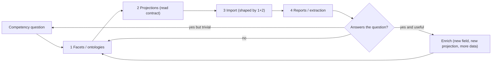

# Universal GhostCrab Methodology

> English version — version française : [`fr/universal_methodology.md`](fr/universal_methodology.md)

Iterative 4-phase methodology for taking any domain — a SaaS UI, a document
corpus, a CRM pipeline, a compliance dataset — from a confirmed Model Proposal
all the way to agent-consumable reports, using GhostCrab primitives end to end.

This document is **agent-facing**. It assumes you already know the basic
GhostCrab tools. If you are looking for the underlying ontology theory or for a
fully worked narrative, see:

- [ontology_dev_for_llm.md](ontology_dev_for_llm.md) — generic ontology
  engineering theory (competency questions, "is-a" test, quality checklist).
- [ontology_story2doc_example.md](ontology_story2doc_example.md) — annotated
  SaaS application transcript covering the full lifecycle in one concrete case.

This methodology is the bridge between the two: theory on top, GhostCrab
runtime on the bottom, one iterative loop in the middle.

## 1. Purpose and Scope

### What this document is

A repeatable, domain-agnostic loop for an agent that has been asked to model a
domain in GhostCrab. The loop covers four phases:

1. **Facets / ontologies** — design the smallest durable shape.
2. **Projections** — design the agent-facing read contract.
3. **Import** — ingest the minimum data that exercises phases 1 and 2.
4. **Reports / extraction** — execute the projections and validate against the
   original competency questions.

### What this document is not

- Not a replacement for [`ONBOARDING_CONTRACT.md`](../../ghostcrab-skills/shared/ONBOARDING_CONTRACT.md).
  This methodology **starts at Phase D (Execute)** of the contract. It assumes
  that intake, clarification, and a user-confirmed Model Proposal have already
  happened.
- Not a domain catalogue. It uses two recurring mini-examples (a SaaS UI
  slice and a document-corpus slice) only to make each step concrete.
- Not a tooling manual. For tool flags and edge cases, see the cited
  references at the end.

### Precondition checklist (do not skip)

Before entering Phase 1 below, all of the following must be true:

- A Model Proposal was shown to the user (per ONBOARDING_CONTRACT §9.1, Phase C).
- The user sent an explicit confirmation in the same thread (per HARD GATES).
- You can quote that confirmation literally for the self-audit at end of turn.
- You know which workspace this work belongs to (existing or to be created).
- You have at least one **competency question** the user wants answered.

If any of these is missing, you are still in Phase A/B/C of the contract. Stop
and return to intake.

### How to elicit competency questions — the narrative approach

Asking "what questions do you need answered?" is too abstract. The live-course
workshop method (documented in [`methodology-immo/`](methodology-immo/)) is
more reliable: give a concrete 90-second scenario anchored in a routine event
from the domain, then ask the team to narrate what happens.

**Example (property management / syndic domain):**

> *"It's the 5th of the month. Marie, the accountant, opens the morning bank
> statement. She sees a transfer of €1,847 labelled 'CP LOT 12 CHGE JANV'. She
> must determine who paid, for which building, whether the payment is complete
> or partial, and whether to issue a receipt or send a reminder."*

In 90 seconds, this scenario produces the core vocabulary across five natural
categories — what the live-course workshops call the **5 acts**:

| Act | Facilitator question | Produces | Maps to GhostCrab |
|---|---|---|---|
| **Nouns** | "What exists in this domain?" | `Copropriétaire`, `ÉcritureBancaire`, `Appel de charges`, `Lot` | Facet schemas / record types |
| **Verbs** | "What happens between things?" | `rapprocher`, `imputer`, `lettrer`, `ventiler` | Graph edges / `ghostcrab_learn` |
| **Qualifiers** | "How do we describe its state?" | `statut_paiement`, `communication_structurée` | Facet fields (dimensions) |
| **Conditions** | "When does it change?" | *if amount matches → Quittance; if partial → Relance level 1* | CONSTRAINT projections / state transitions |
| **Search modes** | "How will you find it in 6 months?" | *by building, by month, by status, by amount range* | Facet index definitions |

The "search modes" question is the most productive and the least spontaneous.
Nobody asks it without prompting. It directly determines which facets are
worth indexing — and therefore which projections are answerable at scale.

For an agent running Phase B (Clarify), use this technique: propose a scenario
from the user's domain, let them correct it, then derive the 5-category
vocabulary. The competency questions emerge from the "search modes" row.

## 2. The Four Phases as One Loop

The four phases form a closed loop, not a linear pipeline. Each pass through
the loop completes one **thin slice**: one facet schema, one projection, one
ingestion, one report. Subsequent passes enrich the model.



### Key principle: design the read contract before ingestion

Doc 2 (`ontology_story2doc_example.md`) was built from a natural order of
discovery: ontology → graph → projection → artefact. That order is fine for a
post-hoc narrative; it is a trap when you are doing the work, because it lets
you spend days ingesting data you will never read back.

This methodology inverts the order: **projections are designed before import**.
The projection is the operational contract. Ingestion is then shaped by what
the projection needs to read, not by what the source happens to expose. This
matches the discipline in
[`vendor/mindbrain/docs/projections.md`](../../vendor/mindbrain/docs/projections.md)
§"Source of Truth vs. Projection": projections are *derived* from facets and
graph state — so you must know the derivation before you ingest.

### Key principle: thin slices, not big-bang modelling

Doc 1 (`ontology_dev_for_llm.md`) §1 already says it: "Ontology development is
iterative." This methodology operationalises that: one pass = one facet field,
one projection, one record, one report. The first pass must be small enough
that you can complete all four phases inside a single working session.

## 3. GhostCrab Primitive Dictionary

The generic ontology vocabulary in doc 1 does not map one-to-one onto
GhostCrab runtime concepts. Use this table whenever you translate a Model
Proposal into actual tool calls.

| Generic ontology term | GhostCrab primitive | Where it lives | Write tool |
|---|---|---|---|
| Class / entity type | **Facet schema / record type** | Schema registry | `ghostcrab_schema_register` (requires `APPROVE_SCHEMA_FREEZE`) |
| Property / attribute | **Facet field** (plain, array, bucket, joined, function-backed, boolean, rating, date-truncation — see [`facets.md`](../../vendor/mindbrain/docs/facets.md)) | Facet definitions | Same as schema |
| Instance / individual | **Record** (a row carrying facet values) | `documents_raw`, `chunks_raw`, `facet_assignments_raw`, or canonical primitives | `ghostcrab_upsert`, `ghostcrab_remember`, `gcp brain document document-ingest` |
| Relationship | **Typed graph edge** | Graph layer | `ghostcrab_learn` |
| Query / view | **Projection** (`proj_type` ∈ `FACT \| GOAL \| STEP \| CONSTRAINT`) | Projections table | `ghostcrab_project` |
| Constraint / axiom | **Recipe** + schema validation + projection with `status: blocking` | Recipes + schema + projections | `ghostcrab_schema_register` for shape, `ghostcrab_project` for runtime |
| Validation question | **Competency question executed as a projection read** | Projections + `ghostcrab_search` / `ghostcrab_pack` | n/a (read) |
| Reusable vocabulary | **Canonical primitives** (`ghostcrab:task`, `ghostcrab:note`, the auto-extracted `source.*` namespace, etc.) | Built into every workspace | Prefer over custom schemas |

Rule of thumb derived from this table: **always look for a canonical primitive
first** (per ONBOARDING_CONTRACT §11 "use `ghostcrab_remember` for durable
facts… `ghostcrab_project` for provisional compact views"). Custom schemas are
the last resort, not the first.

The **5-acts vocabulary** from the live-course narrative approach maps directly
onto this table. Use it to translate a domain narrative into GhostCrab terms
without requiring the user to know the primitives.

## 4. Phase 1 — Facets (Thin Slice)

### Goal

Define the smallest durable shape that can carry the data needed by the
competency question. Nothing more.

### Multi-ontology awareness

Before designing your first facet schema, answer: **is this domain standalone,
or is it a process that consumes other ontologies?**

A **standalone domain** (a document corpus, a contact list, a task tracker) can
be modelled in isolation. A **process domain** (a claim declaration, an order
fulfilment, a regulatory audit) is typically a *consumer* that traverses
several peripheral ontologies, each modelling a stable layer of the business
world.

The property management sinistre case (see
[`methodology-immo/`](methodology-immo/)) shows a canonical layering:

| Layer | Examples in syndic domain | Modelling rule |
|---|---|---|
| Physical / structural | Building, floors, lots, shared areas | Separate namespace; anchor for all processes |
| Actors and roles | Persons + Role Object pattern (one person, multiple roles) | Separate namespace; reused across all processes |
| Contracts / legal | Generic `Contrat` + specialisations (`PoliceAssurance`, `ContratSyndic`) | Abstract parent schema + child schemas |
| Process / events | Generic state machine + event log | Template once, instantiate per case |
| Financial | Budgets, charges, payments, bank statement entries | Separate namespace; joined by projection |
| Regulatory | Obligations, compliance deadlines, diagnostic types | Separate namespace; `SOUMIS_A` graph edges |

Each layer is a separate named graph. Cross-graph joins happen at **projection
time** — not in the facet layer. A projection can traverse `onto_processus` +
`onto_batiment` + `onto_contrat` to answer "all open sinistres on lots whose
leases expire within 90 days" without merging the underlying schemas.

**Do not model all layers in one pass.** Model the anchor entity of the process
first (Wave 1), then extend to one peripheral layer per loop wave.

If the domain is standalone, skip this section.

### Read-before-write protocol

Before drafting any new schema, run these reads in order:

1. `ghostcrab_status` — confirm runtime health, autonomy mode, recipe pointers.
2. `ghostcrab_schema_inspect` on the recipes suggested by `status` — reuse
   before invent (per doc 1 §3, "Check for Reusable Ontologies").
3. `ghostcrab_modeling_guidance` if the domain is fuzzy — surface any returned
   `clarifying_questions` to the user before writing.

If a canonical primitive already covers the entity (a task, a note, a document
source, a chunk), **stop here** and skip schema registration. Move directly to
Phase 2.

### Design rules (adapted from doc 1)

- **One class, one purpose.** Apply the "is-a" test: every instance of a
  subclass must also be an instance of its parent. If it does not pass, the
  hierarchy is wrong.
- **Properties at the most general valid class.** Do not duplicate a field on
  three sibling schemas if it belongs on their parent.
- **Cardinality is mandatory.** Every field gets a type and a cardinality (one,
  optional, required, many). No "we'll figure it out later".
- **Use a dimension namespace for facet fields.** Prefix each field with its
  semantic dimension: `dim_temporelle.date_signalement`,
  `dim_acteur.copropriétaire_id`, `dim_statut.statut_dossier`. This keeps
  cross-workspace queries readable and prevents field-name collisions when
  peripheral ontologies share a workspace.
- **Do not model implementation artefacts as domain classes.** If a field
  exists only because the import format has it, it goes in `source.*` (the
  built-in namespace), not in your domain schema.

### Common failures to avoid (from doc 1 §Common Mistakes)

- Treating every term as a class.
- Mixing classes and instances ("Opportunity" the type vs "Opportunity #42"
  the record).
- Hierarchy levels that add no semantic value.
- Vague parent classes ("Other", "Miscellaneous").

### Write (only after explicit confirmation)

If — and only if — the user typed `APPROVE_SCHEMA_FREEZE` for a custom schema,
call `ghostcrab_schema_register`. Otherwise stay on canonical primitives and
use `ghostcrab_upsert` / `ghostcrab_remember` for the instances.

### Mini-example A — SaaS UI

Competency question: "What sections exist on the Dashboard page, and who can
see them?"

Thin-slice facet schema (one entity, three fields):

| Field | Type | Cardinality | Notes |
|---|---|---|---|
| `page_id` | string | required | Stable identifier of the page. |
| `section_type` | enum | required | `header \| body \| footer \| modal`. Bucket facet. |
| `role_visibility` | array of string | optional | Which user roles see this section. |

Everything else doc 2 §4.1 mentions (screenshots, bounding boxes, DOM
selectors, dynamic states) is deliberately deferred to a later wave (see
§8 Maturity Ladder).

### Mini-example B — Document corpus

Competency question: "Which documents in this collection cover topic *X*?"

Thin-slice facet schema:

| Field | Type | Cardinality | Notes |
|---|---|---|---|
| `topic.category` | enum | required | Controlled vocabulary, one value per document. |

Plus the auto-extracted `source.*` namespace — `source.path`, `source.dir`,
`source.filename`, `source.extension`, `source.ingested_at`,
`source.chunk_index`, `source.chunk_count`, `source.strategy` — which every
workspace exposes for free per
[`facets.md`](../../vendor/mindbrain/docs/facets.md) §"Auto-extracted
source.* facets". Do not redefine these.

## 5. Phase 2 — Projections (Read Contract, Before Import)

### Goal

For each competency question, design exactly one projection that will answer
it. This is the operational contract that ingestion must satisfy.

### Read-before-write protocol

- `ghostcrab_search` on the projection scope: does an active projection
  already cover this question? Deduplicate aggressively (per
  [`projections.md`](../../vendor/mindbrain/docs/projections.md) §9 "Deduplicate
  or update").
- If yes, update weight/status/content instead of creating a new row.

### Design decisions (one per projection)

For every projection, decide explicitly:

1. **`proj_type`** — `FACT` for things believed true, `GOAL` for desired
   outcomes, `STEP` for actions in a process, `CONSTRAINT` for rules that
   block or govern action.
2. **`scope`** — narrowest scope that remains useful: workspace, collection,
   entity. Global is rare and dangerous (cross-tenant leak risk).
3. **Content shape** — a concise sentence, or a structured one-liner
   (`fact|subject=ada|predicate=works_for|object=acme|conf=0.91`). Avoid
   long passages, ambiguous pronouns, hidden assumptions.
4. **`source_ref`** — pointer back to the facet row, document chunk, graph
   edge, or agent action that grounds the projection. A projection without
   grounding gets lower weight and explicit uncertainty marker.
5. **`weight`** — retrieval importance, not truth alone. Use the bands from
   [`projections.md`](../../vendor/mindbrain/docs/projections.md) §7.
6. **`status`** — `active` by default. `blocking` for constraints,
   `resolved`/`expired` for lifecycle.

### Design rules

- **One projection per competency question, not one per sentence.** The
  failure mode "creating a projection for every sentence the LLM sees" is
  called out explicitly in
  [`projections.md`](../../vendor/mindbrain/docs/projections.md) §"LLM Creation
  Policy".
- **Projections are not the source of truth.** Every projection must be
  reconstructible from facets, graph state, or raw records. If it cannot be
  reconstructed, the underlying fact must live somewhere else first.
- **Write at the right time.** Do not call `ghostcrab_project` in this phase
  if the underlying data does not yet exist. Phase 2 designs the projection;
  Phase 4 materialises it.

### Mini-example A — SaaS UI

Competency question: "What steps does a user follow to create an opportunity?"

| Decision | Value |
|---|---|
| `proj_type` | `STEP` (one row per step, ordered) |
| `scope` | `workspace::saas_app` |
| Content shape | `step\|order=3\|action=fill\|field=opportunity_name` |
| `source_ref` | facet row id of the matching `screen_section` |
| `weight` | `0.8` — operational instruction, well grounded |
| `status` | `active` |

### Mini-example B — Document corpus

Competency question: "Which documents cover topic *governance*?"

| Decision | Value |
|---|---|
| `proj_type` | `FACT` (one row per qualified document) |
| `scope` | `my_ws::docs` |
| Content shape | `Document <title> covers topic governance.` |
| `source_ref` | `chunk_id` of the chunk that drove the qualification |
| `weight` | `0.7` |
| `status` | `active` |

The "projection as webhook / trigger" pattern from doc 2 §15 (notify an agent
when a section disappears, when onboarding stalls, etc.) is a Phase 4
extension built on top of these projections. Do not design webhooks in Phase 2;
get one passing report first.

## 6. Phase 3 — Import (Shaped by Phases 1 and 2)

### Goal

Ingest the smallest amount of real data that exercises the full loop. One
record is often enough.

### Iteration discipline

- **Dry-run before live.** Use the no-LLM path first to validate the wiring:
  `document-ingest`, `document-profile --dry-run`, `--mock-profile-json`,
  `--mock-qualification-json` — all documented in
  [`docs/setup/document-import.md`](../setup/document-import.md). The LLM path
  is an optimisation, not a prerequisite.
- **Promote in one step at a time.** No-LLM ingest → live profile → live
  qualification → contextual retrieval + embeddings. Do not enable two new
  layers in the same pass.
- **Stop MCP first.** Database-backed import commands refuse to run while
  `ghostcrab-backend` is alive. Stop the backend or accept the
  `--force` lock risk.

### Read-before-write protocol

Before each new write, run the **read ladder** from
ONBOARDING_CONTRACT §11:

1. `ghostcrab_count` — is the domain even populated?
2. `ghostcrab_search` with explicit `schema_id` and exact filters — does the
   record already exist?
3. `ghostcrab_pack` — only after a factual read, only when context is heavy.

Never treat one empty exact read as proof the whole domain is empty.

### Write tools (by intent)

| Intent | Tool |
|---|---|
| Durable fact or note | `ghostcrab_remember` |
| In-place current-state change (status, owner, priority) | `ghostcrab_upsert` |
| Stable graph structure (entity, relation) | `ghostcrab_learn` |
| Provisional compact view | `ghostcrab_project` |
| Bulk document ingest | `gcp brain document document-ingest` |
| Document classification + chunking | `gcp brain document document-profile` (or `-worker` for queues) |
| Controlled-vocabulary assignment | `gcp brain document document-qualify` |

### Mini-example A — SaaS UI

- One crawled snapshot becomes one record per `screen_section`.
- Insert via `ghostcrab_upsert` against the schema from Phase 1.
- Screenshots, bounding boxes, DOM selectors, role-specific captures — all
  deferred to Wave 2 (see §8). Doc 2 §8 calls this list out; we promote it to
  a *planned* enrichment rather than a missing prerequisite.

### Mini-example B — Document corpus

End-to-end on one document, no LLM in the loop yet:

```bash
gcp brain document document-normalize \
  --input ./source.pdf --output-dir ./out --languages fr

gcp brain document --force document-ingest \
  --workspace-id my_ws --collection-id my_ws::docs \
  --doc-id 1 --source-ref ./out/source.md \
  --language french --strategy paragraph \
  --content-file ./out/source.md

gcp brain document --force document-profile \
  --content-file ./out/source.md --dry-run
```

Then promote to live profiling + qualification using
`document-profile-worker` and `document-qualify` (with
`--mock-qualification-json` first, then a real provider) per
[`docs/setup/document-import.md`](../setup/document-import.md) workflows 3
and 4.

## 7. Phase 4 — Reports / Extraction (Validate the Loop)

### Goal

Run the projection from Phase 2 against the data ingested in Phase 3.
Compare the result to the original competency question. Decide the next
loop entry.

### Procedure

1. Materialise the projection — `ghostcrab_project` if not already created
   in Phase 3, then `ghostcrab_search` / `ghostcrab_pack` to read it back.
2. Lay the result next to the competency question.
3. Honest assessment with three exit branches:

| Outcome | Meaning | Next loop entry |
|---|---|---|
| **Pass and useful** | Projection answers the question, the answer is non-trivial and operationally valuable. | Enrich: add one field, one projection, one source. Re-enter Phase 1 with the next competency question. |
| **Pass but trivial** | Projection answers the question, but the answer was obvious or empty of decision value. | The competency question was too weak. Rewrite it with the user, then re-enter Phase 1. |
| **Fail** | Projection cannot be built, or returns garbage. | Diagnose the missing layer: schema gap → Phase 1; projection gap → Phase 2; ingestion gap → Phase 3. Re-enter at the right phase. |

Do not re-enter at an earlier phase than necessary. A projection that returns
the wrong content does not always indicate a schema bug.

### Honesty discipline

When the report falls short, **say what is missing and why**. Doc 2 §17 puts
it well: "the system knows what it can and cannot produce yet." Better to
return a small report flagged as incomplete than a large one that pretends.

### "One graph, many outputs"

Once a projection passes, the same projection can drive multiple artefacts —
PDF, HTML, JSON player, audit log, chatbot context, voice-over script. This
is the doc 2 §21 principle: artefact generation is downstream of projections,
not parallel to them. Do not re-ingest or re-model to produce a new format.

### Mini-example A — SaaS UI

The `STEP` projection from §5 is read back as an ordered list of steps. The
same projection feeds a chatbot answer ("here are the 5 steps to create an
opportunity") and a JSON player config (one event per step) without any
re-modelling.

### Mini-example B — Document corpus

The `FACT` projection answers "which documents cover topic governance?". The
same projection feeds a search ranking boost (matching docs get higher
weight) and a coverage report ("3 documents cover governance, 0 cover
compliance — gap").

## 8. Maturity Ladder

Doc 2 hints at "MVP first, enrich later" but never formalises it. This
methodology names four waves. Each wave is a *re-entry into the four-phase
loop*, not a new pipeline.

### Wave 1 — Structural slice

- One facet schema or one canonical primitive.
- One projection per top competency question.
- One ingestion path proven end to end (no-LLM mode).
- One report read back successfully.

Exit criterion: an agent can answer at least one user question using
GhostCrab read tools alone.

### Wave 2 — Evidence layer

- Add evidence fields: `source.*` is already free; add screenshots, snapshot
  ids, bounding boxes, viewport, role context, observed-vs-expected diffs.
- Add `source_ref` grounding everywhere it was missing in Wave 1
  projections.
- Add audit projections (`proj_type: FACT`, `source_type: graph_relation` or
  `document_chunk`).

Exit criterion: every Wave 1 projection can name the evidence row that
backs it.

### Wave 3 — Behavioural layer

- Add action / role / branch facets.
- Add `STEP` projections for full user stories (not just single actions).
- Add negative branches and error states (doc 2 §9 blind-spot list).

Exit criterion: the system models not only what *should* exist but what
users *actually do*.

### Wave 4 — Triggers and cross-projection joins

- Promote selected projections to webhook / trigger semantics (doc 2 §15).
- Add `CONSTRAINT` projections with `status: blocking` for policy
  enforcement.
- Add cross-projection reports (e.g. "users blocked in onboarding who match
  churn-risk projection").

Exit criterion: agents react to changes in projection state, not only read
them.

Do not jump waves. Wave 2 without a working Wave 1 produces evidence for
nothing.

## 9. Quality Checklist

Run this checklist at the end of every loop pass. Adapted from doc 1
§Quality Checklist, restricted to what is verifiable inside GhostCrab.

### Facets

- [ ] Each facet field has an explicit type and cardinality.
- [ ] Each field is attached to the most general valid schema.
- [ ] No custom schema duplicates a canonical primitive.
- [ ] Auto-extracted `source.*` facets are not redefined.
- [ ] If a custom schema was registered, the user wrote
      `APPROVE_SCHEMA_FREEZE` literally.

### Projections

- [ ] Each projection has `scope`, `proj_type`, `weight`, `status`.
- [ ] Each projection has `source_ref` grounding, or an explicit uncertainty
      marker in its content.
- [ ] No projection is the only copy of its underlying fact (per
      [`projections.md`](../../vendor/mindbrain/docs/projections.md) §"Source
      of Truth vs. Projection").
- [ ] Each competency question maps to at least one projection.
- [ ] No projection duplicates an existing active projection in the same
      scope / type / source.

### Loop hygiene

- [ ] Every write call this turn can be quoted back to an explicit user
      confirmation (per ONBOARDING_CONTRACT §9.4 self-audit).
- [ ] The thin-slice loop completed end to end before any enrichment was
      attempted.
- [ ] The next loop pass has a single, named competency question.

## 10. Common Failure Modes

| Failure | Symptom | Fix |
|---|---|---|
| Facets before competency question | Schema feels generic, no projection in mind | Stop. Rewrite the competency question first. |
| Import before projection | Lots of data, nothing answers anything | Phase 2 first. Then re-shape ingestion. |
| One projection per sentence | Projection table bloats, dedup fails | Map each projection back to a competency question; delete projections without one. |
| Skipped no-LLM dry-run | Imports succeed on toys, fail or cost on real data | Always exercise the wiring with `--dry-run` / `--mock-*-json` first. |
| Skipped `ghostcrab_status` / `schema_inspect` | New schemas duplicate existing recipes | Always read first. Reuse before invent. |
| First model treated as final | Pressure to ship blocks iteration | Treat every model as Wave 1 of a 4-wave ladder. |
| Write authorised by agent goal | Self-audit cannot quote a user confirmation | Output Model Proposal, return to Phase C, wait. |
| Webhook before working report | Triggers fire on undefined projections | Webhooks belong in Wave 4. Get a Wave 1 pass first. |

## 11. References

Source documents this methodology bridges and depends on:

- [`docs/architecture/ontology_dev_for_llm.md`](ontology_dev_for_llm.md) —
  generic ontology engineering theory (competency questions, "is-a" test,
  quality checklist, common mistakes). The theory ground.
- [`docs/architecture/ontology_story2doc_example.md`](ontology_story2doc_example.md)
  — worked SaaS application example covering snapshot → graph → projection →
  artefact, including the blind-spot identification step and the "one graph,
  many outputs" principle.
- [`ghostcrab-skills/shared/ONBOARDING_CONTRACT.md`](../../ghostcrab-skills/shared/ONBOARDING_CONTRACT.md)
  — hard gates and Phase A→D model. This methodology operates inside
  Phase D.
- [`ghostcrab-skills/codex/ghostcrab-data-architect/SKILL.md`](../../ghostcrab-skills/codex/ghostcrab-data-architect/SKILL.md)
  — owns intake / clarification / freeze discipline (Phases A–C).
- [`vendor/mindbrain/docs/facets.md`](../../vendor/mindbrain/docs/facets.md) —
  facet schema primitives, the auto-extracted `source.*` namespace, native
  query entrypoints.
- [`vendor/mindbrain/docs/projections.md`](../../vendor/mindbrain/docs/projections.md)
  — projection types, weights, status lifecycle, LLM creation policy,
  source-of-truth contract.
- [`docs/setup/document-import.md`](../setup/document-import.md) — operator
  runbook for the document import path (`gcp brain document`), including the
  no-LLM fallbacks this methodology relies on for Phase 3 wiring validation.
- [`docs/architecture/methodology-immo/`](methodology-immo/) — real estate /
  syndic live-course workshop pack. Contains: the 5-act card game methodology
  (narrative approach, competency question elicitation, Miro colour-coding
  system); the sinistre claim declaration ontology (multi-graph architecture,
  dimensional facet naming, state machine, cross-graph projections); and the
  master ontology for a property management firm (`Ontologie Maître —
  Gestionnaire de Syndic`). The primary source for the narrative approach in
  §1 and the multi-ontology awareness section in §4.
