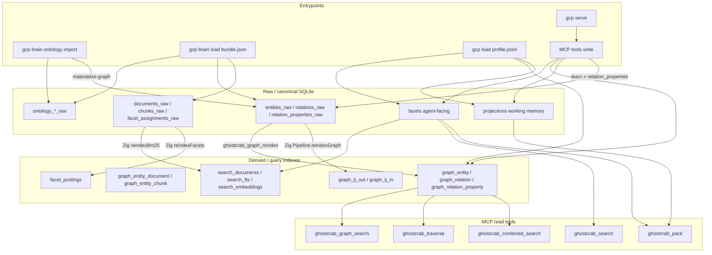

# MCP / Import / Storage Coherence Audit

Date: 2026-05-22

GhostCrab checkout verified: `@mindflight/ghostcrab-personal-mcp` v0.4.0

Vendored MindBrain: `vendor/mindbrain/` (submodule)

Related prior audits:

- [`docs/methodology/ghostcrab-query-layers.md`](../methodology/ghostcrab-query-layers.md) — three-layer query model (facets / graph / pragma)
- [`docs/audit/2026-05-15-ghostcrab-mindbrain-search-audit.md`](2026-05-15-ghostcrab-mindbrain-search-audit.md) — search path (partially stale; see §6)

---

## Executive summary — top 5 risks of empty query results

| # | Risk | Symptom | Root cause |
|---|------|---------|------------|
| 1 | **Raw vs derived gap** | `ghostcrab_graph_search` / `ghostcrab_traverse` return nothing after `gcp brain load` | Import writes `entities_raw` / `relations_raw`; graph tools read `graph_entity` / `graph_relation` only. Reindex is mandatory. |
| 2 | **Two facet pipelines** | `ghostcrab_search` empty after collection import | MCP agent search reads `facets`; collection import writes `facet_assignments_raw` → `facet_postings`. Use `ghostcrab_collection_facet_search` for that layer. |
| 3 | **Learn vs import graph split** | Learn-created data can diverge from import-derived data if raw mirrors are not maintained | `ghostcrab_learn` now writes workspace-scoped `graph_*` rows and mirrors nodes/edges into raw graph tables before reindex. |
| 4 | **Ontology layer invisible to MCP** | OWL import succeeds but all graph tools empty | `ontology_*_raw` tables are not queried by MCP; workspace graph requires `entities_raw` (+ reindex) or `--materialize-graph`. |
| 5 | **Workspace filter inconsistency** | Same entity found by one graph tool, missed by another | `ghostcrab_graph_search` and traverse are workspace scoped; graph path/subgraph still operate by entity id/name without a public workspace filter. |

**Bottom line:** GhostCrab is not one homogeneous store. Data lands in parallel pipelines (agent facts, collection raw, ontology seed, runtime graph). Each MCP read tool binds to a specific derived layer. Empty results usually mean a **layer mismatch**, not an empty domain.

---

## 1. Architecture — three parallel pipelines

GhostCrab MCP does **not** import YAML ontologies directly. The real stack has three layers:



### 1.1 Startup and DB resolution

1. **`gcp serve`** ([`bin/commands/serve.mjs`](../../bin/commands/serve.mjs)) starts the MindBrain Zig HTTP backend, then MCP stdio.
2. **SQLite path** is resolved by `gcp` via `GHOSTCRAB_SQLITE_PATH`, `--db`, workspace config, then local fallback ([`bin/lib/resolve-ghostcrab-sqlite.mjs`](../../bin/lib/resolve-ghostcrab-sqlite.mjs)).
3. The backend receives `GHOSTCRAB_SQLITE_PATH`; all writes land in that single file.
4. MCP tools never open SQLite locally — they call MindBrain HTTP ([`src/db/client.ts`](../../src/db/client.ts)).

### 1.2 There is not one graph

| Layer | Tables | Purpose | Read by MCP graph tools? |
|-------|--------|---------|--------------------------|
| Ontology seed | `ontologies`, `ontology_triples_raw`, `ontology_entity_types`, `ontology_edge_types`, `ontology_entities_raw`, `ontology_relations_raw` | Preserve RDF/OWL taxonomy and seed individuals | **No** |
| Workspace graph raw | `entities_raw`, `entity_aliases_raw`, `relations_raw`, `relation_properties_raw`, `entity_documents_raw`, `entity_chunks_raw` | Durable import/canonical graph per workspace | **No** (except reindex source) |
| Runtime graph | `graph_entity`, `graph_entity_alias`, `graph_relation`, `graph_relation_property`, `graph_entity_document`, `graph_entity_chunk` | Query/traverse index | **Yes** |
| Agent facts | `facets` | Structured memory via remember/upsert | Via `ghostcrab_search`, not graph tools |
| Collection facets | `facet_assignments_raw` → `facet_postings` | Document/chunk facet annotations from import | Via `ghostcrab_collection_facet_search` |

Canonical DDL: [`vendor/mindbrain/sql/sqlite_mindbrain--1.0.0.sql`](../../vendor/mindbrain/sql/sqlite_mindbrain--1.0.0.sql)

Key line references:

- `graph_entity` — line 157
- `facets` — line 317
- `projections` — line 416
- `ontologies` — line 695
- `entities_raw` — line 932
- `facet_assignments_raw` — line 910
- `documents_raw` — line 844

---

## 2. Write path matrix — entrypoint → tables

### 2.1 CLI and native backend

| Entrypoint | Source files | Mechanism | Tables written | Does NOT write |
|------------|--------------|-----------|----------------|----------------|
| `gcp serve` | [`bin/commands/serve.mjs`](../../bin/commands/serve.mjs) | Process orchestration | — | Any data |
| `gcp brain ontology import` | [`bin/commands/brain-ontology.mjs`](../../bin/commands/brain-ontology.mjs) → [`vendor/mindbrain/src/standalone/tool.zig`](../../vendor/mindbrain/src/standalone/tool.zig) (`ontology-import`) | Native `owl2_import.importNTriples` | Always: `ontologies`, `ontology_triples_raw`, `ontology_entity_types`, `ontology_edge_types`, `ontology_entities_raw`, `ontology_relations_raw`, namespaces/dimensions/values as parsed | `graph_*`, `facets`, `search_*` |
| Same + `--materialize-graph` | `tool.zig:1637–1656` | Flag forwarded to OWL import | Also `entities_raw`, `relations_raw` (individuals + object-property assertions) | Automatic `graph_*` (still needs reindex unless import also materializes derived) |
| `gcp brain load <bundle.json>` | [`bin/commands/load.mjs`](../../bin/commands/load.mjs) → `collections_io.importBundleJson` | Native `backup-load` | See §2.1.1 | `graph_*`, `facets`, `search_*`, `graph_lj_*` |
| `gcp load <profile.jsonl>` | [`src/cli/demo-load.ts`](../../src/cli/demo-load.ts) | MCP SQL session via HTTP | `facets`, `graph_entity`, `graph_relation`, `projections` — **direct, bypasses raw** | `entities_raw`, `relations_raw` |

#### 2.1.1 Backup bundle import order (`importBundleJson`)

Source: [`vendor/mindbrain/src/standalone/collections_io.zig:411–730`](../../vendor/mindbrain/src/standalone/collections_io.zig)

Bundle kind: `ghostcrab_backup_bundle`, schema_version `2` (`collections_io.zig:49–51`).

| Bundle JSON section | SQLite table(s) |
|---------------------|-----------------|
| `workspaces` | `workspaces` |
| `collections` | `collections` |
| `ontologies` | `ontologies` |
| `ontology_namespaces` | `ontology_namespaces` |
| `ontology_dimensions` | `ontology_dimensions` |
| `ontology_values` | `ontology_values` |
| `ontology_entity_types` | `ontology_entity_types` |
| `ontology_edge_types` | `ontology_edge_types` |
| `ontology_entities` | `ontology_entities_raw` |
| `ontology_relations` | `ontology_relations_raw` |
| `ontology_triples` | `ontology_triples_raw` |
| `workspace_settings` | `workspace_settings` |
| `collection_ontologies` | `collection_ontologies` |
| `documents_raw` | `documents_raw` |
| `chunks_raw` | `chunks_raw` |
| `documents_raw_vector` | `documents_raw_vector` |
| `chunks_raw_vector` | `chunks_raw_vector` |
| `facet_assignments_raw` | `facet_assignments_raw` |
| `entities_raw` | `entities_raw` |
| `entity_aliases_raw` | `entity_aliases_raw` |
| `relations_raw` | `relations_raw` |
| `relation_properties_raw` | `relation_properties_raw` |
| `entity_documents_raw` | `entity_documents_raw` |
| `entity_chunks_raw` | `entity_chunks_raw` |
| `document_links_raw` | `document_links_raw` |
| `external_links_raw` | `external_links_raw` |

Import runs inside a transaction (`BEGIN` / `COMMIT`). No reindex is triggered automatically. Comment at top of file: *"derived indexes can be rebuilt with reindexAll"*.

### 2.2 MCP write tools (41 registered, 12 basic)

Registration: [`src/tools/register-all.ts`](../../src/tools/register-all.ts) → [`src/server.ts:62`](../../src/server.ts)

| Tool | File | HTTP / SQL path | Primary tables | Side effects |
|------|------|-----------------|----------------|--------------|
| `ghostcrab_remember` | [`src/tools/facets/remember.ts`](../../src/tools/facets/remember.ts) | `POST /api/mindbrain/facts/write` | `facets` | Native sync to `search_documents`, `search_fts*`, `search_embeddings` |
| `ghostcrab_upsert` | [`src/tools/facets/upsert.ts`](../../src/tools/facets/upsert.ts) | SQL session + `POST /search-embedding-upsert` | `facets`, `search_embeddings` | FTS lazy on read via `ensureSearchFtsCaughtUp` |
| `ghostcrab_schema_register` | [`src/tools/facets/schema.ts`](../../src/tools/facets/schema.ts) | SQL direct | `facets` (`schema_id = 'mindbrain:schema'`) | Lazy search sync |
| `ghostcrab_facet_register` | [`src/tools/facets/catalog.ts`](../../src/tools/facets/catalog.ts) | SQL via [`src/db/facet-vocabulary.ts`](../../src/db/facet-vocabulary.ts) | `facets` (`schema_id = 'mindbrain:facet-definition'`, `workspace_id = 'default'` hardcoded) | — |
| `ghostcrab_learn` | [`src/tools/dgraph/learn.ts`](../../src/tools/dgraph/learn.ts) → [`src/db/graph.ts`](../../src/db/graph.ts) | SQL session | Node/edge: `graph_entity`, `graph_entity_alias`, `graph_relation`; raw mirror: `entities_raw`, `relations_raw` | With `relation_properties`: also `relation_properties_raw`, `graph_relation_property`; ensures workspace/ontology scaffold |
| `ghostcrab_graph_reindex` | [`src/tools/dgraph/graph-reindex.ts`](../../src/tools/dgraph/graph-reindex.ts) | Native `POST /api/mindbrain/reindex/graph`, SQL fallback only for older/unavailable endpoint | `*_raw` → `graph_*` | Native path rebuilds adjacency; SQL fallback reports `adjacency_rebuilt: false` |
| `ghostcrab_project` | [`src/tools/pragma/project.ts`](../../src/tools/pragma/project.ts) | SQL session | `projections` | — |
| `ghostcrab_workspace_create` | [`src/tools/workspace/create.ts`](../../src/tools/workspace/create.ts) | SQL | `workspaces` | — |
| `ghostcrab_loadout_seed` | [`src/tools/workspace/loadout-seed.ts`](../../src/tools/workspace/loadout-seed.ts) | SQL session | Same as learn + semantics tables | Direct `graph_*` |
| `ghostcrab_ddl_propose` / `execute` | [`src/tools/workspace/ddl.ts`](../../src/tools/workspace/ddl.ts) | SQL | User DDL + `pending_migrations` | — |

#### 2.2.1 `ghostcrab_learn` graph write detail

`upsertGraphEntity` now writes the `workspace_id` column and embeds it in metadata:

```201:202:src/db/graph.ts
      INSERT INTO graph_entity (workspace_id, entity_type, name, metadata_json)
      VALUES (?, ?, ?, ?)
```

After graph node/edge upsert, `mirrorGraphNodeToRaw` / `mirrorGraphEdgeToRaw` keep `entities_raw` and `relations_raw` aligned so later reindex does not drop learn-created graph data.

### 2.2.3 Reindex implementations compared

| Aspect | MCP `ghostcrab_graph_reindex` | Zig `Pipeline.reindexGraphWithDocumentTable` |
|--------|------------------------------|---------------------------------------------|
| Source | `entities_raw`, `entity_aliases_raw`, `relations_raw`, `relation_properties_raw`, `entity_documents_raw`, `entity_chunks_raw` | Same |
| Target | `graph_entity`, `graph_entity_alias`, `graph_relation`, `graph_relation_property`, `graph_entity_document`, `graph_entity_chunk` | Same |
| Adjacency lists | Native path rebuilds; SQL fallback skips and marks `adjacency_rebuilt: false` | `addRelation` updates `graph_lj_out`, `graph_lj_in` |
| Trigger | MCP tool call; prefers native endpoint | CLI / pipeline `reindexAll` |

Zig source: [`vendor/mindbrain/src/standalone/import_pipeline.zig:684–868`](../../vendor/mindbrain/src/standalone/import_pipeline.zig)

MCP source: [`src/tools/dgraph/graph-reindex.ts:98–256`](../../src/tools/dgraph/graph-reindex.ts)

### 2.2.4 Native full reindex (CLI path)

| Pipeline method | Raw source | Derived target |
|-----------------|------------|----------------|
| `reindexBm25` | `documents_raw`, optional `chunks_raw` | `search_documents`, `search_fts*` |
| `reindexFacets` | `facet_assignments_raw` | `facet_postings` |
| `reindexAll` | All of the above + graph | Combined |

`gcp brain load ... --reindex all --table-id N --collection-id <id>` forwards to native `backup-load`, which runs `reindexAll` after bundle import. The MCP graph tool exposes graph-only native reindex; collection facet reads are exposed separately through `ghostcrab_collection_facet_search`.

---

## 3. Read path matrix — tool → tables → prerequisites

All MCP reads go through MindBrain HTTP ([`src/db/standalone-mindbrain.ts`](../../src/db/standalone-mindbrain.ts)).

**Prefix note:** `mb_pragma.facets` and `facets` are the same table — client strips prefix ([`src/db/client.ts:231–233`](../../src/db/client.ts)).

### 3.1 Facets layer

| Tool | File | Backend path | Tables read | Prerequisites |
|------|------|--------------|-------------|---------------|
| `ghostcrab_search` | [`src/tools/facets/search.ts`](../../src/tools/facets/search.ts) | Native `POST /ghostcrab/search` and/or SQL FTS fallback | `facets`, `search_fts`, `search_documents`, `facets.embedding_blob` (semantic) | Rows in `facets` via remember/upsert; FTS catch-up for upsert path |
| `ghostcrab_count` | [`src/tools/facets/count.ts`](../../src/tools/facets/count.ts) | SQL | `facets` | Same |
| `ghostcrab_collection_facet_search` | [`src/tools/facets/collection-search.ts`](../../src/tools/facets/collection-search.ts) | `GET /collections/facet-search` | `facet_postings` after reindex, fallback `facet_assignments_raw` | `namespace` + `dimension` + postings for Roaring path; otherwise raw fallback |
| `ghostcrab_combined_search` | [`src/tools/search/combined-search.ts`](../../src/tools/search/combined-search.ts) | Delegates graph + SQL joins | `graph_entity`, `graph_relation`, `graph_entity_document` → `facets`, optional `graph_entity_chunk` → `chunks_raw` | Graph reindexed; `document_table_id` for entity→fact links |
| `ghostcrab_pack` (facts leg) | [`src/tools/pragma/pack.ts`](../../src/tools/pragma/pack.ts) | Native hybrid search + SQL hydrate | `projections`, `facets` (by `doc_id`) | Facts in `facets` + `search_documents` synced; no FTS catch-up in pack |

**Search path update vs May 2026 audit:** `ghostcrab_search` now calls `runStandaloneGhostcrabSearch` (native hybrid) when available, with `ensureSearchFtsCaughtUp` fallback — no longer purely `instr()` SQL. See [`search.ts:187–236`](../../src/tools/facets/search.ts).

### 3.2 Graph layer (extended tools)

| Tool | File | Backend path | Tables read | Prerequisites |
|------|------|--------------|-------------|---------------|
| `ghostcrab_graph_search` | [`src/tools/dgraph/graph-search.ts`](../../src/tools/dgraph/graph-search.ts) | `GET /ghostcrab/graph-search` + optional SQL | `graph_entity`; relations from `graph_relation`, `graph_relation_property` | `graph_*` populated; **workspace_id column match** |
| `ghostcrab_traverse` | [`src/tools/dgraph/traverse.ts`](../../src/tools/dgraph/traverse.ts) | `GET /traverse` | `graph_entity`, `graph_relation` | Workspace-scoped lookup by entity name |
| `ghostcrab_graph_path` | [`src/tools/dgraph/graph-path.ts`](../../src/tools/dgraph/graph-path.ts) | `GET /graph-path` | Backend graph | `graph_*` populated |
| `ghostcrab_graph_subgraph` | [`src/tools/dgraph/graph-subgraph.ts`](../../src/tools/dgraph/graph-subgraph.ts) | `GET /graph/subgraph` | Backend graph | `graph_*` populated |
| `ghostcrab_entity_chunks` | [`src/tools/dgraph/entity-chunks.ts`](../../src/tools/dgraph/entity-chunks.ts) | SQL | `graph_entity_chunk`, `graph_entity`, `chunks_raw`, `documents_raw` | Reindex with chunk links |
| `ghostcrab_coverage` | [`src/tools/dgraph/coverage.ts`](../../src/tools/dgraph/coverage.ts) | `GET /coverage-by-domain` | Backend ontology coverage over `graph_entity` | Uses **metadata** workspace filter |
| `ghostcrab_projection_get` | [`src/tools/pragma/projection-get.ts`](../../src/tools/pragma/projection-get.ts) | `GET /ghostcrab/projection-get` | `graph_entity` (`ProjectionResult`, `DeltaFinding`), `graph_relation` | Materialized in `graph_entity`, not `ontology_*` |

Graph search SQL (backend):

```2053:2066:vendor/mindbrain/src/standalone/http_app.zig
    const sql =
        \\SELECT entity_id, entity_type, name, confidence, metadata_json
        \\FROM graph_entity e
        \\WHERE workspace_id = ?1
        \\  AND deprecated_at IS NULL
        \\  AND (?2 IS NULL OR json_extract(metadata_json, '$.collection_id') = ?2)
        ...
```

Coverage uses a **different** workspace predicate:

```638:638:vendor/mindbrain/src/standalone/ontology_sqlite.zig
    const stmt = try prepare(db, "SELECT entity_id, name, entity_type FROM graph_entity WHERE json_extract(metadata_json, '$.workspace_id') = ?1 OR ?1 = 'default'");
```

### 3.3 Pragma layer

| Tool | Store | Read/write |
|------|-------|------------|
| `ghostcrab_project` | `projections` | Write working memory (GOAL, STEP, FACT, CONSTRAINT) |
| `ghostcrab_pack` | `projections` + facts | Read active/blocking projections + top facts |
| `ghostcrab_projection_get` | `graph_entity` type `ProjectionResult` | Read materialized analytical snapshots |

Two distinct "projection" concepts — see [`ghostcrab-query-layers.md` §3](../methodology/ghostcrab-query-layers.md).

### 3.4 HTTP endpoint inventory

| Endpoint | Used by |
|----------|---------|
| `GET /health` | Startup ping |
| `POST /api/mindbrain/sql` | Default SQL |
| `POST /api/mindbrain/sql/session/*` | Transactions |
| `POST /api/mindbrain/facts/write` | `ghostcrab_remember` |
| `POST /api/mindbrain/search-embedding-upsert` | `ghostcrab_upsert` |
| `POST /api/mindbrain/ghostcrab/search` | `ghostcrab_search`, `ghostcrab_pack` |
| `GET /api/mindbrain/ghostcrab/pack-projections` | `ghostcrab_pack` |
| `GET /api/mindbrain/ghostcrab/graph-search` | `ghostcrab_graph_search`, combined search |
| `GET /api/mindbrain/ghostcrab/projection-get` | `ghostcrab_projection_get` |
| `GET /api/mindbrain/traverse` | `ghostcrab_traverse` |
| `GET /api/mindbrain/graph-path` | `ghostcrab_graph_path` |
| `GET /api/mindbrain/graph/subgraph` | `ghostcrab_graph_subgraph` |
| `GET /api/mindbrain/coverage-by-domain` | `ghostcrab_coverage` |
| `GET /api/mindbrain/workspace-export` | `ghostcrab_workspace_export_toon` |
| `GET /api/mindbrain/collections/facet-search` | `ghostcrab_collection_facet_search`, combined-search collection facet fallback |

---

## 4. Taxonomies, facettes, ontologie

### 4.1 Three facet-related stores

| Store | Written by | Read by MCP | Content |
|-------|-----------|-------------|---------|
| `facets` | `ghostcrab_remember`, `ghostcrab_upsert`, schema/facet register, demo JSONL | `ghostcrab_search`, `ghostcrab_count`, `ghostcrab_pack`, combined search (via links) | Agent domain records with `schema_id`, `content`, `facets_json` |
| `facet_assignments_raw` | Backup bundle import, collection ingest | `ghostcrab_collection_facet_search` fallback | Facet tags on documents/chunks in a collection |
| `facet_postings` | Zig `reindexFacets` | `ghostcrab_collection_facet_search` Roaring path | Derived index from `facet_assignments_raw` |

Additionally, `facets` rows with `schema_id = 'mindbrain:schema'` hold **record type definitions** (not domain facts). `schema_id = 'mindbrain:facet-definition'` holds facet vocabulary entries. Searches must filter by `schema_id` to avoid cross-contamination.

### 4.2 Ontology layer

| Store | Role | Visible to graph search? |
|-------|------|---------------------------|
| `ontology_entity_types`, `ontology_edge_types` | Taxonomy (classes, object properties) | No |
| `ontology_entities_raw`, `ontology_relations_raw` | Seed individuals in ontology namespace | No |
| `ontology_triples_raw` | Full RDF preservation | No |
| `entities_raw`, `relations_raw` | Workspace live graph (import/learn raw mirror) | Only after reindex → `graph_*` |

**Critical distinction:** `ontology_entities_raw` ≠ `entities_raw`. Reindex reads **only** `entities_raw`.

OWL import path: `mindbrain.owl2_import.importNTriples` ([`tool.zig:1653`](../../vendor/mindbrain/src/standalone/tool.zig)). Source module is compiled into the MindBrain package (`const owl2_import = mindbrain.owl2_import`) — standalone `.zig` source file is not present in this checkout, which limits line-level audit of materialize-graph behavior.

### 4.3 YAML reference file

[`docs/ghostcrab-ontologie/reference_ghostcrab_ontologies.yaml`](../ghostcrab-ontologie/reference_ghostcrab_ontologies.yaml) is **documentary/derived**, not an import format consumed by MCP or `gcp brain ontology import` (which expects N-Triples). Do not treat it as a load target.

---

## 5. Graphe — raw, derived, runtime

### 5.1 Expected data flow

```
Import (bundle / OWL+materialize / learn)
    → entities_raw / relations_raw  (durable, workspace-scoped)
    → ghostcrab_graph_reindex OR Pipeline.reindexGraph
    → graph_entity / graph_relation  (query layer)
    → ghostcrab_graph_search / ghostcrab_traverse / ghostcrab_combined_search
```

**Exception:** `ghostcrab_learn` and demo JSONL skip step 1 for nodes/edges and write `graph_*` directly.

### 5.2 Schema constraints affecting coherence

From [`sqlite_mindbrain--1.0.0.sql`](../../vendor/mindbrain/sql/sqlite_mindbrain--1.0.0.sql):

- `graph_entity`: `UNIQUE(entity_type, name)` — **global**, not per workspace (line 166)
- `entities_raw`: `UNIQUE(workspace_id, entity_type, name)` — per workspace (line 942)
- `graph_entity.workspace_id` column exists with default `'default'` (line 159)
- `graph_relation.workspace_id` column exists with default `'default'` (line 185)

Learn-created entities compete globally on `(entity_type, name)` but graph_search filters by workspace column — a structural tension.

### 5.3 Typed edge properties

| Store | Role |
|-------|------|
| `relation_properties_raw` | Durable source of truth |
| `graph_relation_property` | Read cache; rebuilt by learn (immediate) or reindex |

`ghostcrab_graph_search(include_relations: true)` reads `graph_relation_property`, not raw.

### 5.4 Links not projected by reindex

| Raw table | Projected? | Impact |
|-----------|------------|--------|
| `entity_documents_raw` | Yes → `graph_entity_document` (needs `document_table_id` for facet links) | Combined search `linked_facts` |
| `entity_chunks_raw` | Yes → `graph_entity_chunk` | Combined search chunk evidence |
| `document_links_raw` | **No** | Document graph links invisible to MCP graph tools |

---

## 6. Incohérences P1–P7 — symptom, cause, diagnostic, mitigation

### P1 — Raw vs derived (primary empty-result cause)

**Symptom:** After `gcp brain load bundle.json`, `ghostcrab_graph_search` and `ghostcrab_traverse` return empty.

**Cause:** Bundle writes raw only ([`collections_io.zig:1–4`](../../vendor/mindbrain/src/standalone/collections_io.zig)). Graph tools read `graph_*`.

**Diagnostic SQL** (replace `immeuble-demo`):

```sql
SELECT 'entities_raw' AS layer, COUNT(*) FROM entities_raw WHERE workspace_id = 'immeuble-demo'
UNION ALL SELECT 'graph_entity', COUNT(*) FROM graph_entity WHERE workspace_id = 'immeuble-demo';
```

If first > 0 and second = 0 → reindex required.

**Mitigation (operational):** Call `ghostcrab_graph_reindex` with matching `workspace_id`. Prefer Zig `reindexAll` if adjacency lists matter.

**Immeuble case:** After bundle load, apartments exist in `entities_raw` but are invisible until reindex.

---

### P2 — Two facet pipelines

**Symptom:** Collection imported with facet assignments; `ghostcrab_search` returns nothing.

**Cause:** Import writes `facet_assignments_raw`; agent fact search reads `facets` only. The collection facet layer has its own tool.

**Diagnostic SQL:**

```sql
SELECT COUNT(*) FROM facet_assignments_raw WHERE workspace_id = 'immeuble-demo';
SELECT COUNT(*) FROM facets WHERE workspace_id = 'immeuble-demo';
SELECT COUNT(*) FROM facet_postings;  -- may exist after Zig reindexFacets
```

**Mitigation:** Use `ghostcrab_collection_facet_search` for imported taxonomy facets. After `reindexFacets`, pass `namespace` + `dimension` (and optional `table_id`) to read decoded Roaring `facet_postings`; without postings or without namespace/dimension it falls back to raw SQL over `facet_assignments_raw`.

---

### P3 — Learn vs import graph split

**Symptom A:** Pre-fix `ghostcrab_learn` in workspace `immeuble-demo` → traverse found nodes while graph_search could be empty.

**Cause:** Older learn inserted `graph_entity` without setting `workspace_id` → defaulted to `'default'`. Current learn writes the workspace column explicitly.

**Symptom B:** Reindex after learn → learn-only nodes disappear.

**Cause:** Older learn wrote `graph_*` directly and only mirrored raw rows when typed relation properties were present. Current learn mirrors nodes and edges into `entities_raw` / `relations_raw`.

**Diagnostic SQL:**

```sql
SELECT entity_id, workspace_id, name FROM graph_entity WHERE name LIKE '%appartement%';
SELECT COUNT(*) FROM entities_raw WHERE workspace_id = 'immeuble-demo';
```

**Mitigation:** Keep using workspace-scoped `ghostcrab_learn`; it now mirrors raw graph rows before later reindex. For imported bundles, still run graph reindex before graph reads.

---

### P4 — Ontology vs workspace graph

**Symptom:** OWL import reports success; all graph tools empty.

**Cause:** Data in `ontology_*_raw` only; MCP never queries it. Without `--materialize-graph`, no `entities_raw` rows.

**Diagnostic SQL:**

```sql
SELECT COUNT(*) FROM ontology_entities_raw WHERE ontology_id = 'immeuble-demo::core';
SELECT COUNT(*) FROM entities_raw WHERE workspace_id = 'immeuble-demo';
```

**Mitigation:** Use `ghostcrab_backup_bundle` with both ontology taxonomy and `entities_raw`, or OWL import with `--materialize-graph` + reindex.

---

### P5 — Workspace isolation inconsistency

**Symptom:** Entity visible in traverse but not graph_search; coverage report differs from search.

**Cause:** Three strategies coexist:
- Graph search: `graph_entity.workspace_id` column
- Coverage: `metadata_json.workspace_id`
- Traverse: no workspace filter; global name lookup

**Additional:** `UNIQUE(entity_type, name)` on `graph_entity` is global — cross-workspace name collision possible.

**Diagnostic SQL:**

```sql
SELECT entity_id, workspace_id, name,
       json_extract(metadata_json, '$.workspace_id') AS meta_ws
FROM graph_entity WHERE name = 'Residence Les Tilleuls';
```

**Mitigation:** When importing, ensure `entities_raw.workspace_id` matches session workspace; after reindex, verify column not just metadata. Avoid relying on traverse alone for workspace-scoped verification.

---

### P6 — Facts write dual path

**Symptom:** Row in `facets` but `ghostcrab_pack` facts empty; or search behaves differently for remember vs upsert rows.

**Cause:**
- `remember` → native write → eager search index sync
- `upsert` → SQL + best-effort embedding upsert → lazy FTS catch-up on search reads only

**Diagnostic SQL:**

```sql
SELECT id, schema_id, doc_id,
       CASE WHEN embedding_blob IS NULL THEN 0 ELSE 1 END AS has_embedding
FROM facets WHERE workspace_id = 'immeuble-demo' LIMIT 10;

SELECT COUNT(*) FROM search_documents;
SELECT COUNT(*) FROM search_fts;
```

**Mitigation:** Prefer `ghostcrab_remember` when search index freshness matters; run search once (triggers FTS catch-up) after bulk upsert.

---

### P7 — Links not projected

**Symptom:** `ghostcrab_combined_search` finds graph entities but `linked_facts` empty; chunk content null.

**Cause:**
- `graph_entity_document` requires `entity_documents_raw` + reindex with `document_table_id`
- `document_links_raw` never projected
- Chunk content needs both `graph_entity_chunk` and `chunks_raw`

**Diagnostic SQL:**

```sql
SELECT COUNT(*) FROM entity_documents_raw WHERE workspace_id = 'immeuble-demo';
SELECT COUNT(*) FROM graph_entity_document ged
  JOIN graph_entity ge ON ge.entity_id = ged.entity_id
  WHERE ge.workspace_id = 'immeuble-demo';
SELECT COUNT(*) FROM document_links_raw WHERE workspace_id = 'immeuble-demo';
```

**Mitigation:** Pass `document_table_id` (facet table id, typically `FACETS_SEARCH_TABLE_ID`) to `ghostcrab_graph_reindex`. Do not expect `document_links_raw` in any current MCP graph tool.

---

## 7. Scénario immeuble-demo

### 7.1 Purpose

Reference domain model for validating import → raw → reindex → query coherence. Spec only — no bundle file shipped in this audit.

### 7.2 Domain model

| Attribute | Value |
|-----------|-------|
| Workspace | `immeuble-demo` |
| Ontology | `immeuble-demo::core` |
| Collection | `immeuble-demo::main` (optional, for documents) |

**Entity types:** `building`, `unit`, `person`, `household`, `shared_space`, `parking_space`, `cellar`

**Edge types:** `contains`, `owns`, `occupies`, `has_member`, `spouse_of`, `parent_of`, `assigned_garage`, `assigned_cellar`

**Entities (minimal set):**

| entity_id | entity_type | name |
|-----------|-------------|------|
| 1 | building | Résidence Les Tilleuls |
| 2 | shared_space | Hall d'entrée |
| 3 | shared_space | Ascenseur A |
| 4 | shared_space | Buanderie |
| 5–9 | unit | Appartement 1 … Appartement 5 |
| 10–14 | parking_space | Garage 1 … Garage 5 |
| 15–19 | cellar | Cave 1 … Cave 5 |
| 20–21 | person | Jean Dupont, Marie Dupont |
| 22 | household | Foyer Dupont |
| 23–27 | person | Locataires A1…A5 (one per unit) |
| 28–32 | household | Foyers locataires A1…A5 |

**Relations (examples):**

| edge_type | source | target |
|-----------|--------|--------|
| contains | Résidence Les Tilleuls | Hall d'entrée, Ascenseur A, Buanderie, Appartements 1–5 |
| contains | Appartement N | (implicit via building) |
| owns | Jean Dupont | Résidence Les Tilleuls |
| owns | Marie Dupont | Résidence Les Tilleuls |
| spouse_of | Jean Dupont | Marie Dupont |
| has_member | Foyer Dupont | Jean Dupont, Marie Dupont |
| occupies | Foyer locataire A1 | Appartement 1 |
| assigned_garage | Appartement N | Garage N |
| assigned_cellar | Appartement N | Cave N |

### 7.3 Diagnostic checklist

| Step | Action | SQL verification | MCP tool | Expected |
|------|--------|------------------|----------|----------|
| 1 | `gcp brain load immeuble-bundle.json --workspace immeuble-demo` | `entities_raw` > 0, `relations_raw` > 0, `ontology_entity_types` ≥ 7 | — | Raw populated; `graph_entity` count = 0 |
| 2 | `ghostcrab_workspace_use` → `immeuble-demo` | — | — | Session workspace set |
| 3 | `ghostcrab_graph_reindex` | `graph_entity`, `graph_relation` > 0 | `ghostcrab_graph_search` query=`appartement` | ≥ 5 unit hits |
| 4 | Optional entity→fact links | `graph_entity_document` > 0 if `entity_documents_raw` in bundle | `ghostcrab_combined_search` | Graph hits + optional `linked_facts` |
| 5 | Traverse | — | `ghostcrab_traverse` from=`Résidence Les Tilleuls` | Paths via `contains` to units |
| 6 | Facets (agent layer) | `facets` count = 0 after import alone | `ghostcrab_search` | Empty — **expected** |
| 7 | Projections (agent layer) | `projections` count = 0 | `ghostcrab_pack` | Empty projections until `ghostcrab_project` |

**Example agent projections (not in bundle — written via MCP after load):**

| proj_type | content |
|-----------|---------|
| FACT | Le couple Dupont possède l'ensemble de l'immeuble. |
| CONSTRAINT | Aucun règlement de copropriété ou bail n'est modélisé. |
| STEP | Associer chaque appartement à son garage et sa cave. |
| GOAL | Vue complète propriété / occupation / espaces communs. |

### 7.4 Quick reference — where does my data go?

| Imported via… | `ghostcrab_graph_search`? | `ghostcrab_search`? |
|---------------|---------------------------|---------------------|
| Ontology N-Triples (no materialize) | No | No |
| Ontology + `--materialize-graph` + reindex | Yes | Only if also in `facets` |
| Backup bundle (no reindex) | No | No |
| Backup + `ghostcrab_graph_reindex` | Yes | No (unless `facets` populated separately) |
| `ghostcrab_learn` | Yes (immediate, current workspace) | No |
| `ghostcrab_remember` | No | Yes |

---

## 8. Vendor gaps and parity risks

| Gap | Impact | Evidence |
|-----|--------|----------|
| `owl2_import` source not in checkout | Cannot audit line-level OWL→table mapping | `tool.zig:21`, `tool.zig:1653` imports `mindbrain.owl2_import` |
| SQL fallback reindex skips `graph_lj_*` | Native traverse/subgraph may stale if native reindex endpoint is unavailable and SQL fallback is used | `graph-reindex.ts` reports `adjacency_rebuilt: false` on SQL fallback |
| No MCP full `reindexAll` tool | BM25/facet rebuild remains CLI/native-load responsibility | `gcp brain load --reindex all --table-id N` forwards to native `backup-load` |
| Graph path/subgraph workspace scoping | These endpoints do not expose a reliable workspace filter yet | GhostCrab does not advertise `workspace_id` on those two tool schemas |
| Demo load uses native fact write for facts, but still writes projections directly | Fact search sync is covered; projections remain local SQL | `demo-load.ts` calls `/facts/write` for remember rows |

---

## 9. Recommandations futures (hors scope audit doc)

Voir le plan d'homogénisation implémenté : MindBrain (reindex HTTP, workspace UNIQUE, traverse scopé, facet search) + GhostCrab (learn/raw mirror, graph_reindex delegate, collection facet tool, bundle immeuble-demo).

Priorités restantes :

1. **Expose native full reindex as MCP:** add a `ghostcrab_collection_reindex` / `ghostcrab_reindex_all` wrapper if agents need BM25+facet rebuild without CLI.
2. **Graph path/subgraph scoping:** add backend workspace filters before exposing `workspace_id` on those MCP schemas.
3. **Post-import hook:** Keep documenting/automating reindex after `backup-load` (graph + optional BM25/facets).
4. **Collection facets in combined search:** Continue tightening how `ghostcrab_combined_search` surfaces collection facet fallback rows.
5. **Coverage workspace filter:** Align coverage with column `workspace_id` where possible.
6. **Project `document_links_raw`** or document permanent exclusion.
7. **Keep vendor source visible/current** when GhostCrab wrappers depend on new MindBrain endpoints.

---

## 10. Annexes

### A. Suggested doc deltas for `ghostcrab-query-layers.md`

Add to **Common Mistakes**:

- Reindex is **mandatory** after collection/graph import — not an optimization.
- `facets` ≠ `facet_assignments_raw` — collection import and agent remember write to different stores.
- `ghostcrab_learn` writes runtime graph directly with default workspace; differs from import→raw→reindex.
- `ghostcrab_traverse` is not workspace-scoped while `ghostcrab_graph_search` is.
- `document_table_id` is required for entity→facet linking in combined search.

### B. Bundle JSON skeleton (immeuble-demo)

```json
{
  "kind": "ghostcrab_backup_bundle",
  "schema_version": "2",
  "scope": { "kind": "workspace", "workspace_id": "immeuble-demo" },
  "workspaces": [
    { "workspace_id": "immeuble-demo", "label": "Immeuble demo", "description": "Copropriété de référence" }
  ],
  "collections": [],
  "ontologies": [
    { "ontology_id": "immeuble-demo::core", "workspace_id": "immeuble-demo", "name": "core", "version": "1.0.0", "frozen": 0, "source_kind": "constructed", "metadata_json": "{}" }
  ],
  "ontology_entity_types": [
    { "ontology_id": "immeuble-demo::core", "entity_type": "building", "label": "Immeuble", "metadata_json": "{}" },
    { "ontology_id": "immeuble-demo::core", "entity_type": "unit", "label": "Appartement", "metadata_json": "{}" }
  ],
  "ontology_edge_types": [
    { "ontology_id": "immeuble-demo::core", "edge_type": "contains", "directed": 1, "source_entity_type": "building", "target_entity_type": "unit", "metadata_json": "{}" },
    { "ontology_id": "immeuble-demo::core", "edge_type": "owns", "directed": 1, "source_entity_type": "person", "target_entity_type": "building", "metadata_json": "{}" }
  ],
  "ontology_entities": [],
  "ontology_relations": [],
  "ontology_triples": [],
  "collection_ontologies": [],
  "workspace_settings": [
    { "workspace_id": "immeuble-demo", "default_ontology_id": "immeuble-demo::core", "metadata_json": "{}" }
  ],
  "documents_raw": [],
  "chunks_raw": [],
  "facet_assignments_raw": [],
  "entities_raw": [
    {
      "workspace_id": "immeuble-demo",
      "ontology_id": "immeuble-demo::core",
      "entity_id": 1,
      "entity_type": "building",
      "name": "Résidence Les Tilleuls",
      "confidence": 1.0,
      "metadata_json": "{}"
    }
  ],
  "entity_aliases_raw": [],
  "relations_raw": [],
  "relation_properties_raw": [],
  "entity_documents_raw": [],
  "entity_chunks_raw": [],
  "document_links_raw": [],
  "external_links_raw": []
}
```

Extend `entities_raw` and `relations_raw` arrays per §7.2 entity/relation tables.

### C. Operational checklist (post any import)

1. Confirm raw counts: `entities_raw`, `relations_raw`, `facet_assignments_raw`, `documents_raw`.
2. Run graph reindex: `ghostcrab_graph_reindex` with correct `workspace_id`; pass `document_table_id` if entity→facet links needed.
3. If using Zig pipeline: `reindexAll` for BM25 + facets + graph + adjacency.
4. Verify derived counts match raw (`graph_entity` ≈ `entities_raw` per workspace).
5. Test read tools in order: `ghostcrab_graph_search` → `ghostcrab_combined_search` → `ghostcrab_search` → `ghostcrab_pack`.
6. If empty at any layer, use P1–P7 diagnostics before concluding domain is empty.

### D. Key source files

| Area | Path |
|------|------|
| MCP server | `src/server.ts` |
| Tool registry | `src/tools/register-all.ts` |
| DB client | `src/db/client.ts` |
| Graph writes | `src/db/graph.ts` |
| Graph reindex | `src/tools/dgraph/graph-reindex.ts` |
| Combined search | `src/tools/search/combined-search.ts` |
| Bundle import | `vendor/mindbrain/src/standalone/collections_io.zig` |
| Reindex pipeline | `vendor/mindbrain/src/standalone/import_pipeline.zig` |
| HTTP backend | `vendor/mindbrain/src/standalone/http_app.zig` |
| DDL | `vendor/mindbrain/sql/sqlite_mindbrain--1.0.0.sql` |
| CLI load | `bin/commands/load.mjs` |
| CLI ontology | `bin/commands/brain-ontology.mjs` |
| Query layers doc | `docs/methodology/ghostcrab-query-layers.md` |
