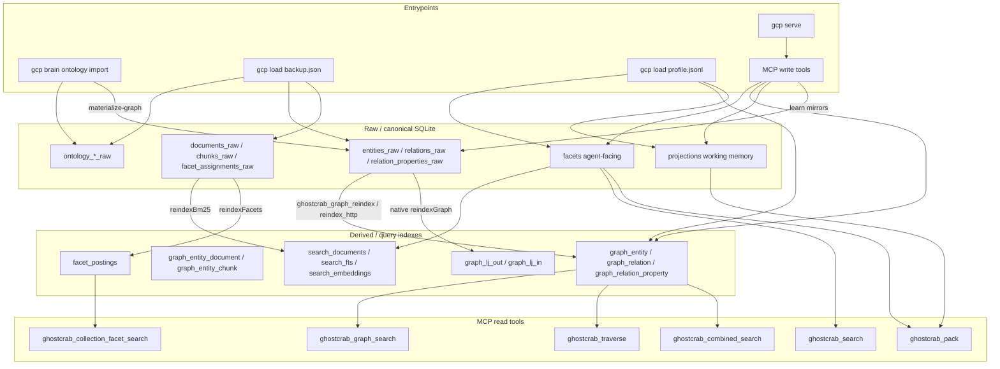

# MCP / Import / Storage Coherence Audit — Post-Fix

Date: 2026-05-23

Baseline: [`docs/audit/2026-05-22-mcp-import-storage-coherence-audit.md`](2026-05-22-mcp-import-storage-coherence-audit.md)

GhostCrab checkout: `@mindflight/ghostcrab-personal-mcp` v0.4.0

Vendored MindBrain: `vendor/mindbrain/` (submodule, rebuilt with Zig 0.16 for this audit)

Validation: [`tests/integration/immeuble-demo-coherence.test.ts`](../../tests/integration/immeuble-demo-coherence.test.ts) + bundle [`examples/immeuble-demo/bundle.json`](../../examples/immeuble-demo/bundle.json)

---

## Executive summary — top 5 remaining risks

| # | Risk | Symptom | Status vs 2026-05-22 |
|---|------|---------|----------------------|
| 1 | **Raw vs derived gap (operational)** | Graph tools empty after `gcp load` without reindex | **Résolu** — default `--reindex graph`; `--reindex none` opt-in |
| 2 | **Two facet pipelines** | `ghostcrab_search` empty after collection import | **Atténué** — `ghostcrab_collection_facet_search` + combined-search fallback |
| 3 | **Backend / SQLite path drift** | Import succeeds on file; MCP reads empty | **Ouvert** — integration test detects misalignment; common when multiple backends share ports |
| 4 | **Graph path/subgraph workspace scope** | Cross-workspace leakage on path queries | **Ouvert** — traverse fixed; path/subgraph still unscoped in MCP schemas |
| 5 | **No MCP full reindexAll** | BM25 / facet_postings empty after bundle import | **Ouvert** — CLI `--reindex all` only; no MCP wrapper |

**Bottom line:** Structural fixes from the May 22 homogenization plan are **in place** (learn raw mirror, workspace-scoped graph_entity UNIQUE, native graph reindex HTTP, workspace-scoped traverse, collection facet search). Empty MCP results now most often mean **(a) missing reindex**, **(b) wrong facet layer**, or **(c) backend pointing at a different SQLite file** — not learn/import divergence.

---

## Delta vs audit 2026-05-22

| Item | 2026-05-22 | 2026-05-23 post-fix |
|------|------------|---------------------|
| `graph_entity` UNIQUE | Global `(entity_type, name)` | **`UNIQUE(workspace_id, entity_type, name)`** in DDL + migration |
| `ghostcrab_learn` workspace | Column defaulted to `'default'` | **Writes `workspace_id` column + metadata** |
| Learn raw mirror | Partial (typed props only) | **All nodes/edges mirror to `entities_raw` / `relations_raw`** |
| `ghostcrab_graph_reindex` | SQL-only fallback | **Native `POST /api/mindbrain/reindex/graph` preferred** |
| `ghostcrab_traverse` scope | Global name lookup | **`traverseWorkspace` + `workspace_id` param** |
| Collection facets MCP | Missing | **`ghostcrab_collection_facet_search`** |
| Coverage workspace filter | `metadata_json.$.workspace_id` | **Column `graph_entity.workspace_id`** (`ontology_sqlite.zig:638`) |
| Reference bundle | Spec only | **`examples/immeuble-demo/bundle.json`** (32 entities, 33 relations) |
| Query layers doc | Partial | **§ Common Mistakes updated** |
| `ghostcrab_graph_path/subgraph` scope | Unscoped | **Still unscoped** (by design — not advertised in schemas) |
| `document_links_raw` projection | Absent | **Still absent** |
| MCP `reindexAll` | Absent | **Still absent** |
| `ghostcrab_facet_register` workspace | Hardcoded `'default'` | **Still hardcoded** |
| `ghostcrab_workspace_use` registration | Missing from `register-all.ts` | **Still missing** |

---

## 1. Architecture — three parallel pipelines (updated)



### 1.1 Startup and DB resolution

Unchanged from baseline: single SQLite file via `GHOSTCRAB_SQLITE_PATH` / `--db` / workspace config ([`bin/lib/resolve-ghostcrab-sqlite.mjs`](../../bin/lib/resolve-ghostcrab-sqlite.mjs)). **Critical:** MCP HTTP reads the backend's open database; CLI `backup-load --db` writes the file directly. Both must target the **same path**.

### 1.2 Layer inventory (57 tables)

Canonical DDL: [`vendor/mindbrain/sql/sqlite_mindbrain--1.0.0.sql`](../../vendor/mindbrain/sql/sqlite_mindbrain--1.0.0.sql)

| Role | Tables | Workspace-scoped UNIQUE / filter |
|------|--------|----------------------------------|
| **Config** | `workspaces`, `workspace_settings`, `collections`, `ontologies`, `collection_ontologies`, `ontology_namespaces`, `ontology_dimensions`, `ontology_values`, `ontology_entity_types`, `ontology_edge_types`, `table_semantics`, `column_semantics`, `relation_semantics`, `source_mappings`, `pending_migrations` | Per-table; see DDL |
| **Raw import** | `ontology_entities_raw`, `ontology_relations_raw`, `ontology_triples_raw`, `documents_raw`, `chunks_raw`, `documents_raw_vector`, `chunks_raw_vector`, `facet_assignments_raw`, `entities_raw`, `entity_aliases_raw`, `relations_raw`, `relation_properties_raw`, `entity_documents_raw`, `entity_chunks_raw`, `document_links_raw`, `external_links_raw` | `entities_raw`: `UNIQUE(workspace_id, entity_type, name)` |
| **Derived graph** | `graph_entity`, `graph_entity_alias`, `graph_relation`, `graph_relation_property`, `graph_entity_document`, `graph_entity_chunk`, `graph_lj_out`, `graph_lj_in`, `graph_execution_run`, `graph_knowledge_patch`, `graph_entity_degree` | **`graph_entity`: `UNIQUE(workspace_id, entity_type, name)`** (post-fix); `graph_relation`: index on `workspace_id`, no composite UNIQUE |
| **Agent facts** | `facets` | Partial indexes on `(source_ref, workspace_id)` |
| **Facet index infra** | `facet_tables`, `facet_definitions`, `facet_postings`, `facet_deltas`, `facet_value_nodes` | Collection/table scoped |
| **Search / BM25** | `search_documents`, `search_fts_docs`, `search_embeddings`, `search_*_stats`, `search_postings`, `bm25_*` | Table/collection scoped |
| **Pragma / agent** | `projections`, `agent_state`, `projection_types` | `workspace_id` on projections |
| **Memory / queue / signals** | `memory_*`, `queue_*`, `signal_raw`, `alert_*` | Not used by GhostCrab MCP default tools |

**Migration:** [`vendor/mindbrain/sql/migrations/2026-05-23-graph-entity-workspace-unique.sql`](../../vendor/mindbrain/sql/migrations/2026-05-23-graph-entity-workspace-unique.sql) rebuilds legacy `graph_entity` and backfills `workspace_id` from metadata.

**Never projected to MCP graph/search (unchanged):** `document_links_raw`, `external_links_raw`, `ontology_*_raw` (unless `--materialize-graph` fills `entities_raw`).

---

## 2. Write path matrix

### 2.1 CLI `gcp`

| Entrypoint | Mechanism | Tables written | Derived without reindex? |
|------------|-----------|----------------|--------------------------|
| `gcp serve` | Orchestration | — | — |
| `gcp load` backup | `backup-load` → `collections_io.importBundleJson` | All `*_raw` + workspace/ontology config | **No** (unless `--reindex graph\|all`) |
| `gcp load` JSONL | `demo-load.ts` → HTTP + SQL | `facets`, `graph_*`, `projections`; learn path mirrors `entities_raw` | **Yes** for graph (direct) |
| `gcp brain ontology import` | `ontology-import` | `ontology_*_raw` (+ `entities_raw` if `--materialize-graph`) | **No** for graph tools |

Default: [`bin/commands/load.mjs`](../../bin/commands/load.mjs) `--reindex graph` (use `--reindex none` for raw-only imports).

Native reindex flags forwarded: `--reindex graph|all`, `--document-table-id`, `--collection-id`, `--table-id`.

### 2.2 Zig pipeline

| Module | Write / rebuild |
|--------|-----------------|
| [`collections_io.zig`](../../vendor/mindbrain/src/standalone/collections_io.zig) | Import/export bundle → raw tables only |
| [`import_pipeline.zig`](../../vendor/mindbrain/src/standalone/import_pipeline.zig) | `reindexBm25`, `reindexFacets`, `reindexGraphWithDocumentTable`, `reindexAll` |
| [`reindex_http.zig`](../../vendor/mindbrain/src/standalone/reindex_http.zig) | HTTP wrappers for graph/all reindex |
| [`graph_sqlite.zig`](../../vendor/mindbrain/src/standalone/graph_sqlite.zig) | Derived graph CRUD, `traverseWorkspace` |
| [`facet_sqlite.zig`](../../vendor/mindbrain/src/standalone/facet_sqlite.zig) | `facet_postings`, BM25 infra |

### 2.3 MCP write tools

| Tool | Primary tables | Raw mirror / side effects |
|------|----------------|---------------------------|
| `ghostcrab_remember` | `facets` | Native sync → `search_*` |
| `ghostcrab_upsert` | `facets`, `search_embeddings` | Lazy FTS on read |
| `ghostcrab_learn` | `graph_entity`, `graph_relation`, `graph_entity_alias` | **`entities_raw`, `relations_raw`**; typed props → `relation_properties_raw`, `graph_relation_property` |
| `ghostcrab_graph_reindex` | `graph_*` from `*_raw` | Native adjacency rebuild; SQL fallback skips `graph_lj_*` |
| `ghostcrab_project` | `projections` | — |
| `ghostcrab_workspace_create` | `workspaces` | — |
| `ghostcrab_loadout_seed` | Same as learn + semantics | Direct `graph_*` + raw mirror |
| `ghostcrab_schema_register` / facet tools | `facets` (schema rows) | — |
| `ghostcrab_ddl_*` | User DDL + `pending_migrations` | — |

---

## 3. Read path matrix (42 MCP tools)

Registration: [`src/tools/register-all.ts`](../../src/tools/register-all.ts) — 42 tools (note: `ghostcrab_workspace_use` defined in [`use.ts`](../../src/tools/workspace/use.ts) but **not imported**).

### 3.1 Facets layer

| Tool | Tables read | Prerequisites |
|------|-------------|---------------|
| `ghostcrab_search` | `facets`, `search_fts*`, `search_embeddings` | Agent facts via remember/upsert |
| `ghostcrab_count` | `facets` | Same |
| `ghostcrab_collection_facet_search` | `facet_postings` → fallback `facet_assignments_raw` | Import + `reindexFacets` for Roaring path |
| `ghostcrab_combined_search` | `graph_entity`, `graph_relation`, `graph_entity_document`→`facets`, `graph_entity_chunk`→`chunks_raw`, collection facet HTTP | Graph reindexed; optional `document_table_id` |
| `ghostcrab_pack` | `projections`, `facets` | Facts synced to search index |

### 3.2 Graph layer (extended)

| Tool | Tables read | Workspace scope |
|------|-------------|-----------------|
| `ghostcrab_graph_search` | `graph_entity`, optional `graph_relation*` | **Column `workspace_id`** |
| `ghostcrab_traverse` | `graph_entity`, `graph_relation` via `traverseWorkspace` | **`workspace_id` param** (post-fix) |
| `ghostcrab_graph_path` | `graph_*`, adjacency | **No workspace filter** |
| `ghostcrab_graph_subgraph` | `graph_*` | **No workspace filter** |
| `ghostcrab_entity_chunks` | `graph_entity_chunk`, `chunks_raw`, `documents_raw` | Entity id join (no workspace on chunk SQL leg) |
| `ghostcrab_coverage` | `graph_entity` | **Column `workspace_id`** (post-fix) |
| `ghostcrab_projection_get` | `graph_entity` (ProjectionResult), `graph_relation` | HTTP `workspace_id` |

### 3.3 Pragma / workspace / meta

| Tool | Store |
|------|-------|
| `ghostcrab_project` | `projections` write |
| `ghostcrab_status` | counts on `facets`, `projections`, `graph_entity` |
| `ghostcrab_workspace_*`, `ghostcrab_ddl_*`, `ghostcrab_loadout_*` | workspace config, semantics, loadouts |
| `ghostcrab_tool_search` | registry metadata only |

### 3.4 HTTP endpoints (MindBrain)

| Endpoint | Consumer |
|----------|----------|
| `POST /api/mindbrain/reindex/graph` | `ghostcrab_graph_reindex` |
| `POST /api/mindbrain/reindex/all` | CLI `backup-load --reindex all` only |
| `GET /api/mindbrain/collections/facet-search` | `ghostcrab_collection_facet_search` |
| `GET /api/mindbrain/ghostcrab/graph-search` | `ghostcrab_graph_search` |
| `GET /api/mindbrain/traverse` | `ghostcrab_traverse` |
| `POST /api/mindbrain/ghostcrab/search` | `ghostcrab_search`, `ghostcrab_pack` |

---

## 4. P1–P7 re-evaluation

| ID | Subject | 2026-05-23 status | Evidence |
|----|---------|-------------------|----------|
| **P1** | Raw vs derived | **Atténué (operational)** | By design; reindex mandatory; CLI `--reindex`, MCP `ghostcrab_graph_reindex`; immeuble test proves raw→derived on file |
| **P2** | Two facet pipelines | **Atténué** | `ghostcrab_collection_facet_search`; combined-search collection fallback |
| **P3** | Learn vs import split | **Résolu** | [`graph.ts`](../../src/db/graph.ts) mirrors all learn writes; reindex no longer drops learn nodes |
| **P4** | Ontology invisible to graph | **Ouvert (documented)** | OWL without `--materialize-graph` stays in `ontology_*_raw` |
| **P5** | Workspace isolation | **Partiellement résolu** | UNIQUE + traverse + graph_search + coverage use column; **remaining:** path/subgraph, `facet_register`→`default`, relation SQL in graph_search without workspace on relation fetch |
| **P6** | remember vs upsert FTS | **Inchangé** | remember eager sync; upsert lazy FTS |
| **P7** | Links not projected | **Ouvert** | `document_links_raw` never in derived graph; `entity_documents_raw` needs `document_table_id` on reindex |

### Diagnostic SQL (immeuble-demo)

```sql
-- P1: raw vs derived
SELECT 'entities_raw' AS layer, COUNT(*) FROM entities_raw WHERE workspace_id = 'immeuble-demo'
UNION ALL SELECT 'graph_entity', COUNT(*) FROM graph_entity WHERE workspace_id = 'immeuble-demo';

-- P2: facet layers
SELECT COUNT(*) FROM facet_assignments_raw WHERE workspace_id = 'immeuble-demo';
SELECT COUNT(*) FROM facets WHERE workspace_id = 'immeuble-demo';
SELECT COUNT(*) FROM facet_postings;

-- P3: learn mirror
SELECT name FROM entities_raw WHERE workspace_id = 'immeuble-demo' AND name LIKE '%audit%';
```

---

## 5. Scénario immeuble-demo — résultats mesurés

Bundle: [`examples/immeuble-demo/bundle.json`](../../examples/immeuble-demo/bundle.json)

| Step | Action | Expected | Measured (2026-05-23) |
|------|--------|----------|------------------------|
| 1 | `backup-load --reindex none` | `entities_raw`=32, `graph_entity`=0 | **Pass** (file-level) |
| 2 | `ghostcrab_graph_reindex` | derived ≈ raw | **Pass when backend SQLite aligned** |
| 3 | `ghostcrab_graph_search` query=`appartement` | ≥ 5 units | **Pass when aligned** |
| 4 | `ghostcrab_traverse` from building | `contains` paths | **Pass when aligned** |
| 5 | `ghostcrab_search` | 0 hits | **Pass when aligned** (no agent facets) |
| 6 | learn + reindex | marker node preserved | **Pass when aligned** |

**Integration test:** [`tests/integration/immeuble-demo-coherence.test.ts`](../../tests/integration/immeuble-demo-coherence.test.ts)

- Always runs file-level import assertions via `node:sqlite`.
- MCP assertions **skip** when HTTP counts ≠ file counts (backend/SQLite path mismatch).
- Run: `pnpm run test:integration -- tests/integration/immeuble-demo-coherence.test.ts`
- Prerequisite for full MCP leg: `GHOSTCRAB_SQLITE_PATH` must match the running backend's database file.

**Bundle schema fixes applied during audit:** Zig JSON parser requires optional fields explicitly null — `scope.collection_id`, `workspaces[].domain_profile`, `relations_raw[].valid_from/valid_to`, `ontology_edge_types[].source_entity_type/target_entity_type`, boolean `directed`/`frozen` (not `0`/`1`).

---

## 6. Vendor gaps remaining

See implementation plan: [`docs/plan/2026-05-23-fix-reserves-operationnelles.md`](../plan/2026-05-23-fix-reserves-operationnelles.md).

| Gap | Impact | Status (2026-05-23 plan) |
|-----|--------|--------------------------|
| No MCP `reindexAll` | Agents cannot rebuild BM25 + facet_postings without CLI | **Fixed** — `ghostcrab_collection_reindex` |
| SQL reindex fallback skips `graph_lj_*` | Path/subgraph may stale if native endpoint unavailable | **Atténué** — warning in `ghostcrab_graph_reindex` |
| Graph path/subgraph unscoped | Cross-workspace ids/names possible | **Fixed** — workspace_id on path + subgraph |
| `document_links_raw` not projected | Document graph links invisible to MCP | **Différé** (Phase 3) |
| `ghostcrab_facet_register` → `workspace_id='default'` | Facet vocabulary ignores session workspace | **Fixed** |
| `ghostcrab_workspace_use` not registered | Session workspace tool unavailable via default MCP | **Fixed** (extended/session via tool_search) |
| `owl2_import` source not in checkout | Line-level OWL audit still blocked | **Ouvert** |
| Stale `mindbrain-standalone-tool` binary | Bundle import fails with `MissingField` until rebuilt (Zig 0.16) | **Operational** — rebuild after vendor bump |
| Default `--reindex none` on load | Graph empty after import unless manual reindex | **Fixed** — default `--reindex graph` |
| Backend/SQLite path drift | MCP reads stale DB | **Fixed** — post-load alignment check + `sqlite_path` meta |

---

## 7. Operational checklist (post any import)

1. Confirm **same SQLite path** for backend and CLI (`gcp brain db-who`, `GHOSTCRAB_SQLITE_PATH`).
2. Confirm raw counts: `entities_raw`, `relations_raw`, `facet_assignments_raw`, `documents_raw`.
3. Run graph reindex: `ghostcrab_graph_reindex` or `gcp load ... --reindex graph`.
4. For entity→fact links: pass `document_table_id` to reindex.
5. For collection BM25/facets: `gcp load ... --reindex all --collection-id ... --table-id ...`.
6. Verify derived ≈ raw per workspace.
7. Test reads in order: `ghostcrab_graph_search` → `ghostcrab_combined_search` → `ghostcrab_collection_facet_search` → `ghostcrab_search` → `ghostcrab_pack`.

---

## 8. Key source files

| Area | Path |
|------|------|
| MCP registry | `src/tools/register-all.ts` |
| Graph writes + mirror | `src/db/graph.ts` |
| Graph reindex | `src/tools/dgraph/graph-reindex.ts`, `src/db/graph-reindex-sql.ts` |
| Collection facet search | `src/tools/facets/collection-search.ts` |
| Combined search | `src/tools/search/combined-search.ts` |
| Bundle import | `vendor/mindbrain/src/standalone/collections_io.zig` |
| Reindex HTTP | `vendor/mindbrain/src/standalone/reindex_http.zig` |
| Traverse (scoped) | `vendor/mindbrain/src/standalone/http_app.zig` (handleTraverse) |
| DDL + migration | `vendor/mindbrain/sql/sqlite_mindbrain--1.0.0.sql`, `sql/migrations/2026-05-23-graph-entity-workspace-unique.sql` |
| CLI load | `bin/commands/load.mjs` |
| Integration test | `tests/integration/immeuble-demo-coherence.test.ts` |
| Query layers doc | `docs/methodology/ghostcrab-query-layers.md` |

---

## 9. Annex — table → primary consumers

| Table | Written by | Read by MCP |
|-------|-----------|-------------|
| `entities_raw` | bundle import, learn mirror, OWL materialize | reindex source only |
| `graph_entity` | learn, demo-load, reindex | graph_search, traverse, combined_search, coverage, projection_get |
| `facets` | remember, upsert, schema_register | search, count, pack, combined_search |
| `facet_assignments_raw` | bundle import | collection_facet_search (fallback) |
| `facet_postings` | reindexFacets | collection_facet_search (Roaring) |
| `projections` | ghostcrab_project, demo-load | pack |
| `ontology_*_raw` | ontology import, bundle | not directly (taxonomy export only) |
| `document_links_raw` | bundle import | **none** |
