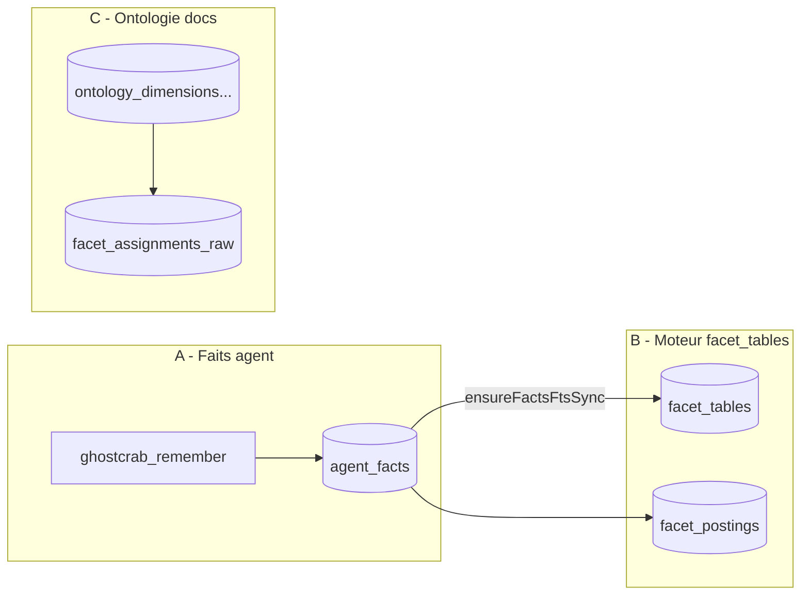

# Comprendre mémoire MCP, facettes, ontologie et projections

Guide d’architecture pour GhostCrab MCP : où vit la mémoire agent, comment distinguer les « facettes », et en quoi les projections diffèrent du graphe métier.

Voir aussi la série détaillée dans [`docs/mcp-explanation/`](mcp-explanation/README.md) (notamment [03 — Projections](mcp-explanation/03-projections-expliquees.md) et [04 — Mémoire MCP](mcp-explanation/04-memoire-mcp-facettes-graphe-projections.md)).

---

## Le piège principal : trois sens du mot « facets »

| Sens | Documentation | Tables / API | Rôle |
|------|---------------|--------------|------|
| **A. Faits agent (mémoire MCP)** | [04-memoire-mcp-facettes-graphe-projections.md](mcp-explanation/04-memoire-mcp-facettes-graphe-projections.md) | Table SQLite **`agent_facts`** (ex-`facets`) | Notes/faits textuels durables (`ghostcrab_remember`, `ghostcrab_search`). Le champ `facets_json` est un **filtre JSON**, pas l’index Roaring MindBrain. |
| **B. Moteur de faceting documentaire** | [vendor/mindbrain/docs/facets.md](vendor/mindbrain/docs/facets.md) | `facet_tables`, `facet_definitions`, `facet_postings` | Index **dérivé** (bitmaps + BM25) sur documents/chunks — pas le stockage des faits agent. |
| **C. Vocabulaire ontologique** | [vendor/mindbrain/docs/collections.md](vendor/mindbrain/docs/collections.md) | `ontology_*`, `facet_assignments_raw` | Schéma graphe + taxonomie de qualification documentaire (`domain.building`, etc.). |

**`facet_tables` n’est pas la table des faits agent.** C’est le registre MindBrain qui indique qu’une table logique (ici `agent_facts`, `table_id = 1`) est indexée pour BM25/FTS. GhostCrab enregistre cette table au démarrage via [`src/db/facets-fts-sync.ts`](../src/db/facets-fts-sync.ts) et [`FACETS_SEARCH_TABLE_ID`](../src/db/fact-store.ts).



Doc graphe canonique : [vendor/mindbrain/docs/graph.md](vendor/mindbrain/docs/graph.md).

---

## 1. Comment le MCP gère la mémoire de l’agent

Quatre couches, pas une seule « mémoire » :

| Couche | Fichiers clés | Outils | Persistant ? |
|--------|---------------|--------|--------------|
| **Routage** | `src/mcp/session-context.ts` | `ghostcrab_workspace_use` | Non (restart MCP) |
| **Faits durables** | `src/tools/facets/remember.ts` → `POST /api/mindbrain/facts/write` | `ghostcrab_remember`, `ghostcrab_upsert`, `ghostcrab_search` | Oui (`agent_facts`) |
| **Mémoire de travail** | `src/tools/pragma/project.ts`, `pack.ts` | `ghostcrab_project`, `ghostcrab_pack` | Oui (`projections`) |
| **Graphe métier** | `src/tools/dgraph/learn.ts`, `src/db/graph.ts` | `ghostcrab_learn`, `ghostcrab_graph_search`, `traverse`… | Oui (raw + runtime) |

**`ghostcrab_pack`** fusionne projections actives + top faits depuis `agent_facts` (BM25/FTS). Il **ne lit pas** `graph_entity`.

**Écriture courante :**

- Texte stable → `remember` / `upsert`
- Relation métier → `learn`
- Objectif de session → `project`, puis `pack`

---

## 2. Ontologie et facettes « réelles »

### Ontologie domaine (ex. immeuble)

LinkML [`ontologies/immeuble-demo/core.yaml`](../ontologies/immeuble-demo/core.yaml) → CLI :

```bash
gcp brain ontology compile \
  --workspace-id <workspace> \
  --ontology-id immeuble-demo::core \
  --input ontologies/immeuble-demo/core.yaml \
  --import-db --force
```

Remplit `ontology_entity_types`, `ontology_edge_types`, `ontology_namespaces`, etc.

### Registre MCP léger

`ghostcrab_schema_register` écrit des définitions dans `agent_facts` avec `schema_id = 'mindbrain:schema'`. Ce n’est pas un remplacement LinkML.

---

## 3. Ajouter du contenu et le récupérer

### Faits agent (`agent_facts`)

| Action | Outil |
|--------|-------|
| Créer | `ghostcrab_remember` |
| Modifier | `ghostcrab_upsert` |
| Chercher | `ghostcrab_search` (filtres = clés dans `facets_json`) |

Pipeline : ligne `agent_facts` → bootstrap FTS (`search_documents`, `search_fts`) → scoring.

### Graphe métier

| Étape | Outil |
|-------|-------|
| Écriture incrémentale | `ghostcrab_learn` → `entities_raw` + `graph_entity` |
| Rebuild si raw modifié hors MCP | `ghostcrab_graph_reindex` |
| Lecture | `ghostcrab_graph_search`, `traverse`, `graph_path` |

**Note :** `ghostcrab_learn` via MCP fixe `entity_type = 'entity'` dans `graph_entity` ; le type métier (`building`, `person`) est souvent dans `metadata_json`. Les imports bundle (lab immeuble) utilisent directement `entity_type: "building"`, etc.

### Facettes documentaires

`facet_assignments_raw` ← ontologie, puis `reindexFacets` → `facet_postings`. Outils collection MCP lisent l’index dérivé, pas `agent_facts`.

---

## 4. Projections vs données réelles

| | Type A (`projections`) | Type B (`ProjectionResult`) | Données réelles |
|--|------------------------|----------------------------|-----------------|
| **Nature** | Résumé agent | Snapshot analytique | Entités/relations domaine |
| **Write MCP** | `ghostcrab_project` | Pipeline import | `ghostcrab_learn` / import |
| **Read MCP** | `ghostcrab_pack` | `ghostcrab_projection_get` | `ghostcrab_graph_search` |
| **Stale si graphe change ?** | Oui | Oui | Non (si reindex OK) |

**Règle mnémotechnique :**

- Vérité métier → graphe
- Note textuelle filtrable → `agent_facts`
- Contexte de session → Type A
- Rapport pré-calculé → Type B

`ghostcrab_search` ne touche pas le graphe ; `ghostcrab_combined_search` peut fusionner les deux.

---

## 5. Parcours code recommandé

1. [04-memoire-mcp-facettes-graphe-projections.md](mcp-explanation/04-memoire-mcp-facettes-graphe-projections.md)
2. [03-projections-expliquees.md](mcp-explanation/03-projections-expliquees.md) + `src/tools/pragma/project.ts`, `projection-get.ts`
3. `src/db/fact-store.ts`, `src/db/facets-fts-sync.ts`, `vendor/mindbrain/sql/sqlite_mindbrain--1.0.0.sql` (table `agent_facts` vs `facet_tables`)
4. [collections.md](vendor/mindbrain/docs/collections.md), [02-mcp-ontologie-gap-rules.md](mcp-explanation/02-mcp-ontologie-gap-rules.md)
5. [graph.md](vendor/mindbrain/docs/graph.md), `src/tools/dgraph/learn.ts`, `src/db/graph.ts`

---

## 6. Réponses directes

1. **Mémoire agent** : session + `agent_facts` + `projections` + graphe via outils graph ; `pack` = projections + faits, pas graphe.
2. **Facettes / ontologie** : LinkML → `ontology_*` ; docs → `facet_assignments_raw` → `facet_postings` ; faits agent → `agent_facts` + `facets_json`.
3. **Ajouter / récupérer** : `remember`/`search` pour faits ; `learn` + outils graphe pour métier.
4. **Projections** : vues/résumés ; graphe/raw = source métier ; rien ne se recalcule seul quand le graphe change.
