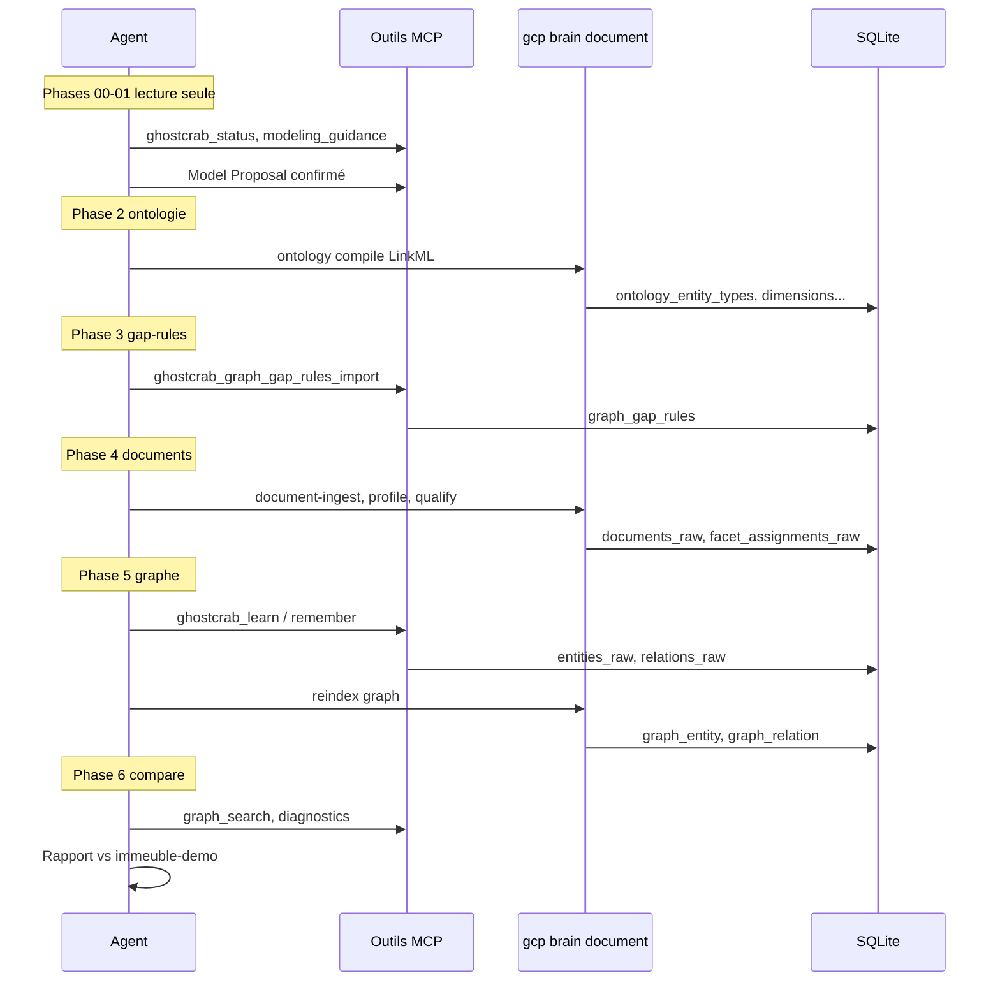

# 01 — Référence golden et processus MCP

> Version française — English: [en/01-reference-to-graph.md](en/01-reference-to-graph.md)

## Ce que `bundle.json` est — et ce qu'il n'est pas

[`examples/immeuble/reference/bundle.json`](../../examples/immeuble/reference/bundle.json) est la **cible de comparaison** pour le MCP lab. C'est un snapshot importable du workspace `immeuble-demo` :

| Section du bundle | Contenu (référence) | Sert à comparer |
|-------------------|---------------------|-----------------|
| `ontology_*` | Taxonomie LinkML `immeuble-demo::core` | Ontologie enregistrée en phase 2 |
| `documents_raw` + `facet_assignments_raw` | 7 docs qualifiés, 22 facet assignments | Qualification en phase 4 |
| `entities_raw` + `relations_raw` | 131 entités, 265 relations | Graphe extrait en phase 5 |
| `entity_documents_raw` | Liens entité ↔ preuve documentaire | Provenance après extraction |

**Ce n'est pas** le chemin à suivre pour construire un domaine avec MCP. On ne « lit » pas le bundle pour apprendre le processus — on **charge** la référence dans `immeuble-demo`, puis on exécute le processus MCP dans `immeuble-demo-llm` et on mesure l'écart.

Fichiers **à côté** du bundle (pas dedans) :

- [`gap-rules/demo.json`](../../examples/immeuble/reference/gap-rules/demo.json) — règles patrimoine
- [`gap-rules/syndic.json`](../../examples/immeuble/reference/gap-rules/syndic.json) — règles occupation/baux
- [`answer-artifacts.seed.jsonl`](../../examples/immeuble/reference/answer-artifacts.seed.jsonl) — seed optionnel `analysis_plan` + `live_answer_view`
- [`scenarios.yaml`](../../examples/immeuble/reference/scenarios.yaml) — questions de compétence

Charger la référence (pour comparaison uniquement) :

```bash
export GHOSTCRAB_SQLITE_PATH="$PWD/data/immeuble-demo.sqlite"
node bin/gcp.mjs load examples/immeuble/reference/bundle.json \
  --workspace immeuble-demo --reindex all
```

---

## Le processus GhostCrab MCP (piste lab)

Point d'entrée : [`examples/immeuble/mcp-lab/README.md`](../../examples/immeuble/mcp-lab/README.md)

**Entrée** : 8 fichiers markdown bruts dans [`mcp-lab/corpus/`](../../examples/immeuble/mcp-lab/corpus/) — pas le bundle, pas les docs qualifiés de `reference/documents/`.

**Sortie visée** : workspace `immeuble-demo-llm` avec ontologie, docs qualifiés, graphe métier, gap-rules — comparable aux seuils de [`success-criteria.yaml`](../../examples/immeuble/mcp-lab/success-criteria.yaml).



### Phase 2 — Ontologie

Prompt : [`02-ontology-register.md`](../../examples/immeuble/mcp-lab/prompts/02-ontology-register.md)

```bash
gcp brain ontology compile \
  --workspace-id immeuble-demo-llm \
  --ontology-id immeuble-demo::core \
  --input ontologies/immeuble-demo/core.yaml \
  --import-db --force
```

Alternative MCP : `ghostcrab_schema_register` (modèle léger, pas équivalent complet LinkML).

**Comparaison** : la référence bundle contient la même ontologie compilée — checklist read-only : [`mcp-lab/reference/ontology-checklist.md`](../../examples/immeuble/mcp-lab/reference/ontology-checklist.md).

### Phase 3 — Gap-rules

Prompt : [`03-gap-rules-design.md`](../../examples/immeuble/mcp-lab/prompts/03-gap-rules-design.md)

Les gap-rules ne sont **pas** dans le bundle. L'agent les conçoit ou importe depuis les exemples training/reference, puis :

```
ghostcrab_graph_gap_rules_import  (outil extended)
ghostcrab_graph_diagnostics
```

**Comparaison** : exécuter les diagnostics sur `immeuble-demo-llm` et viser `missing_required_relations = 0` avec le pack L2 ([`training/gap-rules/L2-syndic-filtered.json`](../../examples/immeuble/training/gap-rules/L2-syndic-filtered.json)).

### Phase 4 — Qualification documentaire

Prompt : [`04-document-ingest.md`](../../examples/immeuble/mcp-lab/prompts/04-document-ingest.md)

Via CLI (pas MCP streaming) :

```bash
gcp brain document collection-create ...
gcp brain document document-ingest --content-file corpus/statuts-tilleuls.md ...
gcp brain document document-profile-worker --limit 8
gcp brain document document-qualify \
  --facets domain.building,domain.unit,...,source.document_type
```

Écrit : `documents_raw`, `chunks_raw`, `facet_assignments_raw`.

**Comparaison** : la référence a 7 docs / 22 facets ; le lab ingère 8 corpus et produit davantage de facet assignments (qualification LLM ou mock).

### Phase 5 — Extraction graphe

Prompt : [`05-graph-extraction.md`](../../examples/immeuble/mcp-lab/prompts/05-graph-extraction.md)

Deux voies :

| Voie | Mécanisme | Écrit |
|------|-----------|-------|
| **Agent MCP** | `ghostcrab_learn` (nœuds/arcs), `ghostcrab_remember` (notes) | `entities_raw`, `relations_raw` |
| **Script live** | `document-business-extract` (moteur natif + LLM) | idem + `entity_documents_raw` |

Puis reindex :

```bash
gcp load partial-bundle --reindex graph
# ou ghostcrab_graph_reindex / ghostcrab_collection_reindex
```

**Comparaison** : seuils entity/relation dans `success-criteria.yaml` (ex. 13 `unit`, 69 `contains`, quotités = 1000).

### Phase 6 — Validation

Prompt : [`06-validate-and-compare.md`](../../examples/immeuble/mcp-lab/prompts/06-validate-and-compare.md)

Checks typiques :

1. Counts par `entity_type` et `edge_type` vs golden
2. `ghostcrab_graph_search` : « appartement » ≥ 13, « Dupont », « bail », « CODA »
3. `ghostcrab_graph_diagnostics` avec gap-rules L2

Automatisé :

```bash
node scripts/import-immeuble-demo-llm.mjs --mode mock --reset
```

**Limitation mock CI** : le script compare in-memory vs golden et produit un rapport — il **ne persiste pas** automatiquement le graphe extrait dans `immeuble-demo-llm`. Pour parité SQLite (requêtes MCP sur le workspace lab), charger manuellement un bundle partiel (ex. `llm-extracted-business.bundle.json`) ou exécuter le pipeline en `--mode live`.

---

## Deux graphes dans la référence (pour la comparaison)

Quand on inspecte le bundle golden, distinguer :

| Clé bundle | Rôle | Count |
|------------|------|-------|
| `ontology_entities` / `ontology_relations` | Schéma LinkML (patterns qualified_relation) | 5 / 4 |
| `entities_raw` / `relations_raw` | **Instances métier** syndic (buildings, units, personnes, baux…) | 131 / 265 |

Le processus MCP phase 5 vise à reproduire le **deuxième** — le graphe instance — pas le mini-graphe de schéma.

---

## Documents : entrée lab vs référence

| | Entrée MCP lab | Référence bundle |
|--|----------------|------------------|
| Dossier | `mcp-lab/corpus/` (8 fichiers verbeux) | `reference/documents/` (7 docs structurés) |
| Rôle | **Source** du processus | **Cible** de comparaison qualité |
| Dans bundle | Non (ingérés à la volée) | Oui (`documents_raw`) |

Les documents de référence ne sont **pas** la source d'extraction du graphe golden — ils sont des preuves alignées sur le modèle déjà défini. Le lab part de corpus plus réalistes pour tester si MCP + LLM retrouvent un graphe comparable.

---

## Récapitulatif

```
Corpus brut  ──processus MCP/CLI──►  immeuble-demo-llm
                                           │
                                           │ compare (success-criteria.yaml)
                                           ▼
bundle.json  ──gcp load──►  immeuble-demo  (cible, pas le processus)
```

Suite : [02 — MCP, ontologie et gap-rules](02-mcp-ontologie-gap-rules.md) · Architecture : [03](03-memoire-mcp-facettes-graphe-projections.md) → [04](04-reindexation-ghostcrab.md) → [05](05-projections-expliquees.md)
