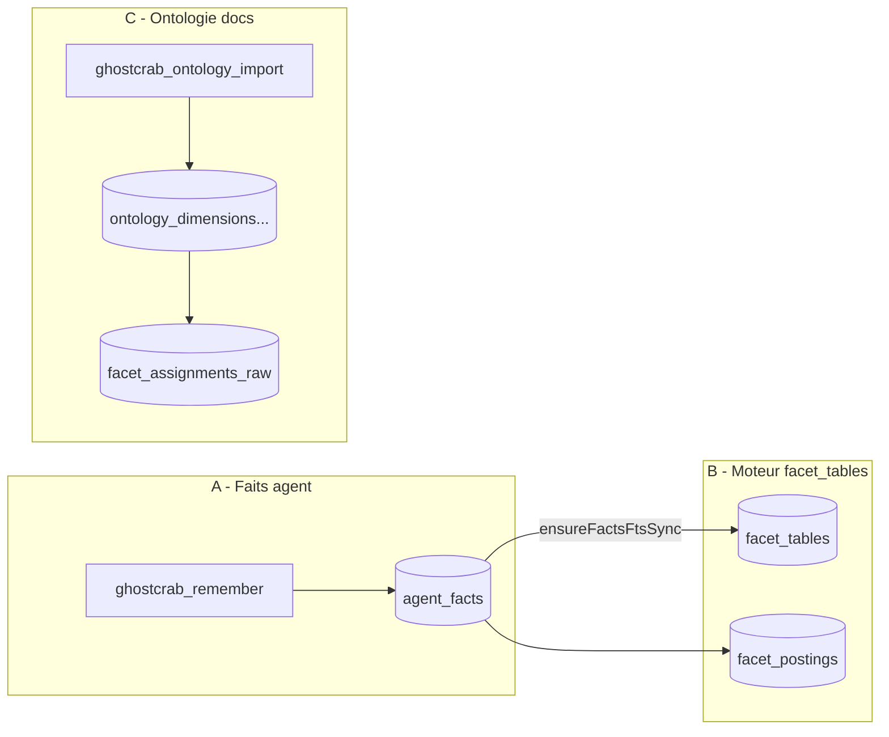
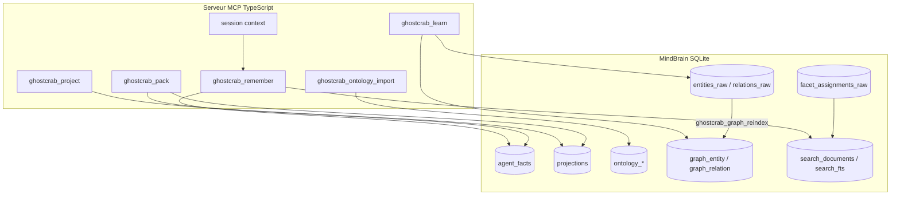

# 03 — Mémoire MCP, facettes, graphe et projections

Ce document explique les couches techniques que le code GhostCrab/MindBrain utilise derrière les outils MCP. Le point important : il n'y a pas une seule « mémoire ». Il y a plusieurs magasins, avec des rôles et des règles de synchronisation différents.

> **Modèle LinkML :** [`ghostcrab-docs::memory-model`](ontology/diagrams/memory-model.md) · [MECE validation](ontology/mece-validation.md)

Suite recommandée : [04 — Réindexation](04-reindexation-ghostcrab.md) puis [05 — Projections expliquées](05-projections-expliquees.md).

Pour auditer ces explications sur un vrai import, voir la [Méthode StarterKit](methode-starterkit/README.md).

---

## Le piège principal : trois sens du mot « facets »

| Sens | Documentation | Tables / API | Rôle |
|------|---------------|--------------|------|
| **A. Faits agent (mémoire MCP)** | ce document § Faits agent | Table SQLite **`agent_facts`** (ex-`facets`) | Notes/faits textuels durables (`ghostcrab_remember`, `ghostcrab_search`). Le champ `facets_json` est un **filtre JSON**, pas l'index Roaring MindBrain. |
| **B. Moteur de faceting documentaire** | [vendor/mindbrain/docs/facets.md](../../vendor/mindbrain/docs/facets.md) | `facet_tables`, `facet_definitions`, `facet_postings` | Index **dérivé** (bitmaps + BM25) sur documents/chunks — pas le stockage des faits agent. |
| **C. Vocabulaire ontologique** | [vendor/mindbrain/docs/collections.md](../../vendor/mindbrain/docs/collections.md) | `ontology_*`, `facet_assignments_raw` | Schéma graphe + taxonomie de qualification documentaire (`domain.*`, etc.). |

**`facet_tables` n'est pas la table des faits agent.** C'est le registre MindBrain qui indique qu'une table logique (ici `agent_facts`, `table_id = 1`) est indexée pour BM25/FTS. GhostCrab enregistre cette table au démarrage via [`src/db/facets-fts-sync.ts`](../../src/db/facets-fts-sync.ts) et [`FACETS_SEARCH_TABLE_ID`](../../src/db/fact-store.ts).



Doc graphe canonique : [vendor/mindbrain/docs/graph.md](../../vendor/mindbrain/docs/graph.md).

---

## Quatre couches mémoire MCP

| Couche | Fichiers clés | Outils | Persistant ? |
|--------|---------------|--------|--------------|
| **Routage** | `src/mcp/session-context.ts` | `ghostcrab_workspace_use` | Non (restart MCP) |
| **Faits durables** | `src/tools/facets/remember.ts` → `POST /api/mindbrain/facts/write` | `ghostcrab_remember`, `ghostcrab_upsert`, `ghostcrab_search` | Oui (`agent_facts`) |
| **Mémoire de travail** | `src/tools/pragma/project.ts`, `pack.ts` | `ghostcrab_project`, `ghostcrab_pack` | Oui (`projections`) |
| **Ontologie formelle** | `src/tools/ontology/import.ts` → HTTP natif MindBrain, fallback CLI natif | `ghostcrab_ontology_import` | Oui (`ontology_*`) |
| **Graphe métier** | `src/tools/dgraph/learn.ts`, `src/db/graph.ts` | `ghostcrab_learn`, `ghostcrab_graph_search`, `traverse`… | Oui (raw + runtime) |

**`ghostcrab_pack`** fusionne projections actives + top faits depuis `agent_facts` (BM25/FTS). Il **ne lit pas** `graph_entity`.

**Écriture courante :**

- Texte stable → `remember` / `upsert`
- Ontologie LinkML/N-Triples → `ontology_import`
- Relation métier → `learn`
- Objectif de session → `project`, puis `pack`



---

## Session MCP : mémoire de routage, pas mémoire métier

`src/mcp/session-context.ts` garde en mémoire process :

- `workspace_id`, par défaut `default` ;
- `schema_id`, optionnel ;
- les métadonnées de pinning du workspace de démarrage.

Cette couche ne qualifie rien et ne stocke aucun fait métier. Elle sert seulement à éviter de répéter `workspace_id` et `schema_id` dans chaque appel. Si le serveur MCP redémarre, ce contexte revient aux défauts ou à la configuration CLI/env.

---

## Bootstrap : `ghostcrab_status`

Premier appel recommandé avant toute écriture ou audit StarterKit. Implémentation : [`src/tools/pragma/status.ts`](../../src/tools/pragma/status.ts).

| Bloc réponse | Rôle |
|--------------|------|
| `workspace_context` | Workspace / schéma actifs, pinning |
| `runtime.capabilities` | Routes MindBrain disponibles (diagnostics, gap-rules, embeddings…) |
| `versions` (depuis v0.5.2) | `ghostcrab_package` (npm), `mcp_surface` (date d'enveloppe JSON), `mindbrain` (semver backend Zig, ex. **1.7.1**) |
| `summary` | Santé embeddings, attention requise |

Lecture schéma agent (registre MCP, pas ontologie LinkML) : `ghostcrab_schema_get` (recommandé), `ghostcrab_schema_list`, `ghostcrab_schema_inspect`.

---

## Faits agent : table `agent_facts`

| Action | Outil |
|--------|-------|
| Créer | `ghostcrab_remember` |
| Modifier | `ghostcrab_upsert` |
| Chercher | `ghostcrab_search` (filtres = clés dans `facets_json`) |

`ghostcrab_remember` écrit un fait durable via `/api/mindbrain/facts/write`. Le contenu est textuel, avec un JSON `facets_json` pour filtrer plus tard.

Pipeline : ligne `agent_facts` → bootstrap FTS (`search_documents`, `search_fts`) → scoring. Détail auto-indexation : [04 — Réindexation §6](04-reindexation-ghostcrab.md#6-auto-indexation--ce-qui-tourne-sans-graph_reindex).

Cette mémoire est utile pour notes stables, état de tracker, observations agent — pas pour le graphe métier. `ghostcrab_search` lit `agent_facts`, pas `graph_entity`.

---

## Ontologie et facettes « réelles »

### Ontologie domaine (LinkML)

Voie MCP native :

```json
{
  "workspace_id": "<workspace>",
  "ontology_id": "<ontology-id>",
  "input_path": "<path-to-core.yaml>",
  "source_format": "linkml"
}
```

Voie CLI opérateur :

```bash
gcp brain ontology compile \
  --workspace-id <workspace> \
  --ontology-id <ontology-id> \
  --input <path-to-core.yaml> \
  --import-db --force
```

Remplit `ontology_entity_types`, `ontology_edge_types`, `ontology_namespaces`, etc.

Ne pas utiliser `ghostcrab_remember`, `ghostcrab_upsert`, `ghostcrab_learn`, `ghostcrab_schema_register` ou `ghostcrab_graph_gap_rules_import` pour importer une ontologie formelle : ces outils écrivent respectivement mémoire, état courant, instances graphe, schémas agent ou règles de diagnostic.

Processus lab détaillé (illustration) : [02 — MCP, ontologie et gap-rules](02-mcp-ontologie-gap-rules.md).

### Registre MCP léger

`ghostcrab_schema_register` écrit des définitions dans `agent_facts` avec `schema_id = 'mindbrain:schema'`. Ce n'est pas un remplacement LinkML.

---

## Qualification documentaire : `facet_assignments_raw`

L'import documentaire passe par le moteur natif :

```bash
gcp brain document document-qualify \
  --workspace-id <workspace> \
  --collection-id <collection-id> \
  --taxonomies <ontology-id> \
  --facets domain.entity_type,source.document_type
```

Le code `qualification_apply.zig` valide que la facette demandée est autorisée, que la cible doc/chunk existe, et écrit dans `facet_assignments_raw`.

Ces facettes qualifient des documents ou chunks. Elles guident la recherche et l'extraction, mais **ne créent pas automatiquement** des entités graphe. Pour cela il faut une extraction graphe (`ghostcrab_learn` ou `document-business-extract`).

Ensuite : `reindexFacets` → `facet_postings`. Outils collection MCP lisent l'index dérivé, pas `agent_facts`. Voir [04 — Réindexation](04-reindexation-ghostcrab.md).

---

## Graphe : raw puis runtime

| Magasin | Tables principales | Écriture | Lecture |
|---------|-------------------|----------|---------|
| **Graphe raw** | `entities_raw`, `relations_raw`, `relation_properties_raw`, liens preuve | `ghostcrab_learn`, `document-business-extract`, import bundle | `ghostcrab_graph_reindex`, exports |
| **Graphe runtime** | `graph_entity`, `graph_relation`, `graph_relation_property`, adjacence | `ghostcrab_learn` direct ou reindex | `ghostcrab_graph_search`, `traverse`, diagnostics, `ghostcrab_projection_get` |

| Étape | Outil |
|-------|-------|
| Écriture incrémentale | `ghostcrab_learn` → `entities_raw` + `graph_entity` |
| Rebuild si raw modifié hors MCP | `ghostcrab_graph_reindex` |
| Lecture live | `ghostcrab_graph_search`, `traverse`, `graph_path` |

**Note :** `ghostcrab_learn` via MCP fixe `entity_type = 'entity'` dans `graph_entity` ; le type métier (`building`, `person`, etc.) est souvent dans `metadata_json`. Les imports bundle opérateur peuvent écrire directement `entity_type: "building"`, etc.

`document-business-extract` demande au LLM un JSON structuré avec entités, relations, liens de preuve et propriétés, puis applique dans une transaction. Si `--reindex graph` est demandé, le raw est rejoué vers le runtime.

Pour les propriétés typées d'arête, `ghostcrab_learn` écrit `relation_properties_raw`, puis projette vers `graph_relation_property`.

---

## Projections de travail : Type A

`FACT | GOAL | STEP | CONSTRAINT` sont des types de lignes dans `projections`. Ce ne sont **pas** des types d'entités du graphe.

| Type | Sens pratique | Exemple générique |
|------|---------------|-------------------|
| `FACT` | Fait de travail compact que l'agent veut garder actif | « Le contrat X expire en juin. » |
| `GOAL` | Objectif en cours | « Consolider les relations actives du domaine. » |
| `STEP` | Prochaine action | « Vérifier les propriétés manquantes sur les arêtes. » |
| `CONSTRAINT` | Règle ou limite active | « Ne pas modifier le workspace de référence. » |

`ghostcrab_project` insère ou rafraîchit une ligne par combinaison `agent_id + scope + proj_type + content`.

`ghostcrab_pack` assemble les projections actives + faits pertinents depuis `agent_facts`. Il ne lit pas le graphe runtime.

Détail complet : [05 — Projections expliquées § Type A](05-projections-expliquees.md#type-a--working-memory-ghostcrab_project).

---

## Projections matérialisées : Type B

`ghostcrab_projection_get` lit des entités runtime :

- `graph_entity.entity_type = 'ProjectionResult'` avec `metadata_json.projection_id = <id>` ;
- relations sortantes vers des preuves (`PROVEN_BY`) ;
- `DeltaFinding` avec `metadata_json.metric = <projection_id>`.

Snapshot analytique matérialisé par un pipeline opérateur — ni requête graphe générique, ni table `projections`.

Détail complet : [05 — Projections expliquées § Type B](05-projections-expliquees.md#type-b--projection-matérialisée-ghostcrab_projection_get).

---

## Projections vs données réelles

| | Type A (`projections`) | Type B (`ProjectionResult`) | Données réelles |
|--|------------------------|----------------------------|-----------------|
| **Nature** | Résumé agent | Snapshot analytique | Entités/relations domaine |
| **Write MCP** | `ghostcrab_project` | Pipeline import | `ghostcrab_learn` / import |
| **Read MCP** | `ghostcrab_pack` | `ghostcrab_projection_get` | `ghostcrab_graph_search` |
| **Stale si graphe change ?** | Oui | Oui | Non ([si réindex OK](04-reindexation-ghostcrab.md)) |

**Règle mnémotechnique :**

- Vérité métier → graphe
- Note textuelle filtrable → `agent_facts`
- Contexte de session → Type A
- Rapport pré-calculé → Type B

`ghostcrab_search` ne touche pas le graphe ; `ghostcrab_combined_search` peut fusionner les deux.

Les projections (Type A / Type B) ne passent **jamais** par les mécanismes de réindexation. Seules les **données réelles** (graphe, collections, faits agent) le font — voir [04 — Réindexation](04-reindexation-ghostcrab.md).

---

## Mises à jour — résumé

| Mise à jour | Effet immédiat | Action si stale |
|-------------|----------------|-----------------|
| `ghostcrab_remember` / `upsert` | Ligne `agent_facts` | Rafraîchir projection Type A si elle résume ce fait |
| `ghostcrab_ontology_import` | Tables `ontology_*` | Réexécuter qualification/couverture si le vocabulaire change |
| `document-qualify` | `facet_assignments_raw` | `ghostcrab_collection_reindex` |
| `entities_raw` / SQL sur raw | Raw modifié | `ghostcrab_graph_reindex` |
| `ghostcrab_learn` | Runtime graphe immédiat | `graph_reindex` si adjacence incohérente |
| `ghostcrab_project` | Pack mis à jour | Rien (mémoire de travail) |
| Graphe change après Type A/B | Projections inchangées | Réécrire `project` ou regénérer pipeline Type B |

Tableau complet : [04 — Réindexation §5](04-reindexation-ghostcrab.md#5-quand-lancer-quoi-).

---

## Règle pratique

- Fait textuel durable → `ghostcrab_remember` ou `ghostcrab_upsert`
- Ontologie formelle LinkML/N-Triples → `ghostcrab_ontology_import`
- Relation métier vérifiable → `ghostcrab_learn` ou `document-business-extract`
- Raw visible aux outils graphe → `ghostcrab_graph_reindex`
- Qualifier des documents/chunks → `document-qualify` puis reindex collection
- Contexte compact agent → `ghostcrab_project`, puis `ghostcrab_pack`
- Snapshot analytique pré-matérialisé → `ghostcrab_projection_get`

La confusion vient du mot « projection » : mémoire de travail agent, snapshots analytiques dans le graphe, et projection interne raw → runtime. Ces trois usages ne sont pas interchangeables.

Audit : [Méthode StarterKit — confirmer ou infirmer](methode-starterkit/03-confirmer-infirmer-les-explications.md).

Suite : [04 — Réindexation GhostCrab](04-reindexation-ghostcrab.md)
