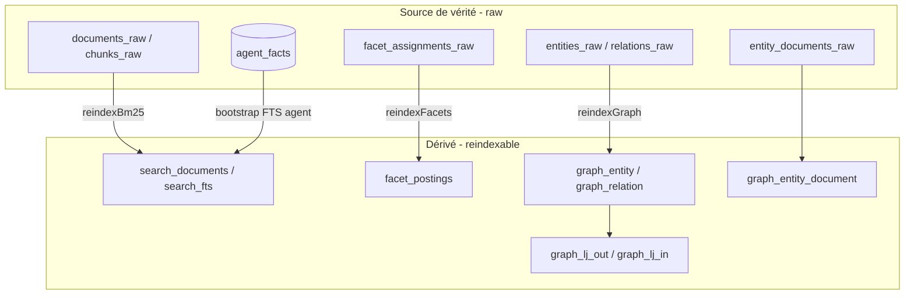

# 04 — Réindexation GhostCrab / MindBrain

Guide opérationnel : **quoi** reconstruire, **partiel vs complet**, **quand** lancer une réindexation, et **ce qui s'indexe tout seul**.

Amont : [03 — Mémoire MCP § Projections vs données réelles](03-memoire-mcp-facettes-graphe-projections.md#projections-vs-données-réelles). Aval : [05 — Projections § stale Type B](05-projections-expliquees.md#type-b--projection-matérialisée-ghostcrab_projection_get).

Les projections (Type A / Type B) ne passent **jamais** par ces mécanismes ; seules les **données réelles** (graphe, collections, faits agent) le font.

Voir aussi : [collections.md](../../vendor/mindbrain/docs/collections.md), [graph.md](../../vendor/mindbrain/docs/graph.md), [facets.md](../../vendor/mindbrain/docs/facets.md), [ghostcrab-query-layers.md](../methodology/fr/ghostcrab-query-layers.md).

---

## 1. Pourquoi une réindexation existe

MindBrain sépare **source de vérité** (`*_raw`) et **index dérivés** (lecture rapide). Les index dérivés peuvent être supprimés ou corrompus ; le raw, lui, est ce qu'on sauvegarde et ce qu'on rejoue.



| Couche | Exemples de tables | Rôle |
|--------|-------------------|------|
| **Raw** | `entities_raw`, `relations_raw`, `facet_assignments_raw`, `documents_raw` | Durable ; backup/restore |
| **Dérivé** | `graph_entity`, `facet_postings`, `search_fts`, `graph_lj_*` | Reconstruit par pipeline / outils reindex |
| **Hors reindex** | `projections` (Type A), `ProjectionResult` (Type B) | Vues / snapshots ; refresh manuel (`ghostcrab_project`, pipeline) |

---

## 2. Les trois fonctions de reindex (moteur Zig)

Implémentation : [`vendor/mindbrain/src/standalone/import_pipeline.zig`](../../vendor/mindbrain/src/standalone/import_pipeline.zig).

| Fonction | Reconstruit | Lit depuis |
|----------|-------------|------------|
| **`reindexBm25`** | Index BM25 / FTS documents (et chunks si `chunk_table_id` fourni) | `documents_raw`, `chunks_raw` |
| **`reindexFacets`** | Postings Roaring (`facet_postings`) pour une collection | `facet_assignments_raw` |
| **`reindexGraph`** / **`reindexGraphWithDocumentTable`** | `graph_entity`, relations, propriétés, liens doc/chunk, **adjacence** `graph_lj_out` / `graph_lj_in` | `entities_raw`, `relations_raw`, … |
| **`reindexAll`** | Les trois ci-dessus enchaînés | workspace + collection + `table_id` |

`reindexAll` est l'équivalent **complet** pour une **collection** (corpus documentaire + facettes collection + graphe lié à cette table).

```zig
// Complet (collection)
try pipeline.reindexAll("ws", "ws::docs", facet_table_id);

// Partiel (API Zig / opérateur — pas d'outil MCP dédié par sous-étape)
_ = try pipeline.reindexBm25("ws", "ws::docs", .{ .table_id = facet_table_id });
_ = try pipeline.reindexFacets("ws", "ws::docs", facet_table_id);
_ = try pipeline.reindexGraph("ws");
_ = try pipeline.reindexGraphWithDocumentTable("ws", facet_table_id);
```

---

## 3. Partiel vs complet — tableau de décision

| Besoin | Mécanisme | Portée |
|--------|-----------|--------|
| Graphe illisible après import raw, extract, ou SQL sur `*_raw` | **`ghostcrab_graph_reindex`** ou CLI `--reindex graph` | Graphe + adjacence (+ liens doc/chunk si `document_table_id`) |
| Tout le workspace (collections + FTS agent) | **`ghostcrab_reindex_all`** (`scope: all`) | Toutes les collections enregistrées + bootstrap `agent_facts` |
| BM25 collection + facettes collection + graphe | **`ghostcrab_collection_reindex`** ou CLI `--reindex all` | Une collection (`collection_id` + `table_id`) |
| Seulement BM25 ou seulement facettes collection | Pipeline Zig `reindexBm25` / `reindexFacets` (appel direct) | **Pas** d'outil MCP ni de flag CLI isolé : passer par `ghostcrab_collection_reindex` / `--reindex all` (reconstruit les trois) ou un appel Zig direct au pipeline |
| Faits agent (`agent_facts`) | Bootstrap FTS + rattrapage à la recherche | Pas `graph_reindex` — voir §6 |
| Projections session (Type A) ou analytiques (Type B) | `ghostcrab_project` / pipeline | **Aucune** réindexation |

---

## 4. Surfaces exposées : MCP, HTTP, CLI

### 4.1 Outils MCP (catalogue étendu)

| Outil | Endpoint natif | Paramètres clés |
|-------|----------------|-----------------|
| **`ghostcrab_reindex_all`** | orchestration MCP (boucle `/reindex/all` + bootstrap FTS agent) | `workspace_id`, optionnel `scope` (`all` \| `collections` \| `graph`), `include_agent_facts` |
| **`ghostcrab_graph_reindex`** | `POST /api/mindbrain/reindex/graph` | `workspace_id`, optionnel `document_table_id`, `include_document_links`, `include_chunk_links` |
| **`ghostcrab_collection_reindex`** | `POST /api/mindbrain/reindex/all` | `workspace_id`, **`collection_id`**, **`table_id`** (requis) — une collection ciblée |

Fichiers GhostCrab : [`src/tools/dgraph/workspace-reindex-all.ts`](../../src/tools/dgraph/workspace-reindex-all.ts), [`src/tools/dgraph/graph-reindex.ts`](../../src/tools/dgraph/graph-reindex.ts), [`src/tools/dgraph/collection-reindex.ts`](../../src/tools/dgraph/collection-reindex.ts).

**`ghostcrab_reindex_all`** découvre les collections du workspace (`collections` + `facet_tables`, repli `documents_raw`) et appelle `reindexAll` pour chacune, puis `ensureFactsFtsSync` pour `agent_facts` par défaut. Préférer cet outil pour « tout le workspace » ; garder `ghostcrab_collection_reindex` quand `collection_id` et `table_id` sont connus.

`ghostcrab_graph_reindex` tente d'abord le backend MindBrain natif. Le chemin natif fait un **rebuild strict** par workspace : il purge les lignes dérivées (`graph_entity`, `graph_relation`, `graph_relation_property`, `graph_entity_alias`), rejoue le raw, puis reconstruit l'**adjacence** Roaring (`graph_lj_out` / `graph_lj_in`) depuis `graph_relation`. Les suppressions/éditions du raw sont donc reflétées (pas d'accumulation périmée). En échec, fallback SQL ([`src/db/graph-reindex-sql.ts`](../../src/db/graph-reindex-sql.ts)) — entités/relations OK, mais `adjacency_rebuilt: false` et l'adjacence reste incomplète jusqu'au prochain reindex natif.

**Adjacence Roaring vs lecture** : l'adjacence `graph_lj_*` est utilisée par `ghostcrab_graph_path`. `ghostcrab_traverse` et `ghostcrab_graph_subgraph` lisent, eux, directement `graph_relation` via des JOIN SQL (pas les bitmaps). Les trois restent cohérents après un reindex natif réussi.

**`document_table_id`** : à passer sur `graph_reindex` quand `entity_documents_raw` alimente `graph_entity_document` (liens entité ↔ documents/faits pour `ghostcrab_combined_search` / `linked_facts`).

### 4.2 CLI MindBrain (haut débit, opérateur)

| Commande | Flag `--reindex` | Effet |
|----------|------------------|--------|
| `gcp brain … backup-load` / `mindbrain-standalone-tool backup-load` | `none` | Charge le bundle **raw uniquement** |
| | `graph` (**défaut** sur load) | Rejoue le graphe dérivé |
| | `all` | BM25 + facettes collection + graphe (`reindexAll`) |
| `document-business-extract` | `none` \| `graph` | Après extract LLM vers raw : graphe optionnel |

Doc : [`vendor/mindbrain/docs/standalone.md`](../../vendor/mindbrain/docs/standalone.md), [`vendor/mindbrain/docs/collections.md`](../../vendor/mindbrain/docs/collections.md) § « Reindex from raw ».

Il n'existe **que deux** routes HTTP publiques côté standalone : `/reindex/graph` et `/reindex/all` — pas de `/reindex/bm25` ou `/reindex/facets` isolés.

---

## 5. Quand lancer quoi ?

### 5.1 Après quelle écriture ?

| Écriture | Réindex nécessaire ? | Détail |
|----------|----------------------|--------|
| **`ghostcrab_learn`** | Non pour voir nœuds/arêtes de base | Écrit **directement** `graph_entity` / `graph_relation` + miroir `entities_raw`. **Adjacence** (`ghostcrab_traverse`, `graph_path`) : préférer un `graph_reindex` natif après gros volumes ou imports mixtes |
| **`ghostcrab_remember` / `upsert`** | Non (graphe) | Index BM25 faits agent : §6 |
| **Import bundle / `backup-load`** | Selon `--reindex` | Défaut `graph` ; `none` si benchmark raw-only ; `all` si recherche collection + facettes |
| **`document-qualify`** (facet_assignments_raw) | **Oui** (facettes collection) | Écrit le raw ; `facet_postings` stale jusqu'à `collection_reindex` ou `all` |
| **`document-business-extract`** | Si pas `--reindex graph` | Raw rempli, graphe dérivé peut être en retard |
| **SQL / édition directe sur `*_raw`** | **Oui** | Toujours rejouer le dérivé concerné |
| **`ghostcrab_project`** (Type A) | Non | Table `projections` indépendante |
| **Pipeline `ProjectionResult`** (Type B) | Non | Entité graphe ; pas de sync auto avec le reste du graphe |

### 5.2 Lien avec « Stale si graphe change ? »

| Type de donnée | Stale sans action ? | Mécanisme de fraîcheur |
|----------------|---------------------|-------------------------|
| **Données réelles graphe** | Oui si seul le raw a changé | `ghostcrab_graph_reindex` ou learn incrémental |
| **Faits agent** | Non pour FTS si bootstrap OK | `ensureFactsFtsSync` + `ensureSearchFtsCaughtUp` |
| **Projections Type A / B** | **Toujours** stale si le graphe évolue | Réécrire `project` ou regénérer le snapshot |

---

## 6. Auto-indexation : ce qui tourne sans `graph_reindex`

GhostCrab **n'a pas** de réindexation globale en tâche de fond sur tout le workspace. En revanche, plusieurs chemins **rattrapent** des index ciblés :

| Chemin | Auto ? | Comportement |
|--------|--------|--------------|
| **`ingestDocument`** (pipeline collection) | Oui | Met à jour search + facet assignments pour le doc ingéré |
| **`gcp load` / `backup-load`** | Oui (par défaut) | `--reindex graph` sauf `none` explicite |
| **`agent_facts` → BM25** | Oui | Synchronisé **à l'écriture** (`facts/write` → `search_documents` / `search_fts_docs` / `search_fts`), donc un fait `remember`/`upsert` est cherchable immédiatement. Filets complémentaires : bootstrap au **démarrage MCP** ([`ensureFactsFtsSync`](../../src/db/facets-fts-sync.ts)) et rattrapage best-effort à chaque **`ghostcrab_search` / `pack`** ([`ensureSearchFtsCaughtUp`](../../src/db/facets-fts-search.ts)) |
| **`ghostcrab_learn`** | Partiel | Runtime graphe immédiat ; pas de rebuild global adjacence |
| **`document-qualify` → facet_postings** | **Non** | Reindex facets explicite |
| **Projections** | **Non** | Jamais |

En résumé : **pas d'auto-reindex universel** ; **oui** pour le FTS des faits agent et pour l'ingest documentaire synchrone ; **oui par défaut** au load de bundle (graphe).

---

## 7. Faits agent vs facettes collection (ne pas confondre)

| | Faits agent | Facettes documentaires (collection) |
|--|-------------|-------------------------------------|
| **Table** | `agent_facts` | `facet_assignments_raw` |
| **Index** | `facet_tables` + `search_fts` (`table_id = 1`) | `facet_postings` par collection |
| **Écriture MCP** | `ghostcrab_remember` | Qualification / import collection |
| **Réindex** | Bootstrap FTS (§6), pas `collection_reindex` | `ghostcrab_collection_reindex` ou `reindexFacets` |

`ghostcrab_collection_reindex` ne réindexe **pas** la table `agent_facts` ; inversement, `ghostcrab_graph_reindex` ne reconstruit pas les postings de qualification documentaire d'une collection.

---

## 8. Parcours opérationnels types

### 8.1 Documents qualifiés

1. Pipeline / outil qualif → `facet_assignments_raw` rempli
2. **`ghostcrab_collection_reindex`** avec le bon `collection_id` et `table_id`
3. Lecture : `ghostcrab_collection_facet_search` (postings Roaring)

### 8.2 Graphe modifié hors MCP (SQL, extract sans reindex)

```text
ghostcrab_graph_reindex {
  workspace_id: "<workspace>",
  document_table_id: 1   // si combined_search / linked_facts
}
```

### 8.3 Session agent uniquement (notes, objectifs)

- `remember` / `search` — pas de reindex graphe
- `project` / `pack` — rafraîchir la projection à la main si le contexte métier a changé (le graphe ne met pas à jour `projections`)

### 8.4 Import bundle opérateur

```bash
# Défaut : raw + graphe dérivé
gcp brain … backup-load --bundle <path> --reindex graph

# Si recherche collection + facettes requises
gcp brain … backup-load --bundle <path> --reindex all \
  --collection-id <collection-id> --table-id <table-id>
```

Validation métier graphe : `ghostcrab_graph_search`, `ghostcrab_traverse` — pas `ghostcrab_pack`.

---

## 9. Erreurs courantes

- **Attendre que `ghostcrab_pack` reflète le graphe** — il lit projections + faits agent, pas `graph_entity`.
- **`learn` puis `traverse` incohérent** — lancer `ghostcrab_graph_reindex` après gros imports ou mélange learn + raw-only.
- **Oublier `collection_reindex` après qualify** — les filtres collection restent vides côté `facet_postings`.
- **`backup-load --reindex none` en prod** — graphe et recherches collection restent vides ou périmés.
- **Confondre reindex et projections** — Type A/B ne se recalculent pas quand le graphe change.
- **Utiliser `collection_reindex` pour des faits `remember`** — mauvais outil ; le FTS agent est géré par le bootstrap §6.
- **Attendre que `graph_reindex` rafraîchisse Type B** — les `ProjectionResult` ne sont pas reconstruits par reindex ; regénérer le pipeline.

---

## 10. Fichiers et références code

| Sujet | Fichier |
|-------|---------|
| Pipeline reindex | `vendor/mindbrain/src/standalone/import_pipeline.zig` |
| Routes HTTP | `vendor/mindbrain/src/standalone/http_app.zig` |
| MCP workspace reindex | `src/tools/dgraph/workspace-reindex-all.ts` |
| MCP graph reindex | `src/tools/dgraph/graph-reindex.ts` |
| MCP collection reindex | `src/tools/dgraph/collection-reindex.ts` |
| Discovery collections | `src/db/reindex-workspace.ts` |
| Learn → graphe runtime | `src/tools/dgraph/learn.ts`, `src/db/graph.ts` |
| FTS faits agent | `src/db/facets-fts-sync.ts`, `src/db/facets-fts-search.ts` |
| Mémoire et projections | [03 — Mémoire MCP](03-memoire-mcp-facettes-graphe-projections.md) |

---

## 11. Réponses directes (FAQ)

1. **Quelles fonctions de reindex ?** — `reindexBm25`, `reindexFacets`, `reindexGraph` (+ variantes document), et `reindexAll` pour tout une collection.
2. **Partiel vs complet ?** — Partiel = une des trois fonctions (surtout Zig/CLI) ; complet collection = `reindexAll` / `ghostcrab_collection_reindex` ; complet graphe workspace = `ghostcrab_graph_reindex`.
3. **Quand les lancer ?** — Après modification du **raw** sans chemin d'ingest synchrone, après qualify, ou quand traverse/path/adjacence semblent faux ; pas après un simple `remember`.
4. **Pas d'auto-indexation ?** — Il y en a pour **agent_facts FTS**, **ingest document**, et **load bundle (graph par défaut)** ; il n'y en a **pas** pour projections, qualify→postings, ni reindex graphe global après learn seul.

Suite : [05 — Projections expliquées](05-projections-expliquees.md)
