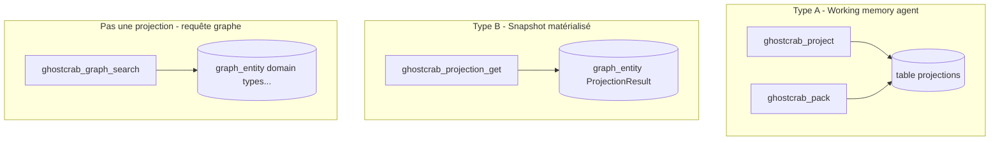
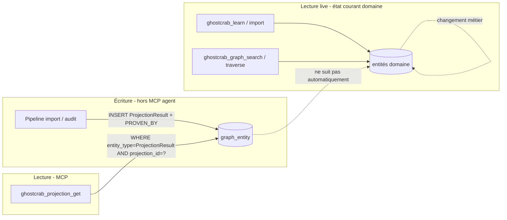

# 05 — Projections expliquées

> Version française — English: [en/05-projections-explained.md](en/05-projections-explained.md)

Amont : [03 — Mémoire MCP](03-memoire-mcp-facettes-graphe-projections.md) · [04 — Réindexation](04-reindexation-ghostcrab.md)

---

## Question fréquente

> Une projection, c'est une requête sur le graphe utilisant les propriétés de nœuds ou d'arêtes ?

**Non.** Dans GhostCrab, « projection » désigne **deux mécanismes distincts** côté agent, ni l'un ni l'autre n'est une requête SQL/Cypher ad hoc sur `graph_entity`.

Il existe aussi un **troisième usage** plus interne : la projection de tables raw vers des tables runtime, par exemple `entities_raw` → `graph_entity` via `ghostcrab_graph_reindex`. Ce document parle surtout des deux projections visibles côté agent.

Pour **interroger le graphe live** (recherche, parcours, filtres metadata), utiliser les outils **graphe** : `ghostcrab_graph_search`, `ghostcrab_traverse`, `ghostcrab_graph_path`, etc. Voir [Couches de requête](../methodology/fr/ghostcrab-query-layers.md).

Pour auditer cette distinction : [Méthode StarterKit](methode-starterkit/README.md).

---

## Les deux types de projections (+ requête graphe)



| | Working memory (Type A) | Matérialisée (Type B) | Requête graphe |
|--|-------------------------|----------------------|----------------|
| **Outil write** | `ghostcrab_project` | *(aucun MCP write)* | `ghostcrab_learn` |
| **Outil read** | `ghostcrab_pack` | `ghostcrab_projection_get` | `ghostcrab_graph_search`, `traverse`… |
| **Stockage** | table `projections` | `graph_entity` type `ProjectionResult` | `graph_entity` + `graph_relation` |
| **Contenu** | Texte court FACT/GOAL/STEP/CONSTRAINT | Snapshot + preuves + deltas | Entités domaine |
| **Stale si graphe change ?** | Oui | Oui | Non ([si réindex OK](04-reindexation-ghostcrab.md)) |

### Découvrir ce qui existe — `ghostcrab_projections_list`

Avant `ghostcrab_pack`, `ghostcrab_projection_get` ou `ghostcrab_artifact_get`, lister les projections et artefacts enregistrés pour le workspace :

- **Type A** — lignes actives dans `projections` (plans d'analyse, working memory)
- **Type B / live** — entrées registre (`ProjectionResult`, `live_answer_view`, `answer_snapshot`, …)

Outil : **`ghostcrab_projections_list`** (extended). Voir aussi le glossaire § [Couches mémoire MCP](glossary.md#couches-mémoire-mcp) et [`src/tools/pragma/projections-list.ts`](../../src/tools/pragma/projections-list.ts).

---

## Type A — Working memory (`ghostcrab_project`)

### Nature

Mémoire de travail **agent-scoped** : objectifs en cours, contraintes actives, faits provisoires pour la session.

Implémentation : [`src/tools/pragma/project.ts`](../../src/tools/pragma/project.ts)

Types : `FACT | GOAL | STEP | CONSTRAINT`. Ce sont des **types de mémoire de travail**, pas des types de nœuds graphe :

| Type | Sens | Exemple générique |
|------|------|-------------------|
| `FACT` | Fait compact que l'agent garde actif | « Le contrat REF-42 expire en juin. » |
| `GOAL` | Objectif courant | « Consolider les relations actives du domaine. » |
| `STEP` | Étape ou prochaine action | « Vérifier les propriétés manquantes sur les arêtes. » |
| `CONSTRAINT` | Contrainte ou règle active | « Ne pas modifier le workspace de référence. » |

Champs importants :

- `agent_id` : propriétaire de la projection, par défaut `agent:self`
- `scope` : périmètre logique de lecture (workspace, domaine, scénario)
- `status` : `active`, `resolved`, `expired`, `blocking`
- `weight` : priorité de lecture dans le pack
- `source_type` : `provisional` ou `curated`, éventuellement suffixé par une famille d'activité
- `source_ref` : référence externe optionnelle (document, entité, ticket)

### Lecture — `ghostcrab_pack`

Fusionne projections actives + FACTs pertinents en un `pack_text` compact pour l'agent.

[`ghostcrab_pack`](../../src/tools/pragma/pack.ts) ne lit **pas** `graph_entity` — seulement projections + faits depuis `agent_facts`.

Conséquence : si le graphe métier est mis à jour, les projections Type A ne sont **pas** recalculées automatiquement. L'agent doit réappeler `ghostcrab_project` si le résumé ne reflète plus la réalité.

---

## Type B — Projection matérialisée (`ghostcrab_projection_get`)

### Nature

**Snapshot analytique pré-calculé** stocké comme entités graphe, identifié par `projection_id` dans `metadata_json`.

Implémentation : [`src/tools/pragma/projection-get.ts`](../../src/tools/pragma/projection-get.ts), backend [`loadGhostcrabProjectionEntities`](../../vendor/mindbrain/src/standalone/http_app.zig) — filtre `entity_type = 'ProjectionResult'` et `projection_id` dans `metadata_json`, **sans JOIN** sur les types domaine.

Retourne un **bundle** composé de :

1. **`projection_results`** — entités `ProjectionResult`
2. **`linked_evidence`** — relations (ex. `PROVEN_BY`) vers entités/chunks preuve
3. **`deltas`** — entités `DeltaFinding` (écarts métriques liés au même `projection_id`)

Ce n'est **pas** « SELECT * FROM graph_entity WHERE metadata.x = y » exécuté à la volée — c'est un **artefact importé ou matérialisé** par un pipeline aval (audit SEO, rapport import, job opérateur).



### Comportement stale

| Action | Effet sur requête graphe live | Effet sur Type B |
|--------|------------------------------|------------------|
| Mise à jour via `learn` / import des entités ou relations | Visible avec outils graphe | **Non**, sauf regénération pipeline |
| `ghostcrab_graph_reindex` | Oui (reconstruit runtime depuis raw) | **Non** pour Type B |
| `ghostcrab_projection_get` | N/A | Renvoie le **snapshot stocké** |

**Write** : pipeline aval (import bundle, extract métier, job opérateur) qui **matérialise** des lignes dans `graph_entity`.

**Read** : `ghostcrab_projection_get { projection_id: "…" }` → bundle `{ projection_results, linked_evidence, deltas }`.

Sans regénération du pipeline, `projection_get` reste un **historique** du dernier calcul — utile pour audit (« qu'avait-on calculé à date T ? »), pas pour l'état courant du domaine.

### Exemple concret : audit SEO

Test ([`tests/tools/projection-get.test.ts`](../../tests/tools/projection-get.test.ts)) :

```json
{
  "entity_type": "ProjectionResult",
  "name": "keyword opportunity set",
  "metadata_json": "{\"projection_id\":\"proj_keyword_opportunities\"}"
}
```

Avec evidence :

```json
{
  "relation_type": "PROVEN_BY",
  "source_id": 10,
  "target_id": 11
}
```

Et delta :

```json
{
  "entity_type": "DeltaFinding",
  "metadata_json": "{\"metric\":\"proj_keyword_opportunities\"}"
}
```

---

## Interroger le graphe live

Utiliser la **couche graphe**, pas les projections :

### Recherche texte + filtres

```
ghostcrab_graph_search {
  workspace_id: "<workspace>",
  query: "<texte>",
  entity_types: ["<type>"],
  limit: 10
}
```

Filtre exact sur metadata :

```
ghostcrab_graph_search {
  metadata_filters: { "<key>": "<value>" }
}
```

Outil **extended** — découvrir via `ghostcrab_tool_search`.

### Parcours topologique

| Outil | Usage | Adjacence Roaring ? |
|-------|-------|---------------------|
| `ghostcrab_traverse` | Walk multi-sauts depuis un nœud | Non — JOIN SQL sur `graph_relation` |
| `ghostcrab_graph_path` | Chemin shortest entre deux entités | Oui — `graph_lj_out` / `graph_lj_in` |
| `ghostcrab_graph_subgraph` | Voisinage N-sauts | Non — JOIN SQL sur `graph_relation` |

Seul `graph_path` charge les bitmaps d'adjacence Roaring ; `traverse` et `subgraph` parcourent `graph_relation` en SQL. Après un `ghostcrab_graph_reindex` natif réussi (rebuild strict), les trois sont cohérents avec le raw.

### Propriétés d'arêtes typées

Écrites via `ghostcrab_learn` → `relation_properties` :

- `value_type` : `text`, `number`, `money_minor`, `percentage_bp`, `date_unix`, `doc_ref`, `uri`
- Stockées dans `relation_properties_raw`, projetées dans `graph_relation_property`

Ce sont des **attributs de relations**, consultables via `ghostcrab_graph_search(include_relations: true)` — pas des « projections » au sens GhostCrab.

---

## Piège à éviter : trois usages du mot « projection »

| Usage | Sens | Outil |
|-------|------|-------|
| Type A | Mémoire de travail agent | `ghostcrab_project` / `pack` |
| Type B | Snapshot analytique figé | `ghostcrab_projection_get` |
| Reindex interne | Raw → runtime (`entities_raw` → `graph_entity`) | `ghostcrab_graph_reindex` |
| Requête graphe (hors GhostCrab) | Parcours live sur entités domaine | `graph_search`, `traverse` |

Confusion fréquente : « projection » au sens GhostCrab ≠ « projection » au sens requête SQL/Cypher sur le graphe.

---

## FAQ

### `ghostcrab_search` interroge-t-il le graphe ?

**Non** — il cherche dans **`agent_facts`**. Pour le graphe : `ghostcrab_graph_search` ou `ghostcrab_combined_search` (graph-first).

### `ghostcrab_combined_search` peut-il lire les facettes collection via Roaring ?

Oui. Quand le graphe et les faits agent ne renvoient rien, `combined_search` interroge les facettes collection. Pour atteindre le chemin Roaring `facet_postings` (au lieu d'un scan brut de `facet_assignments_raw`), il faut soit fournir `collection_facet_table_id` + `collection_facet_namespace` + `collection_facet_dimension`, soit laisser l'outil **résoudre automatiquement** la seule dimension à postings de la collection. Si plusieurs dimensions sont indexées (ambigu) ou aucune, il retombe sur le scan brut. Le bloc `facets.collection_fallback` de la réponse indique la `source` (`facet_postings` vs `facet_assignments_raw`) et le mode de résolution (`explicit` / `auto` / `none`).

### La qualification documentaire crée-t-elle le graphe ?

**Non.** `document-qualify` écrit des labels dans `facet_assignments_raw`. Le graphe métier vient de `ghostcrab_learn` ou `document-business-extract`, puis reindex vers `graph_entity` / `graph_relation`.

### Les gap-rules sont des projections ?

**Non.** Invariants de cardinalité sur le graphe instance. Outils : `ghostcrab_graph_gap_rules_import`, `ghostcrab_graph_diagnostics`. Voir [lab ontologie](02-mcp-ontologie-gap-rules.md).

### Que se passe-t-il après une mise à jour ?

| Mise à jour | Effet | Projection à rafraîchir ? |
|-------------|-------|---------------------------|
| `ghostcrab_remember` / `upsert` | Modifie `agent_facts` | Oui si Type A résume ce fait |
| `document-qualify` | Modifie `facet_assignments_raw` | Non ; reindex facets si nécessaire |
| `entities_raw` / SQL sur raw | Modifie le graphe raw | `ghostcrab_graph_reindex` obligatoire |
| Graphe après `ProjectionResult` | Snapshot Type B stale | Regénérer le pipeline Type B |

Détail : [04 — Réindexation §5](04-reindexation-ghostcrab.md#5-quand-lancer-quoi-).

### Type B remplace-t-il une requête graphe pour l'état courant ?

**Non.** Pour l'état live du domaine, utiliser `ghostcrab_graph_search`, `ghostcrab_traverse`, ou `ghostcrab_graph_subgraph`. Type B archive le résultat d'une analyse passée.

---

## Decision guide

| Question | Outil |
|----------|-------|
| Résumé agent / objectif en cours ? | `ghostcrab_pack` / `ghostcrab_project` |
| Snapshot analytique pré-importé ? | `ghostcrab_projection_get` |
| Trouver des entités dans le graphe ? | `ghostcrab_graph_search` |
| Parcourir relations typées ? | `ghostcrab_traverse` |
| Vérifier une invariante de cardinalité ? | `ghostcrab_graph_diagnostics` + gap-rules |
| État métier live après changement ? | outils graphe (+ `graph_reindex` si raw seul a changé) |

Guide complet : [ghostcrab-query-layers.md](../methodology/fr/ghostcrab-query-layers.md)

Audit méthodologique : [Méthode StarterKit](methode-starterkit/README.md)

Retour hub : [README](README.md)
