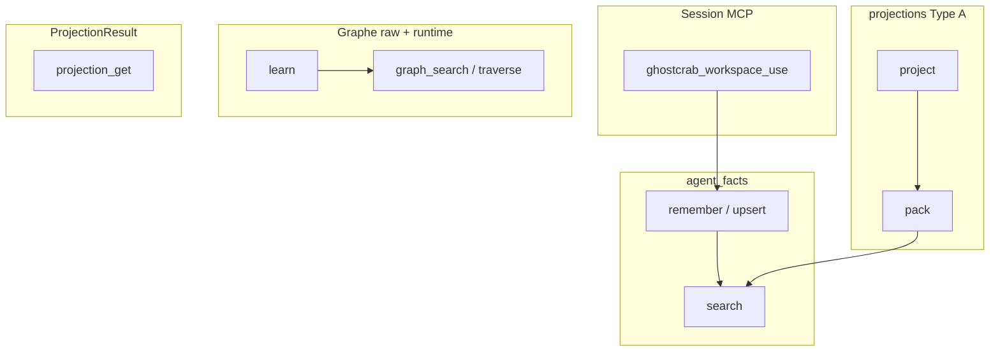

# GhostCrab MCP — explications (architecture + lab)

> Version française — English: [en/README.md](en/README.md)

GhostCrab n'a **pas** une seule « mémoire ». Derrière les outils MCP vivent plusieurs magasins — session, `agent_facts`, qualification documentaire, graphe raw/runtime, projections Type A et Type B.

Cette section unique couvre :

1. **Architecture** (chapitres 03→05) — modèle mental à lire en premier
2. **Lab immeuble** (01–02 + guides) — illustration processus MCP, **pas** modèle mental pour mémoire/projections
3. **StarterKit** ([methode-starterkit/](methode-starterkit/)) — audit SOP5 × runtime Personal

---

## Références transverses

| Document | Sujet |
|----------|-------|
| [Glossaire](glossary.md) | Vocabulaire canonique Personal (LinkML, facets, projections) |
| [Ontologies LinkML/OWL2](ontology/README.md) | Hub : graphes [diagrams/](ontology/diagrams/), YAML [linkml/](ontology/linkml/ghostcrab-docs/), prose 03→05 |
| [Catalogue opérateur](../reference/operator-catalog.md) | Commandes `gcp` + outils MCP et impact tables |

---

## Parcours de lecture — architecture (recommandé)

| Ordre | Document | Sujet |
|-------|----------|-------|
| 0 | [Glossaire](glossary.md) | Termes autorisés / Pro-only |
| 1 | [03 — Mémoire MCP, facettes, graphe et projections](03-memoire-mcp-facettes-graphe-projections.md) | Trois sens de « facets », quatre couches mémoire · LinkML : [`ghostcrab-docs::memory-model`](ontology/diagrams/memory-model.md) |
| 2 | [04 — Réindexation GhostCrab](04-reindexation-ghostcrab.md) | Raw vs dérivé, auto-indexation |
| 3 | [05 — Projections expliquées](05-projections-expliquees.md) | Type A, Type B, requête graphe |

## Parcours StarterKit (audit import)

| Ordre | Document |
|-------|----------|
| 1 | [02 — Méthode StarterKit](methode-starterkit/02-methode-starterkit.md) |
| 2 | [03 — Parcours import source](methode-starterkit/03-parcours-import-source.md) |
| 3 | [04 — Écarts StarterKit ↔ Personal](methode-starterkit/04-ecarts-starterkit-personal.md) |

Références : [01 — Audit](methode-starterkit/01-audit-explications-actuelles.md) · [05 — Confirmer / infirmer](methode-starterkit/05-confirmer-infirmer-les-explications.md)

---

## Carte rapide (architecture)

| Besoin | Couche | Outil |
|--------|--------|-------|
| Vérité métier live | Graphe | `ghostcrab_learn`, `ghostcrab_graph_search` |
| Note textuelle | `agent_facts` | `ghostcrab_remember`, `ghostcrab_search` |
| Contexte session | Type A | `ghostcrab_project`, `ghostcrab_pack` |
| Rapport figé | Type B | pipeline → `ghostcrab_projection_get` |

---

## Lab immeuble (illustration optionnelle)

> Ne pas utiliser le lab comme modèle mental pour mémoire, facettes ou projections.

[`examples/immeuble/reference/bundle.json`](../../examples/immeuble/reference/bundle.json) est une **cible de comparaison**, pas le processus à reproduire.

| Question | Document |
|----------|----------|
| Référence golden vs processus MCP | [01 — Référence](01-reference-vers-graphe.md) |
| Ontologie et gap-rules | [02 — MCP, ontologie et gap-rules](02-mcp-ontologie-gap-rules.md) |
| Contexte lab phases 00→06 | [mcp-lab-context.md](mcp-lab-context.md) |
| MCP vs CLI vs LLM | [how-ghostcrab-mcp-achieves-it.md](how-ghostcrab-mcp-achieves-it.md) |
| Playbook agent | [immeuble-mcp-reconstruction-playbook.md](immeuble-mcp-reconstruction-playbook.md) |

Trois pistes : `immeuble-demo` (référence) · `immeuble-demo-llm` (lab) · `immeuble-training-*` (diagnostics). Détail : [`examples/immeuble/README.md`](../../examples/immeuble/README.md).

---

## Documentation complémentaire

- [Couches de requête GhostCrab](../methodology/fr/ghostcrab-query-layers.md)
- [Méthodologie universelle §12 lab immeuble](../methodology/fr/universal_methodology.md)
- [Import documentaire](../setup/document-import.md)
