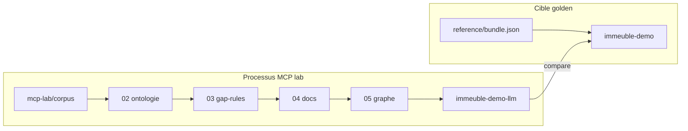

# Explications GhostCrab — immeuble MCP lab

> Version française — English: [en/README.md](en/README.md)

Synthèse courte. Détail pédagogique : [GhostCrab MCP — explication pédagogique](../mcp-explanation/README.md)

## Idée centrale

[`examples/immeuble/reference/bundle.json`](../../examples/immeuble/reference/bundle.json) est la **cible de comparaison** (workspace `immeuble-demo`), pas le processus à reproduire.

Le **processus** vit dans [`examples/immeuble/mcp-lab/`](../../examples/immeuble/mcp-lab/) : corpus brut → ontologie → gap-rules → docs qualifiés → graphe → validation contre [`success-criteria.yaml`](../../examples/immeuble/mcp-lab/success-criteria.yaml).



## Les trois pistes immeuble

| Piste | Workspace | Rôle |
|-------|-----------|------|
| **Reference** | `immeuble-demo` | Charger `bundle.json` — cible golden |
| **MCP lab** | `immeuble-demo-llm` | Reconstruire depuis le corpus via MCP + CLI |
| **Training** | `immeuble-training-*` | Curriculum diagnostics gap-rules L0→L3 |

Hub : [`examples/immeuble/README.md`](../../examples/immeuble/README.md)

## Processus MCP lab (résumé)

| Phase | Prompts | Action |
|-------|---------|--------|
| 00–01 | prerequisites, discovery | `ghostcrab_status`, Model Proposal (lecture seule) |
| 02 | ontology-register | Workspace + ontologie LinkML |
| 03 | gap-rules-design | `ghostcrab_graph_gap_rules_import` |
| 04 | document-ingest | `gcp brain document` (CLI) |
| 05 | graph-extraction | `ghostcrab_learn` ou extract LLM |
| 06 | validate-and-compare | `graph_search`, diagnostics vs golden |

Mock CI :

```bash
node scripts/import-immeuble-demo-llm.mjs --mode mock --reset
```

**Note** : le mode mock compare in-memory vs golden — il valide le pipeline, mais **ne persiste pas** automatiquement le graphe extrait dans `immeuble-demo-llm`. Pour parité DB, charger manuellement un bundle partiel ou relancer en `--mode live`.

## Correspondance méthodologie universelle

Voir [`universal_methodology.md` §12](../methodology/fr/universal_methodology.md) pour le détail.

| Méthodologie (4 phases) | MCP lab | Alignement |
|-------------------------|---------|------------|
| Précondition ONBOARDING + Model Proposal | 00–01 | Conforme |
| Phase 1 — Facettes / ontologie | 02 | Conforme |
| Phase 2 — Projections (contrat de lecture) | *(absent)* | Écart volontaire — validation par graphe, pas par `ghostcrab_pack` |
| Phase 3 — Import | 04 + 05 | Partiel — domaine complet, pas thin slice |
| Phase 4 — Rapports / validation | 06 | Partiel — `graph_search` + diagnostics, pas projections |
| Extension lab | 03 gap-rules | Hors 4 phases — équivalent Wave 4 CONSTRAINT |

## Où aller ensuite

| Besoin | Document |
|--------|----------|
| Référence vs processus, phases détaillées | [01 — Référence et graphe](../mcp-explanation/01-reference-vers-graphe.md) |
| Ontologie, gap-rules, MCP vs CLI | [02 — Ontologie et gap-rules](../mcp-explanation/02-mcp-ontologie-gap-rules.md) |
| Projections vs requêtes graphe | [03 — Projections](../mcp-explanation/03-projections-expliquees.md) |
| Structure du dossier mcp-lab | [Contexte MCP lab](../mcp-explanation/mcp-lab-context.md) |
| Outils phase par phase | [Comment GhostCrab MCP y arrive](../mcp-explanation/how-ghostcrab-mcp-achieves-it.md) |
| Méthodologie GhostCrab | [Méthodologie universelle](../methodology/fr/universal_methodology.md) |
