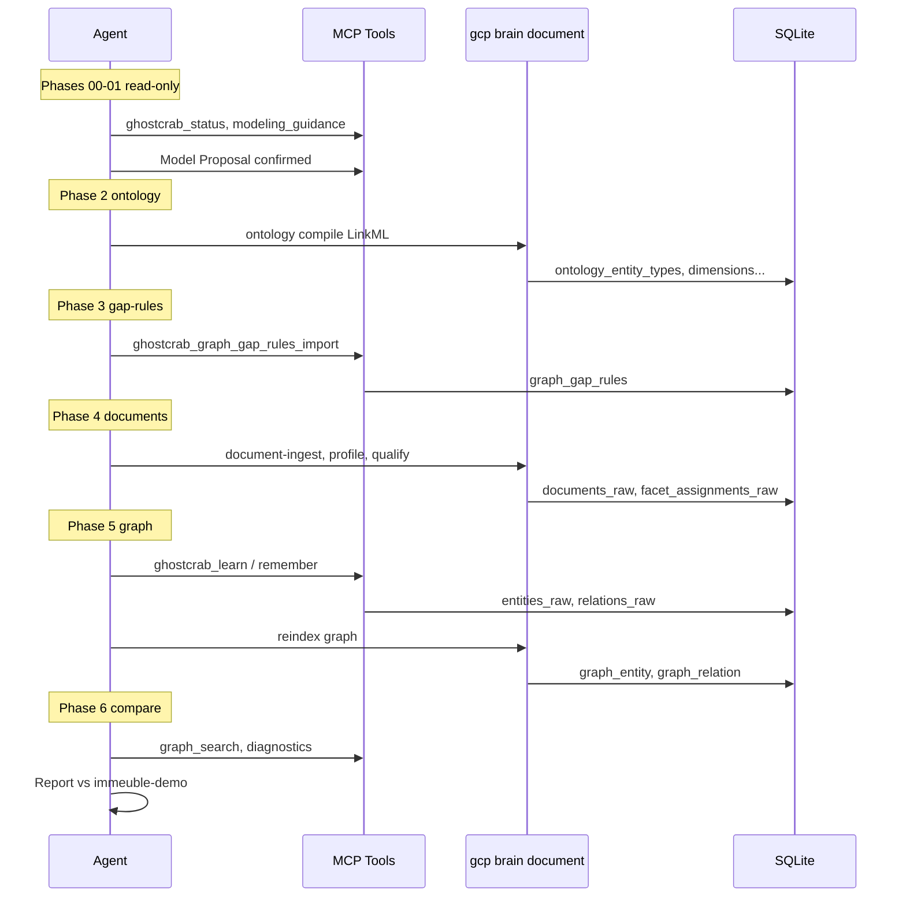

# 01 — Golden reference and MCP process

> English version — version française : [`../01-reference-vers-graphe.md`](../01-reference-vers-graphe.md)

## What `bundle.json` is — and what it is not

[`examples/immeuble/reference/bundle.json`](../../../examples/immeuble/reference/bundle.json) is the **comparison target** for the MCP lab. It is an importable snapshot of the `immeuble-demo` workspace:

| Bundle section | Content (reference) | Used to compare |
|----------------|---------------------|-----------------|
| `ontology_*` | LinkML taxonomy `immeuble-demo::core` | Ontology registered in phase 2 |
| `documents_raw` + `facet_assignments_raw` | 7 qualified docs, 22 facet assignments | Qualification in phase 4 |
| `entities_raw` + `relations_raw` | 131 entities, 265 relations | Graph extracted in phase 5 |
| `entity_documents_raw` | Entity ↔ documentary evidence links | Provenance after extraction |

**It is not** the path to follow when building a domain with MCP. You do not « read » the bundle to learn the process — you **load** the reference into `immeuble-demo`, then run the MCP process in `immeuble-demo-llm` and measure the gap.

Files **alongside** the bundle (not inside it):

- [`gap-rules/demo.json`](../../../examples/immeuble/reference/gap-rules/demo.json) — patrimony rules
- [`gap-rules/syndic.json`](../../../examples/immeuble/reference/gap-rules/syndic.json) — occupancy/lease rules
- [`answer-artifacts.seed.jsonl`](../../../examples/immeuble/reference/answer-artifacts.seed.jsonl) — optional `analysis_plan` + `live_answer_view` seed
- [`scenarios.yaml`](../../../examples/immeuble/reference/scenarios.yaml) — competency questions

Load the reference (for comparison only):

```bash
export GHOSTCRAB_SQLITE_PATH="$PWD/data/immeuble-demo.sqlite"
node bin/gcp.mjs load examples/immeuble/reference/bundle.json \
  --workspace immeuble-demo --reindex all
```

---

## The GhostCrab MCP process (lab track)

Entry point: [`examples/immeuble/mcp-lab/README.md`](../../../examples/immeuble/mcp-lab/README.md)

**Input**: 8 raw markdown files in [`mcp-lab/corpus/`](../../../examples/immeuble/mcp-lab/corpus/) — not the bundle, not the qualified docs from `reference/documents/`.

**Target output**: workspace `immeuble-demo-llm` with ontology, qualified docs, business graph, gap-rules — comparable to the thresholds in [`success-criteria.yaml`](../../../examples/immeuble/mcp-lab/success-criteria.yaml).



### Phase 2 — Ontology

Prompt: [`02-ontology-register.md`](../../../examples/immeuble/mcp-lab/prompts/02-ontology-register.md)

```bash
gcp brain ontology compile \
  --workspace-id immeuble-demo-llm \
  --ontology-id immeuble-demo::core \
  --input ontologies/immeuble-demo/core.yaml \
  --import-db --force
```

MCP alternative: `ghostcrab_schema_register` (lightweight model, not full LinkML equivalent).

**Comparison**: the reference bundle contains the same compiled ontology — read-only checklist: [`mcp-lab/reference/ontology-checklist.md`](../../../examples/immeuble/mcp-lab/reference/ontology-checklist.md).

### Phase 3 — Gap-rules

Prompt: [`03-gap-rules-design.md`](../../../examples/immeuble/mcp-lab/prompts/03-gap-rules-design.md)

Gap-rules are **not** in the bundle. The agent designs them or imports them from training/reference examples, then:

```
ghostcrab_graph_gap_rules_import  (extended tool)
ghostcrab_graph_diagnostics
```

**Comparison**: run diagnostics on `immeuble-demo-llm` and aim for `missing_required_relations = 0` with the L2 pack ([`training/gap-rules/L2-syndic-filtered.json`](../../../examples/immeuble/training/gap-rules/L2-syndic-filtered.json)).

### Phase 4 — Document qualification

Prompt: [`04-document-ingest.md`](../../../examples/immeuble/mcp-lab/prompts/04-document-ingest.md)

Via CLI (not MCP streaming):

```bash
gcp brain document collection-create ...
gcp brain document document-ingest --content-file corpus/statuts-tilleuls.md ...
gcp brain document document-profile-worker --limit 8
gcp brain document document-qualify \
  --facets domain.building,domain.unit,...,source.document_type
```

Writes: `documents_raw`, `chunks_raw`, `facet_assignments_raw`.

**Comparison**: the reference has 7 docs / 22 facets; the lab ingests 8 corpus files and produces more facet assignments (LLM or mock qualification).

### Phase 5 — Graph extraction

Prompt: [`05-graph-extraction.md`](../../../examples/immeuble/mcp-lab/prompts/05-graph-extraction.md)

Two paths:

| Path | Mechanism | Writes |
|------|-----------|--------|
| **MCP agent** | `ghostcrab_learn` (nodes/edges), `ghostcrab_remember` (notes) | `entities_raw`, `relations_raw` |
| **Live script** | `document-business-extract` (native engine + LLM) | same + `entity_documents_raw` |

Then reindex:

```bash
gcp load partial-bundle --reindex graph
# or ghostcrab_graph_reindex / ghostcrab_collection_reindex
```

**Comparison**: entity/relation thresholds in `success-criteria.yaml` (e.g. 13 `unit`, 69 `contains`, quotités = 1000).

### Phase 6 — Validation

Prompt: [`06-validate-and-compare.md`](../../../examples/immeuble/mcp-lab/prompts/06-validate-and-compare.md)

Typical checks:

1. Counts by `entity_type` and `edge_type` vs golden target
2. `ghostcrab_graph_search`: « appartement » ≥ 13, « Dupont », « bail », « CODA »
3. `ghostcrab_graph_diagnostics` with L2 gap-rules

Automated:

```bash
node scripts/import-immeuble-demo-llm.mjs --mode mock --reset
```

**Mock CI limitation**: the script compares in-memory vs golden target and produces a report — it does **not** automatically persist the extracted graph in `immeuble-demo-llm`. For SQLite parity (MCP queries on the lab workspace), manually load a partial bundle (e.g. `llm-extracted-business.bundle.json`) or run the pipeline in `--mode live`.

---

## Two graphs in the reference (for comparison)

When inspecting the golden bundle, distinguish:

| Bundle key | Role | Count |
|------------|------|-------|
| `ontology_entities` / `ontology_relations` | LinkML schema (qualified_relation patterns) | 5 / 4 |
| `entities_raw` / `relations_raw` | **Business instances** syndic (buildings, units, persons, leases…) | 131 / 265 |

The MCP process phase 5 aims to reproduce the **second** — the instance graph — not the mini schema graph.

---

## Documents: lab input vs reference

| | MCP lab input | Reference bundle |
|--|---------------|------------------|
| Folder | `mcp-lab/corpus/` (8 verbose files) | `reference/documents/` (7 structured docs) |
| Role | **Source** of the process | **Target** for quality comparison |
| In bundle | No (ingested on the fly) | Yes (`documents_raw`) |

The reference documents are **not** the source of the golden graph extraction — they are evidence aligned with an already-defined model. The lab starts from more realistic corpus files to test whether MCP + LLM recover a comparable graph.

---

## Summary

```
Raw corpus  ──MCP/CLI process──►  immeuble-demo-llm
                                           │
                                           │ compare (success-criteria.yaml)
                                           ▼
bundle.json  ──gcp load──►  immeuble-demo  (target, not the process)
```

Next: [02 — MCP, ontology, and gap-rules](02-mcp-ontology-gap-rules.md) · Architecture : [03](../03-memoire-mcp-facettes-graphe-projections.md) → [04](../04-reindexation-ghostcrab.md) → [05](../05-projections-expliquees.md) (FR)
