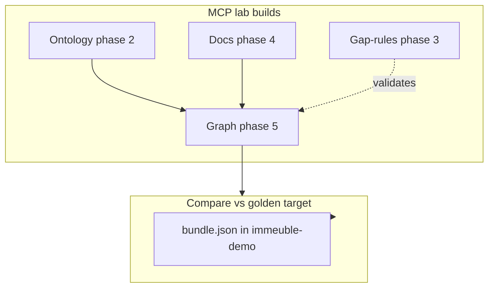

# 02 — MCP, ontology, and gap-rules

> English version — version française : [`../02-mcp-ontologie-gap-rules.md`](../02-mcp-ontologie-gap-rules.md)

This document clarifies **what MCP builds** in the lab process, **what it only consults**, and **where the CLI intervenes** — using [`reference/bundle.json`](../../../examples/immeuble/reference/bundle.json) as a comparison target, not as a how-to guide.

## Overview by artifact

| Artifact | MCP lab process | Tools | SQLite storage | In golden bundle? |
|----------|-----------------|-------|----------------|-------------------|
| Taxonomy ontology | Phase 2 — **build** | CLI compile LinkML **or** `ghostcrab_schema_register` | `ontology_*` | Yes |
| Documents + facets | Phase 4 — **build** | `gcp brain document` (CLI) | `documents_raw`, `facet_assignments_raw` | Yes |
| Instance graph | Phase 5 — **build** | `ghostcrab_learn`, LLM extract | `entities_raw` → `graph_entity` | Yes |
| Gap-rules | Phase 3 — **build** | `ghostcrab_graph_gap_rules_import` | `graph_gap_rules` | **No** |
| Projections seed | Optional | `ghostcrab_project` | `projections` (pragma) | **No** |
| Query | Phase 6 — **consult** | `ghostcrab_graph_search`, `ghostcrab_traverse`, diagnostics | read-only | — |
| Ontology coverage | Audit | `ghostcrab_coverage` | compare ontology vs graph | — |



---

## Ontology

### Role in the process

The ontology defines **what you are allowed to qualify and model**: entity types (`building`, `unit`, `person`…), edge types (`contains`, `owns`, `leases`…), facet dimensions (`domain.building`, `source.document_type`…).

Without an ontology in phase 2, qualification (phase 4) and extraction (phase 5) have no controlled vocabulary.

Methodology crosswalk: MCP lab phase 02 = **Phase 1 — Facets / ontologies** of the [universal methodology](../../methodology/universal_methodology.md). Phases 00–01 cover the ONBOARDING precondition (Model Proposal confirmed before any write).

### Two registration paths (MCP lab)

Documented in [`mcp-lab/prompts/02-ontology-register.md`](../../../examples/immeuble/mcp-lab/prompts/02-ontology-register.md):

**Option A — LinkML (recommended for immeuble)**

```bash
gcp brain ontology compile \
  --workspace-id immeuble-demo-llm \
  --ontology-id immeuble-demo::core \
  --input ontologies/immeuble-demo/core.yaml \
  --import-db --force
```

Canonical source: [`ontologies/immeuble-demo/core.yaml`](../../../ontologies/immeuble-demo/core.yaml)

**Option B — MCP schema register**

```
ghostcrab_schema_register  →  facets with schema_id mindbrain:schema
```

Lighter model; does not replace LinkML richness for syndic.

### MCP consultation tools (not construction)

| Tool | Role |
|------|------|
| `ghostcrab_schema_inspect` | Read a registered schema |
| `ghostcrab_schema_list` | List schemas |
| `ghostcrab_coverage` | Find ontology types without instances in the graph |

### Comparison with the reference

The golden bundle contains the compiled `ontology_*` section. Read-only checklist: [`mcp-lab/reference/ontology-checklist.md`](../../../examples/immeuble/mcp-lab/reference/ontology-checklist.md).

The MCP process must produce an ontology **equivalent** in semantics; strict equality of internal IDs is not required (`parity_note` in success-criteria).

---

## Gap-rules

### Role in the process

Gap-rules are **closed-world invariants** on the instance graph: for each entity of a given type, count outgoing relations of a given type and verify min/max.

Example ([`reference/gap-rules/demo.json`](../../../examples/immeuble/reference/gap-rules/demo.json)):

```json
{
  "rule_id": "unit-one-cellar",
  "entity_type": "unit",
  "relation_type": "assigned_cellar",
  "min_count": 1,
  "max_count": 1
}
```

These are **not** projections or ad hoc queries — they are post-extraction validation rules.

### Where they live

- JSON files alongside the bundle (`reference/gap-rules/`, `training/gap-rules/L0`…`L3`)
- SQLite table **`graph_gap_rules`** after import
- **Absent** from `bundle.json`

### MCP lab process — phase 3

Prompt: [`03-gap-rules-design.md`](../../../examples/immeuble/mcp-lab/prompts/03-gap-rules-design.md)

1. Design or adapt rules (inspired by L0 patrimony, L2 filtered syndic)
2. Import:

```
ghostcrab_graph_gap_rules_import   (extended — ghostcrab_tool_search)
ghostcrab_graph_gap_rules          (list)
ghostcrab_graph_diagnostics        (evaluate)
```

Implementation: [`src/tools/dgraph/diagnostics.ts`](../../../src/tools/dgraph/diagnostics.ts)

CLI alternative:

```bash
mindbrain-standalone-tool graph-gap-rules-import \
  --db "$GHOSTCRAB_SQLITE_PATH" \
  --input examples/immeuble/reference/gap-rules/demo.json
```

### Comparison with the reference

1. Load the golden graph in `immeuble-demo` (bundle)
2. Build the lab graph in `immeuble-demo-llm` (MCP process)
3. Import the **same** rules (adapted `workspace_id`) on both workspaces
4. Compare diagnostics — an incomplete lab graph produces `missing_required_relations` > 0

Read-only checklist: [`mcp-lab/reference/gap-rules-checklist.md`](../../../examples/immeuble/mcp-lab/reference/gap-rules-checklist.md)

---

## Qualified documents — MCP or CLI?

Phase 4 **does not** use `ghostcrab_remember` for source documents. It uses the CLI pipeline:

```bash
gcp brain document document-ingest ...
gcp brain document document-profile-worker ...
gcp brain document document-qualify --taxonomies immeuble-demo::core --facets ...
```

Runbook: [`docs/setup/document-import.md`](../../setup/document-import.md)

MCP intervenes **before** (routing via `ghostcrab_modeling_guidance`) and **after** (search via `ghostcrab_graph_search`, `ghostcrab_entity_chunks`).

**Comparison**: the golden bundle embeds 7 qualified docs; the lab ingests 8 different corpus files — compare **facet counts** and **business coherence**, not byte-for-byte file equality.

---

## Business graph — central MCP role

Phase 5: [`05-graph-extraction.md`](../../../examples/immeuble/mcp-lab/prompts/05-graph-extraction.md)

| Tool | Writes what | Compare with golden target |
|------|-------------|----------------------------|
| `ghostcrab_learn` | Structured nodes/edges + `relation_properties` | `entities_raw`, `relations_raw` counts |
| `ghostcrab_remember` | Text notes (agent FACTs) | **Not** the graph — `agent_facts` table |
| `ghostcrab_graph_reindex` | Projects raw → `graph_entity` | Query index |

Thresholds: [`success-criteria.yaml`](../../../examples/immeuble/mcp-lab/success-criteria.yaml) — e.g. 13 units, 69 contains, quotités 1000.

---

## Summary table: MCP builds vs consults vs CLI

| Action | MCP | CLI |
|--------|-----|-----|
| Register LinkML ontology | inspect only | `gcp brain ontology compile` |
| Lightweight schema alternative | `ghostcrab_schema_register` | — |
| Ingest corpus | guidance | `gcp brain document` |
| Extract graph | `ghostcrab_learn` | `document-business-extract` (live) |
| Import gap-rules | `ghostcrab_graph_gap_rules_import` | `graph-gap-rules-import` |
| Validate graph | `ghostcrab_graph_diagnostics` | compare scripts |
| Compare vs golden target | `ghostcrab_graph_search`, traverse | `import-immeuble-demo-llm.mjs` report |
| Load reference | — | `gcp load bundle.json` |

---

## What MCP does not do on the reference track

Loading `bundle.json` into `immeuble-demo` is a **pure CLI** operation — no MCP tool is required. MCP comes into play when you want to **reproduce** a comparable state from the lab corpus.

Next: [05 — Projections explained](05-projections-explained.md) (stub) · Architecture (FR): [03](../03-memoire-mcp-facettes-graphe-projections.md) → [04](../04-reindexation-ghostcrab.md) → [05](../05-projections-expliquees.md)
