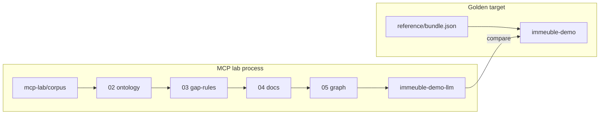

# GhostCrab MCP Lab — Immeuble Overview

> English version — version française : [`../README.md`](../README.md)

Short synthesis. Pedagogical detail: [GhostCrab MCP — pedagogical explanation](../../mcp-explanation/en/README.md)

## Core idea

[`examples/immeuble/reference/bundle.json`](../../../examples/immeuble/reference/bundle.json) is the **comparison target** (workspace `immeuble-demo`), not the process to reproduce.

The **process** lives in [`examples/immeuble/mcp-lab/`](../../../examples/immeuble/mcp-lab/): raw corpus → ontology → gap-rules → qualified docs → graph → validation against [`success-criteria.yaml`](../../../examples/immeuble/mcp-lab/success-criteria.yaml).



## Three immeuble tracks

| Track | Workspace | Role |
|-------|-----------|------|
| **Reference** | `immeuble-demo` | Load `bundle.json` — golden target |
| **MCP lab** | `immeuble-demo-llm` | Rebuild from corpus via MCP + CLI |
| **Training** | `immeuble-training-*` | Gap-rules diagnostics curriculum L0→L3 |

Hub: [`examples/immeuble/README.md`](../../../examples/immeuble/README.md)

## MCP lab process (summary)

| Phase | Prompts | Action |
|-------|---------|--------|
| 00–01 | prerequisites, discovery | `ghostcrab_status`, Model Proposal (read-only) |
| 02 | ontology-register | Workspace + LinkML ontology |
| 03 | gap-rules-design | `ghostcrab_graph_gap_rules_import` |
| 04 | document-ingest | `gcp brain document` (CLI) |
| 05 | graph-extraction | `ghostcrab_learn` or LLM extract |
| 06 | validate-and-compare | `graph_search`, diagnostics vs golden |

Mock CI:

```bash
node scripts/import-immeuble-demo-llm.mjs --mode mock --reset
```

**Note**: mock mode compares in-memory vs golden — it validates the pipeline, but **does not automatically persist** the extracted graph into `immeuble-demo-llm`. For DB parity, manually load a partial bundle or rerun in `--mode live`.

## Universal methodology crosswalk

See [`universal_methodology.md` §12](../../methodology/universal_methodology.md) for full detail.

| Universal methodology (4 phases) | MCP lab | Alignment |
|------------------------------------|---------|-----------|
| ONBOARDING precondition + Model Proposal | 00–01 | Aligned |
| Phase 1 — Facets / ontology | 02 | Aligned |
| Phase 2 — Projections (read contract) | *(absent)* | Intentional gap — validation via graph, not `ghostcrab_pack` |
| Phase 3 — Import | 04 + 05 | Partial — full domain, not thin slice |
| Phase 4 — Reports / validation | 06 | Partial — `graph_search` + diagnostics, not projections |
| Lab extension | 03 gap-rules | Outside core 4 phases — Wave 4 CONSTRAINT equivalent |

## Where to go next

| Need | Document |
|------|----------|
| Reference vs process, detailed phases | [01 — Reference and graph](../../mcp-explanation/en/01-reference-to-graph.md) |
| Ontology, gap-rules, MCP vs CLI | [02 — Ontology and gap-rules](../../mcp-explanation/en/02-mcp-ontology-gap-rules.md) |
| Projections vs graph queries | [03 — Projections explained](../../mcp-explanation/en/03-projections-explained.md) |
| mcp-lab folder structure | [MCP lab context](../../mcp-explanation/en/mcp-lab-context.md) |
| Tools phase by phase | [How GhostCrab MCP achieves it](../../mcp-explanation/en/how-ghostcrab-mcp-achieves-it.md) |
| GhostCrab methodology | [Universal methodology](../../methodology/universal_methodology.md) |
