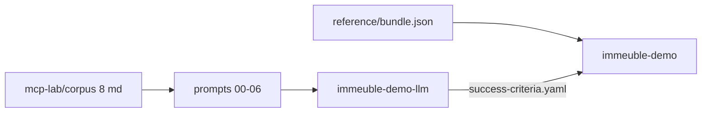

# Context — Immeuble syndic MCP lab

> English version — version française : [`../mcp-lab-context.md`](../mcp-lab-context.md)

Canonical entry point: [`examples/immeuble/mcp-lab/README.md`](../../../examples/immeuble/mcp-lab/README.md)

## Role of the folder

[`examples/immeuble/mcp-lab/`](../../../examples/immeuble/mcp-lab/) is the **MCP agent laboratory**: reconstruct the Belgian syndic domain (Résidence Les Tilleuls + Les Érables) **from raw documents**, in workspace `immeuble-demo-llm`, then **compare** to the golden target `immeuble-demo`.

This is not the « load the bundle and you're done » track — it is the « simulate what a GhostCrab agent would do in real conditions » track.



## Configuration

[`workspace.json`](../../../examples/immeuble/mcp-lab/workspace.json):

| Field | Value |
|-------|-------|
| `workspace_id` | `immeuble-demo-llm` |
| `collection_id` | `immeuble-demo-llm::docs` |
| `ontology_id` | `immeuble-demo::core` |
| `golden_workspace_id` | `immeuble-demo` |
| `golden_bundle` | `../reference/bundle.json` |

## Folder structure

| Element | Role |
|---------|------|
| [`README.md`](../../../examples/immeuble/mcp-lab/README.md) | Agent entry point |
| [`workspace.json`](../../../examples/immeuble/mcp-lab/workspace.json) | Workspace, collection, ontology, reference IDs |
| [`success-criteria.yaml`](../../../examples/immeuble/mcp-lab/success-criteria.yaml) | Validation thresholds (counts, relations, quotités, diagnostics) |
| **`corpus/`** | Input — 8 verbose markdown files + manifest + expected-coverage |
| **`prompts/`** | Agent workflow in 7 phases (00→06), copy-paste prompts |
| **`reference/`** | Read-only checklists (ontology, gap-rules) |

## The corpus

8 **raw and realistic** files listed in [`corpus/manifest.json`](../../../examples/immeuble/mcp-lab/corpus/manifest.json):

| doc_id | File | document_type |
|--------|------|---------------|
| 1 | statuts-tilleuls.md | statuts_copropriete |
| 2 | statuts-erables.md | statuts_copropriete |
| 3 | registre-coproprietaires.md | registre_coproprietaires |
| 4 | composition-occupants.md | composition_menage |
| 5 | baux-locatifs.md | bail |
| 6 | pv-ag-budget-2026.md | pv_ag |
| 7 | coda-janvier-2026.md | extrait_coda |
| 8 | annexes-caves-garages-jardins.md | annexe_lot |

**Distinct from** [`reference/documents/`](../../../examples/immeuble/reference/documents/) (7 qualified docs embedded in the golden bundle).

Explicit rule (prompt 00): **do not load the golden bundle into `immeuble-demo-llm`**. The golden target is used only for comparison at the end.

## The seven phases

| Phase | File | Writes? | Action |
|-------|------|---------|--------|
| 0 | [`00-prerequisites.md`](../../../examples/immeuble/mcp-lab/prompts/00-prerequisites.md) | No | `ghostcrab_status`, Model Proposal |
| 1 | [`01-discovery-and-model-proposal.md`](../../../examples/immeuble/mcp-lab/prompts/01-discovery-and-model-proposal.md) | No | Refine the model from the corpus |
| 2 | [`02-ontology-register.md`](../../../examples/immeuble/mcp-lab/prompts/02-ontology-register.md) | Yes | Workspace + LinkML ontology |
| 3 | [`03-gap-rules-design.md`](../../../examples/immeuble/mcp-lab/prompts/03-gap-rules-design.md) | Yes | Closed-world gap-rules |
| 4 | [`04-document-ingest.md`](../../../examples/immeuble/mcp-lab/prompts/04-document-ingest.md) | Yes | `gcp brain document` — ingest + qualify |
| 5 | [`05-graph-extraction.md`](../../../examples/immeuble/mcp-lab/prompts/05-graph-extraction.md) | Yes | `ghostcrab_learn` / LLM extract |
| 6 | [`06-validate-and-compare.md`](../../../examples/immeuble/mcp-lab/prompts/06-validate-and-compare.md) | No | Compare vs success-criteria |

Phases 02–05: **human confirmation** required (ONBOARDING_CONTRACT §9).

## Success criteria (excerpt)

Source: [`success-criteria.yaml`](../../../examples/immeuble/mcp-lab/success-criteria.yaml)

| Metric | Threshold |
|--------|-----------|
| buildings | 2 |
| units | 13 |
| cellars | 13 |
| lease_contracts | 5 |
| coda_entries | 3 |
| quotités per building | 1000 |
| graph_search « appartement » | ≥ 13 |
| L2 diagnostics | missing_required_relations ≤ 0 |

Read-only checklists:

- [`reference/ontology-checklist.md`](../../../examples/immeuble/mcp-lab/reference/ontology-checklist.md)
- [`reference/gap-rules-checklist.md`](../../../examples/immeuble/mcp-lab/reference/gap-rules-checklist.md)

## The three immeuble tracks

| Track | Workspace | Role |
|-------|-----------|------|
| **Reference** | `immeuble-demo` | Target — golden snapshot (`bundle.json`) |
| **MCP lab** | `immeuble-demo-llm` | Process — reconstruction from corpus |
| **Training** | `immeuble-training-*` | Curriculum gap-rules diagnostics L0→L3 |

## Mock CI

```bash
node scripts/import-immeuble-demo-llm.mjs --mode mock --reset
# → reports/immeuble-demo-llm/<timestamp>/report.md
```

The mock validates the comparison pipeline but **does not persist** the graph in `immeuble-demo-llm`. See [01 — Reference](01-reference-to-graph.md#phase-6--validation).

Next: [How GhostCrab MCP achieves it](how-ghostcrab-mcp-achieves-it.md)
