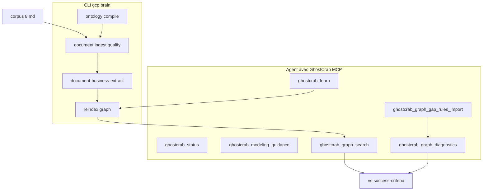

# Comment GhostCrab MCP y arrive

> Version française — English: [en/how-ghostcrab-mcp-achieves-it.md](en/how-ghostcrab-mcp-achieves-it.md)

Comment reconstruire le domaine syndic dans `immeuble-demo-llm` et passer les seuils de [`success-criteria.yaml`](../../examples/immeuble/mcp-lab/success-criteria.yaml).

Contexte du lab : [mcp-lab-context.md](mcp-lab-context.md)

## Principe : MCP + CLI + (optionnel) LLM

GhostCrab MCP **ne fait pas tout seul**. Le lab repose sur trois couches :

| Couche | Rôle dans le lab |
|--------|------------------|
| **Agent MCP** | Raisonne, modélise, écrit le graphe unitairement, valide |
| **CLI `gcp brain …`** | Ingestion/qualification docs, compile ontologie, reindex (haut débit) |
| **Moteur natif + LLM** | Profil doc, qualification facets, extraction graphe batch (`document-business-extract`) |

Règle produit ([`src/mcp/agent-brief.ts`](../../src/mcp/agent-brief.ts)) : MCP = surface d'ontologie et de requête ; l'ingestion documentaire passe par CLI, pas par streaming MCP.



---

## Phase par phase : qui fait quoi

### Phases 0–1 — Comprendre avant d'écrire (MCP pur)

L'agent lit `corpus/*.md` + checklists, appelle :

- `ghostcrab_status` — routing, workspace, santé backend
- `ghostcrab_modeling_guidance` — activity families, étapes suggérées
- `ghostcrab_tool_search` — découvrir les outils extended (graph, workspace, gap-rules…)

**Livrable** : Model Proposal (types entités, arêtes, facets) validé par un humain.
Sans ça, pas d'écriture (ONBOARDING_CONTRACT §9).

Prompts : [`00-prerequisites.md`](../../examples/immeuble/mcp-lab/prompts/00-prerequisites.md), [`01-discovery-and-model-proposal.md`](../../examples/immeuble/mcp-lab/prompts/01-discovery-and-model-proposal.md)

### Phase 2 — Ontologie (MCP + CLI)

| Action | Outil |
|--------|-------|
| Créer workspace | `ghostcrab_workspace_create` + `ghostcrab_workspace_use` |
| Enregistrer taxonomie | **CLI** `gcp brain ontology compile` sur [`ontologies/immeuble-demo/core.yaml`](../../ontologies/immeuble-demo/core.yaml) |
| Alternative légère | `ghostcrab_schema_register` |
| Vérifier | `ghostcrab_schema_inspect`, `ghostcrab_coverage` |

```bash
gcp brain ontology compile \
  --workspace-id immeuble-demo-llm \
  --ontology-id immeuble-demo::core \
  --input ontologies/immeuble-demo/core.yaml \
  --import-db --force
```

L'ontologie fournit le **vocabulaire contrôlé** pour qualifier les docs et nommer les entités/arêtes du graphe.

Prompt : [`02-ontology-register.md`](../../examples/immeuble/mcp-lab/prompts/02-ontology-register.md)

### Phase 3 — Gap-rules (MCP extended)

Avant le graphe complet, l'agent importe des invariants closed-world :

```
ghostcrab_graph_gap_rules_import   ← JSON depuis training/reference
ghostcrab_graph_gap_rules          ← lister
ghostcrab_graph_diagnostics        ← détecter les trous après extraction
```

Exemples de règles : « chaque `unit` doit avoir exactement 1 `assigned_cellar` », « lot occupé par locataire → bail actif ».

Fichiers de référence :

- [`reference/gap-rules/demo.json`](../../examples/immeuble/reference/gap-rules/demo.json)
- [`training/gap-rules/L2-syndic-filtered.json`](../../examples/immeuble/training/gap-rules/L2-syndic-filtered.json)

Implémentation MCP : [`src/tools/dgraph/diagnostics.ts`](../../src/tools/dgraph/diagnostics.ts)

Prompt : [`03-gap-rules-design.md`](../../examples/immeuble/mcp-lab/prompts/03-gap-rules-design.md)

### Phase 4 — Documents qualifiés (CLI, guidé par MCP)

MCP **orchestre**, exécution **CLI** :

```bash
export GHOSTCRAB_SQLITE_PATH="$PWD/data/immeuble-demo-llm.sqlite"

gcp brain document collection-create \
  --workspace-id immeuble-demo-llm \
  --collection-id immeuble-demo-llm::docs \
  --language fr

gcp brain document ontology-attach \
  --workspace-id immeuble-demo-llm \
  --collection-id immeuble-demo-llm::docs \
  --ontology-id immeuble-demo::core --role primary

gcp brain document document-ingest \
  --workspace-id immeuble-demo-llm \
  --collection-id immeuble-demo-llm::docs \
  --doc-id 1 \
  --content-file examples/immeuble/mcp-lab/corpus/statuts-tilleuls.md \
  --language fr --strategy paragraph

gcp brain document document-profile-worker --limit 8

gcp brain document document-qualify \
  --workspace-id immeuble-demo-llm \
  --collection-id immeuble-demo-llm::docs \
  --taxonomies immeuble-demo::core \
  --facets domain.building,domain.unit,domain.role,domain.scenario,domain.decision,finance.payment_status,source.document_type
```

Résultat en SQLite : `documents_raw`, `chunks_raw`, `facet_assignments_raw`.

Runbook : [`docs/setup/document-import.md`](../setup/document-import.md)

Prompt : [`04-document-ingest.md`](../../examples/immeuble/mcp-lab/prompts/04-document-ingest.md)

### Phase 5 — Graphe métier (cœur du lab)

Deux voies pour atteindre ~131 entités / ~265 relations :

#### Voie A — Agent incrémental (MCP)

L'agent lit les docs qualifiés et écrit via [`ghostcrab_learn`](../../src/tools/dgraph/learn.ts) :

```
ghostcrab_learn {
  nodes: [
    { id: "tilleuls", node_type: "building", label: "Résidence Les Tilleuls" }
  ],
  edges: [
    { source: "tilleuls", target: "block-a", label: "contains" }
  ],
  relation_properties: [
    { property_key: "quota_bp", value_type: "percentage_bp", value_number: 200 }
  ]
}
```

Puis reindex :

```
ghostcrab_graph_reindex   (extended — ghostcrab_tool_search)
```

`ghostcrab_remember` = notes textuelles (FACTs agent dans table `agent_facts`) — **pas** le graphe structuré.

#### Voie B — Extraction LLM batch (CLI live)

```bash
gcp brain document document-business-extract \
  --workspace-id immeuble-demo-llm \
  --collection-id immeuble-demo-llm::docs \
  --ontology-id immeuble-demo::core \
  --expected-coverage-json examples/immeuble/mcp-lab/corpus/expected-coverage.json \
  --limit 8
```

Le moteur natif produit `entities_raw`, `relations_raw`, liens preuve → reindex.

Automatisé par : [`scripts/import-immeuble-demo-llm.mjs`](../../scripts/import-immeuble-demo-llm.mjs) en `--mode live`.

Prompt : [`05-graph-extraction.md`](../../examples/immeuble/mcp-lab/prompts/05-graph-extraction.md)

### Phase 6 — Valider et comparer (MCP read)

| Check | Outil |
|-------|-------|
| Counts entités / relations | Rapport script ou SQL |
| Recherche « appartement » ≥ 13 | `ghostcrab_graph_search` |
| Famille Dupont | `ghostcrab_combined_search` |
| Quotités = 1000 | traverse + metadata ou rapport |
| Invariants métier | `ghostcrab_graph_diagnostics` + pack L2 |

Référence golden chargée **à part** dans `immeuble-demo` — jamais copiée dans le workspace LLM pendant le processus.

```bash
# Charger la cible de comparaison (une fois, workspace séparé)
export GHOSTCRAB_SQLITE_PATH="$PWD/data/immeuble-demo.sqlite"
gcp load examples/immeuble/reference/bundle.json \
  --workspace immeuble-demo --reindex all
```

Prompt : [`06-validate-and-compare.md`](../../examples/immeuble/mcp-lab/prompts/06-validate-and-compare.md)

---

## Boucles de feedback

L'agent sait qu'il progresse via :

1. **Checklists read-only** — ontology-checklist, gap-rules-checklist
2. **`success-criteria.yaml`** — seuils chiffrés
3. **Gap diagnostics** — `missing_required_relations → 0` quand le graphe est complet

```bash
# CI mock — valide le pipeline (compare in-memory vs golden)
node scripts/import-immeuble-demo-llm.mjs --mode mock --reset
# → reports/immeuble-demo-llm/<timestamp>/report.md
```

Le mock **ne persiste pas** automatiquement le graphe extrait dans `immeuble-demo-llm`. Pour interroger le workspace lab via MCP après un run mock, charger manuellement un bundle partiel ou relancer en `--mode live`.

---

## Ce qui rend l'exercice faisable

### Favorable

- Ontologie LinkML **déjà définie** ([`core.yaml`](../../ontologies/immeuble-demo/core.yaml))
- Corpus **aligné** sur le récit golden (mêmes immeubles, personnages, scénarios)
- Outils **déterministes** post-extraction : search, traverse, diagnostics
- Gap-rules = **checklist machine** des oublis typiques

### Limites réelles

| Limite | Conséquence |
|--------|-------------|
| Ingest/qualify = CLI | L'agent doit lancer `gcp brain document`, pas seulement MCP |
| Outils graph/gap = extended | Découverte via `ghostcrab_tool_search` |
| Extraction manuelle via `learn` | 131 entités une par une = long ; LLM extract plus réaliste |
| Mode mock CI | Remap golden in-memory — valide le **pipeline**, ne persiste pas le graphe lab |
| Embeddings souvent off | Recherche BM25/texte, pas sémantique vectorielle |

---

## Récapitulatif en une phrase

GhostCrab MCP y arrive en **enchaînant** : modèle validé → ontologie → gap-rules (filet) → docs qualifiés (CLI) → graphe (`learn` ou extract LLM) → reindex → **lecture/diagnostics MCP** comparés à la référence golden.

L'agent MCP est le **chef d'orchestre** ; MindBrain CLI + moteur natif font le gros volume ; les outils MCP garantissent structure, requête et validation.

---

## Voir aussi

- [Projections expliquées](05-projections-expliquees.md) — ce qu'est (et n'est pas) une projection
- [MCP, ontologie et gap-rules](./02-mcp-ontologie-gap-rules.md) — détail par artefact
- [Couches de requête GhostCrab](../methodology/fr/ghostcrab-query-layers.md) — facets vs graphe vs projections
- [Méthodologie universelle §12](../methodology/fr/universal_methodology.md) — correspondance lab ↔ 4 phases
