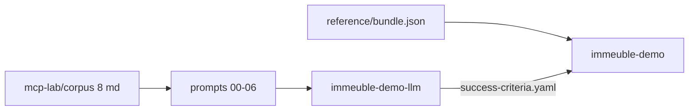

# Contexte — MCP lab immeuble syndic

> Version française — English: [en/mcp-lab-context.md](en/mcp-lab-context.md)

Point d'entrée canonique : [`examples/immeuble/mcp-lab/README.md`](../../examples/immeuble/mcp-lab/README.md)

## Rôle du dossier

[`examples/immeuble/mcp-lab/`](../../examples/immeuble/mcp-lab/) est le **laboratoire agent MCP** : reconstruire le domaine syndic belge (Résidence Les Tilleuls + Les Érables) **depuis des documents bruts**, dans le workspace `immeuble-demo-llm`, puis **comparer** au golden `immeuble-demo`.

Ce n'est pas la piste « charger le bundle et c'est fini » — c'est la piste « simuler ce qu'un agent GhostCrab ferait en conditions réelles ».



## Configuration

[`workspace.json`](../../examples/immeuble/mcp-lab/workspace.json) :

| Champ | Valeur |
|-------|--------|
| `workspace_id` | `immeuble-demo-llm` |
| `collection_id` | `immeuble-demo-llm::docs` |
| `ontology_id` | `immeuble-demo::core` |
| `golden_workspace_id` | `immeuble-demo` |
| `golden_bundle` | `../reference/bundle.json` |

## Structure du dossier

| Élément | Rôle |
|---------|------|
| [`README.md`](../../examples/immeuble/mcp-lab/README.md) | Point d'entrée agent |
| [`workspace.json`](../../examples/immeuble/mcp-lab/workspace.json) | IDs workspace, collection, ontologie, référence |
| [`success-criteria.yaml`](../../examples/immeuble/mcp-lab/success-criteria.yaml) | Seuils de validation (counts, relations, quotités, diagnostics) |
| **`corpus/`** | Entrée — 8 markdown verbeux + manifest + expected-coverage |
| **`prompts/`** | Workflow agent en 7 phases (00→06), prompts copy-paste |
| **`reference/`** | Checklists read-only (ontologie, gap-rules) |

## Le corpus

8 fichiers **bruts et réalistes** listés dans [`corpus/manifest.json`](../../examples/immeuble/mcp-lab/corpus/manifest.json) :

| doc_id | Fichier | document_type |
|--------|---------|---------------|
| 1 | statuts-tilleuls.md | statuts_copropriete |
| 2 | statuts-erables.md | statuts_copropriete |
| 3 | registre-coproprietaires.md | registre_coproprietaires |
| 4 | composition-occupants.md | composition_menage |
| 5 | baux-locatifs.md | bail |
| 6 | pv-ag-budget-2026.md | pv_ag |
| 7 | coda-janvier-2026.md | extrait_coda |
| 8 | annexes-caves-garages-jardins.md | annexe_lot |

**Distinct de** [`reference/documents/`](../../examples/immeuble/reference/documents/) (7 docs qualifiés embarqués dans le bundle golden).

Règle explicite (prompt 00) : **ne pas charger le bundle golden dans `immeuble-demo-llm`**. Le golden sert uniquement à comparer à la fin.

## Les sept phases

| Phase | Fichier | Écrit ? | Action |
|-------|---------|---------|--------|
| 0 | [`00-prerequisites.md`](../../examples/immeuble/mcp-lab/prompts/00-prerequisites.md) | Non | `ghostcrab_status`, Model Proposal |
| 1 | [`01-discovery-and-model-proposal.md`](../../examples/immeuble/mcp-lab/prompts/01-discovery-and-model-proposal.md) | Non | Affiner le modèle depuis le corpus |
| 2 | [`02-ontology-register.md`](../../examples/immeuble/mcp-lab/prompts/02-ontology-register.md) | Oui | Workspace + ontologie LinkML |
| 3 | [`03-gap-rules-design.md`](../../examples/immeuble/mcp-lab/prompts/03-gap-rules-design.md) | Oui | Gap-rules closed-world |
| 4 | [`04-document-ingest.md`](../../examples/immeuble/mcp-lab/prompts/04-document-ingest.md) | Oui | `gcp brain document` — ingest + qualify |
| 5 | [`05-graph-extraction.md`](../../examples/immeuble/mcp-lab/prompts/05-graph-extraction.md) | Oui | `ghostcrab_learn` / extract LLM |
| 6 | [`06-validate-and-compare.md`](../../examples/immeuble/mcp-lab/prompts/06-validate-and-compare.md) | Non | Compare vs success-criteria |

Phases 02–05 : **confirmation humaine** requise (ONBOARDING_CONTRACT §9).

## Critères de succès (extrait)

Source : [`success-criteria.yaml`](../../examples/immeuble/mcp-lab/success-criteria.yaml)

| Métrique | Seuil |
|----------|-------|
| buildings | 2 |
| units | 13 |
| cellars | 13 |
| lease_contracts | 5 |
| coda_entries | 3 |
| quotités par immeuble | 1000 |
| graph_search « appartement » | ≥ 13 |
| diagnostics L2 | missing_required_relations ≤ 0 |

Checklists read-only :

- [`reference/ontology-checklist.md`](../../examples/immeuble/mcp-lab/reference/ontology-checklist.md)
- [`reference/gap-rules-checklist.md`](../../examples/immeuble/mcp-lab/reference/gap-rules-checklist.md)

## Les trois pistes immeuble

| Piste | Workspace | Rôle |
|-------|-----------|------|
| **Reference** | `immeuble-demo` | Cible — snapshot golden (`bundle.json`) |
| **MCP lab** | `immeuble-demo-llm` | Processus — reconstruction depuis corpus |
| **Training** | `immeuble-training-*` | Curriculum diagnostics gap-rules L0→L3 |

### Variante Cursor MCP (`immo-mcp`)

Même SQLite que `.cursor/mcp.json` (`ghostcrab.sqlite`), **deux workspaces** :

| Workspace | Rôle |
|-----------|------|
| `immo-mcp` | Processus — reconstruction MCP depuis corpus |
| `immeuble-demo` | Référence — `bundle.json` chargé pour comparer (phase 6) |

Config : [`workspace-immo-mcp.json`](../../examples/immeuble/mcp-lab/workspace-immo-mcp.json), compare : [`06-validate-and-compare-immo-mcp.md`](../../examples/immeuble/mcp-lab/prompts/06-validate-and-compare-immo-mcp.md).

## CI mock

```bash
node scripts/import-immeuble-demo-llm.mjs --mode mock --reset
# → reports/immeuble-demo-llm/<timestamp>/report.md
```

Le mock valide le pipeline de comparaison mais **ne persiste pas** le graphe dans `immeuble-demo-llm`. Voir [01 — Référence](01-reference-vers-graphe.md#phase-6--validation).

Suite : [Comment GhostCrab MCP y arrive](how-ghostcrab-mcp-achieves-it.md)

## Dépannage — diagnostics L2 renvoie 404

Symptôme : `ghostcrab_graph_diagnostics` ou `curl …/api/mindbrain/graph/diagnostics` renvoie **404/405**, alors que `/health` répond `ok`.

Cause typique : le binaire `ghostcrab-backend` en cours d'exécution est **plus ancien** que le code vendor (routes gap-rules/diagnostics ajoutées récemment). `gcp brain up` (ou alias `gcp up` / legacy `gcp serve`) peut réutiliser un PID au même semver npm (**ex. 0.5.2**) sans redémarrer si le binaire sur disque n'a pas changé.

Correctif :

```bash
pnpm run prebuild:local   # ou npm install du paquet plateforme à jour
gcp brain down            # ou tuer le PID dans data/ghostcrab-backend.pid
export GHOSTCRAB_SQLITE_PATH="${GHOSTCRAB_SQLITE_PATH:-./data/ghostcrab.sqlite}"
gcp brain up --help       # smoke ; ou lancer le binaire prebuild directement :
# ./prebuilds/$(node -p "process.platform+'-'+process.arch")/ghostcrab-backend
curl -sf "http://127.0.0.1:8091/api/mindbrain/capabilities" | jq '.features'
curl -sf "http://127.0.0.1:8091/api/mindbrain/graph/diagnostics?workspace_id=immeuble-demo-llm&ontology_id=immeuble-demo::core"
```

Vérifications :

| Probe | Attendu |
|-------|---------|
| `GET /api/mindbrain/capabilities` | 200, `graph_diagnostics: true` |
| `GET /api/mindbrain/graph/diagnostics?…` | 200 ou 400 (pas 404) |
| `POST /api/mindbrain/graph/gap-rules/import` | 200 ou 400 (pas 405) |
| `ghostcrab_status` → `versions.mindbrain` | semver attendu (ex. **1.7.1**) |

Override binaire : `GHOSTCRAB_BACKEND_BIN=/chemin/vers/ghostcrab-backend gcp brain up`. Après redémarrage, `ghostcrab_status` expose `runtime.capabilities.graph_gap_diagnostics` (et `versions.mindbrain`) ; un directive apparaît si les routes manquent encore.

## Dépannage — ontologie vide dans Graph Explorer (Modèle)

Symptôme : onglet **Modèle → Classes** vide alors que `gcp brain ontology compile` a réussi.

Cause typique : `workspace_settings.default_ontology_id` pointe vers `{workspace}::default` (coquille auto **0 types**) au lieu de `{workspace}::core` (LinkML compilé, **24 classes** pour immeuble-demo).

Correctif canonique (phase 2) : recompiler avec le seed syndic sur le workspace cible :

```bash
gcp brain ontology compile \
  --workspace-id '<workspace_id>' \
  --ontology-id '<workspace_id>::core' \
  --input ontologies/immeuble-demo/core.yaml \
  --profile syndic \
  --import-db --force
```

Cela appelle `ensureWorkspace`, `setDefaultOntology`, et seed les dimensions `source.*` / `domain.*` / `finance.*` **uniquement** sur `<workspace_id>::core`.

Correctif SQL manuel (legacy lab seulement si compile sans `--profile syndic`) :

```sql
UPDATE workspace_settings
SET default_ontology_id = '<workspace_id>::core'
WHERE workspace_id = '<workspace_id>';
```

Vérification : `GET /api/mindbrain/ontology/list?workspace_id=<id>` doit retourner `default_ontology_id: <id>::core`.

Garde-fou lab : [`workspace-test-immo-mcp3.json`](../../examples/immeuble/mcp-lab/workspace-test-immo-mcp3.json) — phase 4 = `document-qualify` live (pas de mock JSON) ; phase 5 = `document-business-extract` live avec `--reindex graph`.

## Dépannage — `ghostcrab_coverage` = null / « No ontology registered »

`ghostcrab_coverage` compte les nœuds **facettes** (taxonomie seedée), pas les lignes LinkML `ontology_entity_types`.

Pour valider le modèle importé, préférer :

- `GET /api/mindbrain/ontology/list` + `ontology/graph?ontology_id=…::core`
- `ghostcrab_graph_diagnostics` avec `ontology_id: <workspace>::core`

Fix associé : `workspaces.domain_profile = 'syndic'` (pas `"test"`) pour la résolution loadout syndic.
