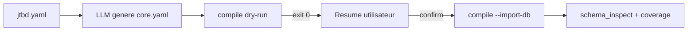

# 06 — Voies d'import ontologie et tabulaire (Personal)

Synthèse Personal des choix introduits par [`personal-mcp/SOP0_import_path_choices.md`](../../../../starter-kit-ghostcrab-perso/starterkit/personal-mcp/SOP0_import_path_choices.md) dans le StarterKit.

> **Modèle LinkML :** [`ghostcrab-docs::import-paths`](../ontology/diagrams/import-paths.md)

Voir aussi : [02 — Méthode StarterKit](02-methode-starterkit.md), [structured-import runbook](../../setup/structured-import.md).

---

## Principe

Deux décisions explicites, enregistrées dans `templates/import_path_choices.yaml` :

| Moment | Choix | Défaut Personal |
|--------|-------|-----------------|
| Phase B0 (avant écriture ontologie) | LinkML via MCP/CLI vs modélisation MCP incrémentale | **LinkML via `ghostcrab_ontology_import`** |
| Phase C2.0 (avant import tabulaire) | structured-import CLI vs scripts SOP5 | **structured-import CLI** |

Les voies historiques restent disponibles ; l'agent ne doit pas les supprimer du dialogue.

---

## Voie ontologie LinkML (défaut)



### Commandes

Import MCP natif (défaut agent) :

```json
{
  "workspace_id": "immeuble-demo",
  "ontology_id": "immeuble-demo::core",
  "input_path": "ontologies/immeuble-demo/core.yaml",
  "source_format": "linkml"
}
```

Dry-run CLI (recommandé avant artefact ou revue opérateur) :

```bash
gcp brain ontology compile \
  --workspace-id immeuble-demo \
  --ontology-id immeuble-demo::core \
  --input ontologies/immeuble-demo/core.yaml \
  --output output/ontology-slice.json
```

Import CLI après confirmation :

```bash
gcp brain ontology compile \
  --workspace-id immeuble-demo \
  --ontology-id immeuble-demo::core \
  --input ontologies/immeuble-demo/core.yaml \
  --import-db --force
```

### Références repo

| Artefact | Chemin |
|----------|--------|
| Exemple domaine | [`ontologies/immeuble-demo/core.yaml`](../../../ontologies/immeuble-demo/core.yaml) |
| Profil GhostCrab | [`ontologies/ghostcrab/profile.yaml`](../../../ontologies/ghostcrab/profile.yaml) |
| Stub StarterKit | [`linkml_ontology.stub.yaml`](../../../../starter-kit-ghostcrab-perso/starterkit/templates/linkml_ontology.stub.yaml) |
| Prompt lab | [`examples/immeuble/mcp-lab/prompts/02-ontology-register.md`](../../../examples/immeuble/mcp-lab/prompts/02-ontology-register.md) |

---

## Voie ontologie MCP incrémentale (alternative)

SOP2 section 7 Voie A : `ghostcrab_workspace_create` → `ghostcrab_schema_register` → `remember` → `upsert` → `learn` → `project`.

Utile quand le modèle mémoire/graphe évolue itérativement sans artefact LinkML versionné. Cette voie ne crée pas une ontologie native `ontology_*` : `schema_register` décrit les schémas agent/facettes, `remember` et `upsert` écrivent la mémoire, `learn` écrit les instances/relation du graphe. Pour importer une ontologie formelle depuis MCP, utiliser `ghostcrab_ontology_import`.

---

## Voie tabulaire structured-import CLI (défaut Personal)

Runbook : [`docs/setup/structured-import.md`](../../setup/structured-import.md)

Exemple : [`examples/immeuble/structured-import/`](../../../examples/immeuble/structured-import/)

```bash
gcp brain structured-import validate --workspace-id <ws> ...
gcp brain structured-import register-semantics --workspace-id <ws> ...
gcp brain structured-import apply --workspace-id <ws> --data-plane import_ready ...
gcp brain structured-import reindex --scope all
```

Correspondance SOP5 gates : voir SOP5 section 1 bis et [02 — Méthode StarterKit](02-methode-starterkit.md).

---

## Voie tabulaire scripts SOP5 (alternative)

SOP5 section 3 Voie A : `profile_source.mjs` → `transform_source_to_jsonb.mjs` → `import_facets.mjs` (dry-run plan upsert) → `materialize_graph_from_edges.mjs` → consumers.

Recommandée quand l'équipe veut le protocole gates/scripts StarterKit sans moteur Zig structured-import.

---

## Gate 1 Personal — contrat modèle

| Source | Quand |
|--------|-------|
| `ghostcrab_workspace_export_model` | workspace déjà peuplé |
| LinkML `compile` dry-run → `ontology-slice.json` | voie LinkML |
| `mvp_core_contract.yaml` | voie MCP ou fallback |

---

## Checklist agent Personal

- [ ] `ghostcrab_status` OK
- [ ] `import_path_choices.yaml` rempli (B0 + C2.0)
- [ ] Voie ontologie : `ghostcrab_ontology_import` **ou** LinkML validé dry-run + import CLI **ou** MCP §7 suivi comme modélisation incrémentale non native
- [ ] Voie tabulaire : structured-import **ou** scripts SOP5, pas les deux
- [ ] `import_manifest.yaml` reflète `import_path_choices` et `commands.path`
- [ ] Post-import : `ghostcrab_coverage` + `consumer_contract.yaml` si déclaré

Retour index : [README](README.md)
