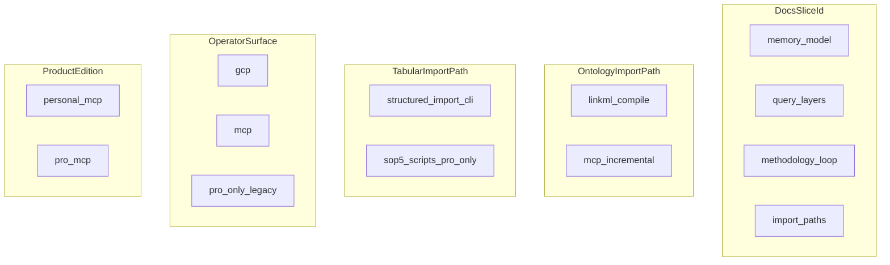

# import-paths — LinkML class graph

| Field | Value |
|-------|-------|
| ontology-id | `ghostcrab-docs::import-paths` |
| source yaml | [`import-paths.yaml`](../linkml/ghostcrab-docs/import-paths.yaml) |
| yaml sha256 (12) | `08e5c9d19630` |
| doc source | [`../../methode-starterkit/06-voies-import-ontologie-et-tabulaire.md`](../../methode-starterkit/06-voies-import-ontologie-et-tabulaire.md) |

> Generated by `node scripts/render-linkml-ontology-graph.mjs`. Do not edit by hand.

## Class hierarchy

```mermaid
classDiagram
    class DocumentationConcept {
      <<abstract>>
    }
    class ImportPathArchitecture {
      Explicit B0 and C2 path choices for Personal agents.
    }
    class OntologyPathChoice {
      Phase B0 ontology authoring path.
    }
    class OntologyPathLinkML {
      Default Personal — LLM-authored core.yaml, imported through ghostcrab_ontology_i
    }
    class OntologyPathMcpIncremental {
      Alternative modeling path — agent schemas, memory, and graph writes without nati
    }
    class TabularPathChoice {
      Phase C2 structured data import path.
    }
    class TabularPathStructuredImport {
      Default Personal — gcp brain structured-import gate chain.
    }
    class TabularPathSop5ScriptsProOnly {
      Pro track — SOP5 Voie A scripts and COPY; not Personal default.
    }
    class FormalOntologyPath {
      LinkML YAML under ontologies/ is authoring source; OWL2 is interchange.
    }
    class PlatformProfileArtifact {
      ontologies/ghostcrab/profile.yaml reusable patterns.
    }
    class DomainSliceArtifact {
      ontologies/<workspace>/core.yaml with id workspace::core.
    }
    class OntologyCompileOperator {
      CLI ontology compile/import path for operator dry-run and offline maintenance.
    }
    class OntologyMcpImportOperator {
      MCP ontology import path for LinkML YAML or OWL/RDF N-Triples into native ontolo
    }
    class AgentSchemaRegistryPath {
      ghostcrab:* JSON schemas for agent_facts — not OWL ontology group.
    }
    class DocumentImportOperator {
      gcp brain document * pipeline for facet_assignments_raw.
    }
    class ProductEditionPersonal {
      ghostcrab-personal-mcp SQLite track; Pro CLI operators forbidden.
    }
    class ProOnlyOperatorBan {
      Operators that must not appear on personal-mcp agent paths.
    }
    DocumentationConcept <|-- ImportPathArchitecture
    DocumentationConcept <|-- OntologyPathChoice
    OntologyPathChoice <|-- OntologyPathLinkML
    OntologyPathChoice <|-- OntologyPathMcpIncremental
    DocumentationConcept <|-- TabularPathChoice
    TabularPathChoice <|-- TabularPathStructuredImport
    TabularPathChoice <|-- TabularPathSop5ScriptsProOnly
    DocumentationConcept <|-- FormalOntologyPath
    DocumentationConcept <|-- PlatformProfileArtifact
    DocumentationConcept <|-- DomainSliceArtifact
    DocumentationConcept <|-- OntologyCompileOperator
    DocumentationConcept <|-- OntologyMcpImportOperator
    DocumentationConcept <|-- AgentSchemaRegistryPath
    DocumentationConcept <|-- DocumentImportOperator
    DocumentationConcept <|-- ProductEditionPersonal
    DocumentationConcept <|-- ProOnlyOperatorBan
```

### Enumerations

