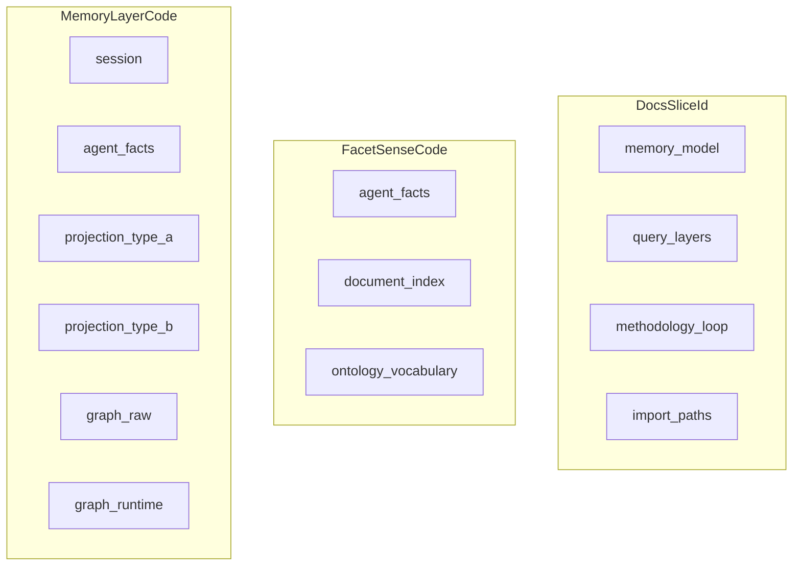

# memory-model — LinkML class graph

| Field | Value |
|-------|-------|
| ontology-id | `ghostcrab-docs::memory-model` |
| source yaml | [`memory-model.yaml`](../linkml/ghostcrab-docs/memory-model.yaml) |
| yaml sha256 (12) | `db27032dbcd1` |
| doc source | [`../../03-memoire-mcp-facettes-graphe-projections.md`](../../03-memoire-mcp-facettes-graphe-projections.md) |

> Generated by `node scripts/render-linkml-ontology-graph.mjs`. Do not edit by hand.

## Class hierarchy

```mermaid
classDiagram
    class DocumentationConcept {
      <<abstract>>
    }
    class MemoryArchitecture {
      Root for Personal multi-store memory model.
    }
    class FacetSense {
      One of three mutually exclusive facet meanings.
    }
    class FacetSenseAgent {
      Sens A — agent_facts and ghostcrab_remember family.
    }
    class FacetSenseDocumentIndex {
      Sens B — facet_tables, facet_postings derived index.
    }
    class FacetSenseOntologyVocabulary {
      Sens C — ontology_* and facet_assignments_raw qualification.
    }
    class MemoryLayer {
      A persistence layer behind MCP tools.
    }
    class SessionRoutingLayer {
      Process MCP session routing; not durable business truth.
    }
    class AgentFactsStore {
      Durable agent text facts (sens A storage).
    }
    class ProjectionTypeAStore {
      Working memory projections table.
    }
    class ProjectionTypeBStore {
      Materialized ProjectionResult in graph_entity.
    }
    class GraphRawStore {
      entities_raw, relations_raw, documents_raw, chunks_raw.
    }
    class GraphRuntimeStore {
      graph_entity, graph_relation after reindex.
    }
    class ReindexRawRuntimePair {
      Raw tables are source of truth; runtime is derived.
    }
    class OntologyTablesStore {
      Formal ontology storage (sens C); compiled from LinkML.
    }
    class DocumentFacetIndexStore {
      Document faceting engine (sens B).
    }
    DocumentationConcept <|-- MemoryArchitecture
    DocumentationConcept <|-- FacetSense
    FacetSense <|-- FacetSenseAgent
    FacetSense <|-- FacetSenseDocumentIndex
    FacetSense <|-- FacetSenseOntologyVocabulary
    DocumentationConcept <|-- MemoryLayer
    MemoryLayer <|-- SessionRoutingLayer
    MemoryLayer <|-- AgentFactsStore
    MemoryLayer <|-- ProjectionTypeAStore
    MemoryLayer <|-- ProjectionTypeBStore
    MemoryLayer <|-- GraphRawStore
    MemoryLayer <|-- GraphRuntimeStore
    DocumentationConcept <|-- ReindexRawRuntimePair
    MemoryLayer <|-- OntologyTablesStore
    MemoryLayer <|-- DocumentFacetIndexStore
```

### Enumerations

