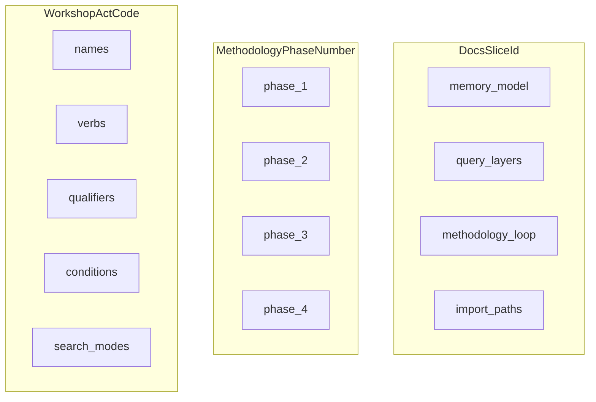

# methodology-loop — LinkML class graph

| Field | Value |
|-------|-------|
| ontology-id | `ghostcrab-docs::methodology-loop` |
| source yaml | [`methodology-loop.yaml`](../linkml/ghostcrab-docs/methodology-loop.yaml) |
| yaml sha256 (12) | `94f8012730c7` |
| doc source | [`../../../methodology/universal_methodology.md`](../../../methodology/universal_methodology.md) |

> Generated by `node scripts/render-linkml-ontology-graph.mjs`. Do not edit by hand.

## Class hierarchy

```mermaid
classDiagram
    class DocumentationConcept {
      <<abstract>>
    }
    class MethodologyLoop {
      Iterative four-phase loop for domain modeling in GhostCrab.
    }
    class MethodologyPhase {
      One phase of the universal methodology.
    }
    class MethodologyPhase1FacetsOntology {
      Design minimal durable facet and ontology shape.
    }
    class MethodologyPhase2Projections {
      Design agent-facing read contract (projections).
    }
    class MethodologyPhase3Import {
      Ingest minimum data exercising phases 1 and 2.
    }
    class MethodologyPhase4Reports {
      Run projections and validate against competency questions.
    }
    class CompetencyQuestion {
      Natural-language question the ontology must support.
    }
    class OnboardingPrerequisite {
      HARD GATES before methodology phase 1.
    }
    class WorkshopAct {
      Facilitation act mapping narrative to GhostCrab artifacts.
    }
    class IterativeEnrichment {
      Loop is not linear; thin slices enrich over passes.
    }
    DocumentationConcept <|-- MethodologyLoop
    DocumentationConcept <|-- MethodologyPhase
    MethodologyPhase <|-- MethodologyPhase1FacetsOntology
    MethodologyPhase <|-- MethodologyPhase2Projections
    MethodologyPhase <|-- MethodologyPhase3Import
    MethodologyPhase <|-- MethodologyPhase4Reports
    DocumentationConcept <|-- CompetencyQuestion
    DocumentationConcept <|-- OnboardingPrerequisite
    DocumentationConcept <|-- WorkshopAct
    DocumentationConcept <|-- IterativeEnrichment
```

### Enumerations

