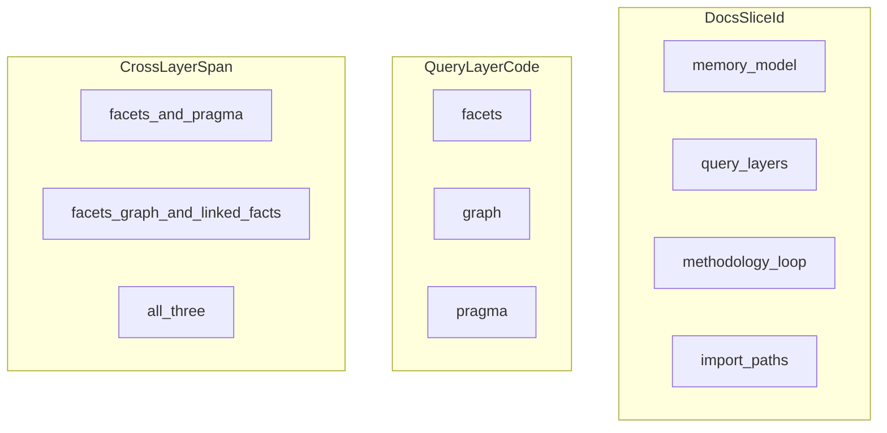

# query-layers — LinkML class graph

| Field | Value |
|-------|-------|
| ontology-id | `ghostcrab-docs::query-layers` |
| source yaml | [`query-layers.yaml`](../linkml/ghostcrab-docs/query-layers.yaml) |
| yaml sha256 (12) | `ada6434a15f2` |
| doc source | [`../../../methodology/ghostcrab-query-layers.md`](../../../methodology/ghostcrab-query-layers.md) |

> Generated by `node scripts/render-linkml-ontology-graph.mjs`. Do not edit by hand.

## Class hierarchy

```mermaid
classDiagram
    class DocumentationConcept {
      <<abstract>>
    }
    class QueryArchitecture {
      How agents read GhostCrab without mixing stores.
    }
    class QueryLayer {
      One MCP query layer with dedicated read tools.
    }
    class FacetsQueryLayer {
      Layer 1 — agent_facts BM25/FTS and facet filters.
    }
    class GraphQueryLayer {
      Layer 2 — graph_entity, graph_relation live queries.
    }
    class PragmaQueryLayer {
      Layer 3 — projections Type A and Type B reads.
    }
    class McpReadTool {
      A named MCP read tool bound to one primary layer.
    }
    class FacetsReadTool
    class GraphReadTool
    class PragmaReadTool
    class CrossLayerReadTool {
      Tool spanning multiple layers; not a storage layer itself.
    }
    class PackCrossLayerTool {
      ghostcrab_pack — agent_facts + projections Type A.
    }
    class CombinedSearchCrossLayerTool {
      ghostcrab_combined_search — graph-first with facet fallback.
    }
    class LiveGraphQuery {
      Explicitly not a projection; queries current graph_entity state.
    }
    DocumentationConcept <|-- QueryArchitecture
    DocumentationConcept <|-- QueryLayer
    QueryLayer <|-- FacetsQueryLayer
    QueryLayer <|-- GraphQueryLayer
    QueryLayer <|-- PragmaQueryLayer
    DocumentationConcept <|-- McpReadTool
    McpReadTool <|-- FacetsReadTool
    McpReadTool <|-- GraphReadTool
    McpReadTool <|-- PragmaReadTool
    DocumentationConcept <|-- CrossLayerReadTool
    CrossLayerReadTool <|-- PackCrossLayerTool
    CrossLayerReadTool <|-- CombinedSearchCrossLayerTool
    DocumentationConcept <|-- LiveGraphQuery
```

### Enumerations

