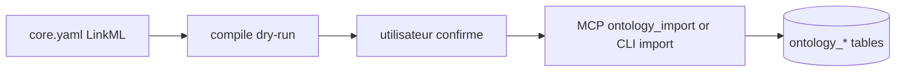

# Pipeline LinkML → OWL2 (Personal)

Source files live under [`ontologies/`](../../../ontologies/). Agents can import through MCP with `ghostcrab_ontology_import`; operators can run the same native engine through `gcp brain ontology`.

---

## Workflow



---

## MCP import

LinkML import from an agent session:

```json
{
  "workspace_id": "immeuble-demo",
  "ontology_id": "immeuble-demo::core",
  "input_path": "ontologies/immeuble-demo/core.yaml",
  "source_format": "linkml"
}
```

OWL/RDF N-Triples import:

```json
{
  "workspace_id": "immeuble-demo",
  "ontology_id": "immeuble-demo::owl",
  "input_path": "output/ontology.nt",
  "source_format": "ntriples",
  "materialize_graph": false
}
```

Use `materialize_graph:true` only when object triples should also create graph instances. Keep it false for pure ontology registration.

## CLI commands

Dry-run (no DB write):

```bash
gcp brain ontology compile \
  --workspace-id immeuble-demo \
  --ontology-id immeuble-demo::core \
  --input ontologies/immeuble-demo/core.yaml \
  --output output/ontology-slice.json
```

Import after explicit confirmation from the CLI:

```bash
gcp brain ontology compile \
  --workspace-id immeuble-demo \
  --ontology-id immeuble-demo::core \
  --input ontologies/immeuble-demo/core.yaml \
  --import-db --force
```

**Stop MCP** before database-backed commands unless `--force` (SQLite lock).

---

## OWL2 interchange

| Command | Role |
|---------|------|
| `gcp brain ontology import` | Load preserved N-Triples into MindBrain |
| `gcp brain ontology export` | Export N-Triples from DB |
| `gcp brain ontology export-linkml` | Round-trip YAML from bundle or DB |

YAML under `ontologies/` remains the **authoring** source; OWL2 is interchange and audit artefact.

---

## Consumer: document qualification

After ontology tables exist:

1. `gcp brain document qualification-vocab-list` — list taxonomy and facet ids
2. `gcp brain document document-qualify` — write `facet_assignments_raw`

See [document-import.md](../../setup/document-import.md).
