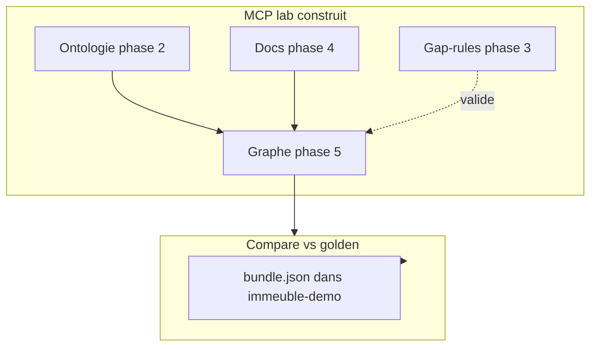

# 02 — MCP, ontologie et gap-rules

> Version française — English: [en/02-mcp-ontology-gap-rules.md](en/02-mcp-ontology-gap-rules.md)

Ce document précise **ce que MCP construit** dans le processus lab, **ce qu'il consulte seulement**, et **où intervient la CLI** — en prenant [`reference/bundle.json`](../../examples/immeuble/reference/bundle.json) comme cible de comparaison, pas comme mode d'emploi.

## Vue d'ensemble par artefact

| Artefact | Processus MCP lab | Outils | Stockage SQLite | Dans bundle golden ? |
|----------|-------------------|--------|-----------------|----------------------|
| Ontologie taxonomie | Phase 2 — **construire** | CLI compile LinkML **ou** `ghostcrab_schema_register` | `ontology_*` | Oui |
| Documents + facets | Phase 4 — **construire** | `gcp brain document` (CLI) | `documents_raw`, `facet_assignments_raw` | Oui |
| Graphe instance | Phase 5 — **construire** | `ghostcrab_learn`, extract LLM | `entities_raw` → `graph_entity` | Oui |
| Gap-rules | Phase 3 — **construire** | `ghostcrab_graph_gap_rules_import` | `graph_gap_rules` | **Non** |
| Projections seed | Optionnel | `ghostcrab_project` | `projections` (pragma) | **Non** |
| Interrogation | Phase 6 — **consulter** | `ghostcrab_graph_search`, `ghostcrab_traverse`, diagnostics | lecture | — |
| Couverture ontologie | Audit | `ghostcrab_coverage` | compare ontology vs graph | — |



---

## Ontologie

### Rôle dans le processus

L'ontologie définit **ce qu'on a le droit de qualifier et de modéliser** : types d'entités (`building`, `unit`, `person`…), types d'arêtes (`contains`, `owns`, `leases`…), dimensions de facets (`domain.building`, `source.document_type`…).

Sans ontologie en phase 2, la qualification (phase 4) et l'extraction (phase 5) n'ont pas de vocabulaire contrôlé.

Correspondance méthodologie : phase MCP lab 02 = **Phase 1 — Facettes / ontologies** de la [méthodologie universelle](../methodology/fr/universal_methodology.md). Les phases 00–01 couvrent la précondition ONBOARDING (Model Proposal confirmé avant toute écriture).

### Deux voies d'enregistrement (MCP lab)

Documentées dans [`mcp-lab/prompts/02-ontology-register.md`](../../examples/immeuble/mcp-lab/prompts/02-ontology-register.md) :

**Option A — LinkML (recommandée pour immeuble)**

```bash
gcp brain ontology compile \
  --workspace-id immeuble-demo-llm \
  --ontology-id immeuble-demo::core \
  --input ontologies/immeuble-demo/core.yaml \
  --import-db --force
```

Source canonique : [`ontologies/immeuble-demo/core.yaml`](../../ontologies/immeuble-demo/core.yaml)

**Option B — MCP schema register**

```
ghostcrab_schema_register  →  facets avec schema_id mindbrain:schema
```

Modèle plus léger ; ne remplace pas la richesse LinkML pour le syndic.

### Outils MCP de consultation (pas de construction)

| Outil | Rôle |
|-------|------|
| `ghostcrab_schema_inspect` | Lire un schema enregistré |
| `ghostcrab_schema_list` | Lister les schemas |
| `ghostcrab_coverage` | Trouver les types ontologie sans instances dans le graphe |

### Comparaison avec la référence

Le bundle golden contient la section `ontology_*` compilée. Checklist read-only : [`mcp-lab/reference/ontology-checklist.md`](../../examples/immeuble/mcp-lab/reference/ontology-checklist.md).

Le processus MCP doit produire une ontologie **équivalente** en sémantique ; l'égalité stricte des IDs internes n'est pas requise (`parity_note` dans success-criteria).

---

## Gap-rules

### Rôle dans le processus

Les gap-rules sont des **invariants closed-world** sur le graphe instance : pour chaque entité d'un type donné, compter les relations sortantes d'un type donné et vérifier min/max.

Exemple ([`reference/gap-rules/demo.json`](../../examples/immeuble/reference/gap-rules/demo.json)) :

```json
{
  "rule_id": "unit-one-cellar",
  "entity_type": "unit",
  "relation_type": "assigned_cellar",
  "min_count": 1,
  "max_count": 1
}
```

Ce ne sont **pas** des projections ni des requêtes ad hoc — ce sont des règles de validation post-extraction.

### Où elles vivent

- Fichiers JSON à côté du bundle (`reference/gap-rules/`, `training/gap-rules/L0`…`L3`)
- Table SQLite **`graph_gap_rules`** après import
- **Absentes** de `bundle.json`

### Processus MCP lab — phase 3

Prompt : [`03-gap-rules-design.md`](../../examples/immeuble/mcp-lab/prompts/03-gap-rules-design.md)

1. Concevoir ou adapter des règles (s'inspirer de L0 patrimoine, L2 syndic filtré)
2. Importer :

```
ghostcrab_graph_gap_rules_import   (extended — ghostcrab_tool_search)
ghostcrab_graph_gap_rules          (lister)
ghostcrab_graph_diagnostics        (évaluer)
```

Implémentation : [`src/tools/dgraph/diagnostics.ts`](../../src/tools/dgraph/diagnostics.ts)

Alternative CLI :

```bash
mindbrain-standalone-tool graph-gap-rules-import \
  --db "$GHOSTCRAB_SQLITE_PATH" \
  --input examples/immeuble/reference/gap-rules/demo.json
```

### Comparaison avec la référence

1. Charger le graphe golden dans `immeuble-demo` (bundle)
2. Construire le graphe lab dans `immeuble-demo-llm` (processus MCP)
3. Importer les **mêmes** règles (adaptées `workspace_id`) sur les deux workspaces
4. Comparer les diagnostics — un graphe lab incomplet produit des `missing_required_relations` > 0

Checklist read-only : [`mcp-lab/reference/gap-rules-checklist.md`](../../examples/immeuble/mcp-lab/reference/gap-rules-checklist.md)

---

## Documents qualifiés — MCP ou CLI ?

La phase 4 **n'utilise pas** `ghostcrab_remember` pour les documents source. C'est le pipeline CLI :

```bash
gcp brain document document-ingest ...
gcp brain document document-profile-worker ...
gcp brain document document-qualify --taxonomies immeuble-demo::core --facets ...
```

Runbook : [`docs/setup/document-import.md`](../setup/document-import.md)

MCP intervient **avant** (routing via `ghostcrab_modeling_guidance`) et **après** (recherche via `ghostcrab_graph_search`, `ghostcrab_entity_chunks`).

**Comparaison** : le bundle golden embarque 7 docs qualifiés ; le lab ingère 8 corpus différents — on compare les **counts de facets** et la **cohérence métier**, pas l'égalité byte-à-byte des fichiers.

---

## Graphe métier — rôle MCP central

Phase 5 : [`05-graph-extraction.md`](../../examples/immeuble/mcp-lab/prompts/05-graph-extraction.md)

| Outil | Écrit quoi | Compare avec golden |
|-------|------------|---------------------|
| `ghostcrab_learn` | Nœuds/arcs structurés + `relation_properties` | `entities_raw`, `relations_raw` counts |
| `ghostcrab_remember` | Notes textuelles (FACTs agent) | **Pas** le graphe — table `facets` |
| `ghostcrab_graph_reindex` | Projette raw → `graph_entity` | Index de requête |

Seuils : [`success-criteria.yaml`](../../examples/immeuble/mcp-lab/success-criteria.yaml) — ex. 13 units, 69 contains, quotités 1000.

---

## Tableau récap : MCP construit vs consulte vs CLI

| Action | MCP | CLI |
|--------|-----|-----|
| Enregistrer ontologie LinkML | inspect seulement | `gcp brain ontology compile` |
| Schema léger alternatif | `ghostcrab_schema_register` | — |
| Ingérer corpus | guidance | `gcp brain document` |
| Extraire graphe | `ghostcrab_learn` | `document-business-extract` (live) |
| Importer gap-rules | `ghostcrab_graph_gap_rules_import` | `graph-gap-rules-import` |
| Valider graphe | `ghostcrab_graph_diagnostics` | scripts compare |
| Comparer vs golden | `ghostcrab_graph_search`, traverse | `import-immeuble-demo-llm.mjs` report |
| Charger référence | — | `gcp load bundle.json` |

---

## Ce que MCP ne fait pas sur la piste reference

Charger `bundle.json` dans `immeuble-demo` est une opération **CLI pure** — aucun outil MCP n'est requis. MCP entre en jeu quand on veut **reproduire** un état comparable depuis le corpus lab.

Suite : [03 — Projections expliquées](03-projections-expliquees.md)
