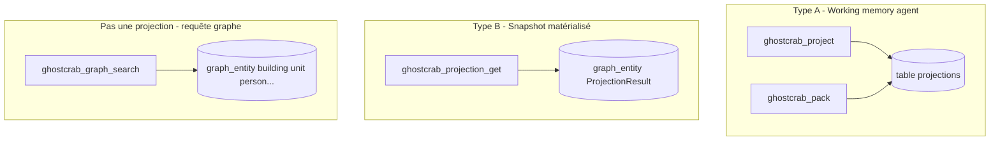

# 03 — Projections expliquées

> Version française — English: [en/03-projections-explained.md](en/03-projections-explained.md)

## Question fréquente

> Une projection, c'est une requête sur le graphe utilisant les propriétés de nœuds ou d'arêtes ?

**Non.** Dans GhostCrab, « projection » désigne **deux mécanismes distincts**, ni l'un ni l'autre n'est une requête SQL/Cypher ad hoc sur `graph_entity`.

Pour **interroger** le graphe immeuble (recherche, parcours, filtres metadata), utiliser les outils **graphe** : `ghostcrab_graph_search`, `ghostcrab_traverse`, `ghostcrab_graph_path`, etc. Voir [Couches de requête](../methodology/fr/ghostcrab-query-layers.md).

### Pourquoi le lab n'utilise pas `ghostcrab_pack` en validation

La [méthodologie universelle](../methodology/fr/universal_methodology.md) place les projections **avant** l'import (Phase 2 = contrat de lecture). Le lab immeuble valide la **reconstruction structurelle** via [`success-criteria.yaml`](../../examples/immeuble/mcp-lab/success-criteria.yaml) et les outils **graphe** (`ghostcrab_graph_search`, `ghostcrab_graph_diagnostics`) — pas via `ghostcrab_pack`. Les projections Type A ([`projections.seed.jsonl`](../../examples/immeuble/reference/projections.seed.jsonl)) restent optionnelles (phase 02-bis documentée en §12 de la méthodologie).

---

## Les deux types de projections



| | Working memory (Type A) | Matérialisée (Type B) | Requête graphe |
|--|-------------------------|----------------------|----------------|
| **Outil write** | `ghostcrab_project` | *(aucun MCP write)* | `ghostcrab_learn` |
| **Outil read** | `ghostcrab_pack` | `ghostcrab_projection_get` | `ghostcrab_graph_search`, `traverse`… |
| **Stockage** | table `projections` | `graph_entity` type `ProjectionResult` | `graph_entity` + `graph_relation` |
| **Contenu** | Texte court FACT/GOAL/STEP/CONSTRAINT | Snapshot + preuves + deltas | Entités domaine (building, unit…) |
| **Immeuble** | [`projections.seed.jsonl`](../../examples/immeuble/reference/projections.seed.jsonl) | **Absent** du bundle | 131 entités dans la référence |

---

## Type A — Working memory (`ghostcrab_project`)

### Nature

Mémoire de travail **agent-scoped** : objectifs en cours, contraintes actives, faits provisoires pour la session.

Implémentation : [`src/tools/pragma/project.ts`](../../src/tools/pragma/project.ts)

Types : `FACT | GOAL | STEP | CONSTRAINT`

Exemple seed immeuble ([`projections.seed.jsonl`](../../examples/immeuble/reference/projections.seed.jsonl)) :

```json
{
  "scope": "immeuble-demo",
  "proj_type": "FACT",
  "source_ref": "scenario:tilleuls-family-stack",
  "content": "Les Tilleuls A1 sont occupés par le couple Henri et Madeleine Dupont..."
}
```

### Relation au processus MCP

- **Pas** produit automatiquement par les phases 2–5 du lab
- **Pas** dans `bundle.json` — fichier sidecar optionnel
- L'agent peut appeler `ghostcrab_project` **après** extraction pour mémoriser un résumé de travail (ex. scénario Dupont, contrainte quotités)

Chargement manuel : lire chaque ligne du seed et appeler `ghostcrab_project` avec les mêmes champs.

### Lecture — `ghostcrab_pack`

Fusionne projections actives + FACTs pertinents en un `pack_text` compact pour l'agent.

[`ghostcrab_pack`](../../src/tools/pragma/pack.ts) ne lit **pas** `graph_entity` — seulement pragma + facets.

---

## Type B — Projection matérialisée (`ghostcrab_projection_get`)

### Nature

**Snapshot analytique pré-calculé** stocké comme entités graphe, identifié par `projection_id` dans `metadata_json`.

Implémentation : [`src/tools/pragma/projection-get.ts`](../../src/tools/pragma/projection-get.ts)

Retourne un **bundle** composé de :

1. **`projection_results`** — entités `ProjectionResult`
2. **`linked_evidence`** — relations (ex. `PROVEN_BY`) vers entités/chunks preuve
3. **`deltas`** — entités `DeltaFinding` (écarts métriques liés au même `projection_id`)

Ce n'est **pas** « SELECT * FROM graph_entity WHERE metadata.x = y » exécuté à la volée — c'est un **artefact importé ou matérialisé** par un pipeline aval (SEO audit, rapport import, etc.).

### Exemple hors immeuble

Test SEO ([`tests/tools/projection-get.test.ts`](../../tests/tools/projection-get.test.ts)) :

```json
{
  "entity_type": "ProjectionResult",
  "name": "keyword opportunity set",
  "metadata_json": "{\"projection_id\":\"proj_keyword_opportunities\"}"
}
```

Avec evidence :

```json
{
  "relation_type": "PROVEN_BY",
  "source_id": 10,
  "target_id": 11
}
```

Et delta :

```json
{
  "entity_type": "DeltaFinding",
  "metadata_json": "{\"metric\":\"proj_keyword_opportunities\"}"
}
```

### Immeuble : absent de la référence

Le bundle golden **ne contient pas** d'entités `ProjectionResult`. Appeler :

```
ghostcrab_projection_get { projection_id: "scenario:tilleuls-family-stack" }
```

sur `immeuble-demo` retourne **vide** — cet id existe dans le seed Type A (`projections.seed.jsonl`), pas comme projection matérialisée Type B.

[`scenarios.yaml`](../../examples/immeuble/reference/scenarios.yaml) liste des **questions de compétence** alignées par id `scenario:*` — ce ne sont ni des projections Type A ni Type B.

---

## Si vous voulez interroger le graphe immeuble

Utiliser la **couche graphe**, pas les projections :

### Recherche texte + filtres

```
ghostcrab_graph_search {
  workspace_id: "immeuble-demo-llm",
  query: "Dupont",
  entity_types: ["person"],
  limit: 10
}
```

Filtre exact sur metadata :

```
ghostcrab_graph_search {
  metadata_filters: { "building_id": "1" }
}
```

Outil **extended** — découvrir via `ghostcrab_tool_search`.

### Parcours topologique

| Outil | Usage |
|-------|-------|
| `ghostcrab_traverse` | Walk multi-sauts depuis un nœud |
| `ghostcrab_graph_path` | Chemin shortest entre deux entités |
| `ghostcrab_graph_subgraph` | Voisinage N-sauts |

### Propriétés d'arêtes typées

Écrites via `ghostcrab_learn` → `relation_properties` :

- `value_type` : `text`, `number`, `money_minor`, `percentage_bp`, `date_unix`, `doc_ref`, `uri`
- Stockées dans `relation_properties_raw`, projetées dans `graph_relation_property`

Exemple immeuble : quote-part sur relation `owns` (`relationProp` dans le modèle golden).

Ce sont des **attributs de relations**, consultables via `ghostcrab_graph_search(include_relations: true)` — pas des « projections » au sens GhostCrab.

---

## FAQ rapide

### `projections.seed.jsonl` charge-t-il le graphe ?

**Non.** C'est un seed optionnel pour `ghostcrab_project` (Type A). Le graphe se construit en phase 5 (`ghostcrab_learn` / extract).

### `scenarios.yaml` est une projection ?

**Non.** Questions de compétence humaines pour valider le domaine. Les ids `scenario:*` peuvent alimenter le champ `source_ref` des projections Type A.

### Les gap-rules sont des projections ?

**Non.** Invariants de cardinalité sur le graphe instance. Outils : `ghostcrab_graph_gap_rules_import`, `ghostcrab_graph_diagnostics`.

### `ghostcrab_search` interroge-t-il le graphe ?

**Non** — il cherche dans la table **facets** (FACTs agent). Pour le graphe : `ghostcrab_graph_search` ou `ghostcrab_combined_search` (graph-first).

### Comment comparer processus MCP vs référence ?

1. Graphe : counts entity/relation vs [`success-criteria.yaml`](../../examples/immeuble/mcp-lab/success-criteria.yaml)
2. Diagnostics : gap-rules L2 sur `immeuble-demo-llm`
3. Projections Type A : optionnel, pas dans le bundle
4. Projections Type B : non applicable à immeuble

---

## Decision guide (extrait)

| Question | Outil |
|----------|-------|
| Résumé agent / objectif en cours ? | `ghostcrab_pack` / `ghostcrab_project` |
| Snapshot analytique pré-importé ? | `ghostcrab_projection_get` |
| Trouver des lots ou personnes dans le graphe ? | `ghostcrab_graph_search` |
| Parcourir owns → occupies → leases ? | `ghostcrab_traverse` |
| Vérifier « chaque lot a une cave » ? | `ghostcrab_graph_diagnostics` + gap-rules |

Guide complet : [ghostcrab-query-layers.md](../methodology/fr/ghostcrab-query-layers.md)
