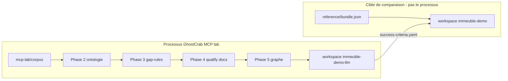

# GhostCrab MCP — explication pédagogique

> Version française — English: [en/README.md](en/README.md)

Synthèse courte : [Explications GhostCrab — immeuble MCP lab](../explanation/README.md)

Cette section explique **le processus GhostCrab MCP** sur l'exemple immeuble syndic : comment un agent part de documents bruts, construit ontologie, graphe et règles, puis **compare son résultat** à la référence golden.

## Idée centrale

[`examples/immeuble/reference/bundle.json`](../../examples/immeuble/reference/bundle.json) n'est **pas** le processus à reproduire — c'est le **résultat final de comparaison** : un snapshot pré-calculé (ontologie + graphe + documents qualifiés) dans le workspace `immeuble-demo`.

Le **processus** à comprendre est celui du **MCP lab** : corpus brut → qualification → extraction graphe → gap-rules → validation contre la référence.



## Par où commencer ?

| Question | Document |
|----------|----------|
| À quoi sert `bundle.json` et que produit le processus MCP ? | [01 — Référence et cible de comparaison](01-reference-vers-graphe.md) |
| Comment MCP crée ontologie et gap-rules ? | [02 — MCP, ontologie et gap-rules](02-mcp-ontologie-gap-rules.md) |
| C'est quoi une projection ? Requête sur le graphe ? | [03 — Projections expliquées](03-projections-expliquees.md) |
| Structure du lab et phases 00→06 | [Contexte MCP lab](mcp-lab-context.md) |
| Outils MCP vs CLI vs LLM, phase par phase | [Comment GhostCrab MCP y arrive](how-ghostcrab-mcp-achieves-it.md) |
| Playbook agent | [Playbook reconstruction](immeuble-mcp-reconstruction-playbook.md) |

## Les trois pistes immeuble

Un seul récit (syndic belge fictif), trois usages. Détail : [`examples/immeuble/README.md`](../../examples/immeuble/README.md).

| Piste | Workspace | Rôle |
|-------|-----------|------|
| **Reference** | `immeuble-demo` | **Cible** — charger `bundle.json` pour comparer |
| **MCP lab** | `immeuble-demo-llm` | **Processus** — reconstruire depuis le corpus via MCP |
| **Training** | `immeuble-training-*` | Curriculum diagnostics (gap rules L0→L3) |

## Processus MCP lab (résumé)

Prompts ordonnés : [`examples/immeuble/mcp-lab/prompts/`](../../examples/immeuble/mcp-lab/prompts/)

| Phase | Écrit ? | Action |
|-------|---------|--------|
| 00–01 | Non | Discovery + Model Proposal |
| 02 | Oui | Workspace + ontologie (`gcp brain ontology compile` ou `ghostcrab_schema_register`) |
| 03 | Oui | Gap-rules (`ghostcrab_graph_gap_rules_import`) |
| 04 | Oui | Ingest + qualify docs (`gcp brain document`) |
| 05 | Oui | Extraction graphe (`ghostcrab_learn` / LLM extract) |
| 06 | Non | Comparer vs `success-criteria.yaml` et référence `immeuble-demo` |

Mock CI :

```bash
node scripts/import-immeuble-demo-llm.mjs --mode mock --reset
# → reports/immeuble-demo-llm/<timestamp>/report.md
```

## Qui fait quoi ?

| Artefact | Processus MCP / CLI | Rôle de `bundle.json` |
|----------|---------------------|------------------------|
| Ontologie | Phase 2 — compile LinkML ou schema_register | Contient la cible `ontology_*` à reproduire |
| Documents qualifiés | Phase 4 — `gcp brain document` | Contient 7 docs qualifiés (référence) vs 8 corpus (entrée lab) |
| Graphe métier | Phase 5 — `ghostcrab_learn` / extract | Contient 131 entités, 265 relations (seuils dans success-criteria) |
| Gap-rules | Phase 3 — import JSON séparé | **Absent** du bundle — sidecar `gap-rules/*.json` |
| Projections seed | Optionnel — `ghostcrab_project` | **Absent** du bundle — sidecar `projections.seed.jsonl` |

**Règle clé** ([`src/mcp/agent-brief.ts`](../../src/mcp/agent-brief.ts)) : MCP = surface d'ontologie et de **requête**. L'ingestion documentaire haute performance passe par **CLI + moteur natif** (`gcp brain document`), pas par streaming MCP unitaire.

## Documentation complémentaire

- [Méthodologie universelle GhostCrab](../methodology/fr/universal_methodology.md) — §12 exemple immeuble MCP lab
- [Couches de requête GhostCrab](../methodology/fr/ghostcrab-query-layers.md)
- [Import documentaire](../setup/document-import.md)
- [Playbook reconstruction MCP lab](./immeuble-mcp-reconstruction-playbook.md)
- [Hub exemple immeuble](../../examples/immeuble/README.md)
