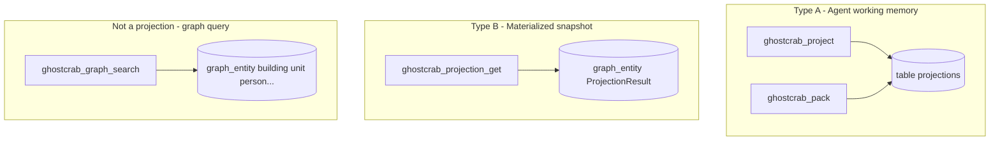

# 03 — Projections explained

> English version — version française : [`../03-projections-expliquees.md`](../03-projections-expliquees.md)

## Frequently asked question

> Is a projection a query on the graph using node or edge properties?

**No.** In GhostCrab, « projection » refers to **two distinct mechanisms**; neither is an ad hoc SQL/Cypher query on `graph_entity`.

To **query** the immeuble graph (search, traversal, metadata filters), use **graph** tools: `ghostcrab_graph_search`, `ghostcrab_traverse`, `ghostcrab_graph_path`, etc. See [Query layers](../../methodology/ghostcrab-query-layers.md).

### Why the lab does not use `ghostcrab_pack` for validation

The [universal methodology](../../methodology/universal_methodology.md) places projections **before** import (Phase 2 = read contract). The immeuble lab validates **structural reconstruction** via [`success-criteria.yaml`](../../../examples/immeuble/mcp-lab/success-criteria.yaml) and **graph** tools (`ghostcrab_graph_search`, `ghostcrab_graph_diagnostics`) — not via `ghostcrab_pack`. Type A projections ([`projections.seed.jsonl`](../../../examples/immeuble/reference/projections.seed.jsonl)) remain optional (phase 02-bis documented in §12 of the methodology).

---

## The two projection types



| | Working memory (Type A) | Materialized (Type B) | Graph query |
|--|-------------------------|----------------------|-------------|
| **Write tool** | `ghostcrab_project` | *(no MCP write)* | `ghostcrab_learn` |
| **Read tool** | `ghostcrab_pack` | `ghostcrab_projection_get` | `ghostcrab_graph_search`, `traverse`… |
| **Storage** | table `projections` | `graph_entity` type `ProjectionResult` | `graph_entity` + `graph_relation` |
| **Content** | Short FACT/GOAL/STEP/CONSTRAINT text | Snapshot + evidence + deltas | Domain entities (building, unit…) |
| **Immeuble** | [`projections.seed.jsonl`](../../../examples/immeuble/reference/projections.seed.jsonl) | **Absent** from bundle | 131 entities in reference |

---

## Type A — Working memory (`ghostcrab_project`)

### Nature

**Agent-scoped** working memory: current goals, active constraints, provisional facts for the session.

Implementation: [`src/tools/pragma/project.ts`](../../../src/tools/pragma/project.ts)

Types: `FACT | GOAL | STEP | CONSTRAINT`

Immeuble seed example ([`projections.seed.jsonl`](../../../examples/immeuble/reference/projections.seed.jsonl)):

```json
{
  "scope": "immeuble-demo",
  "proj_type": "FACT",
  "source_ref": "scenario:tilleuls-family-stack",
  "content": "Les Tilleuls A1 are occupied by the couple Henri and Madeleine Dupont..."
}
```

### Relation to the MCP process

- **Not** produced automatically by lab phases 2–5
- **Not** in `bundle.json` — optional sidecar file
- The agent may call `ghostcrab_project` **after** extraction to memorise a work summary (e.g. Dupont scenario, quotités constraint)

Manual loading: read each seed line and call `ghostcrab_project` with the same fields.

### Reading — `ghostcrab_pack`

Merges active projections + relevant FACTs into a compact `pack_text` for the agent.

[`ghostcrab_pack`](../../../src/tools/pragma/pack.ts) does **not** read `graph_entity` — only pragma + facets.

---

## Type B — Materialized projection (`ghostcrab_projection_get`)

### Nature

**Pre-computed analytical snapshot** stored as graph entities, identified by `projection_id` in `metadata_json`.

Implementation: [`src/tools/pragma/projection-get.ts`](../../../src/tools/pragma/projection-get.ts)

Returns a **bundle** composed of:

1. **`projection_results`** — `ProjectionResult` entities
2. **`linked_evidence`** — relations (e.g. `PROVEN_BY`) to evidence entities/chunks
3. **`deltas`** — `DeltaFinding` entities (metric gaps linked to the same `projection_id`)

This is **not** « SELECT * FROM graph_entity WHERE metadata.x = y » executed on the fly — it is an **imported or materialized artifact** from a downstream pipeline (SEO audit, import report, etc.).

### Example outside immeuble

SEO test ([`tests/tools/projection-get.test.ts`](../../../tests/tools/projection-get.test.ts)):

```json
{
  "entity_type": "ProjectionResult",
  "name": "keyword opportunity set",
  "metadata_json": "{\"projection_id\":\"proj_keyword_opportunities\"}"
}
```

With evidence:

```json
{
  "relation_type": "PROVEN_BY",
  "source_id": 10,
  "target_id": 11
}
```

And delta:

```json
{
  "entity_type": "DeltaFinding",
  "metadata_json": "{\"metric\":\"proj_keyword_opportunities\"}"
}
```

### Immeuble: absent from the reference

The golden bundle **does not contain** `ProjectionResult` entities. Calling:

```
ghostcrab_projection_get { projection_id: "scenario:tilleuls-family-stack" }
```

on `immeuble-demo` returns **empty** — that id exists in the Type A seed (`projections.seed.jsonl`), not as a Type B materialized projection.

[`scenarios.yaml`](../../../examples/immeuble/reference/scenarios.yaml) lists **competency questions** aligned by id `scenario:*` — these are neither Type A nor Type B projections.

---

## If you want to query the immeuble graph

Use the **graph layer**, not projections:

### Text search + filters

```
ghostcrab_graph_search {
  workspace_id: "immeuble-demo-llm",
  query: "Dupont",
  entity_types: ["person"],
  limit: 10
}
```

Exact metadata filter:

```
ghostcrab_graph_search {
  metadata_filters: { "building_id": "1" }
}
```

**Extended** tool — discover via `ghostcrab_tool_search`.

### Topological traversal

| Tool | Usage |
|------|-------|
| `ghostcrab_traverse` | Multi-hop walk from a node |
| `ghostcrab_graph_path` | Shortest path between two entities |
| `ghostcrab_graph_subgraph` | N-hop neighbourhood |

### Typed edge properties

Written via `ghostcrab_learn` → `relation_properties`:

- `value_type`: `text`, `number`, `money_minor`, `percentage_bp`, `date_unix`, `doc_ref`, `uri`
- Stored in `relation_properties_raw`, projected into `graph_relation_property`

Immeuble example: quote-part on `owns` relation (`relationProp` in the golden model).

These are **relation attributes**, queryable via `ghostcrab_graph_search(include_relations: true)` — not « projections » in the GhostCrab sense.

---

## Quick FAQ

### Does `projections.seed.jsonl` load the graph?

**No.** It is an optional seed for `ghostcrab_project` (Type A). The graph is built in phase 5 (`ghostcrab_learn` / extract).

### Is `scenarios.yaml` a projection?

**No.** Human competency questions to validate the domain. The ids `scenario:*` may feed the `source_ref` field of Type A projections.

### Are gap-rules projections?

**No.** Cardinality invariants on the instance graph. Tools: `ghostcrab_graph_gap_rules_import`, `ghostcrab_graph_diagnostics`.

### Does `ghostcrab_search` query the graph?

**No** — it searches the **facets** table (agent FACTs). For the graph: `ghostcrab_graph_search` or `ghostcrab_combined_search` (graph-first).

### How to compare MCP process vs reference?

1. Graph: entity/relation counts vs [`success-criteria.yaml`](../../../examples/immeuble/mcp-lab/success-criteria.yaml)
2. Diagnostics: L2 gap-rules on `immeuble-demo-llm`
3. Type A projections: optional, not in the bundle
4. Type B projections: not applicable to immeuble

---

## Decision guide (excerpt)

| Question | Tool |
|----------|------|
| Agent summary / current goal? | `ghostcrab_pack` / `ghostcrab_project` |
| Pre-imported analytical snapshot? | `ghostcrab_projection_get` |
| Find units or persons in the graph? | `ghostcrab_graph_search` |
| Traverse owns → occupies → leases? | `ghostcrab_traverse` |
| Verify « each unit has a cellar »? | `ghostcrab_graph_diagnostics` + gap-rules |

Full guide: [ghostcrab-query-layers.md](../../methodology/ghostcrab-query-layers.md)
