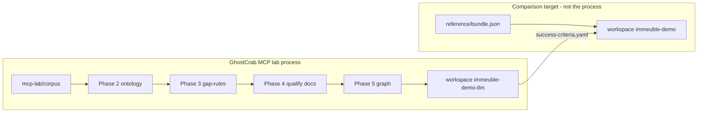

# GhostCrab MCP — pedagogical explanation

> English version — version française : [`../README.md`](../README.md)

Short synthesis: [GhostCrab MCP lab overview](../../explanation/en/README.md)

This section explains **the GhostCrab MCP process** on the immeuble syndic example: how an agent starts from raw documents, builds ontology, graph, and rules, then **compares the result** to the golden reference.

## Core idea

[`examples/immeuble/reference/bundle.json`](../../../examples/immeuble/reference/bundle.json) is **not** the process to reproduce — it is the **final comparison target**: a pre-computed snapshot (ontology + graph + qualified documents) in workspace `immeuble-demo`.

The **process** to understand is the **MCP lab**: raw corpus → qualification → graph extraction → gap-rules → validation against the reference.



## Where to start?

| Question | Document |
|----------|----------|
| What is `bundle.json` for and what does the MCP process produce? | [01 — Reference and comparison target](01-reference-to-graph.md) |
| How does MCP create ontology and gap-rules? | [02 — MCP, ontology and gap-rules](02-mcp-ontology-gap-rules.md) |
| What is a projection? A graph query? | [03 — Projections explained](03-projections-explained.md) |
| Lab structure and phases 00→06 | [MCP lab context](mcp-lab-context.md) |
| MCP vs CLI vs LLM, phase by phase | [How GhostCrab MCP achieves it](how-ghostcrab-mcp-achieves-it.md) |
| Agent playbook | [Reconstruction playbook](immeuble-mcp-reconstruction-playbook.md) |

## Three immeuble tracks

One narrative (fictional Belgian syndic), three uses. Detail: [`examples/immeuble/README.md`](../../../examples/immeuble/README.md).

| Track | Workspace | Role |
|-------|-----------|------|
| **Reference** | `immeuble-demo` | **Target** — load `bundle.json` to compare |
| **MCP lab** | `immeuble-demo-llm` | **Process** — rebuild from corpus via MCP |
| **Training** | `immeuble-training-*` | Gap-rules diagnostics curriculum (L0→L3) |

## MCP lab process (summary)

Ordered prompts: [`examples/immeuble/mcp-lab/prompts/`](../../../examples/immeuble/mcp-lab/prompts/)

| Phase | Writes? | Action |
|-------|---------|--------|
| 00–01 | No | Discovery + Model Proposal |
| 02 | Yes | Workspace + ontology (`gcp brain ontology compile` or `ghostcrab_schema_register`) |
| 03 | Yes | Gap-rules (`ghostcrab_graph_gap_rules_import`) |
| 04 | Yes | Ingest + qualify docs (`gcp brain document`) |
| 05 | Yes | Graph extraction (`ghostcrab_learn` / LLM extract) |
| 06 | No | Compare vs `success-criteria.yaml` and reference `immeuble-demo` |

Mock CI:

```bash
node scripts/import-immeuble-demo-llm.mjs --mode mock --reset
# → reports/immeuble-demo-llm/<timestamp>/report.md
```

## Who does what?

| Artifact | MCP / CLI process | Role of `bundle.json` |
|----------|-------------------|------------------------|
| Ontology | Phase 2 — compile LinkML or schema_register | Contains target `ontology_*` to reproduce |
| Qualified documents | Phase 4 — `gcp brain document` | Contains 7 qualified docs (reference) vs 8 corpus files (lab input) |
| Business graph | Phase 5 — `ghostcrab_learn` / extract | Contains 131 entities, 265 relations (thresholds in success-criteria) |
| Gap-rules | Phase 3 — separate JSON import | **Absent** from bundle — sidecar `gap-rules/*.json` |
| Projection seed | Optional — `ghostcrab_project` | **Absent** from bundle — sidecar `projections.seed.jsonl` |

**Key rule** ([`src/mcp/agent-brief.ts`](../../../src/mcp/agent-brief.ts)): MCP = ontology and **query** surface. High-throughput document ingestion goes through **CLI + native engine** (`gcp brain document`), not unitary MCP streaming.

## Related documentation

- [Universal GhostCrab methodology](../../methodology/universal_methodology.md) — §12 immeuble MCP lab example
- [GhostCrab query layers](../../methodology/ghostcrab-query-layers.md)
- [Document import runbook](../../setup/document-import.md)
- [MCP lab reconstruction playbook](./immeuble-mcp-reconstruction-playbook.md)
- [Immeuble example hub](../../../examples/immeuble/README.md)
