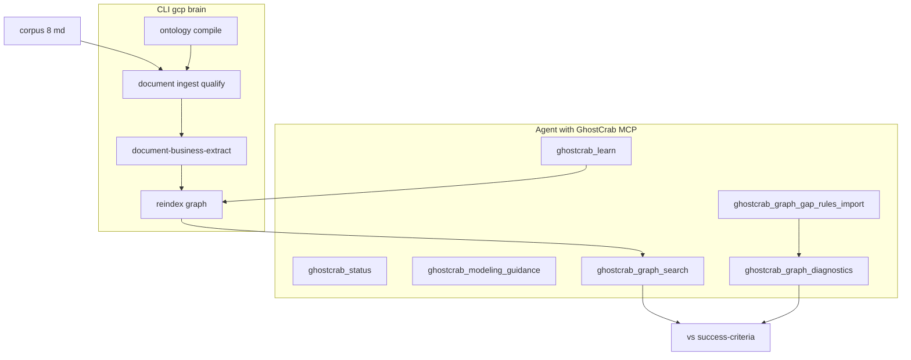

# How GhostCrab MCP achieves it

> English version — version française : [`../how-ghostcrab-mcp-achieves-it.md`](../how-ghostcrab-mcp-achieves-it.md)

How to reconstruct the syndic domain in `immeuble-demo-llm` and pass the thresholds in [`success-criteria.yaml`](../../../examples/immeuble/mcp-lab/success-criteria.yaml).

Lab context: [mcp-lab-context.md](mcp-lab-context.md)

## Principle: MCP + CLI + (optional) LLM

GhostCrab MCP **does not do everything alone**. The lab rests on three layers:

| Layer | Role in the lab |
|-------|-----------------|
| **MCP agent** | Reasons, models, writes the graph incrementally, validates |
| **CLI `gcp brain …`** | Doc ingestion/qualification, compile ontology, reindex (high throughput) |
| **Native engine + LLM** | Doc profile, facet qualification, batch graph extraction (`document-business-extract`) |

Product rule ([`src/mcp/agent-brief.ts`](../../../src/mcp/agent-brief.ts)): MCP = ontology and query surface; document ingestion goes through CLI, not MCP streaming.



---

## Phase by phase: who does what

### Phases 0–1 — Understand before writing (pure MCP)

The agent reads `corpus/*.md` + checklists, calls:

- `ghostcrab_status` — routing, workspace, backend health
- `ghostcrab_modeling_guidance` — activity families, suggested steps
- `ghostcrab_tool_search` — discover extended tools (graph, workspace, gap-rules…)

**Deliverable**: Model Proposal (entity types, edges, facets) validated by a human.  
Without it, no writes (ONBOARDING_CONTRACT §9).

Prompts: [`00-prerequisites.md`](../../../examples/immeuble/mcp-lab/prompts/00-prerequisites.md), [`01-discovery-and-model-proposal.md`](../../../examples/immeuble/mcp-lab/prompts/01-discovery-and-model-proposal.md)

### Phase 2 — Ontology (MCP + CLI)

| Action | Tool |
|--------|------|
| Create workspace | `ghostcrab_workspace_create` + `ghostcrab_workspace_use` |
| Register taxonomy | **CLI** `gcp brain ontology compile` on [`ontologies/immeuble-demo/core.yaml`](../../../ontologies/immeuble-demo/core.yaml) |
| Lightweight alternative | `ghostcrab_schema_register` |
| Verify | `ghostcrab_schema_inspect`, `ghostcrab_coverage` |

```bash
gcp brain ontology compile \
  --workspace-id immeuble-demo-llm \
  --ontology-id immeuble-demo::core \
  --input ontologies/immeuble-demo/core.yaml \
  --import-db --force
```

The ontology provides the **controlled vocabulary** to qualify docs and name graph entities/edges.

Prompt: [`02-ontology-register.md`](../../../examples/immeuble/mcp-lab/prompts/02-ontology-register.md)

### Phase 3 — Gap-rules (MCP extended)

Before the complete graph, the agent imports closed-world invariants:

```
ghostcrab_graph_gap_rules_import   ← JSON from training/reference
ghostcrab_graph_gap_rules          ← list
ghostcrab_graph_diagnostics        ← detect gaps after extraction
```

Example rules: « each `unit` must have exactly 1 `assigned_cellar` », « unit occupied by tenant → active lease ».

Reference files:

- [`reference/gap-rules/demo.json`](../../../examples/immeuble/reference/gap-rules/demo.json)
- [`training/gap-rules/L2-syndic-filtered.json`](../../../examples/immeuble/training/gap-rules/L2-syndic-filtered.json)

MCP implementation: [`src/tools/dgraph/diagnostics.ts`](../../../src/tools/dgraph/diagnostics.ts)

Prompt: [`03-gap-rules-design.md`](../../../examples/immeuble/mcp-lab/prompts/03-gap-rules-design.md)

### Phase 4 — Qualified documents (CLI, guided by MCP)

MCP **orchestrates**, **CLI** executes:

```bash
export GHOSTCRAB_SQLITE_PATH="$PWD/data/immeuble-demo-llm.sqlite"

gcp brain document collection-create \
  --workspace-id immeuble-demo-llm \
  --collection-id immeuble-demo-llm::docs \
  --language fr

gcp brain document ontology-attach \
  --workspace-id immeuble-demo-llm \
  --collection-id immeuble-demo-llm::docs \
  --ontology-id immeuble-demo::core --role primary

gcp brain document document-ingest \
  --workspace-id immeuble-demo-llm \
  --collection-id immeuble-demo-llm::docs \
  --doc-id 1 \
  --content-file examples/immeuble/mcp-lab/corpus/statuts-tilleuls.md \
  --language fr --strategy paragraph

gcp brain document document-profile-worker --limit 8

gcp brain document document-qualify \
  --workspace-id immeuble-demo-llm \
  --collection-id immeuble-demo-llm::docs \
  --taxonomies immeuble-demo::core \
  --facets domain.building,domain.unit,domain.role,domain.scenario,domain.decision,finance.payment_status,source.document_type
```

Result in SQLite: `documents_raw`, `chunks_raw`, `facet_assignments_raw`.

Runbook: [`docs/setup/document-import.md`](../../setup/document-import.md)

Prompt: [`04-document-ingest.md`](../../../examples/immeuble/mcp-lab/prompts/04-document-ingest.md)

### Phase 5 — Business graph (core of the lab)

Two paths to reach ~131 entities / ~265 relations:

#### Path A — Incremental agent (MCP)

The agent reads qualified docs and writes via [`ghostcrab_learn`](../../../src/tools/dgraph/learn.ts):

```
ghostcrab_learn {
  nodes: [
    { id: "tilleuls", node_type: "building", label: "Résidence Les Tilleuls" }
  ],
  edges: [
    { source: "tilleuls", target: "block-a", label: "contains" }
  ],
  relation_properties: [
    { property_key: "quota_bp", value_type: "percentage_bp", value_number: 200 }
  ]
}
```

Then reindex:

```
ghostcrab_graph_reindex   (extended — ghostcrab_tool_search)
```

`ghostcrab_remember` = text notes (agent FACTs in `facets` table) — **not** the structured graph.

#### Path B — Batch LLM extraction (CLI live)

```bash
gcp brain document document-business-extract \
  --workspace-id immeuble-demo-llm \
  --collection-id immeuble-demo-llm::docs \
  --ontology-id immeuble-demo::core \
  --expected-coverage-json examples/immeuble/mcp-lab/corpus/expected-coverage.json \
  --limit 8
```

The native engine produces `entities_raw`, `relations_raw`, evidence links → reindex.

Automated by: [`scripts/import-immeuble-demo-llm.mjs`](../../../scripts/import-immeuble-demo-llm.mjs) in `--mode live`.

Prompt: [`05-graph-extraction.md`](../../../examples/immeuble/mcp-lab/prompts/05-graph-extraction.md)

### Phase 6 — Validate and compare (MCP read)

| Check | Tool |
|-------|------|
| Entity / relation counts | Script report or SQL |
| Search « appartement » ≥ 13 | `ghostcrab_graph_search` |
| Dupont family | `ghostcrab_combined_search` |
| Quotités = 1000 | traverse + metadata or report |
| Business invariants | `ghostcrab_graph_diagnostics` + L2 pack |

Golden reference loaded **separately** in `immeuble-demo` — never copied into the LLM workspace during the process.

```bash
# Load comparison target (once, separate workspace)
export GHOSTCRAB_SQLITE_PATH="$PWD/data/immeuble-demo.sqlite"
gcp load examples/immeuble/reference/bundle.json \
  --workspace immeuble-demo --reindex all
```

Prompt: [`06-validate-and-compare.md`](../../../examples/immeuble/mcp-lab/prompts/06-validate-and-compare.md)

---

## Feedback loops

The agent knows it is progressing via:

1. **Read-only checklists** — ontology-checklist, gap-rules-checklist
2. **`success-criteria.yaml`** — numeric thresholds
3. **Gap diagnostics** — `missing_required_relations → 0` when the graph is complete

```bash
# Mock CI — validates the pipeline (compare in-memory vs golden target)
node scripts/import-immeuble-demo-llm.mjs --mode mock --reset
# → reports/immeuble-demo-llm/<timestamp>/report.md
```

The mock **does not automatically persist** the extracted graph in `immeuble-demo-llm`. To query the lab workspace via MCP after a mock run, manually load a partial bundle or rerun in `--mode live`.

---

## What makes the exercise feasible

### Favourable factors

- LinkML ontology **already defined** ([`core.yaml`](../../../ontologies/immeuble-demo/core.yaml))
- Corpus **aligned** with the golden narrative (same buildings, characters, scenarios)
- **Deterministic** post-extraction tools: search, traverse, diagnostics
- Gap-rules = **machine checklist** of typical omissions

### Real limits

| Limit | Consequence |
|-------|-------------|
| Ingest/qualify = CLI | Agent must run `gcp brain document`, not MCP alone |
| Graph/gap tools = extended | Discovery via `ghostcrab_tool_search` |
| Manual extraction via `learn` | 131 entities one by one = long; LLM extract more realistic |
| Mock CI mode | Remaps golden in-memory — validates the **pipeline**, does not persist the lab graph |
| Embeddings often off | BM25/text search, not vector semantic search |

---

## Summary in one sentence

GhostCrab MCP achieves it by **chaining**: validated model → ontology → gap-rules (safety net) → qualified docs (CLI) → graph (`learn` or LLM extract) → reindex → **MCP read/diagnostics** compared to the golden reference.

The MCP agent is the **conductor**; MindBrain CLI + native engine handle bulk volume; MCP tools guarantee structure, query, and validation.

---

## See also

- [Projections explained](./03-projections-explained.md) — what a projection is (and is not)
- [MCP, ontology, and gap-rules](./02-mcp-ontology-gap-rules.md) — detail by artifact
- [GhostCrab query layers](../../methodology/ghostcrab-query-layers.md) — facets vs graph vs projections
- [Universal methodology §12](../../methodology/universal_methodology.md) — lab ↔ 4 phases crosswalk
