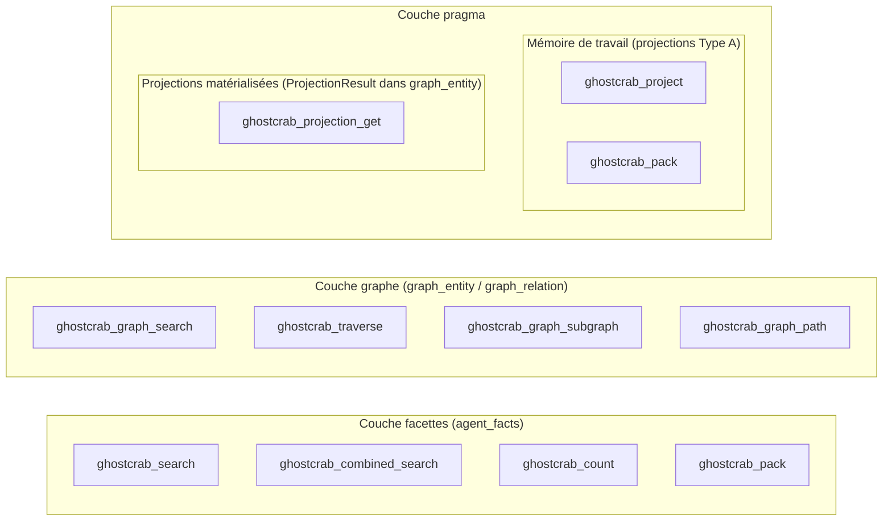

# Couches de requête GhostCrab

> Version française — version anglaise : [`../ghostcrab-query-layers.md`](../ghostcrab-query-layers.md)

GhostCrab stocke les données dans trois couches distinctes. Chacune dispose d'outils dédiés. Les confondre est la cause la plus fréquente de résultats vides.

> **Tranche LinkML :** [`ghostcrab-docs::query-layers`](../../explanation/ontology/diagrams/query-layers.md)

## Vue d'ensemble



---

## Couche 1 — Facettes

**Stockage :** `agent_facts` (SQLite Personal). Glossaire : [glossary.md](../explanation/glossary.md).

Enregistrements de domaine structurés, écrits via `ghostcrab_remember` / `ghostcrab_upsert`. Chaque ligne possède un `schema_id`, un `content` en texte libre et un sac JSON `facets`.

| Outil | Rôle |
|------|---------|
| `ghostcrab_search` | Récupération classée — mot-clé (`hybrid` / `bm25` / `semantic`) + filtres exacts sur les facettes |
| `ghostcrab_combined_search` | Récupération inter-couches, graphe d'abord — entités graphe + faits facettes liés, avec repli sur les facettes |
| `ghostcrab_count` | Caractériser l'espace avant de chercher — décomptes agrégés par facette |
| `ghostcrab_pack` | Paquet de contexte compact — principaux faits correspondants + projections pragma actives |

**Contrainte clé :** `ghostcrab_search` exclut explicitement `graph_entity`, `graph_relation` et `projection_result`. Un résultat à zéro ici ne signifie **pas** que le domaine est vide — cela signifie que la table des facettes n'a pas de correspondance.

Lorsque `ghostcrab_search` ne renvoie aucun résultat, il suggère `ghostcrab_graph_search` et `ghostcrab_projection_get` comme étapes suivantes.

### Recherche inter-couches

Utiliser `ghostcrab_combined_search` lorsque l'appelant ne sait pas si la réponse
se trouve dans les entités/relations du graphe ou dans les faits facettes.

`ghostcrab_combined_search` est graphe d'abord :

1. rechercher dans `graph_entity` avec `entity_types`, `collection_id` et
   `metadata_filters` optionnels ;
2. inclure éventuellement les relations adjacentes ;
3. récupérer les faits liés via `graph_entity_document` où
   `table_id = FACETS_SEARCH_TABLE_ID` ;
4. si aucune entité graphe ni fait lié n'est trouvé, revenir à
   `ghostcrab_search` avec `facet_schema_id`, `facet_filters` et
   `facet_mode`.

`ghostcrab_csearch` est un alias strict de `ghostcrab_combined_search`. Le
nom canonique est listé par défaut ; l'alias est découvrable via
`ghostcrab_tool_search`.

---

## Couche 2 — Graphe

**Stockage :** `graph_entity` + `graph_relation` + `graph_relation_property` (+ `graph_entity_chunk` pour l'ancrage)

Données structurelles importées ou dérivées : nœuds d'ontologie, entités de graphe de connaissances, liens de provenance.

| Outil | Rôle |
|------|---------|
| `ghostcrab_graph_search` | Trouver des entités par texte, `entity_type`, `collection_id`, `metadata_filters` |
| `ghostcrab_traverse` | Parcours dirigé multi-sauts depuis un nœud de départ — renvoie des chemins avec `node_id`, `edge_label`, `depth` |
| `ghostcrab_graph_subgraph` | Expansion de voisinage à N sauts depuis des IDs d'entités graines |
| `ghostcrab_graph_path` | Plus court chemin entre deux IDs d'entités |
| `ghostcrab_entity_chunks` | Contenu brut de chunk / document lié à une entité graphe |

Les outils graphe sont marqués comme étendus, mais ils sont listés dans
`tools/list` et directement appelables. Parcourir le catalogue runtime complet
avec `gcp tools list`, ou demander le sous-ensemble graphe à l'outil de
découverte MCP :

```
ghostcrab_tool_search { visibility: ["extended"], subsystem: ["graph"] }
```

`ghostcrab_graph_search` exclut explicitement `facets`, `projections` et `memory_projections`.

### Attributs d'arêtes

Les arêtes portent deux types d'attributs, tous deux écrits via `ghostcrab_learn` :

**Métadonnées non typées** — `edge.properties` (valeurs JSON quelconques, stockées dans `graph_relation.metadata_json`)

```json
{ "source": "task:auth", "target": "task:deploy", "label": "BLOCKS",
  "properties": { "reason": "needs login cert", "since": "2026-05" } }
```

**Propriétés typées** — `edge.relation_properties` (stockées de façon canonique dans `relation_properties_raw`, projetées dans `graph_relation_property` indexé)

```json
{ "source": "task:auth", "target": "task:deploy", "label": "BLOCKS",
  "relation_properties": [
    { "property_key": "delay_days", "value_type": "number",      "value_number": 5 },
    { "property_key": "cost_eur",   "value_type": "money_minor", "value_integer": 4999, "currency": "EUR" },
    { "property_key": "source_url", "value_type": "uri",         "value_text": "https://jira.example/TASK-42" }
  ] }
```

| `value_type` | Colonne requise | Notes |
|---|---|---|
| `text`, `uri` | `value_text` | |
| `number`, `percentage_bp` | `value_number` | `percentage_bp` = points de base |
| `date_unix`, `money_minor` | `value_integer` | `money_minor` requiert `currency` |
| `doc_ref` | `ref_doc_id` | FK vers `doc_id` |

Les deux types d'attributs sont renvoyés par `ghostcrab_graph_search(include_relations: true)` — sous forme de `metadata` (non typé) et `relation_properties` (tableau typé) sur chaque objet relation. Les événements d'arêtes de `ghostcrab_graph_subgraph` portent nativement les propriétés typées depuis le backend MindBrain.

`relation_properties_raw` est la source de vérité durable. `graph_relation_property` est une projection/cache rafraîchie par `ghostcrab_learn` pour les lectures immédiates et reconstruite par `ghostcrab_graph_reindex` à partir des lignes brutes.

Utiliser `properties` pour un contexte lisible et souple. Utiliser `relation_properties` pour les valeurs à filtrer, indexer ou agréger.

---

## Couche 3 — Pragma / Projections

« Projection » désigne deux choses différentes dans GhostCrab. Elles vivent dans des stockages distincts et sont accessibles via des outils différents.

### A. Projections de mémoire de travail

**Stockage :** table `projections` (Type A)

Contexte agent éphémère : objectifs, étapes, contraintes, faits pour la tâche en cours.

| Outil | Rôle |
|------|---------|
| `ghostcrab_project` | **Écrire/modéliser** — créer ou rafraîchir une projection provisoire (`GOAL`, `STEP`, `FACT`, `CONSTRAINT`) |
| `ghostcrab_pack` | **Lire** — projections actives + bloquantes pour `agent_id` / `scope`, plus les principaux faits facettes |

`ghostcrab_pack` fait le pont entre la couche 1 et la couche 3A : il renvoie les projections pragma **et** jusqu'à 5 correspondances facettes via recherche hybride. Il n'interroge pas `graph_entity`.

### B. Projections graphe matérialisées

**Stockage :** `graph_entity` où `entity_type = ProjectionResult` (couche graphe étendue)

Instantanés analytiques précalculés, produits par des pipelines d'ingestion ou des recettes (p. ex. audits SEO, instantanés de pipeline). Chacun est identifié par un `projection_id` dans `metadata_json`.

| Outil | Rôle |
|------|---------|
| `ghostcrab_projection_get` | Récupérer un paquet de projection complet : `ProjectionResult` + relations de preuve liées + deltas `DeltaFinding` |

`ghostcrab_projection_get` est un **outil étendu** — le découvrir via `ghostcrab_tool_search`.

---

## Guide de décision

| Question | Outil |
|----------|------|
| Trouver des faits de domaine stockés par texte ou valeurs de facettes ? | `ghostcrab_search` |
| Chercher quand la couche de stockage est inconnue ? | `ghostcrab_combined_search` |
| Compter les faits par facette avant de chercher ? | `ghostcrab_count` |
| Contexte agent compact (objectifs actifs + faits pertinents) ? | `ghostcrab_pack` |
| Trouver des entités graphe par type, nom ou métadonnées ? | `ghostcrab_graph_search` |
| Parcourir dépendances, bloqueurs ou relations dans le graphe ? | `ghostcrab_traverse` |
| Développer un voisinage local dans le graphe ? | `ghostcrab_graph_subgraph` |
| Plus court chemin entre deux entités graphe ? | `ghostcrab_graph_path` |
| Récupérer un instantané analytique précalculé ? | `ghostcrab_projection_get` |
| Créer ou mettre à jour la mémoire de travail agent ? | `ghostcrab_project` |
| Découvrir des outils graphe / projection absents de la liste par défaut ? | `ghostcrab_tool_search { visibility: ["extended"] }` |

---

## Erreurs courantes

- **`ghostcrab_search` ne renvoie rien → supposer que le domaine est vide.** Faux : les couches graphe et projection sont distinctes. Escalader vers `ghostcrab_graph_search` ou `ghostcrab_projection_get`.
- **Supposer qu'un outil est absent.** `tools/list` renvoie le catalogue complet et un sous-ensemble est marqué comme recommandé par défaut. Utiliser `ghostcrab_tool_search` ou `gcp tools list` pour filtrer par domaine ou accès.
- **Confondre recommandé et étendu.** Les outils étendus sont listés et appelables ; le `title` ne marque que le sous-ensemble recommandé.
- **Confondre les deux concepts de « projection ».** Type A (`projections`) ≠ Type B (`ProjectionResult` dans `graph_entity`). Voir [05-projections](../explanation/05-projections-expliquees.md).
- **S'attendre à ce que `ghostcrab_pack` inclue des données graphe.** Ce n'est pas le cas. Pack = projections pragma + faits facettes uniquement.
- **Utiliser `ghostcrab_search` comme attrape-tout.** Utiliser `ghostcrab_combined_search` lorsque graphe et facettes doivent tous deux être pris en compte.
- **Omettre le réindexage après import collection/graphe.** Les chargements de bundle de sauvegarde utilisent par défaut `--reindex graph`, donc les tables dérivées `graph_*` sont remplies automatiquement. Utiliser `--reindex none` uniquement pour des imports bruts ou des benchmarks ; utiliser `--reindex all` lorsque les postings BM25 et facettes de collection sont aussi requis.
- **Confondre les `facets` agent avec les `facet_assignments_raw` de collection.** `ghostcrab_remember` écrit des faits agent ; l'import collection écrit `facet_assignments_raw`. Après réindexage, les lectures de facettes collection utilisent les `facet_postings` Roaring via `ghostcrab_collection_facet_search` (passer `namespace`, `dimension` et `table_id` optionnel) ; le repli SQL brut s'applique lorsque les postings sont absents ou que namespace/dimension sont omis.
- **`ghostcrab_learn` vs chemin d'import.** Learn écrit graphe runtime + miroir brut ; l'import n'écrit que le brut. Les deux convergent après réindexage, mais learn requiert un contexte workspace correspondant.
- **Périmètre workspace de `ghostcrab_traverse`.** Passer `workspace_id` (défaut : session). La recherche graphe et traverse filtrent toutes deux par colonne workspace.
- **`document_table_id` pour les liens entité→fait.** Requis sur `ghostcrab_graph_reindex` lors de l'utilisation de `entity_documents_raw` pour que `ghostcrab_combined_search` puisse renvoyer `linked_facts`.

---

## Chemin de validation MCP lab immeuble

Le parcours [`examples/immeuble/mcp-lab/`](../../../examples/immeuble/mcp-lab/) valide la reconstruction de domaine en utilisant **les outils de la couche graphe**, et non les projections de mémoire de travail :

| Contrôle de validation | Outil | Couche |
|------------------------|-------|--------|
| Trouver unités, personnes, baux | `ghostcrab_graph_search` | Graphe |
| Parcourir propriété / occupation | `ghostcrab_traverse` | Graphe |
| Invariants monde fermé | `ghostcrab_graph_diagnostics` + gap-rules | Graphe |
| Décomptes entités/relations | SQL ou script de comparaison | Graphe brut |

Le lab n'utilise **pas** `ghostcrab_pack` ni `ghostcrab_projection_get` pour le succès/échec — le bundle golden n'a pas d'entités `ProjectionResult`. Les graines optionnelles d'artefacts de réponse se trouvent dans [`answer-artifacts.seed.jsonl`](../../../examples/immeuble/reference/answer-artifacts.seed.jsonl) et exposent `analysis_plan` + `live_answer_view`.

Détail : [`docs/explanation/05-projections-expliquees.md`](../../explanation/05-projections-expliquees.md) · [`universal_methodology.md`](universal_methodology.md) §12.

---

## Voir aussi

- [`ghostcrab-skills/shared/QUERY_PATTERNS.md`](../../../ghostcrab-skills/shared/QUERY_PATTERNS.md) — échelle d'escalade et habitudes de récupération
- [`vendor/mindbrain/docs/facets.md`](../../../vendor/mindbrain/docs/facets.md) — internals de la couche facettes
- [`vendor/mindbrain/docs/projections.md`](../../../vendor/mindbrain/docs/projections.md) — internals des projections
- [`vendor/mindbrain/docs/graph.md`](../../../vendor/mindbrain/docs/graph.md) — internals de la couche graphe et schéma `graph_relation_property`
- [`docs/plan/2026-05-19-mindbrain-v1.4.2-edge-properties.md`](../../../docs/plan/2026-05-19-mindbrain-v1.4.2-edge-properties.md) — notes d'implémentation pour les propriétés d'arêtes typées
- [`docs/explanation/05-projections-expliquees.md`](../../explanation/05-projections-expliquees.md) — projections Type A/B vs requêtes graphe
- [`docs/methodology/universal_methodology.md`](universal_methodology.md) §12 — table de correspondance lab MCP immeuble
