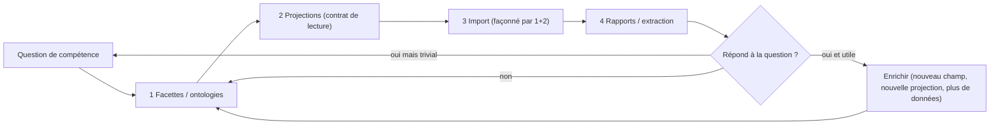

# Méthodologie universelle GhostCrab

> Version française — version anglaise : [`../universal_methodology.md`](../universal_methodology.md)

Méthodologie itérative en 4 phases pour amener n'importe quel domaine — une interface SaaS, un corpus documentaire, un pipeline CRM, un jeu de données de conformité — d'une Proposition de modèle confirmée jusqu'à des rapports exploitables par les agents, en utilisant les primitives GhostCrab de bout en bout.

Ce document est **destiné aux agents**. Il suppose que vous connaissez déjà les outils GhostCrab de base. Si vous cherchez la théorie ontologique sous-jacente ou un exemple narratif complet, consultez :

- [ontology_dev_for_llm.md](../ontology_dev_for_llm.md) — théorie générale du génie ontologique (questions de compétence, test « est-un », checklist qualité). Version française : [fr/ontology_dev_for_llm.md](ontology_dev_for_llm.md).
- [ontology_story2doc_example.md](../ontology_story2doc_example.md) — exemple d'application SaaS annoté couvrant le cycle de vie complet en un cas concret.

Cette méthodologie est le pont entre les deux : la théorie en amont, le moteur d'exécution GhostCrab en aval, une boucle itérative au centre.

**Vocabulaire Personal :** [glossary.md](../explanation/glossary.md). **Gates import :** StarterKit `SOP5` (§1 bis `gcp brain structured-import`) + [structured-import](../setup/structured-import.md). **Ontologies LinkML :** [ontology/README.md](../explanation/ontology/README.md).

> **Modèle LinkML de cette section :** tranche [`ghostcrab-docs::methodology-loop`](../explanation/ontology/diagrams/methodology-loop.md) (graphe de classes MECE + [validation MECE](../explanation/ontology/mece-validation.md)).

## 1. Objectif et périmètre

### Ce qu'est ce document

Une boucle répétable et agnostique au domaine pour un agent qui a reçu la mission de modéliser un domaine dans GhostCrab. La boucle couvre quatre phases :

1. **Facettes / ontologies** — concevoir la forme durable minimale.
2. **Projections** — concevoir le contrat de lecture orienté agent.
3. **Import** — ingérer le minimum de données qui exerce les phases 1 et 2.
4. **Rapports / extraction** — exécuter les projections et valider par rapport aux questions de compétence originales.

### Ce que ce document n'est pas

- Pas un remplacement du [`ONBOARDING_CONTRACT.md`](../../../ghostcrab-skills/shared/ONBOARDING_CONTRACT.md).
  Cette méthodologie **commence à la Phase D (Exécution)** du contrat. Elle suppose que la prise en charge, la clarification et une Proposition de modèle confirmée par l'utilisateur ont déjà eu lieu.
- Pas un catalogue de domaines. Elle utilise deux mini-exemples récurrents (une interface SaaS et un corpus documentaire) uniquement pour rendre chaque étape concrète.
- Pas un manuel d'outillage. Pour les flags et cas particuliers, consulter les références en fin de document.

### Checklist des prérequis (ne pas sauter)

Avant d'entrer dans la Phase 1 ci-dessous, toutes les conditions suivantes doivent être vraies :

- Une Proposition de modèle a été présentée à l'utilisateur (conformément à ONBOARDING_CONTRACT §9.1, Phase C).
- L'utilisateur a envoyé une confirmation explicite dans le même fil (conformément aux HARD GATES).
- Vous pouvez citer cette confirmation mot pour mot pour l'auto-audit en fin de tour.
- Vous savez à quel espace de travail (workspace) ce travail appartient (existant ou à créer).
- Vous avez au moins une **question de compétence** que l'utilisateur veut voir répondue.

Si l'une de ces conditions manque, vous êtes encore en Phase A/B/C du contrat. Stop — retourner à la prise en charge.

### Comment éliciter les questions de compétence — l'approche narrative

Demander « quelles questions voulez-vous voir répondues ? » est trop abstrait. La méthode des ateliers live (voir §12 exemple MCP lab immeuble et l'approche narrative ci-dessous) est plus fiable : proposer un scénario concret de 90 secondes ancré dans un événement routinier du domaine, puis demander à l'équipe de narrer ce qui se passe.

**Exemple (gestion immobilière / syndic) :**

> *« C'est le 5 du mois. Marie, la comptable, ouvre le relevé bancaire du matin. Elle voit un virement de 1 847 € libellé 'CP LOT 12 CHGE JANV'. Elle doit déterminer qui a payé, pour quel immeuble, si le paiement est complet ou partiel, et s'il faut émettre une quittance ou envoyer une relance. »*

En 90 secondes, ce scénario produit le vocabulaire central en cinq catégories naturelles — les **5 actes** des ateliers live :

| Acte | Question du facilitateur | Produit | Correspond dans GhostCrab |
|---|---|---|---|
| **Noms** | « De quoi parle-t-on dans ce domaine ? » | `Copropriétaire`, `ÉcritureBancaire`, `Appel de charges`, `Lot` | Schémas de facettes / types d'enregistrements |
| **Verbes** | « Qu'est-ce qui se passe entre les choses ? » | `rapprocher`, `imputer`, `lettrer`, `ventiler` | Arêtes de graphe / `ghostcrab_learn` |
| **Qualificatifs** | « Comment décrit-on son état ? » | `statut_paiement`, `communication_structurée` | Champs de facette (dimensions) |
| **Conditions** | « Quand est-ce que ça change ? » | *si montant = appel → Quittance ; si partiel → Relance niveau 1* | Projections CONSTRAINT / transitions d'état |
| **Modes de recherche** | « Comment le retrouvera-t-on dans 6 mois ? » | *par immeuble, par mois, par statut, par tranche de montant* | Définitions d'index de facettes |

La question « modes de recherche » est la plus productive et la moins spontanée. Personne ne la pose sans y être invité. Elle détermine directement quelles facettes valent la peine d'être indexées — et donc quelles projections seront interrogeables à l'échelle.

Pour un agent en Phase B (Clarification), utiliser cette technique : proposer un scénario du domaine de l'utilisateur, le laisser le corriger, puis dériver le vocabulaire en 5 catégories. Les questions de compétence émergent de la rangée « modes de recherche ».

## 2. Les quatre phases en une boucle

Les quatre phases forment une boucle fermée, pas un pipeline linéaire. Chaque passage accomplit une **tranche fine** : un schéma de facette, une projection, une ingestion, un rapport. Les passages suivants enrichissent le modèle.



### Principe clé : concevoir le contrat de lecture avant l'ingestion

Le doc 2 (`ontology_story2doc_example.md`) a été construit dans l'ordre naturel de découverte : ontologie → graphe → projection → artefact. Cet ordre convient à un récit a posteriori ; c'est un piège lorsqu'on fait le travail, car il permet de passer des jours à ingérer des données qu'on ne lira jamais.

Cette méthodologie inverse l'ordre : **les projections sont conçues avant l'import**. La projection est le contrat opérationnel. L'ingestion est ensuite façonnée par ce que la projection doit lire, pas par ce que la source expose. Cela correspond à la discipline dans [`vendor/mindbrain/docs/projections.md`](../../../vendor/mindbrain/docs/projections.md) §« Source of Truth vs. Projection » : les projections sont *dérivées* de l'état des facettes et du graphe — il faut donc connaître la dérivation avant d'ingérer.

### Principe clé : tranches fines, pas de modélisation en une seule fois

Le doc 1 (`ontology_dev_for_llm.md`) §1 le dit déjà : « Le développement d'ontologies est itératif. » Cette méthodologie l'opérationnalise : un passage = un champ de facette, une projection, un enregistrement, un rapport. Le premier passage doit être suffisamment petit pour compléter les quatre phases en une seule session de travail.

## 3. Dictionnaire des primitives GhostCrab

Le vocabulaire ontologique générique du doc 1 ne correspond pas terme à terme aux concepts du moteur d'exécution GhostCrab. Utiliser ce tableau chaque fois que vous traduisez une Proposition de modèle en appels d'outils réels.

| Terme ontologique générique | Primitive GhostCrab | Où elle vit | Outil d'écriture |
|---|---|---|---|
| Classe / type d'entité | **Schéma de facette / type d'enregistrement** | Registre de schémas | `ghostcrab_schema_register` (nécessite `APPROVE_SCHEMA_FREEZE`) |
| Propriété / attribut | **Champ de facette** (plain, array, bucket, joined, function-backed, boolean, rating, date-truncation — voir [`facets.md`](../../../vendor/mindbrain/docs/facets.md)) | Définitions de facettes | Idem schéma |
| Instance / individu | **Enregistrement** (une ligne portant des valeurs de facette) | `documents_raw`, `chunks_raw`, `facet_assignments_raw`, ou primitives canoniques | `ghostcrab_upsert`, `ghostcrab_remember`, `gcp brain document document-ingest` |
| Relation | **Arête de graphe typée** | Couche graphe | `ghostcrab_learn` |
| Requête / vue | **Projection** (`proj_type` ∈ `FACT \| GOAL \| STEP \| CONSTRAINT`) | Table des projections | `ghostcrab_project` |
| Contrainte / axiome | **Recette** + validation de schéma + projection avec `status: blocking` | Recettes + schéma + projections | `ghostcrab_schema_register` pour la forme, `ghostcrab_project` pour l'exécution |
| Question de validation | **Question de compétence exécutée comme lecture de projection** | Projections + `ghostcrab_search` / `ghostcrab_pack` | n/a (lecture) |
| Vocabulaire réutilisable | **Primitives canoniques** (`ghostcrab:task`, `ghostcrab:note`, le namespace `source.*` auto-extrait, etc.) | Intégrées à chaque workspace | Préférer aux schémas personnalisés |

Règle empirique : **toujours chercher une primitive canonique d'abord** (conformément à ONBOARDING_CONTRACT §11). Les schémas personnalisés sont le dernier recours, pas le premier.

Le **vocabulaire des 5 actes** de l'approche narrative des ateliers live se mappe directement sur ce tableau. L'utiliser pour traduire un récit de domaine en termes GhostCrab sans demander à l'utilisateur de connaître les primitives.

## 4. Phase 1 — Facettes (Tranche fine)

### Objectif

Définir la forme durable minimale qui peut porter les données requises par la question de compétence. Rien de plus.

### Conscience multi-ontologies

Avant de concevoir votre premier schéma de facette, répondre à : **ce domaine est-il autonome, ou est-il un processus qui consomme d'autres ontologies ?**

Un **domaine autonome** (corpus documentaire, liste de contacts, gestionnaire de tâches) peut être modélisé de manière isolée. Un **domaine de processus** (déclaration de sinistre, exécution de commande, audit réglementaire) est typiquement un *consommateur* qui traverse plusieurs ontologies périphériques, chacune modélisant une couche stable du monde métier.

L'exemple sinistre dans la gestion immobilière (voir §12 MCP lab immeuble et [`examples/immeuble/reference/scenarios.yaml`](../../../examples/immeuble/reference/scenarios.yaml)) montre une stratification canonique :

| Couche | Exemples dans le domaine syndic | Règle de modélisation |
|---|---|---|
| Physique / structurelle | Immeuble, étages, lots, parties communes | Espace de noms séparé ; ancre de tous les processus |
| Acteurs et rôles | Personnes + pattern Role Object (une personne, plusieurs rôles) | Espace de noms séparé ; réutilisé dans tous les processus |
| Contrats / juridique | `Contrat` générique + spécialisations (`PoliceAssurance`, `ContratSyndic`) | Schéma parent abstrait + schémas enfants |
| Processus / événements | Machine à états générique + journal d'événements | Template unique, instancier par cas |
| Financière | Budgets, charges, paiements, écritures bancaires | Espace de noms séparé ; joint par projection |
| Réglementaire | Obligations, échéances de conformité, types de diagnostics | Espace de noms séparé ; arêtes `SOUMIS_A` |

Chaque couche est un graphe nommé séparé. Les jointures inter-graphes se font au **moment de la projection** — pas dans la couche des facettes. Une projection peut traverser `onto_processus` + `onto_batiment` + `onto_contrat` sans fusionner les schémas sous-jacents.

**Ne pas modéliser toutes les couches en un seul passage.** Modéliser l'entité d'ancrage du processus d'abord (Vague 1), puis étendre à une couche périphérique par passage de boucle.

Si le domaine est autonome, ignorer cette section.

### Protocole lecture-avant-écriture

Avant d'ébaucher un nouveau schéma, effectuer ces lectures dans l'ordre :

1. `ghostcrab_status` — confirmer l'état du moteur d'exécution, le mode d'autonomie, les pointeurs de recettes.
2. `ghostcrab_schema_inspect` sur les recettes suggérées par `status` — réutiliser avant d'inventer (conformément au doc 1 §3, « Rechercher des ontologies réutilisables »).
3. `ghostcrab_modeling_guidance` si le domaine est flou — présenter les éventuelles `clarifying_questions` retournées à l'utilisateur avant d'écrire.

Si une primitive canonique couvre déjà l'entité (une tâche, une note, une source documentaire, un chunk), **s'arrêter ici** et passer directement à la Phase 2.

### Règles de conception (adaptées du doc 1)

- **Une classe, un objectif.** Appliquer le test « est-un » : chaque instance d'une sous-classe doit aussi être une instance de son parent. Si ce n'est pas le cas, la hiérarchie est incorrecte.
- **Propriétés à la classe valide la plus générale.** Ne pas dupliquer un champ sur trois schémas frères s'il appartient à leur parent.
- **La cardinalité est obligatoire.** Chaque champ reçoit un type et une cardinalité (un, optionnel, requis, plusieurs). Pas de « on verra plus tard ».
- **Utiliser un espace de noms de dimension pour les champs de facette.** Préfixer chaque champ avec sa dimension sémantique : `dim_temporelle.date_signalement`, `dim_acteur.copropriétaire_id`, `dim_statut.statut_dossier`. Cela rend les requêtes inter-workspaces lisibles et prévient les collisions de noms de champs.
- **Ne pas modéliser les artefacts d'implémentation comme des classes du domaine.** Si un champ existe uniquement parce que le format d'import l'expose, il va dans `source.*` (le namespace intégré), pas dans le schéma du domaine.

### Erreurs courantes à éviter (du doc 1 §Erreurs courantes)

- Traiter chaque terme comme une classe.
- Mélanger classes et instances (« Opportunité » le type vs « Opportunité #42 » l'enregistrement).
- Niveaux hiérarchiques sans valeur sémantique ajoutée.
- Classes parentes vagues (« Autre », « Divers »).

### Écriture (uniquement après confirmation explicite)

Si — et seulement si — l'utilisateur a tapé `APPROVE_SCHEMA_FREEZE` pour un schéma personnalisé, appeler `ghostcrab_schema_register`. Sinon, rester sur les primitives canoniques et utiliser `ghostcrab_upsert` / `ghostcrab_remember` pour les instances.

### Mini-exemple A — Interface SaaS

Question de compétence : « Quelles sections existent sur la page Dashboard, et qui peut les voir ? »

Schéma de facette en tranche fine (une entité, trois champs) :

| Champ | Type | Cardinalité | Notes |
|---|---|---|---|
| `page_id` | chaîne | requis | Identifiant stable de la page. |
| `section_type` | enum | requis | `header \| body \| footer \| modal`. Facette bucket. |
| `role_visibility` | tableau de chaînes | optionnel | Quels rôles utilisateur voient cette section. |

Tout le reste mentionné dans le doc 2 §4.1 (captures d'écran, bounding boxes, sélecteurs DOM, états dynamiques) est délibérément reporté à une vague ultérieure (voir §8 Échelle de maturité).

### Mini-exemple B — Corpus documentaire

Question de compétence : « Quels documents de cette collection traitent du sujet *X* ? »

Schéma de facette en tranche fine :

| Champ | Type | Cardinalité | Notes |
|---|---|---|---|
| `topic.category` | enum | requis | Vocabulaire contrôlé, une valeur par document. |

Plus le namespace `source.*` auto-extrait — `source.path`, `source.dir`, `source.filename`, `source.extension`, `source.ingested_at`, `source.chunk_index`, `source.chunk_count`, `source.strategy` — que chaque workspace expose gratuitement conformément à [`facets.md`](../../../vendor/mindbrain/docs/facets.md) §« Auto-extracted source.* facets ». Ne pas les redéfinir.

## 5. Phase 2 — Projections (Contrat de lecture, avant l'import)

### Objectif

Pour chaque question de compétence, concevoir exactement une projection qui y répondra. C'est le contrat opérationnel que l'ingestion doit satisfaire.

### Protocole lecture-avant-écriture

- `ghostcrab_search` sur le périmètre de la projection : une projection active couvre-t-elle déjà cette question ? Dédupliquer agressivement (conformément à [`projections.md`](../../../vendor/mindbrain/docs/projections.md) §9 « Deduplicate or update »).
- Si oui, mettre à jour le poids/statut/contenu au lieu de créer une nouvelle ligne.

### Décisions de conception (une par projection)

Pour chaque projection, décider explicitement :

1. **`proj_type`** — `FACT` pour les faits considérés comme vrais, `GOAL` pour les résultats souhaités, `STEP` pour les actions dans un processus, `CONSTRAINT` pour les règles qui bloquent ou gouvernent l'action.
2. **`scope`** — périmètre le plus étroit qui reste utile : workspace, collection, entité. Le global est rare et dangereux (risque de fuite inter-tenant).
3. **Forme du contenu** — une phrase concise, ou une ligne structurée (`fact|subject=ada|predicate=works_for|object=acme|conf=0.91`). Éviter les longs passages, les pronoms ambigus, les hypothèses cachées.
4. **`source_ref`** — pointeur vers la ligne de facette, le chunk de document, l'arête de graphe ou l'action de l'agent qui ancre la projection. Une projection sans ancrage reçoit un poids plus faible et un marqueur d'incertitude explicite.
5. **`weight`** — importance pour la récupération, pas uniquement la vérité. Utiliser les intervalles de [`projections.md`](../../../vendor/mindbrain/docs/projections.md) §7.
6. **`status`** — `active` par défaut. `blocking` pour les contraintes, `resolved`/`expired` pour le cycle de vie.

### Règles de conception

- **Une projection par question de compétence, pas une par phrase.** L'anti-pattern « créer une projection pour chaque phrase que le LLM voit » est explicitement signalé dans [`projections.md`](../../../vendor/mindbrain/docs/projections.md) §« LLM Creation Policy ».
- **Les projections ne sont pas la source de vérité.** Chaque projection doit être reconstructible depuis les facettes, l'état du graphe ou les enregistrements bruts. Si elle ne peut pas être reconstruite, le fait sous-jacent doit d'abord exister ailleurs.
- **Écrire au bon moment.** Ne pas appeler `ghostcrab_project` dans cette phase si les données sous-jacentes n'existent pas encore. La Phase 2 conçoit la projection ; la Phase 4 la matérialise.

### Mini-exemple A — Interface SaaS

Question de compétence : « Quelles étapes un utilisateur suit-il pour créer une opportunité ? »

| Décision | Valeur |
|---|---|
| `proj_type` | `STEP` (une ligne par étape, ordonnée) |
| `scope` | `workspace::saas_app` |
| Forme du contenu | `step\|order=3\|action=fill\|field=opportunity_name` |
| `source_ref` | id de la ligne de facette du `screen_section` correspondant |
| `weight` | `0.8` — instruction opérationnelle, bien ancrée |
| `status` | `active` |

### Mini-exemple B — Corpus documentaire

Question de compétence : « Quels documents traitent du sujet *gouvernance* ? »

| Décision | Valeur |
|---|---|
| `proj_type` | `FACT` (une ligne par document qualifié) |
| `scope` | `my_ws::docs` |
| Forme du contenu | `Le document <titre> traite du sujet gouvernance.` |
| `source_ref` | `chunk_id` du chunk qui a entraîné la qualification |
| `weight` | `0.7` |
| `status` | `active` |

Le pattern « projection comme webhook / déclencheur » du doc 2 §15 (notifier un agent quand une section disparaît, quand l'onboarding cale, etc.) est une extension de Phase 4 construite sur ces projections. Ne pas concevoir de webhooks en Phase 2 ; obtenir d'abord un rapport qui passe.

## 6. Phase 3 — Import (Façonné par les Phases 1 et 2)

### Objectif

Ingérer la plus petite quantité de données réelles qui exerce la boucle complète. Un seul enregistrement suffit souvent.

### Discipline d'itération

- **Dry-run avant le live.** Utiliser d'abord le chemin sans LLM pour valider le câblage : `document-ingest`, `document-profile --dry-run`, `--mock-profile-json`, `--mock-qualification-json` — tous documentés dans [`docs/setup/document-import.md`](../../setup/document-import.md). Le chemin LLM est une optimisation, pas un prérequis.
- **Promouvoir une étape à la fois.** Ingestion sans LLM → profil en direct → qualification en direct → récupération contextuelle + embeddings. Ne pas activer deux nouvelles couches dans le même passage.
- **Arrêter MCP d'abord.** Les commandes d'import liées à la base de données refusent de s'exécuter pendant que `ghostcrab-backend` est actif. Arrêter le backend ou accepter le risque de verrou `--force`.

### Protocole lecture-avant-écriture

Avant chaque nouvelle écriture, exécuter l'**échelle de lecture** de ONBOARDING_CONTRACT §11 :

1. `ghostcrab_count` — le domaine est-il même peuplé ?
2. `ghostcrab_search` avec `schema_id` explicite et filtres exacts — l'enregistrement existe-t-il déjà ?
3. `ghostcrab_pack` — uniquement après une lecture factuelle, uniquement quand le contexte est lourd.

Ne jamais traiter une lecture vide exacte comme la preuve que tout le domaine est vide.

### Outils d'écriture (par intention)

| Intention | Outil |
|---|---|
| Fait ou note durable | `ghostcrab_remember` |
| Changement d'état courant en place (statut, propriétaire, priorité) | `ghostcrab_upsert` |
| Structure de graphe stable (entité, relation) | `ghostcrab_learn` |
| Vue compacte provisoire | `ghostcrab_project` |
| Ingestion de documents en masse | `gcp brain document document-ingest` |
| Classification de documents + chunking | `gcp brain document document-profile` (ou `-worker` pour les files) |
| Assignation de vocabulaire contrôlé | `gcp brain document document-qualify` |

### Mini-exemple A — Interface SaaS

- Un snapshot crawlé devient un enregistrement par `screen_section`.
- Insérer via `ghostcrab_upsert` contre le schéma de la Phase 1.
- Captures d'écran, bounding boxes, sélecteurs DOM, captures spécifiques aux rôles — tout reporté à la Vague 2 (voir §8). Le doc 2 §8 liste ces manques ; nous les promouvons en *enrichissement planifié* plutôt qu'en prérequis manquant.

### Mini-exemple B — Corpus documentaire

De bout en bout sur un seul document, sans LLM dans la boucle pour l'instant :

```bash
gcp brain document document-normalize \
  --input ./source.pdf --output-dir ./out --languages fr

gcp brain document --force document-ingest \
  --workspace-id my_ws --collection-id my_ws::docs \
  --doc-id 1 --source-ref ./out/source.md \
  --language french --strategy paragraph \
  --content-file ./out/source.md

gcp brain document --force document-profile \
  --content-file ./out/source.md --dry-run
```

Ensuite promouvoir au profilage + qualification en direct avec `document-profile-worker` et `document-qualify` (avec `--mock-qualification-json` d'abord, puis un vrai fournisseur) conformément aux workflows 3 et 4 de [`docs/setup/document-import.md`](../../setup/document-import.md).

## 7. Phase 4 — Rapports / Extraction (Valider la boucle)

### Objectif

Exécuter la projection de la Phase 2 sur les données ingérées en Phase 3. Comparer le résultat à la question de compétence originale. Décider de l'entrée suivante dans la boucle.

### Procédure

1. Matérialiser la projection — `ghostcrab_project` si pas encore créée en Phase 3, puis `ghostcrab_search` / `ghostcrab_pack` pour la relire.
2. Mettre le résultat à côté de la question de compétence.
3. Évaluation honnête avec trois branches de sortie :

| Résultat | Signification | Prochain point d'entrée |
|---|---|---|
| **Réussite et utile** | La projection répond à la question, la réponse est non triviale et opérationnellement précieuse. | Enrichir : ajouter un champ, une projection, une source. Ré-entrer en Phase 1 avec la prochaine question de compétence. |
| **Réussite mais triviale** | La projection répond à la question, mais la réponse était évidente ou sans valeur de décision. | La question de compétence était trop faible. La réécrire avec l'utilisateur, puis ré-entrer en Phase 1. |
| **Échec** | La projection ne peut pas être construite, ou retourne des données incorrectes. | Diagnostiquer la couche manquante : écart de schéma → Phase 1 ; écart de projection → Phase 2 ; écart d'ingestion → Phase 3. Ré-entrer à la bonne phase. |

Ne pas ré-entrer à une phase antérieure à ce qui est nécessaire. Une projection qui retourne un contenu incorrect n'indique pas toujours un bug de schéma.

### Discipline d'honnêteté

Quand le rapport est insuffisant, **dire ce qui manque et pourquoi**. Le doc 2 §17 l'exprime bien : « le système sait ce qu'il peut et ne peut pas encore produire. » Mieux vaut retourner un petit rapport signalé comme incomplet qu'un grand rapport qui feint la complétude.

### « Un graphe, plusieurs sorties »

Une fois qu'une projection passe, la même projection peut alimenter plusieurs artefacts — PDF, HTML, player JSON, journal d'audit, contexte chatbot, script voice-over. C'est le principe du doc 2 §21 : la génération d'artefacts est en aval des projections, pas en parallèle. Ne pas ré-ingérer ou re-modéliser pour produire un nouveau format.

### Mini-exemple A — Interface SaaS

La projection `STEP` de §5 est relue comme une liste ordonnée d'étapes. La même projection alimente une réponse chatbot (« voici les 5 étapes pour créer une opportunité ») et une config JSON player (un événement par étape) sans aucune re-modélisation.

### Mini-exemple B — Corpus documentaire

La projection `FACT` répond à « quels documents traitent du sujet gouvernance ? ». La même projection alimente un boost de classement de recherche (les documents correspondants reçoivent un poids plus élevé) et un rapport de couverture (« 3 documents couvrent la gouvernance, 0 couvrent la conformité — manque »).

## 8. Échelle de maturité

Le doc 2 suggère « MVP d'abord, enrichir ensuite » mais ne le formalise pas. Cette méthodologie nomme quatre vagues. Chaque vague est une *ré-entrée dans la boucle en quatre phases*, pas un nouveau pipeline.

### Vague 1 — Tranche structurelle

- Un schéma de facette ou une primitive canonique.
- Une projection par question de compétence prioritaire.
- Un chemin d'ingestion prouvé de bout en bout (mode sans LLM).
- Un rapport relu avec succès.

Critère de sortie : un agent peut répondre à au moins une question utilisateur en utilisant uniquement les outils de lecture GhostCrab.

### Vague 2 — Couche d'évidence

- Ajouter des champs d'évidence : `source.*` est déjà gratuit ; ajouter captures d'écran, identifiants de snapshot, bounding boxes, viewport, contexte de rôle, diffs observé-vs-attendu.
- Ajouter l'ancrage `source_ref` partout où il manquait dans les projections de la Vague 1.
- Ajouter des projections d'audit (`proj_type: FACT`, `source_type: graph_relation` ou `document_chunk`).

Critère de sortie : chaque projection de la Vague 1 peut nommer la ligne d'évidence qui la soutient.

### Vague 3 — Couche comportementale

- Ajouter des facettes d'action / rôle / branche.
- Ajouter des projections `STEP` pour les user stories complètes (pas seulement les actions isolées).
- Ajouter les branches négatives et les états d'erreur (liste des angles morts du doc 2 §9).

Critère de sortie : le système modélise non seulement ce qui *devrait* exister mais ce que les utilisateurs *font réellement*.

### Vague 4 — Déclencheurs et jointures inter-projections

- Promouvoir certaines projections en sémantique webhook / déclencheur (doc 2 §15).
- Ajouter des projections `CONSTRAINT` avec `status: blocking` pour l'application des politiques.
- Ajouter des rapports inter-projections (ex. « utilisateurs bloqués à l'onboarding qui correspondent à la projection de risque de churn »).

Critère de sortie : les agents réagissent aux changements d'état des projections, pas seulement à leur lecture.

Ne pas sauter de vagues. La Vague 2 sans une Vague 1 fonctionnelle produit des évidences pour rien.

## 9. Checklist qualité

Exécuter cette checklist à la fin de chaque passage de boucle. Adaptée de la §Checklist qualité du doc 1, restreinte à ce qui est vérifiable dans GhostCrab.

### Facettes

- [ ] Chaque champ de facette a un type et une cardinalité explicites.
- [ ] Chaque champ est attaché au schéma valide le plus général.
- [ ] Aucun schéma personnalisé ne duplique une primitive canonique.
- [ ] Les facettes `source.*` auto-extraites ne sont pas redéfinies.
- [ ] Si un schéma personnalisé a été enregistré, l'utilisateur a tapé `APPROVE_SCHEMA_FREEZE` littéralement.

### Projections

- [ ] Chaque projection a `scope`, `proj_type`, `weight`, `status`.
- [ ] Chaque projection a un ancrage `source_ref`, ou un marqueur d'incertitude explicite dans son contenu.
- [ ] Aucune projection n'est la seule copie de son fait sous-jacent (conformément à [`projections.md`](../../../vendor/mindbrain/docs/projections.md) §« Source of Truth vs. Projection »).
- [ ] Chaque question de compétence correspond à au moins une projection.
- [ ] Aucune projection ne duplique une projection active existante dans le même périmètre / type / source.

### Hygiène de boucle

- [ ] Chaque appel d'écriture de ce tour peut être cité en référence à une confirmation explicite de l'utilisateur (conformément à ONBOARDING_CONTRACT §9.4 auto-audit).
- [ ] La boucle en tranche fine s'est complétée de bout en bout avant toute tentative d'enrichissement.
- [ ] Le prochain passage de boucle a une seule question de compétence nommée.

## 10. Modes d'échec courants

| Échec | Symptôme | Correction |
|---|---|---|
| Facettes avant la question de compétence | Le schéma semble générique, aucune projection en tête | Stop. Réécrire la question de compétence d'abord. |
| Import avant la projection | Beaucoup de données, rien ne répond à quoi que ce soit | Phase 2 d'abord. Ensuite remodeler l'ingestion. |
| Une projection par phrase | La table de projections se gonfle, la déduplication échoue | Associer chaque projection à une question de compétence ; supprimer les projections sans question. |
| Dry-run sans LLM sauté | Les imports réussissent sur les tests, échouent ou coûtent sur les données réelles | Toujours exercer le câblage avec `--dry-run` / `--mock-*-json` d'abord. |
| `ghostcrab_status` / `schema_inspect` sautés | Les nouveaux schémas dupliquent des recettes existantes | Toujours lire d'abord. Réutiliser avant d'inventer. |
| Premier modèle traité comme définitif | La pression de livraison bloque l'itération | Traiter chaque modèle comme la Vague 1 d'une échelle en 4 vagues. |
| Écriture autorisée par l'objectif de l'agent | L'auto-audit ne peut pas citer une confirmation utilisateur | Produire la Proposition de modèle, retourner en Phase C, attendre. |
| Webhook avant un rapport fonctionnel | Les déclencheurs s'activent sur des projections indéfinies | Les webhooks appartiennent à la Vague 4. Obtenir d'abord un passage de Vague 1. |

## 11. Références

Documents sources que cette méthodologie relie et dont elle dépend :

- [`docs/methodology/ontology_dev_for_llm.md`](../ontology_dev_for_llm.md) —
  théorie générale du génie ontologique (questions de compétence, test « est-un », checklist qualité, erreurs courantes). Le socle théorique.
- [`docs/methodology/ontology_story2doc_example.md`](../ontology_story2doc_example.md)
  — exemple d'application SaaS couvrant snapshot → graphe → projection →
  artefact, incluant l'étape d'identification des angles morts et le principe « un graphe, plusieurs sorties ».
- [`ghostcrab-skills/shared/ONBOARDING_CONTRACT.md`](../../../ghostcrab-skills/shared/ONBOARDING_CONTRACT.md)
  — barrières strictes et modèle Phase A→D. Cette méthodologie opère à l'intérieur de la Phase D.
- [`ghostcrab-skills/codex/ghostcrab-data-architect/SKILL.md`](../../../ghostcrab-skills/codex/ghostcrab-data-architect/SKILL.md)
  — possède la discipline de prise en charge / clarification / gel (Phases A–C).
- [`vendor/mindbrain/docs/facets.md`](../../../vendor/mindbrain/docs/facets.md) —
  primitives de schéma de facettes, le namespace `source.*` auto-extrait, points d'entrée de requête natifs.
- [`vendor/mindbrain/docs/projections.md`](../../../vendor/mindbrain/docs/projections.md)
  — types de projections, poids, cycle de vie des statuts, politique de création LLM, contrat source de vérité.
- [`docs/setup/document-import.md`](../../setup/document-import.md) — runbook opérateur pour le chemin d'import de documents (`gcp brain document`), incluant les solutions de repli sans LLM sur lesquelles cette méthodologie s'appuie pour la validation du câblage en Phase 3.
- [`docs/methodology/ghostcrab-query-layers.md`](../ghostcrab-query-layers.md) —
  facettes vs graphe vs projections ; échelle d'escalade en cas de résultats vides.
- [`docs/explanation/README.md`](../../explanation/README.md) (FR) ·
  [`docs/explanation/en/README.md`](../../explanation/en/README.md) (EN) —
  synthèse lab (cible golden vs processus) et hub architecture (03→04→05).
- [`examples/immeuble/mcp-lab/`](../../../examples/immeuble/mcp-lab/) — prompts
  agent, corpus, critères de succès (exemple travaillé au §12).

> **Note :** Les références à `docs/architecture/methodology-immo/` dans des
> versions antérieures pointaient vers un pack d'ateliers absent de ce dépôt.
> Utiliser l'approche narrative en 5 actes du §1 et le MCP lab immeuble (§12)
> comme exemples syndic in-repo.

## 12. Exemple travaillé — MCP lab immeuble

La piste [`examples/immeuble/mcp-lab/`](../../../examples/immeuble/mcp-lab/) est un **exercice d'intégration bout en bout** pour le domaine syndic belge (Résidence Les Tilleuls + Les Érables). Elle valide qu'un agent peut reconstruire ontologie, documents qualifiés, gap-rules et graphe métier depuis un corpus brut, puis comparer à une référence golden.

Documentation :

- Synthèse lab : [`docs/explanation/README.md`](../../explanation/README.md) (FR) · [`docs/explanation/en/README.md`](../../explanation/en/README.md) (EN)
- Architecture (FR) : [03](../../explanation/03-memoire-mcp-facettes-graphe-projections.md) → [04](../../explanation/04-reindexation-ghostcrab.md) → [05](../../explanation/05-projections-expliquees.md)

### Cible golden vs processus

[`examples/immeuble/reference/bundle.json`](../../../examples/immeuble/reference/bundle.json) est la **cible de comparaison** chargée dans le workspace `immeuble-demo` — pas le processus à reproduire. Le processus s'exécute dans `immeuble-demo-llm` depuis [`mcp-lab/corpus/`](../../../examples/immeuble/mcp-lab/corpus/).

### Correspondance : 4 phases universelles ↔ prompts MCP lab

| Méthodologie universelle | MCP lab (prompts) | Alignement |
|--------------------------|-------------------|------------|
| Précondition ONBOARDING + Model Proposal | 00–01 | Conforme |
| Phase 1 — Facettes / ontologie | 02 (`ontology compile` / `schema_register`) | Conforme |
| Phase 2 — Projections (contrat de lecture) | *(absent du lab)* | **Écart volontaire** — voir note ci-dessous |
| Phase 3 — Import | 04 (docs qualifiés CLI) + 05 (graphe via `learn` / extract) | Partiel — import domaine complet, pas thin slice |
| Phase 4 — Rapports / validation | 06 (`graph_search`, `graph_diagnostics`, `success-criteria.yaml`) | Partiel — validation graphe + gap-rules, pas `ghostcrab_pack` |
| Extension lab | 03 gap-rules | Hors 4 phases centrales — équivalent Vague 4 CONSTRAINT / diagnostics |

### Écarts documentés

1. **Artefacts de réponse avant import.** Cette méthodologie exige de concevoir le contrat de réponse (Phase 2) avant l'ingestion. Le lab immeuble valide la **reconstruction structurelle** (ontologie + docs + graphe instance). Le bundle golden ne contient pas d'entités `ProjectionResult` ; la validation utilise [`success-criteria.yaml`](../../../examples/immeuble/mcp-lab/success-criteria.yaml) et les outils graphe, pas `ghostcrab_pack`. Pour un alignement strict, ajouter une **phase 02-bis** optionnelle : seed [`answer-artifacts.seed.jsonl`](../../../examples/immeuble/reference/answer-artifacts.seed.jsonl) via `gcp load` — documenté seulement ; prompts lab inchangés.

2. **Tranches fines vs domaine complet.** La Vague 1 de cette méthodologie complète une question de compétence de bout en bout. Le lab immeuble vise le **domaine syndic complet d'un coup** — plus proche d'un test d'intégration/régression que d'une première tranche fine.

3. **Gap-rules (phase 03).** Les invariants closed-world sur le graphe instance ne sont pas une phase centrale universelle. Ils correspondent à la discipline CONSTRAINT Vague 4 et aux diagnostics post-import.

4. **Persistance mock CI.** `node scripts/import-immeuble-demo-llm.mjs --mode mock --reset` valide le pipeline de comparaison in-memory mais **ne persiste pas** automatiquement le graphe extrait dans `immeuble-demo-llm`. Pour parité requête MCP sur le workspace lab, charger manuellement un bundle partiel ou relancer en `--mode live`.

### Source des questions de compétence

Les questions de compétence lisibles par un humain sont dans [`examples/immeuble/reference/scenarios.yaml`](../../../examples/immeuble/reference/scenarios.yaml). Elles sont portées par le seed optionnel d'artefact `analysis_plan` — voir [`ontology_dev_for_llm.md`](../ontology_dev_for_llm.md) Exemple appliqué.
