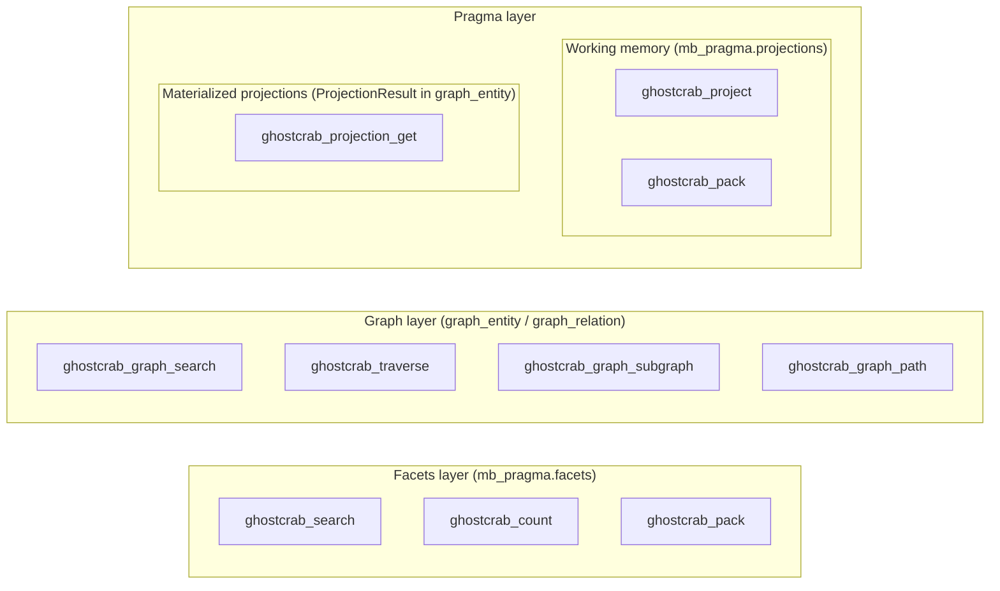

# GhostCrab Query Layers

GhostCrab stores data in three separate layers. Each has dedicated tools. Mixing them up is the most common source of empty results.

## Overview



---

## Layer 1 — Facets

**Store:** `mb_pragma.facets`

Structured domain records written via `ghostcrab_remember` / `ghostcrab_upsert`. Each row has a `schema_id`, free-text `content`, and a `facets` JSON bag.

| Tool | Purpose |
|------|---------|
| `ghostcrab_search` | Ranked retrieval — keyword (`hybrid` / `bm25` / `semantic`) + exact facet filters |
| `ghostcrab_count` | Shape the space before searching — aggregate counts by facet |
| `ghostcrab_pack` | Compact context bundle — top matching facts + active pragma projections |

**Key constraint:** `ghostcrab_search` explicitly excludes `graph_entity`, `graph_relation`, and `projection_result`. A zero-hit result here does **not** mean the domain is empty — it means the facets table has no match.

When `ghostcrab_search` returns zero hits, it suggests `ghostcrab_graph_search` and `ghostcrab_projection_get` as next steps.

---

## Layer 2 — Graph

**Store:** `graph_entity` + `graph_relation` + `graph_relation_property` (+ `graph_entity_chunk` for grounding)

Imported or derived structural data: ontology nodes, knowledge graph entities, provenance links.

| Tool | Purpose |
|------|---------|
| `ghostcrab_graph_search` | Find entities by text, `entity_type`, `collection_id`, `metadata_filters` |
| `ghostcrab_traverse` | Multi-hop directed walk from a start node — returns paths with `node_id`, `edge_label`, `depth` |
| `ghostcrab_graph_subgraph` | N-hop neighborhood expansion from seed entity IDs |
| `ghostcrab_graph_path` | Shortest path between two entity IDs |
| `ghostcrab_entity_chunks` | Raw chunk / document content linked to a graph entity |

**All graph tools are extended** — they do not appear in the default 11 MCP descriptors. Discover them with:

```
ghostcrab_tool_search { visibility: ["extended"], subsystem: ["graph"] }
```

`ghostcrab_graph_search` explicitly excludes `facets`, `projections`, and `memory_projections`.

### Edge attributes

Edges carry two kinds of attributes, both written via `ghostcrab_learn`:

**Untyped metadata** — `edge.properties` (any JSON values, stored in `graph_relation.metadata_json`)

```json
{ "source": "task:auth", "target": "task:deploy", "label": "BLOCKS",
  "properties": { "reason": "needs login cert", "since": "2026-05" } }
```

**Typed properties** — `edge.relation_properties` (stored canonically in `relation_properties_raw`, projected into indexed `graph_relation_property`)

```json
{ "source": "task:auth", "target": "task:deploy", "label": "BLOCKS",
  "relation_properties": [
    { "property_key": "delay_days", "value_type": "number",      "value_number": 5 },
    { "property_key": "cost_eur",   "value_type": "money_minor", "value_integer": 4999, "currency": "EUR" },
    { "property_key": "source_url", "value_type": "uri",         "value_text": "https://jira.example/TASK-42" }
  ] }
```

| `value_type` | Required column | Notes |
|---|---|---|
| `text`, `uri` | `value_text` | |
| `number`, `percentage_bp` | `value_number` | `percentage_bp` = basis points |
| `date_unix`, `money_minor` | `value_integer` | `money_minor` requires `currency` |
| `doc_ref` | `ref_doc_id` | FK to `doc_id` |

Both attribute kinds are returned by `ghostcrab_graph_search(include_relations: true)` — as `metadata` (untyped) and `relation_properties` (typed array) on each relation object. `ghostcrab_graph_subgraph` edge events carry typed properties natively from the MindBrain backend.

`relation_properties_raw` is the durable source of truth. `graph_relation_property` is a projection/cache refreshed by `ghostcrab_learn` for immediate reads and rebuilt by `ghostcrab_graph_reindex` from raw rows.

Use `properties` for loose human-readable context. Use `relation_properties` for values you need to filter, index, or aggregate.

---

## Layer 3 — Pragma / Projections

"Projection" refers to two different things in GhostCrab. They live in different stores and are accessed by different tools.

### A. Working memory projections

**Store:** `mb_pragma.projections`

Short-lived agent context: goals, steps, constraints, facts for the current task.

| Tool | Purpose |
|------|---------|
| `ghostcrab_project` | **Write/model** — create or refresh a provisional projection (`GOAL`, `STEP`, `FACT`, `CONSTRAINT`) |
| `ghostcrab_pack` | **Read** — active + blocking projections for `agent_id` / `scope`, plus top facet facts |

`ghostcrab_pack` bridges Layer 1 and Layer 3A: it returns pragma projections **and** up to 5 facet hits via hybrid search. It does not query `graph_entity`.

### B. Materialized graph projections

**Store:** `graph_entity` where `entity_type = ProjectionResult` (extended graph layer)

Precomputed analytical snapshots built by ingest pipelines or recipes (e.g. SEO audits, pipeline snapshots). Each is identified by a `projection_id` in `metadata_json`.

| Tool | Purpose |
|------|---------|
| `ghostcrab_projection_get` | Retrieve one full projection bundle: `ProjectionResult` + linked evidence relations + `DeltaFinding` deltas |

`ghostcrab_projection_get` is an **extended tool** — discover it via `ghostcrab_tool_search`.

---

## Decision Guide

| Question | Tool |
|----------|------|
| Find stored domain facts by text or facet values? | `ghostcrab_search` |
| Count facts by facet before searching? | `ghostcrab_count` |
| Compact agent context (active goals + relevant facts)? | `ghostcrab_pack` |
| Find graph entities by type, name, or metadata? | `ghostcrab_graph_search` |
| Walk dependencies, blockers, or relations in the graph? | `ghostcrab_traverse` |
| Expand a local neighborhood in the graph? | `ghostcrab_graph_subgraph` |
| Shortest path between two graph entities? | `ghostcrab_graph_path` |
| Retrieve a precomputed analytical snapshot? | `ghostcrab_projection_get` |
| Create or update agent working memory? | `ghostcrab_project` |
| Discover graph / projection tools not in default 11? | `ghostcrab_tool_search { visibility: ["extended"] }` |

---

## Common Mistakes

- **`ghostcrab_search` returns nothing → assume domain is empty.** Wrong: the graph and projection layers are separate. Escalate to `ghostcrab_graph_search` or `ghostcrab_projection_get`.
- **Calling graph tools by default.** They are extended — not listed in the default tool set. Call `ghostcrab_tool_search` first.
- **Confusing the two "projection" concepts.** Working memory projections (`mb_pragma.projections`) ≠ materialized `ProjectionResult` entities in the graph. Different stores, different tools.
- **Expecting `ghostcrab_pack` to include graph data.** It doesn't. Pack = pragma projections + facet facts only.

---

## Related

- [`ghostcrab-skills/shared/QUERY_PATTERNS.md`](../../ghostcrab-skills/shared/QUERY_PATTERNS.md) — escalation ladder and retrieval habits
- [`vendor/mindbrain/docs/facets.md`](../../vendor/mindbrain/docs/facets.md) — facets layer internals
- [`vendor/mindbrain/docs/projections.md`](../../vendor/mindbrain/docs/projections.md) — projection internals
- [`vendor/mindbrain/docs/graph.md`](../../vendor/mindbrain/docs/graph.md) — graph layer internals and `graph_relation_property` schema
- [`docs/plan/2026-05-19-mindbrain-v1.4.2-edge-properties.md`](../plan/2026-05-19-mindbrain-v1.4.2-edge-properties.md) — implementation notes for typed edge properties
