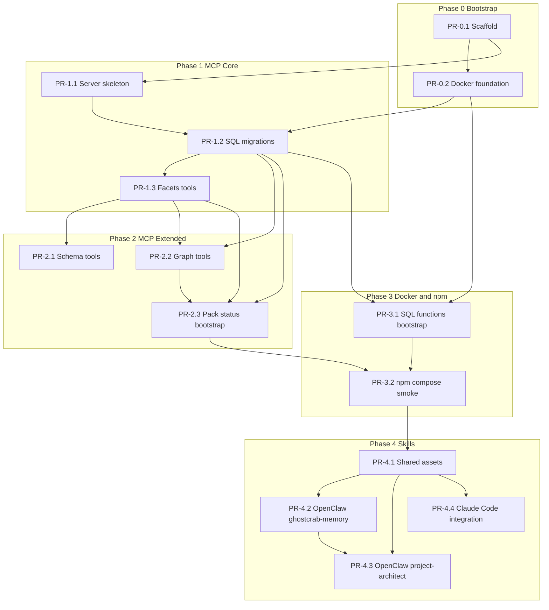

# GhostCrab — Master Plan Roadmap

This document is the **single source of truth** for phased delivery of **GhostCrab** — MindFlight’s PostgreSQL memory stack for MCP agents (`@mindflight/ghostcrab`), shipped with Docker image `mindflight/ghostcrab-postgres` (three extensions: `pg_facets`, `pg_dgraph`, `pg_pragma`), plus downstream skills (OpenClaw + Claude Code). GhostCrab is a **first-class component of [MFO](https://github.com/mindflight) (MindFlight Orchestrator)** and also works standalone. Public docs: `ghostcrab.mindflight.io` (when published).

**Authoritative specs**: `docs/SOP_start/` (especially `SOP_mcp_server.md`, `docker_structure.md`, `app_structure.md`, `SOP_openclaw.md`, `claude-code.md`, `renommage_strata.md`) and `docs/uses-cases/list-use-cases.md`.

**Implementation detail (Level 3)**: PostgreSQL tables, PL/pgSQL helpers, and JSONB namespaces keep the `mfo_*` / `mfo:` prefix — this is internal storage, not the public MCP API. See `docs/SOP_start/renommage_strata.md`.

**Project state**: Greenfield — implement in order; each PR should be mergeable independently where dependencies allow.

---

## Consolidated project layout (ASCII)

This merges the structural views from `app_structure.md`, `SOP_mcp_server.md`, `docker_structure.md`, and `claude-code.md`. **Target topology: two repositories** (product vs integrations). If you use a single monorepo during bootstrap, mirror the same folders under one root.

### Repository split

```
ghostcrab/               ← Repo 1 — compiled/deployable product (npm `@mindflight/ghostcrab` + Docker)
ghostcrab-skills/        ← Repo 2 — config + docs only (OpenClaw + Claude Code + shared)
```

**Coupling**: `ghostcrab-skills` depends on `ghostcrab` only via **MCP + `DATABASE_URL`** in `.mcp.json` / OpenClaw MCP config (`mcpServers.ghostcrab`) — no code imports.

```
                    ┌─────────────────────┐
                    │        GhostCrab       │
                    │  (npm / DockerHub)  │
                    └──────────▲──────────┘
                               │
                     DATABASE_URL + MCP tools
                               │
                    ┌──────────┴──────────┐
                    │    ghostcrab-skills    │
        ┌───────────┼──────────┬──────────┼───────────┐
        │           │          │          │           │
   claude-code  openclaw    shared/   (optional     README
   /self-memory /ghostcrab-memory copies  epistemic
   /data-architect ...                 agent profile)
```

### Repo 1 — `ghostcrab/` (MCP server + Postgres image assets)

```
ghostcrab/
├── src/
│   ├── index.ts                    # MCP Server, stdio, ListTools / CallTool
│   ├── db/
│   │   ├── client.ts               # pg Pool, query, ping
│   │   └── migrations/
│   │       ├── 001_facets_schema.sql
│   │       ├── 002_dgraph_schema.sql
│   │       ├── 003_pragma_schema.sql
│   │       └── 004_bootstrap_data.sql
│   ├── tools/
│   │   ├── registry.ts
│   │   ├── facets/                 # search, remember, count, schema_*
│   │   ├── dgraph/                 # coverage, traverse, learn
│   │   └── pragma/                # pack, status
│   ├── bootstrap/
│   │   └── seed.ts                 # mfo:system seed at startup (when applicable)
│   └── types/                      # facets, dgraph, pragma TS types
├── docker/
│   ├── Dockerfile                  # multi-stage; native .so optional + pgvector
│   ├── docker-compose.yml          # postgres + optional mcp-server service
│   ├── healthcheck.sh
│   └── init/
│       ├── 00_extensions.sql       # CREATE EXTENSION + safe fallback
│       ├── 01_schema.sql           # aligns with migrations (document drift risk)
│       ├── 02_functions.sql        # mfo_search_hybrid, mfo_count_by, etc.
│       └── 03_bootstrap.sql
├── tests/
│   ├── tools/
│   └── fixtures/
├── .mcp.json                       # example consumer config (root)
├── .env.example
├── package.json                    # @mindflight/ghostcrab, bin
├── tsconfig.json
└── README.md
```

**Rule (from `app_structure.md`)**: this repo contains **no** OpenClaw- or Claude-specific files — only MCP tools and Docker/DB.

### Repo 2 — `ghostcrab-skills/` (integrations)

```
ghostcrab-skills/
├── claude-code/
│   ├── self-memory/
│   │   ├── CLAUDE.md               # fragment: session start, write-back rules
│   │   ├── .mcp.json               # same MCP format as OpenClaw
│   │   └── .claude/settings.json # hooks: session_start, pre_tool_use, etc.
│   └── data-architect/
│       ├── CLAUDE.md               # fragment: data-architect workflow
│       ├── SCHEMA_DESIGN_PROJECT.md
│       ├── templates/              # domain.schema.json, migration.sql.tpl, types.ts.tpl
│       └── examples/
│           ├── project-management/
│           ├── crm/
│           └── knowledge-base/
├── openclaw/
│   ├── ghostcrab-memory/              # plug-in skill (MCP server key: `ghostcrab`)
│   │   ├── mcp.json                # npx @mindflight/ghostcrab + DATABASE_URL
│   │   ├── SKILL.md
│   │   ├── README.md
│   │   └── (copies from shared/: SCHEMA_DESIGN, QUERY_PATTERNS, …)
│   └── ghostcrab-epistemic-agent/     # optional full agent profile (SOUL, AGENTS, …)
│       ├── SOUL.md
│       ├── AGENTS.md
│       ├── HEARTBEAT.md
│       ├── WORKING.md
│       └── README.md
├── shared/
│   ├── SCHEMA_DESIGN.md
│   ├── QUERY_PATTERNS.md
│   └── bootstrap_seed.jsonl
├── Makefile                        # dist, validate, clean (release copies, no symlinks in ZIPs)
└── README.md
```

**Naming note**: Phase 4 of this roadmap refers to **`ghostcrab-project-architect`** (per `SOP_openclaw.md`). That deliverable overlaps the **`claude-code/data-architect`** + OpenClaw architect examples — keep folder names consistent with whichever SOP you treat as canonical; content should stay in sync with `shared/`.

**Claude Code vs OpenClaw (structural)** — same MCP tools; different client surfaces:

| Client     | Primary instruction file | MCP config location (typical)        |
|-----------|----------------------------|--------------------------------------|
| OpenClaw  | `SKILL.md` / `SOUL.md`     | `~/.openclaw/mcp_servers.json` merge |
| Claude Code | `CLAUDE.md` fragments    | project `.mcp.json` or `~/.claude.json` |

### Docs-only tree in current workspace (optional)

If `ghostcrab-skills` is not split yet, you may keep:

```
docs/
├── SOP_start/          # authoritative specs
├── uses-cases/
└── roadmap.md          # this file
```

until Repo 2 is created; Phase 4 PRs then add `ghostcrab-skills/` at repo root (or separate clone).

---

## Roadmap V2 (native dual-mode)

Execution plan for **SQL-first + optional native extensions** (`pg_facets`, `pg_dgraph`, `pg_pragma`), DockerHub image, CI matrix, and tool dispatch: **[ROADMAP-V2.md](ROADMAP-V2.md)**.

---

## How to use this roadmap (AI agents)

1. **Pick one PR** — Never mix two PR scopes in one change set unless explicitly parallelizable (see graph).
2. **Read pre-conditions** — Confirm parent PRs are merged or the branch includes their changes.
3. **Execute Agent Instructions** in order — Check each acceptance box before opening a PR.
4. **Fill the MR body** using the same four sections: Scope / Changes / Tests / Architecture Impact (copy from this file).
5. **Canonical MCP tool names (public API)** — Use `ghostcrab_search`, `ghostcrab_remember`, `ghostcrab_count`, `ghostcrab_pack`, `ghostcrab_status`, `ghostcrab_coverage`, `ghostcrab_traverse`, `ghostcrab_learn`, `ghostcrab_schema_*` per `docs/SOP_start/renommage_strata.md`. Internal SQL remains `mfo_*` / `mfo:`.
6. **Coverage semantics** — Graph coverage: proceed ≥ **0.85**, warn ≥ **0.70** (per SOP).
7. **Docker stdio** — MCP service in Compose: `stdin_open: true`, `tty: true`.
8. **Skills packaging** — Copy `shared/` into skill bundles (no symlinks in release ZIPs).

---

## Global dependency graph



**Parallelism note**: After **PR-1.3**, **PR-2.1** and **PR-2.2** can proceed in parallel on separate branches if migrations (PR-1.2) are on `main`. **PR-4.2**, **PR-4.3**, **PR-4.4** can fork from **PR-4.1** in parallel if assets are stable.

---

## Phase timeline (suggested)

| Phase | Goal | PR count |
|-------|------|----------|
| 0 | Repo + runnable Postgres (extensions + health) | 2 |
| 1 | MCP process + schema + first tools | 3 |
| 2 | Full tool surface | 3 |
| 3 | Pure-SQL fallbacks, packaging, E2E | 2 |
| 4 | Skills and client integrations | 4 |

---

## Phase 0 — Project bootstrap

### PR-0.1: Repository scaffold and tooling

**Scope**: Initialize the `ghostcrab` repository (GitHub: `mindflight/ghostcrab`) as a TypeScript package with lint/format, env template, README, and a minimal CI workflow so every later PR has a consistent baseline.

**Changes**:
- Add `package.json` (`name`: `@mindflight/ghostcrab`, `type: module`, scripts: `build`, `test`, `lint`).
- Add `tsconfig.json` (Node 20+, `moduleResolution` compatible with MCP SDK).
- Add ESLint + Prettier configs; optional `vitest` or `node:test` placeholder.
- Add `.env.example` with `DATABASE_URL`, `PG_POOL_MAX`.
- Add `README.md`: prerequisites, clone, `npm install`, link to this roadmap.
- Add `.github/workflows/ci.yml` (or equivalent): install, lint, build on push.

**Tests**:
- CI passes on clean checkout.
- `npm run build` succeeds (stub `src/index.ts` that exits 0 or minimal `console.log` acceptable only if **PR-1.1** immediately replaces it — prefer skipping real server until PR-1.1).

**Architecture Impact**:
- No runtime architecture yet; establishes module system and quality gate.
- No breaking changes (first commit).

**Agent Instructions**:
- Pre-condition: empty or docs-only repo.
- Steps: (1) Add configs and scripts. (2) Add minimal `src/` placeholder if required for `tsc`. (3) Verify CI locally with `npm ci && npm run build && npm run lint`.
- Acceptance: CI green; README lists Phase 0→4 at high level.

---

### PR-0.2: Docker foundation (Postgres + extensions hook + healthcheck)

**Scope**: Deliver `docker/Dockerfile` (multi-stage as per `docker_structure.md`), `docker-compose.yml` for Postgres, init SQL that attempts `CREATE EXTENSION` for `pg_trgm`, `vector`, `uuid-ossp`, and the three MFO extensions inside `DO $$ ... EXCEPTION` blocks for silent fallback, plus `healthcheck.sh` and updated `.env.example` (`POSTGRES_*`, `MFO_NATIVE_EXTENSIONS=auto`).

**Changes**:
- `docker/Dockerfile` — builder stage optional if native `.so` not yet available; document `MFO_NATIVE_EXTENSIONS`.
- `docker/docker-compose.yml` — service `postgres`, volume, healthcheck, ports.
- `docker/init/00_extensions.sql` (or merged `init.sql` per SOP) — idempotent extension creation.
- `docker/healthcheck.sh` — `pg_isready` + simple query.
- `.env.example` — extend with `POSTGRES_USER`, `POSTGRES_PASSWORD`, `POSTGRES_DB`.

**Tests**:
- `docker compose up -d` → container healthy within timeout.
- Logs show extensions created or skipped without aborting startup.

**Architecture Impact**:
- **Data plane**: PostgreSQL 16 baseline; dual-mode path for native vs SQL-only behavior in later PRs.
- **Operational**: Healthcheck contract for Compose `depends_on: condition: service_healthy`.

**Agent Instructions**:
- Pre-condition: **PR-0.1** merged (or branch includes it).
- Steps: (1) Implement Dockerfile per `docs/SOP_start/docker_structure.md`. (2) Wire compose + init. (3) Run compose and capture health evidence in PR description.
- Acceptance: Fresh volume bootstraps successfully; document `docker compose` one-liner in README.

---

## Phase 1 — MCP server core

### PR-1.1: MCP server skeleton (pool, stdio, registry, startup DB gate)

**Scope**: Production-ready MCP process using `@modelcontextprotocol/sdk`, stdio transport, centralized `ToolHandler` registry, and **fail-fast** if `DATABASE_URL` is unreachable at startup (`exit(1)` with clear logs), per `SOP_mcp_server.md`.

**Changes**:
- `src/db/client.ts` — `pg` `Pool`, `query`, `ping`.
- `src/tools/registry.ts` — `ToolHandler`, `registerTool`, `toolRegistry` map.
- `src/index.ts` — `Server` metadata (`name`, `version`), `ListTools` / `CallTool` handlers, `StdioServerTransport`.
- Side-effect imports: stub tools or empty registry until PR-1.3 (must return empty tool list or minimal `ghostcrab_status` stub — **prefer empty list** to avoid false contracts).
- Register no business tools yet, or a single `ghostcrab_status` that returns `{ ok: false, reason: "schema not migrated" }` until migrations land (choose one approach and document in PR).

**Tests**:
- Unit test: mock pool or testcontainer optional; at minimum script: start with invalid `DATABASE_URL` → exit code 1.
- Valid `DATABASE_URL` against **PR-0.2** Postgres → process stays up.

**Architecture Impact**:
- **API**: MCP tools list stable only after subsequent PRs.
- **Dependencies**: `@modelcontextprotocol/sdk`, `pg`, `zod`.

**Agent Instructions**:
- Pre-condition: **PR-0.1** + **PR-0.2** available for integration testing.
- Steps: (1) Implement client + server. (2) Add startup `ping()`. (3) Document run: `DATABASE_URL=... node dist/index.js`.
- Acceptance: MCP client can list tools (even if empty); bad DB fails fast.

---

### PR-1.2: SQL migrations 001–004 (extensions + core tables)

**Scope**: Idempotent migrations aligning with SOP: extensions where applicable; tables `mfo_facets` (JSONB, `vector(1536)`, tsvector, BM25-related columns per spec), `mfo_nodes` / `mfo_edges`, `mfo_projections`, `mfo_agent_state`; `IF NOT EXISTS` throughout.

**Changes**:
- `src/db/migrations/001_facets_schema.sql`
- `src/db/migrations/002_dgraph_schema.sql`
- `src/db/migrations/003_pragma_schema.sql`
- `src/db/migrations/004_bootstrap_data.sql` (minimal seed if spec requires; full `mfo:system` may move to PR-2.3 — follow `SOP_mcp_server.md` literally).
- Migration runner OR document applying SQL via docker init — **pick one strategy** and use consistently in PR-3.1 (prefer programmatic runner in server or `npm run migrate`).

**Tests**:
- Apply migrations against clean DB → success second run (idempotence).
- Optional: SQL lint or `psql -f` in CI with service container.

**Architecture Impact**:
- **Schema**: All tools in Phases 1–2 assume these tables exist.
- **Indexes**: GIN, ivfflat on embeddings per SOP.

**Agent Instructions**:
- Pre-condition: **PR-0.2** Postgres image or local PG16.
- Steps: (1) Copy DDL from SOP. (2) Prove idempotence. (3) Update README “Database setup”.
- Acceptance: `psql` `\dt` shows internal `mfo_*` tables; no errors on re-apply.

---

### PR-1.3: Facets tools — `ghostcrab_search`, `ghostcrab_remember`, `ghostcrab_count`

**Scope**: First vertical slice: hybrid search, write path for facets, and grouped counts for dashboards (O(1)-style aggregations per use-case doc).

**Changes**:
- `src/tools/facets/search.ts`, `remember.ts`, `count.ts`
- `src/types/facets.ts` + Zod input schemas
- `src/index.ts` imports registering these tools
- `tests/tools/facets.test.ts` + `tests/fixtures/test_data.sql`

**Tests**:
- Integration tests: insert → search → count by `group_by`.
- Manual: MCP `CallTool` for each with sample payloads from SOP.

**Architecture Impact**:
- **API**: Stable tool names and JSON contracts for clients (OpenClaw/Claude Code depend on this).
- **Performance**: Query plans for GIN/vector paths documented if non-trivial.

**Agent Instructions**:
- Pre-condition: **PR-1.2** applied.
- Steps: (1) Implement handlers using `query()`. (2) Map errors to MCP `isError` responses. (3) Add fixtures.
- Acceptance: All three tools callable; results match SOP examples within tolerance.

---

## Phase 2 — MCP server extended tools

### PR-2.1: Schema tools — `ghostcrab_schema_register`, `ghostcrab_schema_list`, `ghostcrab_schema_inspect`

**Scope**: Facet/schema registration and introspection for agent-driven schema design workflows.

**Changes**:
- `src/tools/facets/schema.ts` (or split files if cleaner)
- Types + tests under `tests/tools/schema.test.ts`
- Registry updates in `src/index.ts`

**Tests**:
- Round-trip: register → list → inspect.
- Invalid input → Zod errors surfaced as tool errors.

**Architecture Impact**:
- **API**: New tools; no DB schema change unless SOP adds catalog tables — if so, include migration bump in this PR.

**Agent Instructions**:
- Pre-condition: **PR-1.3** merged.
- Steps: (1) Read SOP tool payloads. (2) Implement against `mfo_facets` / metadata tables as specified. (3) Document example JSON in README appendix.

---

### PR-2.2: Graph tools — `ghostcrab_coverage`, `ghostcrab_traverse`, `ghostcrab_learn`

**Scope**: Epistemic graph operations on `mfo_nodes` / `mfo_edges`; coverage computation with thresholds **0.85** / **0.70**; traversal; learning edges/facts as per SOP.

**Changes**:
- `src/tools/dgraph/coverage.ts`, `traverse.ts`, `learn.ts`
- `src/types/dgraph.ts`
- `tests/tools/dgraph.test.ts`

**Tests**:
- Fixture graph: coverage crosses thresholds; `can_proceed_autonomously` semantics if specified.
- Traversal depth limits and cycle safety.

**Architecture Impact**:
- **API**: Graph tool contracts frozen for skills repo.
- **Risk**: Hot queries — add indexes if tests show seq scans on large fixtures.

**Agent Instructions**:
- Pre-condition: **PR-1.2** + **PR-1.3** merged.
- Steps: (1) Implement coverage math exactly as SOP. (2) Add traversal caps. (3) Validate error messages for unknown nodes.

---

### PR-2.3: Context tools — `ghostcrab_pack`, `ghostcrab_status` + bootstrap seed `mfo:system`

**Scope**: Memproj-backed context pack and compact status object; run `bootstrap/seed.ts` at startup to ensure `mfo:system` root entries when empty.

**Changes**:
- `src/tools/pragma/pack.ts`, `status.ts`
- `src/types/pragma.ts`
- `src/bootstrap/seed.ts` + wire in `src/index.ts` after DB connect
- `tests/tools/pragma.test.ts`

**Tests**:
- Cold DB: seed creates expected rows.
- `ghostcrab_pack` returns structured projections (FACT, GOAL, STEP, CONSTRAINT) per SOP.
- `ghostcrab_status` shape stable (document JSON keys).

**Architecture Impact**:
- **Runtime**: Startup order = connect → migrate? (if runner) → seed → serve MCP.
- **API**: Completes the **11-tool** surface documented in `SOP_openclaw.md` (verify count after merge).

**Agent Instructions**:
- Pre-condition: **PR-1.2** merged; **PR-2.2** merged or rebase to include graph data for realistic packs.
- Steps: (1) Implement pack/status. (2) Seed idempotently. (3) Cross-check tool list vs OpenClaw SOP table.

---

## Phase 3 — Docker polish and npm distribution

### PR-3.1: Docker SQL functions and bootstrap scripts

**Scope**: Pure SQL equivalents in `docker/init/` for hybrid search, counts, graph traversal, and pack context — PL/pgSQL functions `mfo_search_hybrid`, `mfo_count_by`, `mfo_traverse` (SQL fallback; distinct from MCP tool `ghostcrab_traverse`), `mfo_pack_context` — plus `03_bootstrap.sql`, aligning with `docker_structure.md` for environments without native extension `.so`.

**Changes**:
- `docker/init/01_schema.sql` (if not redundant with migrations — avoid drift; prefer single source: either duplicate with comment “mirrors migration X” or generate from one folder)
- `docker/init/02_functions.sql`
- `docker/init/03_bootstrap.sql`
- Update `README.md`: explain **SQL fallback** vs native extensions.

**Tests**:
- `psql` execute functions against sample data; compare results to MCP tool outputs (smoke).
- Document any intentional semantic gap between SQL fallback and native extension.

**Architecture Impact**:
- **Deployment**: `MFO_NATIVE_EXTENSIONS=auto` behavior documented.
- **Maintainability**: Flag if duplicate DDL — create follow-up issue to unify migration + docker init.

**Agent Instructions**:
- Pre-condition: **PR-1.2** schema stable.
- Steps: (1) Port function definitions from `docker_structure.md`. (2) Run in compose. (3) PR notes on drift risk.

---

### PR-3.2: npm package, Compose MCP service, `.mcp.json`, E2E smoke

**Scope**: Ship `bin` for `npx @mindflight/ghostcrab`, add `mcp-server` service to compose (image or build from repo Dockerfile), stdio flags, example `.mcp.json`, and automated smoke: Postgres up → MCP lists **N** tools → `ghostcrab_status` returns JSON.

**Changes**:
- `package.json` `bin`, `files`, `publishConfig` (if applicable)
- `docker/docker-compose.yml` — add `mcp-server` service, `depends_on` healthy postgres, `environment: DATABASE_URL`, `stdin_open`, `tty`
- `.mcp.json` at repo root (example for users)
- `tests/e2e/smoke.sh` or CI job

**Tests**:
- CI job runs compose + smoke (or nightly if too heavy for every PR).
- Local: copy-paste from README succeeds.

**Architecture Impact**:
- **Distribution**: First consumer-facing install path.
- **Security**: No secrets in `.mcp.json`; document env substitution.

**Agent Instructions**:
- Pre-condition: **PR-2.3** + **PR-3.1** merged.
- Steps: (1) Verify all tools registered. (2) Compose MCP attaches to same network as Postgres. (3) Record tool count in README.
- Acceptance: One command brings up DB + MCP reference stack.

---

## Phase 4 — Shared assets and client integrations

**Cursor plan**: [.cursor/plans/phase_4_skills_integrations_strata.plan.md](../.cursor/plans/phase_4_skills_integrations_strata.plan.md).

**Note**: `app_structure.md` describes a second repo `ghostcrab-skills/`. If skills stay in-repo for now, use `ghostcrab-skills/` at workspace root; if split later, copy this section into that repo’s roadmap.

### PR-4.1: Shared documentation assets

**Scope**: Create `ghostcrab-skills/shared/` (or `docs/skills/shared/`) with `SCHEMA_DESIGN.md`, `QUERY_PATTERNS.md`, `bootstrap_seed.jsonl` per SOP; versioning note for copy-into-ZIP distribution.

**Changes**:
- Add shared markdown and seed file
- `Makefile` targets: `make dist`, `validate`, `clean` (stub OK if full ZIP in PR-4.2)

**Tests**:
- `make validate` checks files exist and links resolve (optional script).

**Architecture Impact**:
- **Content**: No runtime coupling; consumed only by skills packaging.

**Agent Instructions**:
- Pre-condition: **PR-3.2** merged (tool names finalized).
- Steps: (1) Extract patterns from `SOP_openclaw.md` / `claude-code.md`. (2) Align examples with `ghostcrab_search` / `ghostcrab_pack` contracts.

---

### PR-4.2: OpenClaw skill — `ghostcrab-memory`

**Scope**: Deliver `openclaw/ghostcrab-memory/` with `mcp.json` pointing to `npx @mindflight/ghostcrab` and `mcpServers` key **`ghostcrab`**, `SKILL.md` (tool table, mandatory rules: pack, write-back, structured gaps), `README.md`, and **copied** `shared/` files (not symlinks).

**Changes**:
- `openclaw/ghostcrab-memory/mcp.json`, `SKILL.md`, `README.md`
- Copied shared docs into skill folder
- Session start sequence documented

**Tests**:
- Manual checklist from `SOP_openclaw.md` Scenario A (self-memory).
- Validate JSON merges into `~/.openclaw/mcp_servers.json` (document only).

**Architecture Impact**:
- **Client**: OpenClaw gateway config contract.
- **Versioning**: Skill version should track server major.minor for compatibility table in README.

**Agent Instructions**:
- Pre-condition: **PR-4.1** merged.
- Steps: (1) Copy shared. (2) List all MCP tools with parameter summaries. (3) Add Docker run instructions for Postgres.

---

### PR-4.3: OpenClaw skill — `ghostcrab-project-architect`

**Scope**: Project modeling workflow: `SKILL.md`, `SCHEMA_DESIGN_PROJECT.md`, `templates/`, `examples/project-management`, `examples/crm`, `examples/knowledge-base` per SOP.

**Changes**:
- `openclaw/ghostcrab-project-architect/**`
- Eight-phase workflow text + cross-links to shared query patterns

**Tests**:
- Manual Scenario B (architect) from SOP: expected tool call sequence documented and spot-checked.

**Architecture Impact**:
- **Content only**; may reference new facet namespaces — document convention (`pm:`, `crm:`, `kb:`).

**Agent Instructions**:
- Pre-condition: **PR-4.1** merged; **PR-4.2** optional but recommended for consistency.
- Steps: (1) Port examples from SOP. (2) Ensure no contradiction with server tool names.

---

### PR-4.4: Claude Code integration

**Scope**: `claude-code/` folder with `CLAUDE.md` fragment (session start: `ghostcrab_search` + `ghostcrab_status`), `.mcp.json`, example `.claude/settings.json` hooks (`session_start` → `ghostcrab_status`, `pre_tool_use` → `ghostcrab_pack`), and data-architect layout under `ghostcrab/` (`schemas/`, `migrations/`, `types/`).

**Changes**:
- `claude-code/CLAUDE.md` (or merge instructions)
- `claude-code/.mcp.json` example
- `claude-code/settings.json` snippet
- `ghostcrab/` template tree + pointer to `SCHEMA_DESIGN_PROJECT.md`

**Tests**:
- Manual: Claude Code loads MCP; hooks file validates as JSON.
- Document parity with OpenClaw tool list.

**Architecture Impact**:
- **Client**: Claude Code hooks behavior; users may combine with **PR-4.2** patterns.

**Agent Instructions**:
- Pre-condition: **PR-3.2** merged.
- Steps: (1) Mirror OpenClaw MCP env vars. (2) Keep instructions minimal for token efficiency. (3) Link to Docker one-liner.

---

## MR body template (copy into GitHub/GitLab)

Use this for **every** PR:

```markdown
## Scope
<!-- 1-2 sentences from this roadmap -->

## Changes
<!-- Bullet list of files/features; link to roadmap PR-ID -->

## Tests
<!-- Commands run + results -->

## Architecture Impact
- Dependencies:
- Schema:
- API / tools:
- Breaking changes:
```

---

## Demo backlog (from use cases)

After **Phase 3**, prioritize demos for skill marketing (`docs/uses-cases/list-use-cases.md`):

1. Compliance Checker (full stack)
2. Project Management / Orion (full stack)
3. Incident Responder (dashboard + `ghostcrab_status`)

These validate three distinct graph/facet shapes before heavy investment in Phase 4 content.

---

## Revision history

| Version | Date | Notes |
|---------|------|-------|
| 1.0 | 2026-03-22 | Initial master roadmap from SOP_start + use cases |
| 1.1 | 2026-03-22 | GhostCrab product naming, `@mindflight/ghostcrab`, `ghostcrab_*` MCP tools, `ghostcrab-skills/` layout (see `renommage_strata.md`) |
