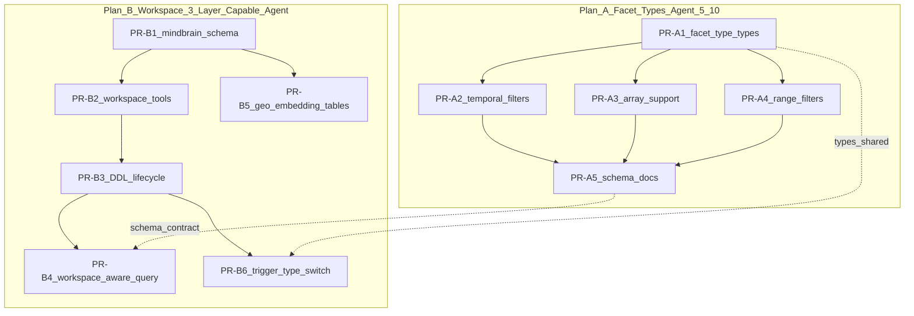

# GhostCrab V3 — Plan de travail complet

## 1. Analyse critique de la proposition V3

### Incohérences majeures identifiées

**Le SOP V3 est rédigé en Go, le projet est en TypeScript.** Tout le code Go (`cobra.Command`, `internal/tools/`, `cmd/`) dans le SOP V3 est inapproprié. Le serveur MCP GhostCrab est un paquet npm TypeScript (`@mindflight/ghostcrab`) avec `pg`, `zod`, et `@modelcontextprotocol/sdk`. Le SOP doit être retranscrit dans l'idiome TS du projet existant.

**Le SOP V3 mélange deux repos.** `ghostcrab-mcp` (serveur MCP, TS) et `mindcli` (CLI Go, repo séparé). Les PRs 04-06 du SOP V3 concernent mindCLI — elles sont hors scope du repo `ghostcrab-mcp`. Les interfaces entre les deux doivent être clarifiées, pas implémentées au même endroit.

**L'ordre de priorité est inversé.** Le SOP V3 commence par les workspaces et le DDL lifecycle (PR-01 à PR-04), qui sont les plus risqués et les moins utiles immédiatement. Les gaps facettes (document `facets_management.md`) améliorent directement les outils existants et sont additifs — ils devraient passer en premier.

**Les 3 layers sont un saut architectural prématuré.** La V2 vient de stabiliser le dual-mode natif (182 tests, 16 outils MCP). Introduire un Layer 1 relationnel + triggers auto avant d'avoir résolu les gaps de typologies de facettes dans le Layer 2 existant revient à construire l'étage avant d'avoir fini les fondations.

### Ce qui est bien

- Le modèle 3-layer est **conceptuellement solide** — il tient la route architecturalement
- Le document `facets_management.md` avec les 6 gaps est **excellent** — analyse précise, aménagements tous additifs
- La séparation MCP (décision) / CLI (exécution batch) est le bon pattern
- Les conventions de nommage sont claires et cohérentes

### Recommandation : split en 2 plans

La complexité globale est trop élevée pour un agent 5/10 en un seul bloc. Le travail se découpe naturellement en :

- **Plan A — Typologies de facettes** : extension du modèle existant dans `ghostcrab-mcp`, additif, bien cadré, faisable par agent 5/10 (Kimi 2.5 / Sonnet 4.6)
- **Plan B — Architecture workspace + 3-layer** : restructuration lourde, migrations, nouveau schéma `mindbrain`, DDL lifecycle — nécessite agent plus capable ou supervision humaine rapprochée

---

## 2. PLAN A — Typologies de facettes (agent 5/10)

Scope : extension du query proxy et du trigger generator **dans le code TS existant** pour supporter les 6 gaps identifiés dans `facets_management.md`. Chaque PR est indépendante et testable.

### PR-A1 — `facet_type` dans SyncFieldSpec et trigger generator skeleton

**Why**: Le trigger generator actuel (qui sera créé en Plan B) et le query proxy traitent tous les types identiquement. Avant d'implémenter les types avancés, il faut poser la structure `facet_type` dans les types TypeScript partagés et dans le schéma de validation.

**What**:

- Nouveau fichier `src/types/facet-types.ts` : union type `FacetType = "term" | "boolean" | "integer" | "float" | "array" | "ltree" | "temporal" | "temporal_range" | "geo" | "jsonpath" | "computed" | "embedding"`
- Extension de `SyncFieldSpec` dans `src/types/facets.ts` avec le champ optionnel `facet_type`
- Zod schema correspondant
- Tests unitaires pour la validation

**How**: Purement des types et de la validation — pas de changement de comportement runtime.

**Files**: `src/types/facet-types.ts` (new), `src/types/facets.ts` (edit), `tests/unit/facet-types.test.ts` (new)

---

### PR-A2 — Query proxy : filtres temporels (Gap 5)

**Why**: `ghostcrab_query_facets` / `ghostcrab_search` font du match exact JSONB (`@>`). Les dates stockées dans `facets` ne peuvent pas être filtrées par range. C'est le gap le plus impactant pour les cas d'usage réels (deadline, created_at, etc.).

**What**:

- Extension du `SearchInput` Zod schema : nouveau champ optionnel `temporal_filters: TemporalFilter[]`
- Type `TemporalFilter = { facet_key: string; from?: string; to?: string; relative?: string }`
- Résolution des filtres relatifs (`last_7_days`, `this_month`, `this_quarter`) côté TS avant requête PG
- Clause SQL générée : `(facets->>'deadline')::TIMESTAMPTZ BETWEEN $from AND $to`
- Tests unitaires + mise à jour du schema MCP `inputSchema`

**How**: Extension de [src/tools/facets/search.ts](src/tools/facets/search.ts) — la logique `sqlFallback` ajoute les clauses temporelles après les filtres JSONB existants. Le chemin natif BM25 n'est pas impacté (pas de filtres JSONB).

**Files**: `src/tools/facets/search.ts` (edit), `src/tools/facets/count.ts` (edit — mêmes filtres temporels pour le count), `tests/tools/facets.test.ts` (edit)

---

### PR-A3 — Query proxy : support arrays (Gap 2)

**Why**: Stocker `{"tags": ["Go", "PG"]}` dans `facets` JSONB et filtrer avec `@>` ne fonctionne pas pour les arrays. L'opérateur correct est `?` ou `?|`. Sans ce fix, tout filtre sur un champ multi-valeur échoue silencieusement.

**What**:

- Nouveau paramètre optionnel `array_filters` dans `SearchInput` et `CountInput` : `Record<string, string[]>` (OR sur les valeurs du champ array)
- Clause SQL : `facets->'tags' ?| ARRAY[$1, $2]` (PostgreSQL `?|` pour "any of")
- Alternative pour le count : unnest des valeurs array pour compter chaque élément distinctement
- Tests unitaires pour array filters (single value, multi-value, empty array)

**How**: Extension du pattern existant dans `sqlFallback` de [search.ts](src/tools/facets/search.ts) et [count.ts](src/tools/facets/count.ts). Les `array_filters` sont traités séparément des `filters` car l'opérateur SQL diffère.

**Files**: `src/tools/facets/search.ts`, `src/tools/facets/count.ts`, `tests/tools/facets.test.ts`

---

### PR-A4 — Query proxy : filtres numériques range (Gap 5 suite)

**Why**: Les floats et numériques dans `facets` JSONB ne peuvent pas être filtrés par range (`prix BETWEEN 10 AND 100`). Même problème que les temporels mais pour les scalaires numériques.

**What**:

- Nouveau paramètre optionnel `range_filters` dans `SearchInput` et `CountInput` : `{ facet_key: string; min?: number; max?: number }[]`
- Clause SQL : `(facets->>'prix')::numeric BETWEEN $min AND $max`
- Support des ranges ouverts (min seul ou max seul)
- Tests unitaires

**How**: Pattern identique à PR-A2, mais avec cast `::numeric` au lieu de `::TIMESTAMPTZ`.

**Files**: `src/tools/facets/search.ts`, `src/tools/facets/count.ts`, `tests/tools/facets.test.ts`

---

### PR-A5 — Schema MCP et documentation des typologies

**Why**: Les nouveaux filtres (temporal, array, range) doivent être documentés dans le schema MCP `inputSchema` pour que les agents LLM sachent les utiliser. Le `ghostcrab_status` doit aussi exposer les types de facettes supportés.

**What**:

- Mise à jour de `inputSchema` dans `searchTool.definition` et `countTool.definition`
- Ajout d'un champ `supported_facet_types` dans la réponse `ghostcrab_status`
- Tests de contrat MCP (`mcp-schema-contract.test.ts`)

**How**: Extension de [status.ts](src/tools/pragma/status.ts) et des définitions d'outils.

**Files**: `src/tools/facets/search.ts`, `src/tools/facets/count.ts`, `src/tools/pragma/status.ts`, `tests/tools/mcp-schema-contract.test.ts`

---

## 3. PLAN B — Architecture workspace + 3-layer (agent capable)

Scope : fondation `mindbrain` schema, isolation workspace, DDL lifecycle avec human-in-the-loop — tout en TypeScript dans `ghostcrab-mcp`.

### PR-B1 — Foundation : schema `mindbrain` + workspace isolation

**Why**: Toutes les tables de contrôle (workspaces, pending_migrations, query_templates, source_mappings) doivent exister avant tout. Le `workspace_id` TEXT doit être ajouté aux tables Layer 2 existantes (`mfo_facets`, `graph.entity`, `graph.relation`).

**What**:

- Migration `009_mindbrain_foundation.sql` :
  - `CREATE SCHEMA mindbrain`
  - `mindbrain.workspaces` (id, label, pg_schema, description, created_by, status)
  - `mindbrain.pending_migrations` (id UUID, workspace_id, sql, sync_spec, rationale, preview_trigger, status)
  - `mindbrain.query_templates` (id, workspace_id, sql_template, param_schema, description)
  - `mindbrain.source_mappings` (id UUID, workspace_id, source_ref, target_table, field_map)
  - Colonnes `workspace_id TEXT DEFAULT 'default'` sur `mfo_facets`, `graph.entity`, `graph.relation`
  - Index sur `workspace_id`
  - Contrainte UNIQUE sur `mfo_facets.source_ref`
  - Seed workspace `default`
- Types TS dans `src/types/workspace.ts`

**How**: Migration SQL idempotente (IF NOT EXISTS partout). Les données existantes migrent vers `workspace_id = 'default'`.

**Files**: `src/db/migrations/009_mindbrain_foundation.sql` (new), `src/types/workspace.ts` (new), `tests/unit/workspace.test.ts` (new)

---

### PR-B2 — Outils MCP workspace

**Why**: L'agent doit pouvoir créer et lister des workspaces avant de proposer des DDL.

**What**:

- `ghostcrab_workspace_create` : validation id regex, CREATE SCHEMA, INSERT INTO workspaces
- `ghostcrab_workspace_list` : SELECT avec stats (facets_count, entities_count)
- Enregistrement dans `register-all.ts`
- Tests unitaires (id invalide, idempotence, listing)

**How**: Nouveau fichier `src/tools/workspace/create.ts` et `list.ts` suivant le pattern existant (`registerTool`, Zod validation, `ToolHandler`).

**Files**: `src/tools/workspace/create.ts` (new), `src/tools/workspace/list.ts` (new), `src/tools/register-all.ts` (edit), `tests/tools/workspace.test.ts` (new)

---

### PR-B3 — DDL lifecycle : propose + approve + execute

**Why**: C'est le coeur de la V3 — l'agent propose des DDL, l'humain valide via CLI, puis exécute.

**What**:

- `ghostcrab_ddl_propose` : parse SQL, rejette DROP/TRUNCATE, stocke en pending
- `ghostcrab_ddl_list_pending` : liste les migrations en attente
- `ghostcrab_ddl_execute` : vérifie status = approved, exécute DDL + trigger en transaction
- CLI `maintenance ddl-approve --id <uuid> --by <name>` et `maintenance ddl-execute --id <uuid>`
- Fonction `generateSyncTrigger()` en TS dans `src/db/trigger-generator.ts`

**How**: Le trigger generator est la pièce centrale — il produit du SQL dynamique à partir du SyncSpec. Le DDL propose stocke le trigger preview pour review humaine.

**Files**: `src/tools/workspace/ddl.ts` (new), `src/db/trigger-generator.ts` (new), `src/cli/runner.ts` (edit), `tests/tools/ddl.test.ts` (new), `tests/unit/trigger-generator.test.ts` (new)

---

### PR-B4 — Query proxy workspace-aware

**Why**: Tous les outils de requête existants doivent respecter l'isolation workspace quand un `workspace_id` est fourni.

**What**:

- Paramètre optionnel `workspace_id` sur `ghostcrab_search`, `ghostcrab_count`, `ghostcrab_facet_tree`
- Clause `AND workspace_id = $N` ajoutée quand le paramètre est présent
- Backward compatible : sans `workspace_id`, comportement identique (pas de filtre)
- Tests de parity avec et sans workspace

**How**: Extension minimale des `sqlFallback` et chemins natifs existants dans [search.ts](src/tools/facets/search.ts), [count.ts](src/tools/facets/count.ts), [hierarchy.ts](src/tools/facets/hierarchy.ts).

**Files**: `src/tools/facets/search.ts`, `src/tools/facets/count.ts`, `src/tools/facets/hierarchy.ts`, `tests/tools/facets.test.ts`

---

### PR-B5 — Geo entities et embedding vectors (Gaps 4 et 6)

**Why**: Les coordonnées PostGIS et les vecteurs pgvector ne peuvent pas vivre dans le JSONB `facets`. Deux tables Layer 2 spécialisées sont nécessaires.

**What**:

- Migration `010_specialized_layer2.sql` :
  - `public.geo_entities` (source_ref, workspace_id, schema_id, geom GEOMETRY, bbox)
  - `public.embedding_vectors` (source_ref, workspace_id, schema_id, embedding vector(1536), model_id)
  - Index GIST pour geo, IVFFlat pour embeddings
- Nouvel outil `ghostcrab_query_geo` (distance, bbox)
- Extension de `ghostcrab_search` mode `semantic` pour utiliser `embedding_vectors` quand disponible

**How**: Nouvelles tables + nouveaux outils suivant le pattern existant.

**Files**: `src/db/migrations/010_specialized_layer2.sql` (new), `src/tools/facets/geo.ts` (new), `tests/tools/geo.test.ts` (new)

---

### PR-B6 — Trigger generator : support ltree + array (Gaps 2 et 3)

**Why**: Le trigger generator de PR-B3 doit savoir produire du SQL différent selon `facet_type` — notamment l'unnest pour arrays et l'expansion d'ancêtres pour ltree.

**What**:

- Switch sur `facet_type` dans `generateSyncTrigger()` :
  - `"array"` : INSERT avec unnest, source_ref suffixé par élément
  - `"ltree"` : INSERT avec `subpath` / `generate_series` pour les ancêtres
  - `"geo"` : INSERT dans `geo_entities` au lieu de `mfo_facets`
  - `"embedding"` : skip (fait par mindCLI)
- Tests unitaires pour chaque branche du switch

**How**: Extension de `src/db/trigger-generator.ts` créé en PR-B3.

**Files**: `src/db/trigger-generator.ts` (edit), `tests/unit/trigger-generator.test.ts` (edit)

---

## 4. Graphe de dépendances

Plan A peut démarrer immédiatement, indépendamment de Plan B. Plan B dépend de PR-A1 pour les types partagés, mais ce lien est faible (copie de types).

## 5. Estimation de complexité

| PR  | Complexité | Fichiers touches | Tests estimes | Agent min |
| --- | ---------- | ---------------- | ------------- | --------- |
| A1  | Faible     | 3                | 5-8           | 4/10      |
| A2  | Moyenne    | 3                | 8-12          | 5/10      |
| A3  | Moyenne    | 3                | 8-10          | 5/10      |
| A4  | Faible     | 3                | 6-8           | 4/10      |
| A5  | Faible     | 4                | 4-6           | 4/10      |
| B1  | Moyenne    | 3                | 5-8           | 5/10      |
| B2  | Moyenne    | 4                | 8-10          | 5/10      |
| B3  | Haute      | 5                | 15-20         | 7/10      |
| B4  | Moyenne    | 4                | 8-10          | 5/10      |
| B5  | Haute      | 4                | 10-12         | 6/10      |
| B6  | Haute      | 2                | 12-15         | 7/10      |

