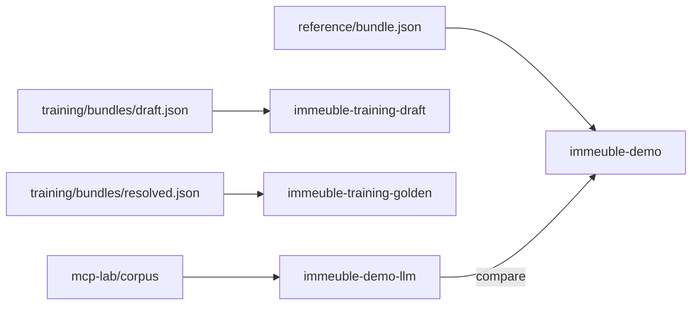

# Immeuble syndic examples

Three tracks, three workspaces, one narrative (Belgian fictional syndic demo).

| Track | Folder | Workspace(s) | Purpose |
|-------|--------|--------------|---------|
| **Reference** | [`reference/`](reference/) | `immeuble-demo` | Golden bundle, Studio smoke, comparison target |
| **Training** | [`training/`](training/) | `immeuble-training-draft`, `immeuble-training-golden` | Gap diagnostics curriculum (E01–E03, modules A1–B3) |
| **MCP lab** | [`mcp-lab/`](mcp-lab/) | `immeuble-demo-llm` | Agent reconstructs ontology + graph from raw corpus |



## Quick start — reference

```bash
export GHOSTCRAB_SQLITE_PATH="$PWD/data/immeuble-demo.sqlite"
node bin/gcp.mjs load examples/immeuble/reference/bundle.json \
  --workspace immeuble-demo --reindex all
bash vendor/mindbrain/scripts/demo-immeuble-gaps.sh \
  --rules examples/immeuble/reference/gap-rules/demo.json
```

## Quick start — training

```bash
node scripts/generate-immeuble-demo.mjs --training --emit draft,resolved
export GHOSTCRAB_SQLITE_PATH="$PWD/data/immeuble-training.sqlite"
bash scripts/load-immeuble-training.sh --both --force
bash scripts/compare-immeuble-training.sh --rules gap-rules/L2-syndic-filtered.json
bash scripts/verify-training-module.sh --module A2
bash scripts/verify-training-module.sh --module A3
```

## Quick start — MCP lab (agent)

1. Read [`mcp-lab/README.md`](mcp-lab/README.md)
2. Follow [`mcp-lab/prompts/00-prerequisites.md`](mcp-lab/prompts/00-prerequisites.md) through `06-validate-and-compare.md`

Mock CI:

```bash
node scripts/import-immeuble-demo-llm.mjs --mode mock --reset
```

## Regenerate narrative demo

```bash
node scripts/generate-immeuble-demo.mjs
pnpm run test -- tests/examples/immeuble-demo.test.ts
```

## Legacy paths

[`../immeuble-demo/`](../immeuble-demo/) contains symlinks to this tree for backward compatibility.

Ontology source: [`ontologies/immeuble-demo/core.yaml`](../../ontologies/immeuble-demo/core.yaml)
