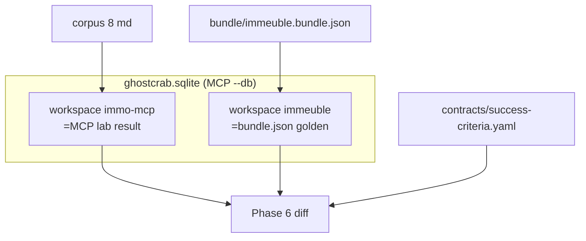

# Validate and compare — workspace `immo-mcp`

**Phase 6 — compare MCP reconstruction vs golden reference (same SQLite, two workspaces).**

Adapted from [`06-validate-and-compare.md`](06-validate-and-compare.md).

## Two workspaces, one SQLite file

Cursor MCP (`.cursor/mcp.json`) uses a **single** database:

```text
/home/dlamotte/Documents/ghostcrab-personal-mcp/data/ghostcrab.sqlite
```

| Workspace | Role | How it is populated |
|-----------|------|---------------------|
| **`immo-mcp`** | **Process** — what GhostCrab MCP built from the 8 corpus docs (phases 2–5) | Agent + CLI on this workspace only |
| **`immeuble`** | **Reference** — expected golden snapshot | Load `bundle/immeuble.bundle.json` **once** for comparison (never into `immo-mcp`) |



## Pre-step — load golden (human or agent, before compare)

Same `--db` as MCP. **Do not** change SQLite file between workspaces.

```bash
export GHOSTCRAB_SQLITE_PATH="/home/dlamotte/Documents/ghostcrab-personal-mcp/data/ghostcrab.sqlite"

node bin/gcp.mjs load examples/immeuble/bundle/immeuble.bundle.json \
  --workspace immeuble \
  --reindex all \
  --db "$GHOSTCRAB_SQLITE_PATH"
```

## Tools

- `ghostcrab_graph_diagnostics` (workspace_id per side)
- `ghostcrab_graph_search` / `ghostcrab_graph_gap_rules`
- `ghostcrab_count` / `ghostcrab_combined_search` where useful
- Optional: `ghostcrab_tool_search` → extended graph tools

Pass `workspace_id` explicitly on every call (`immo-mcp` vs `immeuble`).

## Agent prompt (copy-paste)

```text
Phase 6 — compare MCP lab result vs golden (same SQLite, two workspaces).

SQLite: /home/dlamotte/Documents/ghostcrab-personal-mcp/data/ghostcrab.sqlite
Process workspace: immo-mcp (what we built from corpus)
Reference workspace: immeuble (bundle.json golden — load if missing)

1. Confirm `immeuble` is loaded. If graph_entity count is 0, stop and ask human to run bundle load (see 06-validate-and-compare-immo-mcp.md).

2. On immo-mcp — run checks from `success-criteria.yaml`:
   - entity counts (buildings=2, units=13, cellars=13, lease_contracts=5, coda_entries=3, …)
   - ghostcrab_graph_search query "appartement" (≥13)
   - ghostcrab_graph_diagnostics ontology immeuble::core → missing_required_relations ≤ 0

3. On immeuble — same counts (sanity: golden should match criteria).

4. Comparison table — immo-mcp vs immeuble vs success-criteria thresholds:
   | Metric | criteria | immo-mcp | immeuble | immo-mcp OK? |

5. Drill-down max 3 gaps on immo-mcp (traverse / graph_search).

Deliverable: markdown report with pass/fail on immo-mcp; immeuble is the expected column, not the process under test.
```

## Report template

```markdown
# Immeuble MCP lab — comparison report (immo-mcp)

## Summary
- Status: pass | fail
- SQLite: ghostcrab.sqlite (Cursor MCP --db)
- Process workspace: immo-mcp
- Reference workspace: immeuble (bundle golden)

## Entity counts
| type | criteria | immo-mcp | immeuble | immo-mcp ok |

## Relation / search / diagnostics
| check | criteria | immo-mcp | immeuble | immo-mcp ok |

## Gaps on immo-mcp (max 3)
1. …
```

## Rules

- **Never** load `bundle.json` into workspace `immo-mcp`.
- `success-criteria.yaml` thresholds apply to **`immo-mcp`**; `immeuble` is the structural reference column.

## Done

Lab complete when `immo-mcp` meets `success-criteria.yaml` thresholds (or gaps documented with remediation).
